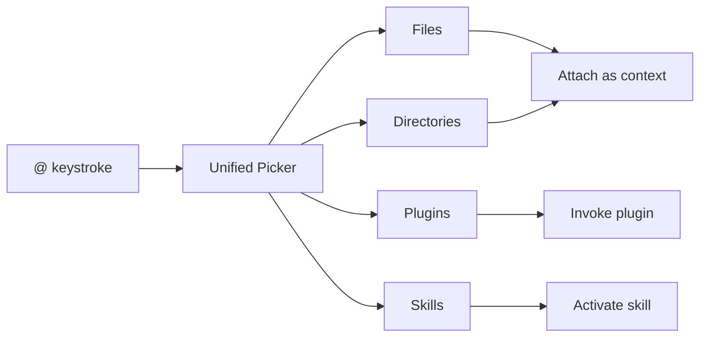
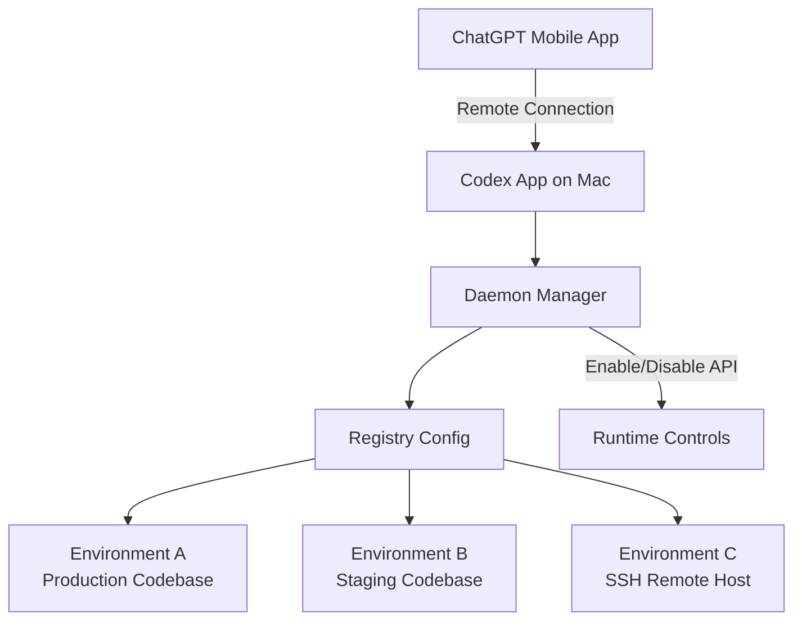

# Codex CLI v0.131.0 Release Guide: Unified Mentions, Plugin Marketplace CLI, Python SDK Migration, and TUI Overhaul


---

Codex CLI v0.131.0 shipped on 18 May 2026, landing the same day OpenAI announced its Dell AI Factory partnership to bring Codex into on-premises enterprise environments [^1]. This release consolidates several feature tracks that have been developing across the v0.129-v0.130 cycle into a cohesive upgrade: a unified mention picker, first-class plugin marketplace CLI commands, a migrated Python SDK under the `openai-codex` package name, a richer TUI with blended token usage and service-tier visibility, and daemon-managed remote-control improvements [^2].

This article walks through every significant change, with configuration examples and practical guidance on adopting each feature.

## Unified @ Mentions: One Picker for Everything

Prior to v0.131.0, the `@` mention system in the TUI resolved files and directories, but plugins and skills required separate invocation patterns. The unified mention picker merges these into a single search surface [^2].

### How It Works

Typing `@` in the prompt input now opens a fuzzy-search picker backed by app-server plugin metadata. The picker indexes four resource types:

- **Files** in the current workspace
- **Directories** for scoping context
- **Plugins** registered from any marketplace source
- **Skills** bundled in plugins or defined locally



### Practical Usage

Mentioning a file attaches it as context, exactly as before. Mentioning a plugin invokes it by name — equivalent to the previous explicit `@plugin-name` syntax, but now discoverable through the same picker. Mentioning a skill activates its instructions for the current turn.

This eliminates the need to remember separate invocation patterns. A single `@` followed by a few characters is sufficient to find any resource in the workspace.

### Configuration

The picker draws its plugin metadata from the app-server's plugin registry. If you are running Codex CLI without the app-server (pure CLI mode), the picker still resolves files and directories but will not surface plugins unless they are installed locally [^3].

## Plugin Marketplace CLI: Version-Aware Distribution

The plugin marketplace has been evolving since its introduction in v0.117.0, but v0.131.0 marks the first release where the full lifecycle — add, install, share, checkout, and upgrade — is accessible from CLI commands with version pinning [^2] [^4].

### Core Commands

```bash
# Add a marketplace source from GitHub
codex plugin marketplace add openai/codex-plugins

# Pin to a specific branch or tag
codex plugin marketplace add acme-corp/codex-plugins@main
codex plugin marketplace add acme-corp/codex-plugins#v2.1.0

# Sparse checkout for monorepos
codex plugin marketplace add https://github.com/example/plugins.git --sparse plugins/my-plugin

# Upgrade all marketplace sources to latest
codex plugin marketplace upgrade

# Remove a marketplace source
codex plugin marketplace remove marketplace-name
```

### Version-Aware Sharing

v0.131.0 introduces version-aware plugin sharing, extending the workspace sharing feature from v0.129.0 [^5]. When you share a plugin set with teammates, the share now includes version metadata — recipients receive the exact versions you have installed, not the latest from the marketplace. This prevents drift between team members.

### Share Checkout

The new "share checkout" workflow lets a recipient install a shared plugin set in one step. Previously, receiving a shared workspace required manually matching marketplace sources and versions. Share checkout resolves this automatically [^2].

### Default-Enabled Plugin Hooks

Plugin hooks (lifecycle scripts bundled with plugins) are now enabled by default. In previous releases, `[features].plugin_hooks = true` had to be set explicitly in `config.toml`. This change reflects hooks reaching stable status [^2] [^6].

If you need to disable hooks for a specific plugin, use the per-plugin configuration:

```toml
[plugins."noisy-plugin@marketplace"]
enabled = true

[plugins."noisy-plugin@marketplace".hooks]
enabled = false
```

### Marketplace JSON Structure

For teams running private marketplace registries, the `marketplace.json` schema remains unchanged. Place it at `$REPO_ROOT/.agents/plugins/marketplace.json` or `~/.agents/plugins/marketplace.json`:

```json
{
  "name": "team-marketplace",
  "interface": { "displayName": "Engineering Team Plugins" },
  "plugins": [
    {
      "name": "lint-enforcer",
      "source": { "source": "git-subdir", "url": "https://github.com/acme/plugins.git", "path": "lint-enforcer" },
      "policy": {
        "installation": "AVAILABLE",
        "authentication": "ON_INSTALL"
      },
      "category": "Quality"
    }
  ]
}
```

Curated plugin cache versions now use short SHAs for cleaner local paths under `~/.codex/plugins/cache/` [^2].

## Python SDK: The openai-codex Package

The Python SDK has moved from `codex-sdk-python` to the `openai-codex` package, aligning naming with the broader OpenAI SDK ecosystem [^2] [^7].

### Installation

```bash
pip install openai-codex-sdk
```

The package requires Python 3.10 or later [^7].

### What Changed

The migration brings four substantive improvements:

1. **Pinned runtime-generated types** — the SDK now ships with generated type stubs that match the exact version of the Codex binary it wraps, eliminating type mismatches between SDK and CLI versions [^2].

2. **Concurrent turn routing** — multiple threads can now process turns concurrently without blocking each other. Previously, the SDK serialised turns across all threads through a single event loop [^2].

3. **Approval modes** — the SDK exposes approval mode configuration programmatically, matching the CLI's `suggest`, `auto-edit`, and `full-auto` modes [^2] [^8].

4. **Integration coverage** — expanded test suite covering MCP server interactions, plugin loading, and structured output schemas [^2].

### Migration Path

If you are importing from the old package:

```python
# Before (codex-sdk-python)
from codex_sdk import Codex

# After (openai-codex-sdk)
from openai_codex import Codex
```

The core API surface — `Codex`, `AsyncCodex`, `thread_start()`, `thread.run()`, and `thread.turn()` — remains unchanged:

```python
from openai_codex import Codex

with Codex() as codex:
    thread = codex.thread_start(model="gpt-5.4")
    result = thread.run("Refactor the auth module to use dependency injection")
    print(result.final_response)
```

For concurrent turn routing, the async variant is recommended:

```python
from openai_codex import AsyncCodex
import asyncio

async def parallel_analysis():
    async with AsyncCodex() as codex:
        thread_a = codex.thread_start(model="gpt-5.4")
        thread_b = codex.thread_start(model="gpt-5.4")

        results = await asyncio.gather(
            thread_a.run("Analyse the payment service for race conditions"),
            thread_b.run("Review the auth service for token leakage"),
        )
        for r in results:
            print(r.final_response)

asyncio.run(parallel_analysis())
```

## TUI Overhaul: Blended Token Usage, Service-Tier Commands, and Responsive Tables

The TUI received its most substantial visual upgrade since the Rust rewrite. The changes are entirely display-side — no behavioural changes to the agent loop [^2].

### Blended Token Usage

The status line now displays blended token usage rather than raw input/output counts. This combines prompt tokens, completion tokens, cached tokens, and reasoning tokens into a single cost-weighted metric that better reflects actual spend. The display adapts to your model's pricing tier [^2].

### Data-Driven Service-Tier Commands

The command palette now surfaces service-tier-specific commands dynamically. If your account has access to GPT-5.2-Codex features (long-horizon compaction, enhanced cybersecurity tools), the relevant commands appear automatically. Commands unavailable at your tier are hidden rather than greyed out [^2].

### Permissions and Approval Mode Display

The TUI header now persistently shows the current approval mode (`suggest`, `auto-edit`, or `full-auto`) and effective workspace roots. This was previously only visible via the `/permissions` slash command [^2].

### Responsive Markdown Tables

Markdown tables in agent responses now reflow based on terminal width. Narrow terminals receive a vertically-stacked format rather than truncated columns. This is particularly useful when running Codex in split-pane terminal layouts [^2].

### Additional TUI Fixes

Several interaction bugs were resolved:

- URL wrapping in agent responses no longer breaks clickable links [^2]
- Light-mode selection contrast improved — selections are now visible in all terminal colour schemes [^2]
- `Shift+Enter` works correctly in tmux for multi-line prompt input [^2]
- `/review` now shows MCP startup status during the review initialisation phase [^2]
- `/side` correctly handles `Esc` to cancel side-fork creation [^2]

## Daemon-Managed Remote Control

The `codex remote-control` command introduced in v0.130.0 receives significant upgrades in v0.131.0 [^2] [^9].

### Runtime Enable/Disable APIs

Remote-control instances can now be enabled and disabled at runtime without restarting the daemon. This is useful for maintenance windows or when temporarily pausing agent access:

```bash
# Start the daemon
codex remote-control --daemon

# Disable at runtime (via API)
curl -X POST http://localhost:21100/api/v1/remote/disable

# Re-enable
curl -X POST http://localhost:21100/api/v1/remote/enable

# Check status
curl http://localhost:21100/api/v1/remote/status
```

### Registry-Backed Environments

Remote environments can now be backed by a registry configuration, enabling centralised management of which environments are available for remote sessions. This builds on the multi-environment support from v0.130.0 where `view_image` gained cross-environment resolution [^9].



## Windows Sandbox Hardening

v0.131.0 addresses several Windows-specific sandbox issues that affected enterprise deployments [^2]:

- **Deny-read rules** now correctly prevent agent access to restricted paths on Windows, closing a gap where NTFS alternate data streams could bypass read restrictions
- **Scoped write roots** enforce workspace boundaries more strictly, preventing writes outside configured `writable_roots`
- **Firewall policy** effectiveness improved — previously, certain PowerShell invocations could bypass the sandbox's network isolation
- **PowerShell edge cases** around execution policy and module loading are now handled correctly

## Git and Auth Reliability

Several authentication and Git reliability improvements landed [^2]:

- Root worktree hooks are now respected when Codex operates in a Git worktree
- Repository-level `core.hooksPath` and `core.fsmonitor` configurations are ignored in helper commands to prevent interference with Codex's own Git operations
- Local MCP OAuth callbacks now bind correctly to the expected port
- Superseded login tokens are revoked on re-authentication, preventing token accumulation

## Upgrade Path

Install or upgrade via npm:

```bash
npm install -g @openai/codex@0.131.0
```

Verify the installation:

```bash
codex --version
# 0.131.0

# Run the new diagnostics command to verify your setup
codex doctor
```

### Breaking Changes

There are no breaking changes in v0.131.0. The Python SDK package rename is the most disruptive change, but the old `codex-sdk-python` package continues to function — it simply will not receive further updates [^2].

Plugin hooks being enabled by default may surface hooks from plugins that were previously silent. If you experience unexpected behaviour after upgrading, check your installed plugins with `codex /plugins` and disable hooks for specific plugins as shown above.

## What v0.131.0 Signals

This release is a consolidation milestone. The unified mention picker, stabilised plugin hooks, and Python SDK migration all represent features graduating from experimental to production status. The TUI improvements — particularly blended token usage and service-tier awareness — reflect Codex's growing user base (now exceeding four million weekly developers [^1]) and the need for clearer cost visibility and capability discovery.

The daemon-managed remote-control improvements, combined with the Dell AI Factory partnership announced the same day [^1], signal OpenAI's push towards enterprise deployment patterns where Codex runs as persistent infrastructure rather than an ephemeral terminal tool.

For teams already running Codex in CI/CD pipelines via `codex exec`, the Python SDK's concurrent turn routing unlocks genuine parallel agent workflows without the overhead of spawning multiple CLI processes. For individual developers, the unified mention picker is the most immediately impactful change — a small interaction improvement that compounds across hundreds of daily prompts.

## Citations

[^1]: OpenAI. "OpenAI and Dell Technologies partner to bring Codex to hybrid and on-premises enterprise environments." *openai.com*, 18 May 2026. [https://openai.com/index/dell-codex-enterprise-partnership/](https://openai.com/index/dell-codex-enterprise-partnership/)

[^2]: OpenAI. "Codex CLI v0.131.0 Release Notes." *GitHub Releases*, 18 May 2026. [https://github.com/openai/codex/releases](https://github.com/openai/codex/releases)

[^3]: OpenAI. "Features - Codex CLI." *OpenAI Developers*, 2026. [https://developers.openai.com/codex/cli/features](https://developers.openai.com/codex/cli/features)

[^4]: OpenAI. "Build plugins - Codex." *OpenAI Developers*, 2026. [https://developers.openai.com/codex/plugins/build](https://developers.openai.com/codex/plugins/build)

[^5]: OpenAI. "Codex CLI v0.129.0 Release Notes." *GitHub Releases*, May 2026. [https://github.com/openai/codex/releases](https://github.com/openai/codex/releases)

[^6]: OpenAI. "Changelog - Codex." *OpenAI Developers*, 2026. [https://developers.openai.com/codex/changelog](https://developers.openai.com/codex/changelog)

[^7]: OpenAI. "SDK - Codex." *OpenAI Developers*, 2026. [https://developers.openai.com/codex/sdk](https://developers.openai.com/codex/sdk)

[^8]: OpenAI. "Command line options - Codex CLI." *OpenAI Developers*, 2026. [https://developers.openai.com/codex/cli/reference](https://developers.openai.com/codex/cli/reference)

[^9]: OpenAI. "Codex CLI v0.130.0 Release Notes." *GitHub Releases*, 8 May 2026. [https://github.com/openai/codex/releases](https://github.com/openai/codex/releases)
