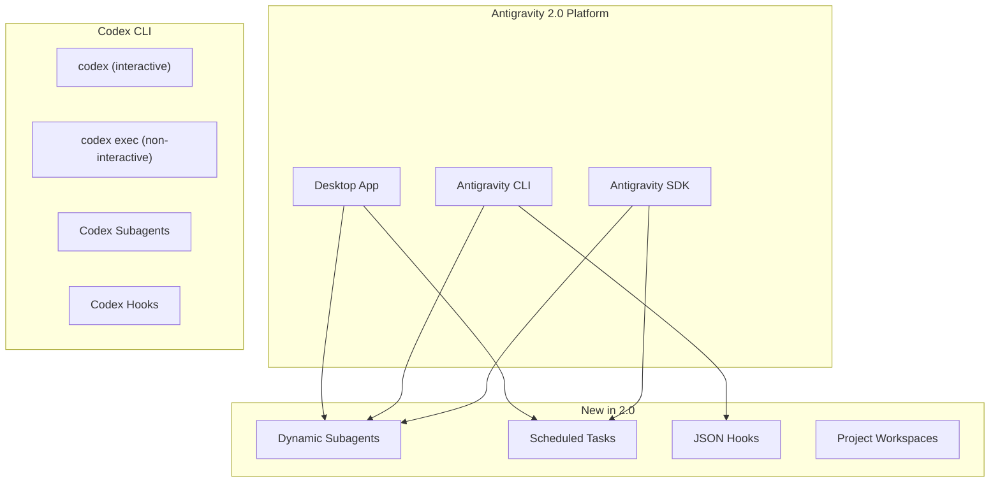
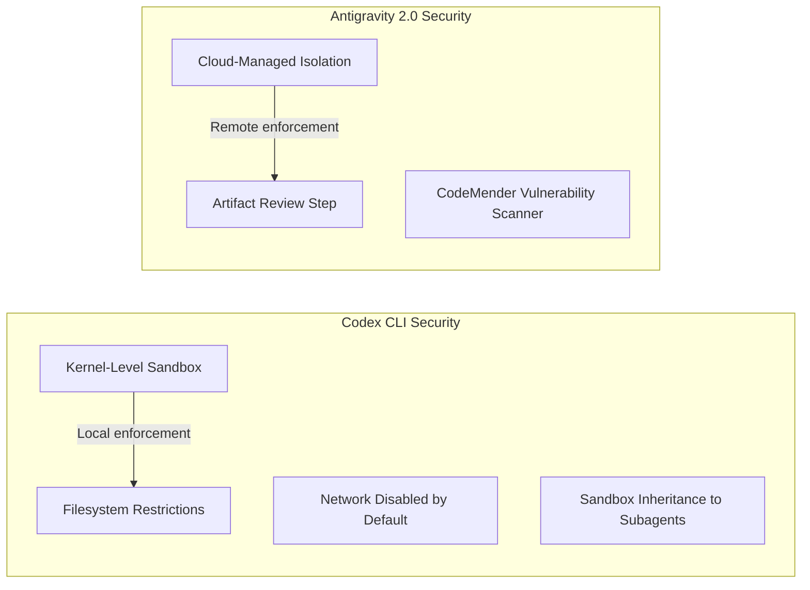
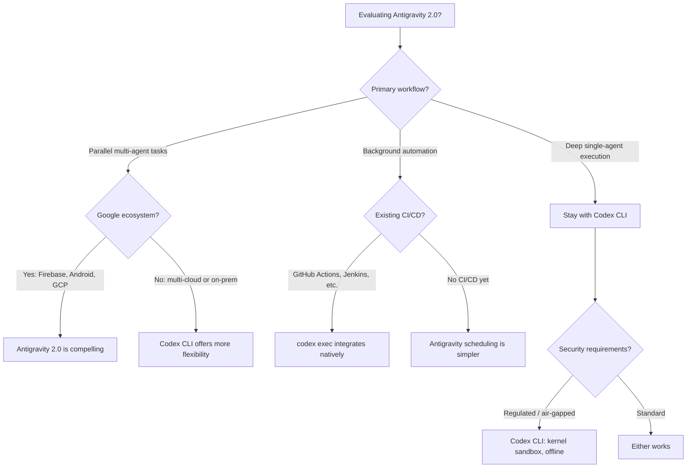

# Antigravity 2.0 vs Codex CLI: What the Google I/O 2026 Upgrade Changes in the Competitive Landscape


---

Google I/O 2026 transformed Antigravity from a capable IDE-native agent into a standalone platform with its own CLI, SDK, managed execution, and background automation[^1]. For teams already invested in Codex CLI, the question is no longer "IDE versus terminal" — it is whether Antigravity 2.0's new capabilities close the gaps that made Codex CLI the stronger choice for deep, sandboxed execution. This article dissects the upgrade surface by surface and maps where the competitive balance has shifted.

## What Changed: Antigravity 1.x to 2.0

The original Antigravity (November 2025) was a modified VS Code fork with multi-agent orchestration via a Manager View[^2]. Version 2.0 extends this into three distinct product surfaces[^1]:

- **Antigravity Desktop** — a standalone application decoupled from VS Code, acting as the central hub for agent interaction
- **Antigravity CLI** — a lightweight terminal tool for spinning up agents without a GUI
- **Antigravity SDK** — programmatic access to the same agent harness, deployable on your own infrastructure

The headline capabilities added are dynamic subagents for parallelised workflows, scheduled tasks for background automation, JSON hooks for intercepting agent behaviour, project-based workspace organisation, and new slash commands including `/goal`, `/grill-me`, `/schedule`, and `/browser`[^3].



## Dynamic Subagents: Native Parallelism vs Fork Semantics

The most consequential 2.0 feature is dynamic subagents. Antigravity can now orchestrate multiple agents executing tasks simultaneously within a single session, with the platform handling spawning, routing, result collection, and thread closure[^1]. During the keynote demo, Antigravity 2.0 launched 93 separate subagents to build an operating system framework in 12 hours[^4].

Codex CLI's subagent model works differently. Agents spawn as separate threads inheriting the current sandbox policy, with `agents.max_threads` defaulting to 6 concurrent threads and `agents.max_depth` capped at 1 to prevent recursive fan-out[^5]. Configuration lives in TOML files under `~/.codex/agents/` or `.codex/agents/`:

```toml
# .codex/agents/test-runner.toml
name = "test-runner"
description = "Runs test suites in isolation"
developer_instructions = "Execute tests, report failures with file paths and line numbers"
model = "o4-mini"
sandbox_mode = "full"
```

| Capability | Antigravity 2.0 | Codex CLI |
|---|---|---|
| Max concurrent agents | Not publicly capped (93 demonstrated) | 6 default (`agents.max_threads`) |
| Nesting depth | Multi-level (Manager → Writer → Tester) | 1 default (`agents.max_depth`) |
| Agent isolation | Project workspaces | Sandbox inheritance + git worktrees |
| Orchestration model | Platform-managed | User-configured TOML + `/agent` command |
| Cost visibility | Aggregated per session | Per-thread token tracking |

**Where Antigravity leapfrogs:** Native parallelism is a first-class concern. You do not need to configure concurrency limits or set up external orchestrators — the platform handles agent lifecycle management, including spawning, routing, and teardown[^1].

**Where Codex CLI still leads:** Fork semantics via git worktrees give you deterministic file-system isolation that prevents agents from trampling each other's changes[^6]. Antigravity's project workspaces are higher-level abstractions that do not provide the same git-level guarantees.

## Scheduled Tasks and Background Automation

Antigravity 2.0 introduces scheduled tasks via cron syntax, allowing agents to run background work without real-time supervision[^3]. The `/schedule` slash command lets you define recurring automation directly from the desktop app or CLI.

Codex CLI achieves equivalent functionality through `codex exec` — a single-shot, non-interactive invocation designed for cron jobs, GitHub Actions, and CI/CD pipelines[^7]:

```bash
# Codex CLI: cron-based nightly dependency audit
# crontab entry
0 2 * * * codex exec "Audit package.json for outdated dependencies, \
  create a summary in /tmp/audit-$(date +%F).md" \
  --model o4-mini \
  --approval-mode full-auto 2>/dev/null
```

```bash
# Antigravity CLI: scheduled task (new in 2.0)
antigravity schedule --cron "0 2 * * *" \
  --goal "Audit dependencies and report outdated packages"
```

The key difference: Antigravity's scheduling is built into the platform with a visual management UI in the desktop app. Codex CLI delegates scheduling to the operating system or CI platform, which is more flexible but requires you to assemble the pieces yourself.

Codex CLI's hooks system — firing on session start, pre-tool use, post-tool use, prompt submission, and agent stop — continues to run in `--full-auto` mode[^8]. Antigravity 2.0 now has JSON hooks for intercepting agent behaviour, narrowing what was previously a significant gap.

## Sandbox Security: Kernel-Level vs Cloud-Managed

This is where the competitive picture remains most one-sided.

Codex CLI runs with Linux kernel-level sandboxing enabled by default — network-disabled, filesystem-restricted execution that prevents agents from reaching the internet or modifying files outside the working directory[^9]. The sandbox policy is inherited by subagents, and you can override it per-agent in TOML configuration.

Antigravity 2.0's managed agents execute in "isolated Linux environments" on Google Cloud[^1]. The new CodeMender security agent autonomously scans generated code for vulnerabilities[^10]. This is a meaningful addition, but it addresses a different layer — code quality rather than execution containment.



For regulated environments and security-conscious teams, Codex CLI's local, kernel-level sandboxing remains the stronger guarantee — you control the boundary, and it works offline[^9].

## Model Comparison: Gemini 3.5 Flash vs GPT-5.5 and codex-mini

Antigravity 2.0 defaults to Gemini 3.5 Flash, which Google claims runs four times faster than any other frontier model whilst outperforming Gemini 3.1 Pro on coding benchmarks[^11]. On Terminal-Bench 2.1, Gemini 3.5 Flash scores 76.2% — competitive but below GPT-5.5[^12]. It delivers approximately 92% of GPT-5.5-class performance at significantly lower latency[^12].

Codex CLI supports the full GPT-5.x family plus `codex-mini-latest` for speed-sensitive workflows:

```toml
# config.toml — model routing for different tasks
model = "o4-mini"                    # Default: balanced speed/quality

[profiles.deep]
model = "o3"                         # Complex reasoning tasks

[profiles.fast]
model = "codex-mini-latest"          # Rapid iteration, lower cost
```

| Model | Terminal-Bench 2.1 | Relative Speed | Best For |
|---|---|---|---|
| GPT-5.5 | Highest tier | Baseline | Complex multi-file refactors |
| o4-mini | Strong | ~2x GPT-5.5 | Daily development |
| codex-mini-latest | Good | ~3x GPT-5.5 | CI/CD, batch automation |
| Gemini 3.5 Flash | 76.2% | ~4x (Google's claim) | Antigravity parallelism |

⚠️ Direct benchmark comparisons should be treated cautiously — Google's "4x faster" claim refers to output token throughput, not end-to-end task completion time, and benchmark methodologies vary across providers.

## Enterprise and Ecosystem Integration

Antigravity 2.0 deepens Google ecosystem integration: Firebase, Android Studio (via the stable Android CLI), Google AI Studio, and Google Cloud deployment[^1]. The new AI Ultra plan (\$249.99/month) provides 5x the usage limits of AI Pro[^13].

Codex CLI integrates with AWS, Azure, GCP, and self-hosted infrastructure[^14]. Enterprise governance features include managed configuration distribution, RBAC, and compliance APIs. The open-source codebase means you can audit every line of the agent loop.

| Dimension | Antigravity 2.0 | Codex CLI |
|---|---|---|
| Cloud provider lock-in | Google Cloud | Multi-cloud + self-hosted |
| Mobile development | Android CLI + Firebase | Via MCP servers |
| Enterprise governance | Google Workspace admin | RBAC + managed config |
| Open source | Proprietary | Open source (Apache 2.0) |
| Pricing | AI Ultra \$249.99/mo | API token-based |

## Decision Framework: Who Should Care About 2.0



**Antigravity 2.0 is the better choice when** you need native multi-agent parallelism without configuration overhead, your stack is Firebase/Android/GCP, or you want built-in scheduling with a visual management layer.

**Codex CLI remains the better choice when** you need kernel-level sandbox security, multi-cloud or on-prem deployment, deterministic git worktree isolation for parallel agents, open-source auditability, or deep integration with existing CI/CD pipelines via `codex exec`.

**The dual-agent pattern is increasingly viable:** use Antigravity 2.0 for broad orchestration and prototyping, then hand off to Codex CLI for sandboxed, auditable execution in production pipelines[^6].

## What to Watch

Three developments will determine whether Antigravity 2.0's momentum translates into sustained competitive advantage:

1. **SDK maturity** — the Antigravity SDK enables third-party infrastructure deployment, potentially neutralising the Google Cloud lock-in concern
2. **Codex CLI v0.131 stable release** — alpha features including improved plugin sharing and remote control may close the orchestration gap[^15]
3. **Model convergence** — Antigravity now supports third-party models including Claude[^14], whilst Codex CLI's model-agnostic architecture via `codex exec --model` keeps options open

The I/O 2026 announcements confirm that the coding agent landscape has moved beyond simple tool comparisons into platform-level competition. The right choice depends less on which tool is "better" and more on which platform ecosystem aligns with your team's infrastructure, security posture, and workflow preferences.

## Citations

[^1]: [Google I/O 2026 Developer Highlights: Antigravity, Gemini API, AI Studio](https://blog.google/innovation-and-ai/technology/developers-tools/google-io-2026-developer-highlights/)
[^2]: [Google Antigravity vs Codex CLI: Multi-Agent IDE Meets Terminal-First Agent](https://codex.danielvaughan.com/2026/05/13/google-antigravity-vs-codex-cli-multi-agent-ide-terminal-first-comparison/)
[^3]: [Google launches Antigravity 2.0 with an updated desktop app and CLI tool — TechCrunch](https://techcrunch.com/2026/05/19/google-launches-antigravity-2-0-with-an-updated-desktop-app-and-cli-tool/)
[^4]: [Google I/O 2026: Antigravity 2.0 created an operating system in 12 hours — Digit.in](https://www.digit.in/news/general/google-io-2026-google-claims-antigravity-20-created-an-operating-system-in-12-hours-brings-vibe-coding-to-android.html)
[^5]: [Subagents — Codex CLI | OpenAI Developers](https://developers.openai.com/codex/subagents)
[^6]: [Running Multiple Codex Agent Instances: Parallel Orchestration Patterns — Codex Blog](https://codex.danielvaughan.com/2026/04/18/running-multiple-codex-agents-parallel-orchestration/)
[^7]: [Codex CLI Automations and Scheduled Tasks: Background Agent Workflows — Codex Blog](https://codex.danielvaughan.com/2026/03/27/codex-cli-automations-scheduled-tasks/)
[^8]: [Codex CLI hook governance: what works today (and what doesn't) — Agentic Control Plane](https://agenticcontrolplane.com/blog/codex-cli-hooks-reference)
[^9]: [Features — Codex CLI | OpenAI Developers](https://developers.openai.com/codex/cli/features)
[^10]: [With expanded Antigravity platform, Google accelerates agent-native software development — SiliconANGLE](https://siliconangle.com/2026/05/19/google-accelerates-agent-native-software-development-expanded-antigravity-platform/)
[^11]: [Gemini 3.5: frontier intelligence with action — Google Blog](https://blog.google/innovation-and-ai/models-and-research/gemini-models/gemini-3-5/)
[^12]: [Gemini 3.5 Flash: Benchmarks, Pricing, and Complete Specs — LLM Stats](https://llm-stats.com/blog/research/gemini-3.5-flash-launch)
[^13]: [Google launches Antigravity 2.0 — TechCrunch (pricing details)](https://techcrunch.com/2026/05/19/google-launches-antigravity-2-0-with-an-updated-desktop-app-and-cli-tool/)
[^14]: [AI Coding Agents 2026: Comparison — Lushbinary](https://lushbinary.com/blog/ai-coding-agents-comparison-cursor-windsurf-claude-copilot-kiro-2026/)
[^15]: [Codex CLI Releases — GitHub](https://github.com/openai/codex/releases)
