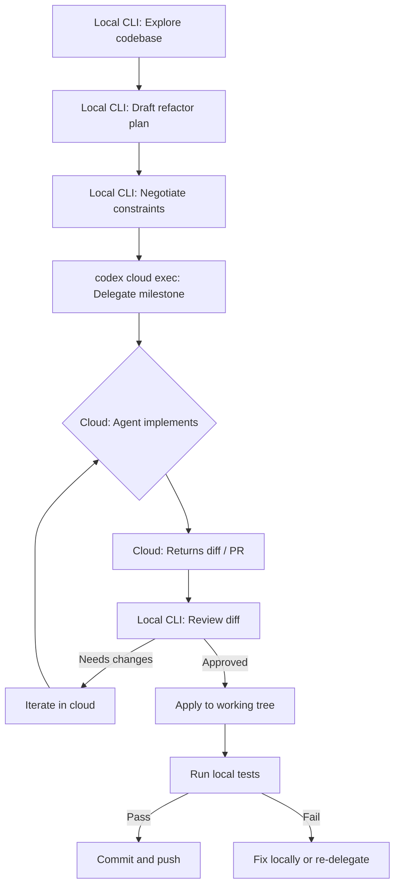
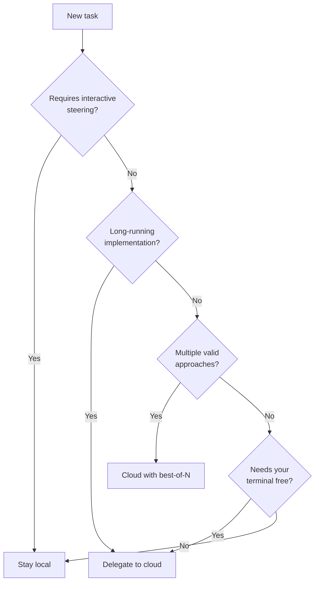

# Codex CLI Cloud Delegation Workflows: Plan Locally, Execute Remotely, Apply Diffs


---

Codex Cloud runs agent tasks inside isolated containers on OpenAI's infrastructure, each with your repository checked out and dependencies installed[^1]. The `codex cloud` CLI subcommands — `exec`, `list`, and the interactive picker — let you launch, monitor, and apply those tasks without leaving the terminal. This article covers the delegation workflow pattern: plan your change locally where context is fast and cheap, delegate the implementation to cloud where compute is plentiful and sandboxed, then pull the result back into your working tree. It is a pattern the official Codex workflows documentation calls "Delegate Refactor to Cloud"[^2], and it becomes substantially more powerful when combined with best-of-N attempts, structured output, and shell scripting.

## Why Delegate to the Cloud?

Local Codex sessions are interactive — you approve each step, steer the agent, and iterate quickly. Cloud tasks are asynchronous — fire and forget[^3]. The distinction matters because it changes how you allocate your attention:

| Dimension | Local CLI | Cloud Task |
|---|---|---|
| Interaction model | Synchronous, human-in-the-loop | Asynchronous, autonomous |
| Sandbox | macOS Seatbelt / Linux Landlock on your machine[^4] | Ephemeral container, destroyed after task[^1] |
| Parallelism | One session per terminal | Multiple tasks in parallel containers[^3] |
| Best use | Planning, negotiation, review | Implementation, refactoring, bulk changes |
| Cost surface | Your local compute + API tokens | OpenAI-hosted compute + API tokens |

The delegation workflow exploits this split: use the local CLI for the parts of work that benefit from fast feedback (understanding the codebase, drafting a plan, reviewing a diff), and push the parts that benefit from uninterrupted execution to the cloud.

## The `codex cloud` Subcommands

### Interactive Picker

Running `codex cloud` with no arguments opens a terminal picker that lists your active and completed cloud tasks[^5]:

```bash
codex cloud
```

From the picker you can browse task status, view diffs, and apply changes to your local project. Press `Ctrl+O` to switch between environments[^5].

### `codex cloud exec`

Submit a task directly:

```bash
codex cloud exec --env ENV_ID "Refactor auth module per PLAN.md milestone 1"
```

Key flags[^6]:

| Flag | Values | Purpose |
|---|---|---|
| `--env` | Environment ID | Target cloud environment (required) |
| `--attempts` | 1–4 | Best-of-N parallel attempts |
| `QUERY` | String | Task prompt; omit for interactive entry |

The command exits with a non-zero status if submission fails, making it safe to chain in scripts[^6].

### `codex cloud list`

List recent tasks with optional filtering:

```bash
codex cloud list --env ENV_ID --json --limit 5
```

Flags[^6]:

| Flag | Purpose |
|---|---|
| `--env` | Filter by environment |
| `--json` | Machine-readable JSON output |
| `--limit` | Maximum tasks to return (1–20) |
| `--cursor` | Pagination cursor from previous response |

JSON output includes a `tasks` array where each task has `id`, `url`, `title`, `status`, `updated_at`, `environment_id`, `summary`, and `attempt_total`[^6].

## The Delegation Workflow Step by Step



### Phase 1: Plan Locally

Start an interactive Codex session in your repository:

```bash
codex
```

Ask the agent to analyse the target code and produce a structured plan. The official workflow documentation recommends using the `$plan` skill if available[^2]:

```
$plan

Refactor the notification subsystem to:
- separate delivery channels (email, Slack, webhook) into strategy pattern
- extract retry logic into a shared middleware
- add per-channel circuit breakers

Constraints:
- no changes to the public NotificationService API
- maintain backward compatibility with existing event payloads
- include a rollback strategy for each milestone
```

The agent scans your local files, identifies module boundaries, and produces a step-by-step plan. Negotiate revisions until you are satisfied:

```
Revise the plan to specify exact file moves per milestone
and add integration test checkpoints between milestones.
```

Planning locally is fast because the agent reads files directly from disk rather than checking them out into a container[^2].

### Phase 2: Delegate to Cloud

Commit or stash your current work so you have a clean baseline for comparing the cloud diff[^2]. Then delegate the first milestone:

```bash
codex cloud exec --env my-backend-env \
  "Implement Milestone 1 from the notification refactor plan in PLAN.md. \
   Run tests after each file change. Stop if any test fails."
```

The cloud container checks out your repository at `HEAD`, runs your setup script (with internet access for dependency installation), then executes the agent's plan inside a sandboxed environment[^7]. When the agent finishes, it produces a diff or opens a pull request directly[^1].

### Phase 3: Review and Apply

Browse completed tasks from the terminal:

```bash
codex cloud
```

Select the task, review the diff, and apply changes to your working tree. Alternatively, if the cloud task opened a pull request, review it on GitHub and merge normally.

Run your local test suite against the applied changes before committing:

```bash
npm test && git add -A && git commit -m "refactor: notification channels (milestone 1)"
```

## Best-of-N Attempts

The `--attempts` flag (1–4) tells Codex Cloud to run multiple independent attempts in parallel and select the best result[^5][^6]. This is a meaningful quality lever for tasks with ambiguous solutions:

```bash
codex cloud exec --env my-backend-env --attempts 3 \
  "Refactor the payment gateway adapter to support async webhooks. \
   Minimise changes to the existing synchronous API surface."
```

Each attempt runs in its own container. The system evaluates the results and presents the best candidate. Use best-of-N when:

- The refactoring has multiple valid approaches and you want to compare
- The task is complex enough that a single attempt might miss edge cases
- You are willing to trade compute cost for solution quality

Avoid it for straightforward changes where a single attempt reliably succeeds — you pay for each attempt[^8].

## Scripting Cloud Delegation

### Batch Milestone Execution

Loop through milestones in a shell script:

```bash
#!/usr/bin/env bash
set -euo pipefail

ENV_ID="my-backend-env"
MILESTONES=("Milestone 1: Extract channel strategies" \
            "Milestone 2: Add retry middleware" \
            "Milestone 3: Wire circuit breakers")

for milestone in "${MILESTONES[@]}"; do
  echo "Delegating: $milestone"
  codex cloud exec --env "$ENV_ID" \
    "Implement $milestone from PLAN.md. Run tests after changes."
done

echo "All milestones submitted. Monitor with: codex cloud list --env $ENV_ID"
```

### Polling for Completion

Use `codex cloud list` with `--json` to poll task status:

```bash
#!/usr/bin/env bash
set -euo pipefail

ENV_ID="my-backend-env"

while true; do
  pending=$(codex cloud list --env "$ENV_ID" --json --limit 20 \
    | jq '[.tasks[] | select(.status != "completed" and .status != "failed")] | length')

  if [ "$pending" -eq 0 ]; then
    echo "All tasks complete."
    break
  fi

  echo "$pending tasks still running..."
  sleep 30
done
```

### Structured Output for Downstream Pipelines

Combine `codex exec` (local non-interactive mode) with cloud results for structured reporting[^9]:

```bash
codex exec --json --output-schema '{
  "type": "object",
  "properties": {
    "files_changed": { "type": "array", "items": { "type": "string" } },
    "tests_passed": { "type": "boolean" },
    "risk_assessment": { "type": "string" }
  },
  "required": ["files_changed", "tests_passed", "risk_assessment"]
}' "Analyse the diff from the latest cloud task and produce a risk report."
```

## When to Delegate vs. When to Stay Local



**Stay local** when you need to negotiate, review incrementally, or the change is small enough to complete in minutes.

**Delegate to cloud** when the implementation is well-defined, the task takes more than a few minutes, or you want to run multiple tasks in parallel while continuing other work locally[^3].

**Use best-of-N** when the task has genuine ambiguity and you want to compare approaches rather than iterate on a single attempt[^5].

## AGENTS.md Conventions for Cloud Tasks

Cloud tasks read AGENTS.md just as local sessions do[^10]. Add conventions that specifically help the cloud agent work autonomously:

```markdown
## Cloud Task Conventions

- Always run the full test suite (`npm test`) before marking a task complete
- Commit changes with conventional commit messages
- If tests fail after three consecutive fix attempts, stop and report the failure
- Never modify files outside the directories specified in the task prompt
- Include a summary comment in the PR description listing every file changed and why
```

These conventions reduce the need for interactive steering, which is unavailable during cloud execution.

## CI/CD Integration Pattern

Trigger cloud tasks from GitHub Actions for automated refactoring pipelines:


```yaml
name: Delegate Refactor
on:
  workflow_dispatch:
    inputs:
      milestone:
        description: "Milestone to implement"
        required: true

jobs:
  delegate:
    runs-on: ubuntu-latest
    env:
      CODEX_API_KEY: ${{ secrets.CODEX_API_KEY }}
    steps:
      - name: Submit cloud task
        run: |
          codex cloud exec \
            --env "${{ vars.CODEX_ENV_ID }}" \
            --attempts 2 \
            "${{ inputs.milestone }}"

      - name: Wait and check status
        run: |
          sleep 60
          codex cloud list --env "${{ vars.CODEX_ENV_ID }}" --json --limit 1
```


## Anti-Patterns

| Anti-pattern | Why it fails | Alternative |
|---|---|---|
| Delegating without a plan | Cloud agent lacks context, produces unfocused changes | Plan locally first, reference a PLAN.md |
| Using `--attempts 4` for every task | Quadruples cost with no quality gain on simple changes | Reserve best-of-N for genuinely ambiguous tasks |
| Skipping local test run after applying | Cloud tests pass in the container but your local environment may differ | Always run tests locally before committing |
| Delegating tasks that need interactive steering | Cloud tasks cannot ask clarifying questions mid-execution | Keep interactive work local |
| Not setting AGENTS.md cloud conventions | Agent operates without guardrails, may make overly broad changes | Add explicit cloud task constraints |

## Known Limitations

- **`--output-schema` is not available on `codex cloud exec`** — structured output is only supported on local `codex exec`[^9]. Use local exec to post-process cloud results.
- **Environment setup time** — first task on a new environment incurs container setup latency. Subsequent tasks benefit from caching (12-hour TTL)[^7].
- **Context carry-over** — the official delegation workflow in the app carries context from local planning into the cloud thread[^2]. The CLI `codex cloud exec` starts a fresh context — include all necessary instructions in the prompt or reference files in the repository.
- **Attempt limit** — best-of-N is capped at 4 attempts[^6]. For higher parallelism, submit separate tasks.

## Citations

[^1]: [Codex Cloud Overview — OpenAI Developers](https://developers.openai.com/codex/cloud)
[^2]: [Workflows: Delegate Refactor to Cloud — OpenAI Developers](https://developers.openai.com/codex/workflows)
[^3]: [Introducing Codex — OpenAI](https://openai.com/index/introducing-codex/)
[^4]: [Sandbox — Codex Concepts — OpenAI Developers](https://developers.openai.com/codex/concepts/sandboxing)
[^5]: [Features — Codex CLI — OpenAI Developers](https://developers.openai.com/codex/cli/features)
[^6]: [Command Line Options — Codex CLI — OpenAI Developers](https://developers.openai.com/codex/cli/reference)
[^7]: [Cloud Environments — Codex Web — OpenAI Developers](https://developers.openai.com/codex/cloud/environments)
[^8]: [Best Practices — Codex — OpenAI Developers](https://developers.openai.com/codex/learn/best-practices)
[^9]: [Non-interactive Mode — Codex — OpenAI Developers](https://developers.openai.com/codex/noninteractive)
[^10]: [AGENTS.md — Codex Configuration — OpenAI Developers](https://developers.openai.com/codex/config/agents-md)
