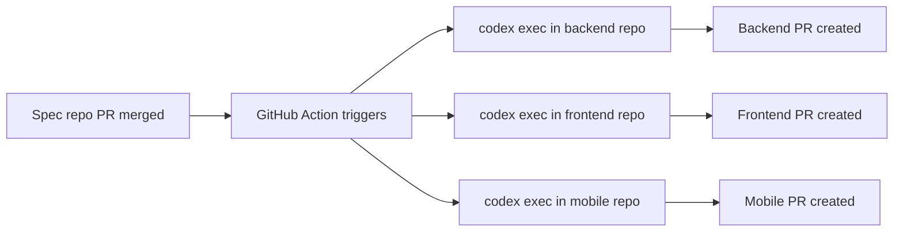
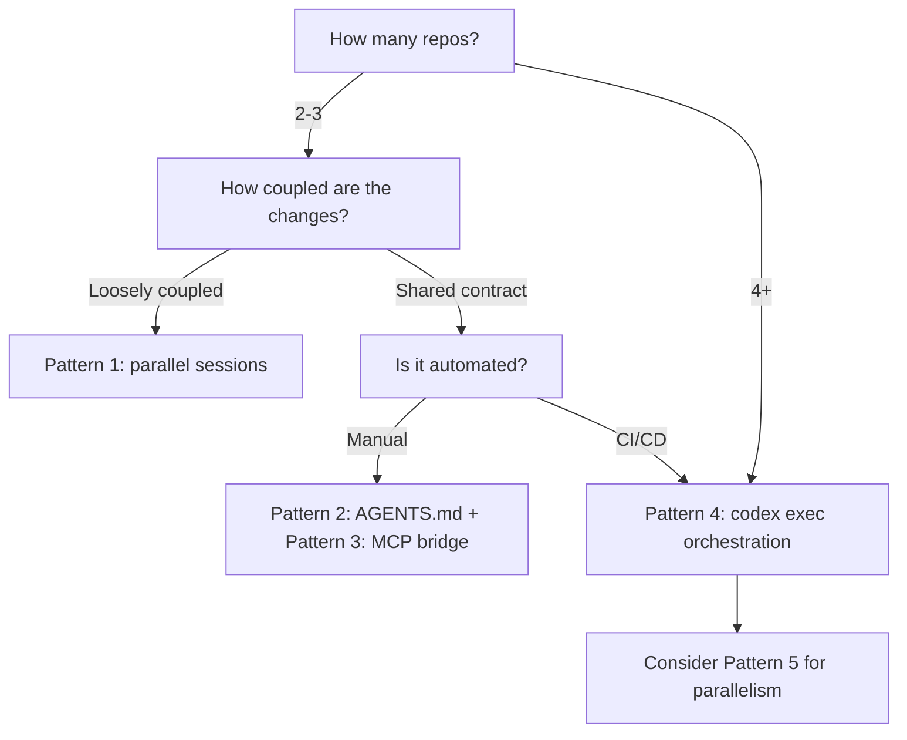

# Codex CLI for Cross-Repository Development: Multi-Repo Sessions, Coordination Patterns, and MCP-Bridged Workflows


---

Senior developers working on microservices architectures, shared libraries, or platform teams rarely touch a single repository in isolation. A typical task — say, adding a new field to an API response — might require coordinated changes across a backend service, a shared protobuf or OpenAPI schema repository, a frontend client, and an infrastructure-as-code repository. Codex CLI was designed around single-repository sessions, and as of v0.131.0, first-class multi-repo support remains an open request [^1][^2]. That does not mean cross-repository work is impractical — it means you need deliberate patterns. This article covers five strategies, ranked from simplest to most sophisticated.

## The Single-Repo Constraint

Codex CLI roots every session at a **project root**, detected by markers such as `.git` [^3]. AGENTS.md discovery, sandbox write boundaries, rollout files, and the diff viewer all assume this single root. The Codex app has a similar limitation: its diff panel only shows changes for the current repository even when the agent edits files outside it [^2].

Understanding this constraint is essential because fighting it — symlinking unrelated repos under one parent, or using `danger-full-access` to roam the filesystem — leads to brittle sessions and weakened security posture. The patterns below work *with* the constraint rather than against it.

## Pattern 1: Parallel Terminal Sessions with Shared Context

The simplest approach is running one Codex CLI session per repository in separate terminal panes. If you use `tmux` or a tiling terminal, name your sessions meaningfully:

```bash
# Terminal 1 — backend
cd ~/src/billing-service
codex "Add invoice_status field to the GET /invoices response"

# Terminal 2 — frontend
cd ~/src/dashboard-app
codex "Consume the new invoice_status field from GET /invoices"
```

This works because each session gets its own sandbox, its own AGENTS.md context, and its own rollout file [^4]. The developer acts as the coordination layer, reviewing diffs in each pane and ensuring consistency.

### When to use it

- Two or three repositories with clear, describable interfaces between them
- Changes that can be described independently ("add the field" vs "consume the field")
- You want full sandbox protection in each repo

### Limitations

Neither session knows what the other is doing. If the backend agent changes the field name from `invoice_status` to `status`, the frontend session has no way to discover that mid-flight.

## Pattern 2: AGENTS.md Cross-References

You can encode cross-repository contracts directly in each repository's AGENTS.md file, giving the agent enough context to make consistent changes without seeing the other codebase:

```markdown
<!-- billing-service/AGENTS.md -->
## API Contract

This service exposes a REST API consumed by `dashboard-app`.
The canonical OpenAPI spec lives at `../api-specs/billing/openapi.yaml`.
When modifying any endpoint response shape, update the spec file first,
then implement the change here.

Field naming convention: snake_case, matching the spec exactly.
```

```markdown
<!-- dashboard-app/AGENTS.md -->
## API Dependency

This app consumes the billing service API.
The canonical OpenAPI spec lives at `../api-specs/billing/openapi.yaml`.
When the spec changes, regenerate the client with:
`npx openapi-generator-cli generate -i ../api-specs/billing/openapi.yaml -g typescript-fetch -o src/api/billing`
```

The key insight is that AGENTS.md can reference files *outside* the repository root using relative paths for documentation purposes, even though the agent cannot write to them from within the sandbox [^5]. The developer ensures the spec file is updated first, then each agent session picks up the instruction to conform to it.

### Strengthening with global AGENTS.md

For organisation-wide conventions, place a global file at `~/.codex/AGENTS.md`:

```markdown
<!-- ~/.codex/AGENTS.md -->
## Cross-Repository Conventions

- All API field names use snake_case.
- Breaking API changes require a version bump in the OpenAPI spec.
- Shared types live in the `common-types` package; never duplicate definitions.
- Database migration files must be backwards-compatible for two releases.
```

This file is prepended to every session regardless of which repository you open, ensuring baseline consistency [^3].

## Pattern 3: MCP Servers as Cross-Repo Bridges

MCP servers can expose tools that operate on repositories the current session cannot directly reach. A filesystem MCP server scoped to a sibling repository gives the agent read (and optionally write) access to that codebase:

```toml
# ~/.codex/config.toml — user-scoped, available in all sessions
[mcp_servers.api-specs]
command = "npx"
args = ["-y", "@anthropic-ai/mcp-filesystem", "/home/dev/src/api-specs"]
enabled = true
```

With this configuration, any Codex CLI session can use MCP tools to read the API spec files, even though the session itself is rooted in a different repository [^6]. You can then instruct the agent:

```
Read the OpenAPI spec for billing from the api-specs MCP server,
then update the TypeScript client in this repo to match.
```

### Scoping and security considerations

- Use `enabled_tools` to restrict which MCP tools the agent can invoke, preventing unintended writes to the shared repo [^6]:

```toml
[mcp_servers.api-specs]
command = "npx"
args = ["-y", "@anthropic-ai/mcp-filesystem", "/home/dev/src/api-specs"]
enabled_tools = ["read_file", "list_directory", "search_files"]
```

- For project-scoped MCP servers, place the configuration in `.codex/config.toml` within the consuming repository. The project must be trusted for Codex to load project-scoped servers [^6].
- Avoid exposing sensitive repositories (infrastructure secrets, credentials) through broad filesystem MCP servers.

## Pattern 4: `codex exec` Orchestration Scripts

For automated pipelines — CI/CD, nightly maintenance, or coordinated refactors — shell scripts can orchestrate multiple `codex exec` invocations sequentially, passing structured output between them:

```bash
#!/usr/bin/env bash
set -euo pipefail

# Step 1: Generate the schema change in the API specs repo
cd ~/src/api-specs
codex exec "Add invoice_status enum field (draft|sent|paid|overdue) to \
  the GET /invoices response in billing/openapi.yaml" \
  --output-schema ./schemas/change-summary.json \
  -o /tmp/schema-change.json

# Step 2: Implement the backend change using the schema as context
cd ~/src/billing-service
codex exec "Implement the API change described in this context. \
  $(cat /tmp/schema-change.json)" \
  --approval-mode full-auto

# Step 3: Regenerate and adapt the frontend client
cd ~/src/dashboard-app
codex exec "The billing API OpenAPI spec has been updated. \
  Regenerate the client and update all components that display invoices \
  to show the new invoice_status field."
```

Each `codex exec` invocation runs in its own sandbox with `--ephemeral` semantics by default, ensuring no state leaks between steps [^7]. The `--output-schema` flag produces structured JSON that downstream steps can consume programmatically [^7].

### Combining with the GitHub Action

For pull-request-driven workflows, the Codex GitHub Action can trigger separate `codex exec` runs per repository when a shared spec file changes [^8]:



## Pattern 5: Subagent Delegation with Shared Context

Codex CLI's subagent system can parallelise work across different directories. While subagents share the same repository root by default, you can configure custom agent definitions with distinct working directories:

```toml
# .codex/config.toml in the orchestrating repo
[[agents]]
name = "backend-updater"
model = "o4-mini"
prompt = "You update the billing-service Go code. Working directory: /home/dev/src/billing-service"

[[agents]]
name = "frontend-updater"
model = "gpt-5.4"
prompt = "You update the dashboard-app React code. Working directory: /home/dev/src/dashboard-app"
```

The orchestrating session can then delegate:

```
Spawn subagents: backend-updater to add the invoice_status field
to the billing service, and frontend-updater to consume it
in the dashboard. Both must use snake_case field naming.
```

Subagents inherit the parent session's MCP servers and approval policy but operate in separate execution contexts [^9]. The `MultiAgentV2` configuration introduced in v0.128.0 adds thread caps and depth controls to prevent runaway delegation chains [^10].

### Anti-patterns

| Anti-pattern | Why it fails | Alternative |
|---|---|---|
| Single session with `danger-full-access` roaming across repos | No sandbox protection, AGENTS.md context mismatch, diff panel shows only current repo | Parallel sessions or MCP bridges |
| Symlinking repos under a common parent | Git detection breaks, rollout paths become ambiguous | Explicit MCP filesystem servers |
| Copy-pasting diffs between sessions manually | Error-prone, loses structured output benefits | `codex exec` pipeline with `--output-schema` |
| Trusting the agent to "just figure out" cross-repo contracts | Non-deterministic field naming, missed breaking changes | AGENTS.md contract encoding |

## Choosing a Pattern



For most senior developers, the combination of **Pattern 2** (AGENTS.md cross-references) and **Pattern 3** (MCP bridges for read access) covers daily interactive work. Reserve `codex exec` orchestration for automated pipelines where human coordination would be a bottleneck.

## What Is Coming

The multi-repo feature requests on GitHub (#11956, #6219, #15168) collectively have over 50 upvotes [^1][^2]. OpenAI's multi-environment session support in v0.130.0 — where app-server sessions can choose an environment and working directory per turn [^10] — suggests the infrastructure for first-class multi-repo sessions is being built. Until then, the patterns above give you production-grade cross-repository workflows without sacrificing sandbox safety.

## Citations

[^1]: GitHub Issue #11956 — "Multi-repo support" (openai/codex), [https://github.com/openai/codex/issues/11956](https://github.com/openai/codex/issues/11956)
[^2]: GitHub Issue #6219 — "Feature request: Support work in several different repositories during same session" (openai/codex), [https://github.com/openai/codex/issues/6219](https://github.com/openai/codex/issues/6219)
[^3]: OpenAI Developers — "Custom instructions with AGENTS.md", [https://developers.openai.com/codex/guides/agents-md](https://developers.openai.com/codex/guides/agents-md)
[^4]: OpenAI Developers — "Features – Codex CLI", [https://developers.openai.com/codex/cli/features](https://developers.openai.com/codex/cli/features)
[^5]: OpenAI Developers — "Advanced Configuration – Codex", [https://developers.openai.com/codex/config-advanced](https://developers.openai.com/codex/config-advanced)
[^6]: OpenAI Developers — "Model Context Protocol – Codex", [https://developers.openai.com/codex/mcp](https://developers.openai.com/codex/mcp)
[^7]: OpenAI Developers — "Non-interactive mode – Codex", [https://developers.openai.com/codex/noninteractive](https://developers.openai.com/codex/noninteractive)
[^8]: OpenAI Developers — "GitHub Action – Codex", [https://developers.openai.com/codex/github-action](https://developers.openai.com/codex/github-action)
[^9]: OpenAI Developers — "Subagents – Codex", [https://developers.openai.com/codex/subagents](https://developers.openai.com/codex/subagents)
[^10]: Releasebot — "Codex Updates by OpenAI - May 2026", [https://releasebot.io/updates/openai/codex](https://releasebot.io/updates/openai/codex)
