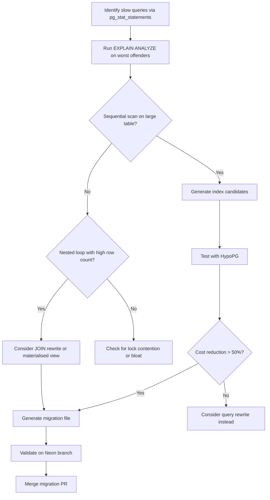

# Codex CLI for Database Query Performance Optimisation: EXPLAIN Plan Analysis, Index Tuning, and MCP-Driven Workflows


---

Codex CLI has mature coverage for database schema migrations — Atlas, Prisma, Flyway, and Neon branching all have dedicated articles in this knowledge base. What is conspicuously absent is the other half of the database lifecycle: **query performance optimisation**. This article fills that gap, covering how to use Codex CLI with PostgreSQL MCP servers, AGENTS.md conventions, structured audits via `codex exec`, and EXPLAIN-plan-driven index tuning workflows.

## Why This Matters Now

Database query performance remains the single largest source of production incidents for most backend teams [^1]. The 2026 ecosystem has converged on three PostgreSQL MCP servers that expose `pg_stat_statements`, EXPLAIN plans, and hypothetical indexing directly to AI coding agents, making Codex CLI a viable co-pilot for query tuning workflows that previously required deep DBA expertise [^2].

## The MCP Server Landscape for Query Performance

Three open-source MCP servers provide the tool surface Codex needs to analyse query performance without direct production access.

### Postgres MCP Pro (CrystalDBA)

The `crystaldba/postgres-mcp` server exposes read-only query analysis alongside an implementation of the Anytime Algorithm from Microsoft's Database Tuning Advisor [^3]. Key tools include:

- `get_slow_queries` — retrieves the top-N slowest queries from `pg_stat_statements`, ranked by total execution time
- `explain_query` — runs `EXPLAIN (ANALYZE, BUFFERS, FORMAT JSON)` and returns a structured execution plan
- `suggest_indexes` — applies the Anytime Algorithm to recommend indexes, including estimated cost reduction

### PGTuner MCP

The `isdaniel/pgtuner_mcp` server adds **HypoPG integration** for hypothetical index testing without writing to the catalogue [^4]:

- `retrieve_slow_queries` — pulls slow queries with detailed statistics
- `analyze_execution_plan` — runs EXPLAIN ANALYZE with annotation
- `test_hypothetical_index` — creates a HypoPG virtual index and re-runs the query to compare plans

### MCP-PostgreSQL-Ops

The `call518/MCP-PostgreSQL-Ops` server provides broader DBA tooling across PostgreSQL 12–18 [^5], including bloat detection, lock monitoring, and autovacuum analysis — useful context when query slowness stems from table bloat or lock contention rather than missing indexes.

## Configuring MCP Servers in Codex CLI

Add the relevant MCP server to your project's `.codex/config.toml`:

```toml
[mcp_servers.postgres-perf]
command = "npx"
args = ["-y", "@crystaldba/postgres-mcp"]

[mcp_servers.postgres-perf.env]
DATABASE_URL = "$DATABASE_URL"
```

For PGTuner, the configuration follows the same pattern:

```toml
[mcp_servers.pgtuner]
command = "npx"
args = ["-y", "pgtuner-mcp"]

[mcp_servers.pgtuner.env]
PG_CONNECTION_STRING = "$DATABASE_URL"
```

> **Sandbox note:** These MCP servers need network access to reach the database. Configure `network_access` in your permission profile to allow connections to your database host, or use the `network-enabled` profile [^6].

## AGENTS.md Conventions for Query Performance

Encode your team's database performance standards in `AGENTS.md` so Codex respects them across all sessions:

```markdown
## Database Performance Conventions

- Never run EXPLAIN ANALYZE against production; use a Neon branch or read replica
- All queries returning > 100 rows must use pagination (LIMIT/OFFSET or cursor-based)
- Prefer CTEs over nested subqueries for readability and plan stability
- New indexes require a migration file, not ad-hoc DDL
- Sequential scans on tables > 10,000 rows must be justified in a code comment
- Use covering indexes (INCLUDE) when the query only reads indexed columns
- Foreign keys must have a corresponding index on the referencing column
```

These conventions prevent Codex from generating queries that pass functional tests but introduce performance regressions.

## Interactive Workflow: Analysing Slow Queries

The most common workflow starts with identifying slow queries, then iterating on solutions.

### Step 1: Identify Slow Queries

```
> @postgres-perf get the top 10 slowest queries by total execution time
```

Codex calls the MCP server's `get_slow_queries` tool and returns a ranked list with mean execution time, call count, and total time.

### Step 2: Analyse the Execution Plan

```
> Run EXPLAIN ANALYZE on the slowest query and identify the most expensive nodes
```

Codex retrieves the JSON execution plan and annotates it, highlighting sequential scans on large tables, nested loop joins with high row estimates, and sort operations spilling to disc.

### Step 3: Generate Index Recommendations

```
> Suggest indexes that would improve this query. Test them with HypoPG before creating migration files.
```

With PGTuner, Codex creates hypothetical indexes, re-runs EXPLAIN, and compares the estimated cost. Only indexes that demonstrate measurable improvement get promoted to migration files.



## Structured Audit with `codex exec`

For CI integration, use `codex exec` with `--output-schema` to produce machine-readable performance audit reports:

```bash
codex exec \
  --model gpt-5.4 \
  --output-schema '{"type":"object","properties":{"slow_queries":{"type":"array","items":{"type":"object","properties":{"query":{"type":"string"},"mean_time_ms":{"type":"number"},"recommendation":{"type":"string"},"severity":{"type":"string","enum":["critical","warning","info"]}}}},"index_recommendations":{"type":"array","items":{"type":"object","properties":{"table":{"type":"string"},"columns":{"type":"array","items":{"type":"string"}},"type":{"type":"string"},"estimated_improvement_pct":{"type":"number"}}}}}}' \
  "Analyse the top 20 slowest queries from pg_stat_statements. For each, run EXPLAIN ANALYZE, classify severity, and recommend indexes or query rewrites."
```

This produces structured JSON that downstream tooling can ingest — for example, a GitHub Actions step that fails the build if any `critical` severity queries are found without an accompanying fix.

## Safe Testing with Neon Branching

Production databases should never be the target for EXPLAIN ANALYZE or hypothetical index testing in automated pipelines. Neon's instant branching provides copy-on-write isolation [^7]:

```toml
[mcp_servers.neon]
command = "npx"
args = ["-y", "neon-mcp-server"]

[mcp_servers.neon.env]
NEON_API_KEY = "$NEON_API_KEY"
```

The workflow becomes:

1. **Branch** — Codex creates a Neon branch from the production snapshot
2. **Analyse** — EXPLAIN ANALYZE runs against the branch with realistic data
3. **Test** — HypoPG indexes are tested on the branch
4. **Migrate** — Validated indexes are written as migration files
5. **Clean up** — The branch is deleted after the analysis completes

This pattern gives Codex access to production-scale data distributions without any risk to live traffic.

## Reusable `query-tuner` Skill

Encapsulate the workflow in a reusable skill at `.codex/skills/query-tuner/SKILL.md`:

```markdown
# Query Tuner

## Trigger
Run when asked to analyse slow queries or optimise database performance.

## Steps
1. Connect to the database via the postgres-perf MCP server
2. Retrieve the top 20 slowest queries from pg_stat_statements
3. For each query with mean execution time > 100ms:
   a. Run EXPLAIN ANALYZE and identify bottlenecks
   b. Generate index candidates
   c. Test candidates with HypoPG
   d. If improvement > 30%, generate a migration file
4. Output a summary table: query hash, current mean time, projected mean time, recommended action
5. Create a PR with migration files if any indexes are recommended

## Constraints
- Never modify production data
- All indexes must be created via migration files, never ad-hoc
- Prefer partial indexes for queries with WHERE clauses on a small subset of rows
- Always check for existing indexes that cover the same columns before recommending new ones
```

## PostToolUse Hook for Query Linting

Add a PostToolUse hook that catches common query anti-patterns before they reach production:

```toml
[[hooks]]
event = "PostToolUse"
match_tool = "^(Bash|Write)$"
command = "/usr/bin/python3 .codex/hooks/query_lint.py"
```

The hook script inspects any SQL in tool output for:

- `SELECT *` on tables with more than 10 columns
- Missing `WHERE` clauses on `UPDATE` or `DELETE` statements
- `LIKE '%pattern%'` queries that cannot use B-tree indexes
- Cartesian joins (missing join conditions)

When detected, the hook returns feedback steering Codex toward the corrected pattern.

## Model Selection for Query Performance Work

| Task | Recommended Model | Rationale |
|------|------------------|-----------|
| Slow query triage | GPT-5.3-Codex | Fast enough for iterative analysis, lower cost [^8] |
| EXPLAIN plan interpretation | GPT-5.4 | Complex plan trees benefit from stronger reasoning [^8] |
| Index recommendation | GPT-5.4 | Needs to reason about selectivity and covering index tradeoffs [^8] |
| Migration file generation | GPT-5.3-Codex-Spark | Mechanical code generation, speed matters [^8] |
| Structured audit (`codex exec`) | GPT-5.4 | Output-schema compliance requires higher capability [^8] |

## Anti-Patterns

- **Running EXPLAIN ANALYZE on production** — Always use a branch or read replica. Codex has no built-in guardrail against this; your AGENTS.md conventions and sandbox config must enforce it.
- **Trusting row estimates blindly** — EXPLAIN estimates can be wildly wrong when statistics are stale. Run `ANALYZE` on the target table before interpreting plans. ⚠️
- **Creating indexes for every slow query** — Each index slows writes. Consider query rewrites, materialised views, or application-level caching before adding indexes.
- **Ignoring partial indexes** — For queries that filter on a boolean flag or status column, a partial index (`WHERE active = true`) is often 90% smaller and faster than a full index.
- **Skipping HypoPG validation** — Generating migration files without testing the index against the actual query plan risks creating indexes that the planner does not use.

## Known Limitations

- **`--output-schema` and `--resume` are mutually exclusive** — structured audit output cannot be resumed if interrupted [^9]
- **Context window constraints** — Large EXPLAIN ANALYZE output (particularly for queries joining 10+ tables) can consume significant context. Use subagent delegation for complex analyses.
- **MCP server maturity** — The PostgreSQL MCP servers are community-maintained. Test new versions in a non-production environment before upgrading. ⚠️
- **HypoPG availability** — HypoPG must be installed as a PostgreSQL extension. It is not available on all managed database providers.
- **Non-deterministic recommendations** — Codex may suggest different indexes across runs for the same query. Use the structured audit output to compare and stabilise recommendations.

## Citations

[^1]: [Database Performance Optimization: Query Tuning and Explain Plans — DasRoot (April 2026)](https://dasroot.net/posts/2026/04/database-performance-optimization-query-tuning-explain-plans/)
[^2]: [Postgres MCP Pro — CrystalDBA GitHub](https://github.com/crystaldba/postgres-mcp)
[^3]: [CrystalDBA Postgres MCP — Augment Code MCP Registry](https://www.augmentcode.com/mcp/postgres-mcp)
[^4]: [PGTuner MCP — GitHub](https://github.com/isdaniel/pgtuner_mcp)
[^5]: [MCP-PostgreSQL-Ops — GitHub](https://github.com/call518/MCP-PostgreSQL-Ops)
[^6]: [Codex CLI Sandbox Configuration — OpenAI Developers](https://developers.openai.com/codex/concepts/sandboxing)
[^7]: [Neon MCP Server — Neon Docs](https://neon.com/docs/ai/neon-mcp-server)
[^8]: [Codex CLI Models — OpenAI Developers](https://developers.openai.com/codex/concepts/models)
[^9]: [Codex CLI Non-Interactive Mode — OpenAI Developers](https://developers.openai.com/codex/noninteractive)
