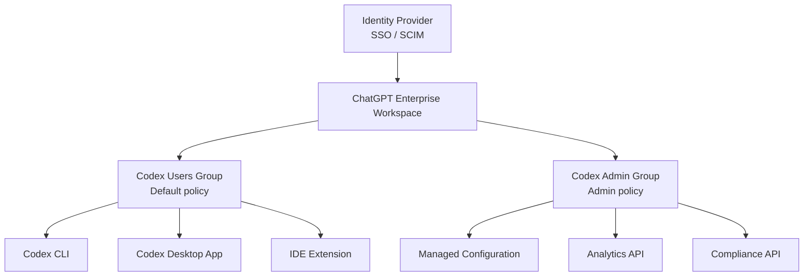
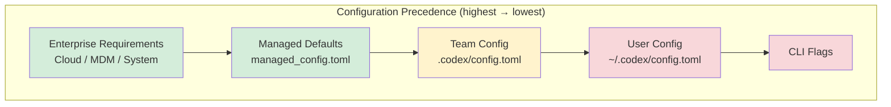
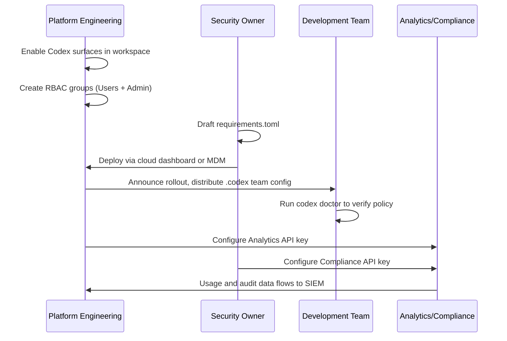

# Codex CLI Enterprise Admin Setup: RBAC, Managed Configuration, and Compliance APIs


---

On 14 May 2026, OpenAI published the first dedicated Enterprise Admin Setup guide for Codex, consolidating workspace enablement, RBAC, managed configuration, access tokens, and governance APIs into a single reference [^1]. This article walks through the seven-step rollout process, explains how managed configuration layers interact with local settings, and shows how the Compliance and Analytics APIs close the observability loop for regulated environments.

## Why a Dedicated Admin Guide Now?

Codex has shipped hooks general availability, access tokens for non-interactive workflows, and device-code authentication in the same release window [^2]. Each feature creates new surface area that enterprise security teams need to govern. Before May 2026, administrators assembled rollout procedures from scattered docs on sandbox modes, approval policies, and workspace settings. The new guide unifies these into a prescriptive sequence.

## The Three Owners Model

OpenAI recommends identifying three organisational roles before touching any settings [^1]:

| Role | Responsibility |
|---|---|
| **ChatGPT Enterprise Workspace Owner** | Enables Codex surfaces, configures workspace toggles |
| **Security Owner** | Sets agent permission boundaries, approval policies, sandbox constraints |
| **Analytics Owner** | Integrates Analytics and Compliance APIs, monitors governance data |

This separation of duties mirrors traditional cloud landing-zone patterns where infrastructure, security, and observability each have distinct owners.

## Step-by-Step Rollout

### 1. Enable Codex Surfaces

Codex Local (the CLI and desktop app) is enabled by default on new ChatGPT Enterprise workspaces [^1]. Codex Cloud requires explicit enablement and GitHub repository connection. Toggle both from **Workspace Settings → Settings and Permissions**.

Two optional toggles matter for CLI-centric teams:

- **Access tokens** — allow members to run Codex from scripts, schedulers, and private CI runners using their ChatGPT workspace identity [^2]
- **Device-code authentication** — supports non-interactive CLI environments such as SSH sessions and containers where browser-based OAuth is impractical [^1]

### 2. Configure RBAC

Codex RBAC sits inside ChatGPT Enterprise's existing custom-role system. Permissions resolve to the most permissive (least restrictive) access across all assigned roles [^1].

OpenAI recommends two groups:

```
Codex Users    → general access, inherits default policy
Codex Admin    → settings management, policy deployment, analytics
```

The **Codex Admin** role grants access to the managed-configuration page, analytics dashboards, cloud-managed policies, and GitHub connector management [^1]. If your organisation uses SCIM, back the Codex Admin group with your identity provider so membership changes are auditable and centrally managed [^1].



### 3. Deploy Managed Configuration

Managed configuration is the mechanism that makes enterprise policy enforceable rather than advisory. It has two layers [^3]:

- **Requirements** (`requirements.toml`) — admin-enforced constraints that users cannot override
- **Managed defaults** (`managed_config.toml`) — starting values applied at launch; users may modify them during sessions

#### Requirements Precedence

Codex applies requirements in a first-match-wins sequence [^3]:

1. Cloud-managed requirements (ChatGPT Business/Enterprise dashboard)
2. macOS MDM via `com.openai.codex:requirements_toml_base64`
3. System `requirements.toml` (`/etc/codex/` on Unix; `%ProgramData%\OpenAI\Codex\` on Windows)

#### Example: Locking Down a Regulated Environment

```toml
# /etc/codex/requirements.toml
allowed_approval_policies = ["untrusted", "on-request"]
allowed_sandbox_modes = ["read-only", "workspace-write"]
allowed_web_search_modes = ["cached"]

[features]
browser_use = false
computer_use = false

[rules]
prefix_rules = [
  { pattern = [{ token = "rm" }], decision = "forbidden" },
  { pattern = [{ token = "git", subtokens = ["push", "force"] }], decision = "forbidden" },
  { pattern = [{ token = "git" }], decision = "prompt" }
]

[experimental_network]
enabled = true
allowed_domains = ["api.openai.com", "registry.npmjs.org", "pypi.org"]
denied_domains = ["*"]
```

This configuration restricts approval policy to human-reviewed modes, disables browser and computer use, blocks destructive shell commands, and permits network access only to package registries [^3].

#### Host-Specific Sandbox Rules

For teams with heterogeneous infrastructure — local laptops and remote devboxes — use `[[remote_sandbox_config]]` to apply different policies per host [^3]:

```toml
allowed_sandbox_modes = ["read-only"]

[[remote_sandbox_config]]
hostname_patterns = ["*.devbox.example.com"]
allowed_sandbox_modes = ["read-only", "workspace-write"]
```

#### MCP Server Allowlisting

Requirements can also restrict which MCP servers the CLI is permitted to connect to [^3]:

```toml
[mcp_servers.docs]
identity = { command = "codex-mcp" }
```

Any MCP server not listed in the allowlist is rejected at startup, preventing developers from introducing unvetted tool servers.

### 4. macOS MDM Deployment

For organisations using Jamf, Kandji, or Mosyle, managed configuration can be pushed as a device profile [^3]:

1. Build the TOML payload
2. Encode with base64
3. Add to MDM profile under `com.openai.codex` with key `requirements_toml_base64` (for requirements) or `config_toml_base64` (for defaults)
4. Push profile; users restart Codex
5. Verify startup configuration reflects managed values

This is the only deployment path that does not require users to accept or install anything — the profile lands silently via MDM.

### 5. Team Configuration via `.codex`

Below the enterprise layer sits repository-scoped team configuration [^4]. The `.codex` directory checked into a repository provides:

```
.codex/
  config.toml       # defaults: sandbox, approvals, model
  rules/            # command governance rules
  skills/           # shared agent capabilities
```

Team config applies to anyone who opens the repository, regardless of their personal `~/.codex/config.toml` settings. Enterprise requirements always take precedence over team config [^3].



⚠️ CLI flags sit at the bottom of the precedence stack — they are overridden by managed layers. This is a deliberate design choice ensuring that `--full-auto` on the command line cannot bypass an enterprise policy restricting approval to `on-request`.

### 6. Governance: Analytics and Compliance APIs

Two API surfaces close the observability loop [^1]:

#### Analytics API

Scoped to `codex.enterprise.analytics.read`, the Analytics API exposes:

- `/workspaces/{workspace_id}/usage` — token consumption, session counts, model distribution
- `/code_reviews` — auto-review trigger counts, pass/fail rates
- `/code_review_responses` — developer responses to review findings

Setup requires a dedicated read-only API key. Email `support@openai.com` with the key's last four digits to request scoping [^1].

#### Compliance API

Scoped to read and delete permissions, the Compliance API provides:

- `/compliance/workspaces/{workspace_id}/logs` — audit trail of Codex interactions
- `/codex_tasks` — cloud task metadata
- `/codex_environments` — environment configuration snapshots

These endpoints support SIEM integration, retention-policy enforcement, and right-to-erasure requests under GDPR [^1].

### 7. Verification Checklist

OpenAI's guide concludes with a verification matrix [^1]:

- [ ] Local and cloud sign-in functions correctly
- [ ] MFA and SSO requirements match corporate security policy
- [ ] RBAC and workspace toggles produce expected access behaviour
- [ ] Managed configuration applies (check `codex doctor` output for policy layer)
- [ ] Governance data is visible to analytics owners

The `codex doctor` command, shipped in v0.131.0, now reports which managed-configuration layer is active, making it the fastest way to verify that enterprise policy has landed on a developer's machine [^5].

## Security Guarantees

OpenAI documents the following enterprise security properties for Codex [^6]:

| Property | Detail |
|---|---|
| Data training | Enterprise data is never used for model training |
| Data retention | Zero data retention for App, CLI, and IDE Extension |
| Encryption at rest | AES-256 |
| Encryption in transit | TLS 1.2+ |
| Audit logging | Via Compliance API |
| Residency and retention | Follows ChatGPT Enterprise workspace policies |

## Anti-Patterns

**Granting Codex Admin to all developers.** The admin role provides write access to managed policies that affect every user in the workspace. Keep it to platform engineering, IT, and governance operators.

**Relying solely on team config for security.** Repository-scoped `.codex/config.toml` is advisory — developers can override it locally. Use enterprise requirements for anything security-critical.

**Skipping the Analytics API.** Without usage telemetry, you cannot detect token-budget anomalies, shadow model usage, or unapproved MCP server connections.

**Deploying `full-auto` via managed defaults.** Even as a managed default, `full-auto` removes the human review checkpoint. For regulated environments, enforce `on-request` or `untrusted` via requirements instead.

## Practical Rollout Sequence

For teams moving from ad-hoc Codex adoption to governed deployment:



## Conclusion

The enterprise admin setup guide brings Codex's governance story to parity with what security teams expect from any developer tooling rollout: identity-backed access control, centrally enforced policy, and API-driven observability. The combination of cloud-managed requirements, MDM deployment, and the Compliance API makes it possible to adopt Codex CLI at scale without sacrificing the controls that regulated industries demand.

---

## Citations

[^1]: OpenAI, "Admin Setup – Codex", *OpenAI Developers*, May 2026. [https://developers.openai.com/codex/enterprise/admin-setup](https://developers.openai.com/codex/enterprise/admin-setup)

[^2]: OpenAI, "Changelog – Codex", *OpenAI Developers*, May 2026. [https://developers.openai.com/codex/changelog](https://developers.openai.com/codex/changelog)

[^3]: OpenAI, "Managed configuration – Codex", *OpenAI Developers*, May 2026. [https://developers.openai.com/codex/enterprise/managed-configuration](https://developers.openai.com/codex/enterprise/managed-configuration)

[^4]: OpenAI, "Config basics – Codex", *OpenAI Developers*, 2026. [https://developers.openai.com/codex/config-basic](https://developers.openai.com/codex/config-basic)

[^5]: OpenAI, "Codex CLI v0.131.0 Release", *GitHub Releases*, May 2026. [https://github.com/openai/codex/releases](https://github.com/openai/codex/releases)

[^6]: OpenAI, "Security – Codex", *OpenAI Developers*, 2026. [https://developers.openai.com/codex/security](https://developers.openai.com/codex/security)
