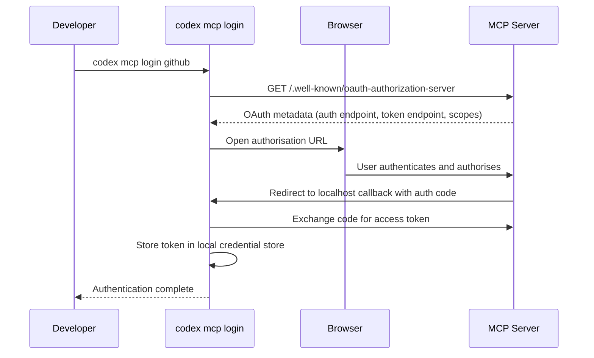
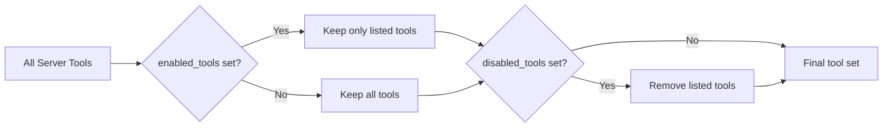

# Codex CLI MCP Server Management: CLI Commands, OAuth Flows, Streamable HTTP, and Production Configuration Patterns


---

The Model Context Protocol has become the standard integration surface for Codex CLI. Every MCP server you connect — whether a local STDIO process or a remote streamable HTTP endpoint — adds tools to the agent's repertoire. Managing those servers well is the difference between a responsive, secure agent session and a sluggish, over-privileged one.

Since March 2026, Codex CLI has shipped a dedicated `codex mcp` subcommand family that handles server registration, authentication, inspection, and removal entirely from the terminal[^1]. Combined with the TOML-based configuration system for tool filtering, approval modes, and timeout tuning, the MCP management surface now covers everything from quick local experiments to locked-down enterprise deployments.

This article is the comprehensive reference for that surface.

---

## The `codex mcp` Subcommand Family

Six subcommands cover the full lifecycle of an MCP server connection[^1][^2]:

| Subcommand | Purpose |
|---|---|
| `codex mcp add <name>` | Register a new STDIO or HTTP server |
| `codex mcp list` | Show all configured servers with auth status |
| `codex mcp get <name>` | Display detailed config for one server |
| `codex mcp remove <name>` | Delete a server entry from `config.toml` |
| `codex mcp login <name>` | Start an OAuth 2.0 flow for an HTTP server |
| `codex mcp logout <name>` | Remove stored OAuth credentials |

All mutations persist atomically to `~/.codex/config.toml` (or `$CODEX_HOME/config.toml`) via the internal `ConfigEditsBuilder`, ensuring no partial writes[^2].

### Adding a STDIO Server

STDIO servers run as local child processes. The command after `--` is the server's launch command:

```bash
# Documentation server via npx
codex mcp add context7 -- npx -y @upstash/context7-mcp

# Playwright browser automation
codex mcp add playwright -- npx -y @anthropic/mcp-playwright

# GitHub MCP with environment variable forwarding
codex mcp add github -- npx -y @github/mcp-server \
  --env GITHUB_PERSONAL_ACCESS_TOKEN
```

The CLI validates the server name, constructs the STDIO transport configuration, and writes the entry to `config.toml`[^2].

### Adding a Streamable HTTP Server

Streamable HTTP servers are remote endpoints accessible over HTTPS. Pass a URL instead of a launch command:

```bash
# Linear's hosted MCP server
codex mcp add linear --url https://mcp.linear.app/sse

# A self-hosted internal server with bearer token
codex mcp add internal-docs --url https://docs.internal.corp/mcp
```

When adding an HTTP server, the CLI automatically probes for OAuth support. If the server advertises OAuth metadata, the CLI may trigger an interactive login flow immediately[^2].

### Listing and Inspecting Servers

```bash
# Human-readable list with auth status
codex mcp list

# JSON output for scripting
codex mcp list --json

# Detailed view of one server
codex mcp get context7
```

The `list` command computes authentication status for each server by checking environment variables for bearer tokens, querying the local credential store for OAuth tokens, and probing HTTP servers for OAuth discovery endpoints[^2].

### Removing Servers

```bash
codex mcp remove context7
```

This deletes the server entry from `config.toml`. It does not remove stored OAuth credentials — use `codex mcp logout` first if you want a clean removal[^1].

---

## TOML Configuration Reference

The `codex mcp` CLI writes configuration entries, but for fine-grained control — tool filtering, approval modes, timeouts — you edit `config.toml` directly[^3][^4].

### STDIO Server — Full Example

```toml
[mcp_servers.docs]
enabled = true
required = true
command = "docs-server"
args = ["--port", "4000"]
env = { "API_KEY" = "value" }
env_vars = ["ANOTHER_SECRET"]
cwd = "/path/to/server"
startup_timeout_sec = 10.0
tool_timeout_sec = 60.0
enabled_tools = ["search", "summarize"]
disabled_tools = ["slow-tool"]
```

### Streamable HTTP Server — Full Example

```toml
[mcp_servers.github]
enabled = true
required = true
url = "https://github-mcp.example.com/mcp"
bearer_token_env_var = "GITHUB_TOKEN"
http_headers = { "X-Custom" = "value" }
env_http_headers = { "X-Auth" = "AUTH_ENV_VAR" }
startup_timeout_sec = 10.0
tool_timeout_sec = 60.0
enabled_tools = ["list_issues", "get_file_contents"]
disabled_tools = ["delete_issue"]
scopes = ["repo"]
```

### Key Configuration Parameters

| Key | Type | Default | Description |
|---|---|---|---|
| `enabled` | bool | `true` | Activate or deactivate without removing config |
| `required` | bool | `false` | Fail session startup if server cannot connect |
| `command` | string | — | STDIO: launch command |
| `args` | array | `[]` | STDIO: command arguments |
| `env` | table | `{}` | STDIO: inline environment variables |
| `env_vars` | array | `[]` | STDIO: forward named env vars from host |
| `cwd` | string | — | STDIO: working directory |
| `url` | string | — | HTTP: server endpoint URL |
| `bearer_token_env_var` | string | — | HTTP: env var containing bearer token |
| `http_headers` | table | `{}` | HTTP: static request headers |
| `env_http_headers` | table | `{}` | HTTP: headers sourced from env vars |
| `startup_timeout_sec` | float | `10.0` | Seconds to wait for server initialisation |
| `tool_timeout_sec` | float | `60.0` | Seconds to wait for tool execution |
| `enabled_tools` | array | all | Allow-list of exposed tool names |
| `disabled_tools` | array | `[]` | Deny-list applied after `enabled_tools` |
| `default_tools_approval_mode` | string | — | `"auto"`, `"prompt"`, or `"approve"` |
| `scopes` | array | — | OAuth scopes to request |
| `oauth_resource` | string | — | OAuth resource indicator |
| `experimental_environment` | string | — | Target execution environment |

Sources: [^3][^4]

---

## OAuth Authentication Flows

Streamable HTTP servers increasingly require OAuth 2.0 authentication. Codex CLI implements a full OAuth flow with local callback handling[^1][^3].

### How It Works



### Configuring the OAuth Callback

By default, Codex binds a temporary HTTP listener on a random port for the OAuth callback. If your OAuth provider requires a fixed callback URL, set these top-level keys in `config.toml`[^3]:

```toml
mcp_oauth_callback_port = 8432
mcp_oauth_callback_url = "http://localhost:8432/oauth/callback"
```

### Scope Resolution

If the MCP server advertises `scopes_supported` in its OAuth metadata, Codex uses those server-advertised scopes rather than any scopes configured in `config.toml`[^3]. This prevents misconfiguration where a client requests scopes the server does not recognise. You can still set `scopes` in your server config as a fallback for servers that do not advertise supported scopes.

### Credential Storage

OAuth tokens are stored separately from `config.toml` in a local credential store. On macOS, Codex uses the system Keychain where available; on Linux, it falls back to file-based encrypted storage[^2]. `codex mcp logout <name>` removes only the stored credentials — the server configuration remains intact.

---

## Tool Filtering and Approval Modes

Every MCP server can expose dozens of tools. Connecting a GitHub MCP server, for example, might add tools for listing issues, creating pull requests, deleting branches, and managing releases. You rarely want all of them active in every session[^3].

### The Filtering Pipeline

Tool filtering applies in two stages:

1. **`enabled_tools`** — an allow-list. If set, only named tools are exposed to the agent.
2. **`disabled_tools`** — a deny-list applied *after* `enabled_tools`. Any tool named here is removed, even if it appeared in the allow-list.



### Per-Tool Approval Overrides

Beyond the server-level `default_tools_approval_mode`, you can set approval behaviour per tool[^4]:

```toml
[mcp_servers.chrome_devtools]
url = "http://localhost:3000/mcp"
enabled_tools = ["open", "screenshot", "click"]
default_tools_approval_mode = "auto"

[mcp_servers.chrome_devtools.tools.click]
approval_mode = "approve"
```

Here, `open` and `screenshot` run automatically, but `click` always requires explicit user approval. The three approval modes are[^3]:

- **`auto`** — tool executes without prompting
- **`prompt`** — agent sees the tool but must request permission each call
- **`approve`** — the tool call is shown to the user for explicit approval before execution

---

## Project-Scoped vs User-Scoped Configuration

MCP servers can be registered at two levels[^3][^4]:

| Scope | File | Use Case |
|---|---|---|
| **User** | `~/.codex/config.toml` | Personal servers used across all projects |
| **Project** | `.codex/config.toml` | Team-shared servers specific to a repository |

Project-scoped MCP configuration only loads from **trusted projects**. The first time Codex encounters a `.codex/config.toml` in an untrusted directory, it prompts for trust confirmation before activating any servers defined there[^4].

### Team Configuration Pattern

For shared team setups, commit a `.codex/config.toml` in the repository root:

```toml
# .codex/config.toml — checked into version control

[mcp_servers.playwright]
command = "npx"
args = ["-y", "@anthropic/mcp-playwright"]
enabled_tools = ["navigate", "screenshot", "click", "fill"]
default_tools_approval_mode = "auto"
tool_timeout_sec = 30.0

[mcp_servers.sentry]
url = "https://mcp.sentry.dev/sse"
enabled_tools = ["search_issues", "get_issue_details"]
default_tools_approval_mode = "auto"
```

Individual developers can then override or supplement these in their user-scoped `config.toml`. The configuration hierarchy applies: project config is merged with user config, and user config takes precedence on conflicts[^4].

---

## Plugin-Provided MCP Servers

Codex plugins can bundle their own MCP servers. When a plugin includes an MCP server, you manage it through the plugin's namespace rather than the top-level `mcp_servers` table[^5]:

```toml
[plugins."sample@test".mcp_servers.sample]
enabled = true
default_tools_approval_mode = "prompt"
enabled_tools = ["read", "search"]

[plugins."sample@test".mcp_servers.sample.tools.search]
approval_mode = "approve"
```

This keeps plugin-provided servers isolated from your manually configured servers, preventing naming collisions and making it easy to enable or disable an entire plugin's tool surface with a single toggle.

---

## Enterprise Governance with `requirements.toml`

Enterprise administrators can constrain MCP configuration through `requirements.toml`[^6]. This prevents developers from connecting arbitrary MCP servers in managed environments:

```toml
# requirements.toml — admin-enforced

[mcp_servers]
# Only allow servers matching these URL patterns
allowed_urls = ["https://mcp.internal.corp/*", "https://github-mcp.example.com/*"]

# Block STDIO servers entirely in managed environments
allow_stdio = false
```

When a developer's `config.toml` includes an MCP server that violates `requirements.toml` constraints, Codex falls back to the nearest compliant configuration and notifies the user[^6]. The `codex doctor` command (introduced in v0.131.0) now includes MCP server health in its diagnostic output, verifying connectivity, authentication status, and policy compliance[^7].

---

## Production Configuration Patterns

### Pattern 1: Minimal Surface Area

Start with the smallest tool set you need. Every registered tool adds its JSON schema to every API request, consuming tokens[^8]:

```toml
[mcp_servers.github]
url = "https://api.github.com/mcp"
bearer_token_env_var = "GITHUB_TOKEN"
# Only the three tools this project actually uses
enabled_tools = ["get_file_contents", "list_issues", "create_pull_request"]
default_tools_approval_mode = "auto"
```

### Pattern 2: Read-Only by Default, Write on Approval

For servers with destructive capabilities, expose read tools freely but gate writes:

```toml
[mcp_servers.database]
command = "npx"
args = ["-y", "@crystaldba/postgres-mcp"]
env_vars = ["DATABASE_URL"]
enabled_tools = ["query", "explain", "list_tables", "describe_table", "execute"]
default_tools_approval_mode = "auto"

[mcp_servers.database.tools.execute]
approval_mode = "approve"
```

### Pattern 3: CI/CD Server Selection

In non-interactive `codex exec` runs, mark critical servers as `required` so the pipeline fails fast if a server is unreachable rather than silently degrading:

```toml
[mcp_servers.github]
url = "https://api.github.com/mcp"
bearer_token_env_var = "GITHUB_TOKEN"
required = true
startup_timeout_sec = 15.0

[mcp_servers.sentry]
url = "https://mcp.sentry.dev/sse"
required = false  # nice to have, not a hard dependency
```

### Pattern 4: Environment-Specific Forwarding

Use `env_vars` with the `source` attribute to forward secrets from different stores depending on execution environment:

```toml
[mcp_servers.internal]
command = "internal-mcp-server"
env_vars = [
  "API_KEY",
  { name = "REMOTE_TOKEN", source = "remote" }
]
```

The `source = "remote"` directive tells Codex to resolve the variable from the remote environment when running via `codex cloud exec`, rather than the local shell[^3].

---

## Troubleshooting MCP Connections

When an MCP server fails to connect or tools behave unexpectedly, use these diagnostic steps:

1. **Check server status**: `codex mcp list` shows connectivity and auth status for all servers.
2. **Inspect configuration**: `codex mcp get <name>` displays the full TOML entry including resolved environment variables.
3. **Run diagnostics**: `codex doctor` (v0.131.0+) includes MCP server health checks[^7].
4. **Increase timeouts**: Servers loading large schemas may need `startup_timeout_sec` above the 10-second default.
5. **Check tool filtering**: If a tool you expect is missing, verify it is not excluded by `enabled_tools` or `disabled_tools`.
6. **Re-authenticate**: For OAuth servers, `codex mcp logout <name>` followed by `codex mcp login <name>` forces a fresh token exchange.

---

## What Is Missing — and What Is Coming

As of v0.131.0, two notable gaps remain in the `codex mcp` CLI[^9][^10]:

- **No `enable`/`disable` subcommand** — You cannot temporarily deactivate a server without editing `config.toml` manually. A feature request for `codex mcp enable|disable <server>` has been filed[^9].
- **No tool listing or validation** — The CLI cannot enumerate which tools a server exposes or validate that a server responds correctly before you start a session. A proposal for `codex mcp validate` and `codex mcp tools <server>` is under discussion[^10].

Both features are expected in the v0.132.x cycle based on the current GitHub issue triage.

---

## Citations

[^1]: [Model Context Protocol — Codex | OpenAI Developers](https://developers.openai.com/codex/mcp)
[^2]: [MCP CLI Commands — openai/codex | DeepWiki](https://deepwiki.com/openai/codex/6.3-mcp-cli-commands)
[^3]: [Configuration Reference — Codex | OpenAI Developers](https://developers.openai.com/codex/config-reference)
[^4]: [Sample Configuration — Codex | OpenAI Developers](https://developers.openai.com/codex/config-sample)
[^5]: [Codex CLI Plugin Marketplace — Remote Installation, Workspace Sharing, and Bundled Hooks | Codex Blog](https://codex.danielvaughan.com/2026/05/08/codex-cli-plugin-marketplace-remote-install-workspace-sharing-bundled-hooks/)
[^6]: [Managed Configuration — Codex | OpenAI Developers](https://developers.openai.com/codex/enterprise/managed-configuration)
[^7]: [Codex CLI v0.131.0 Release — GitHub Releases](https://github.com/openai/codex/releases/tag/v0.131.0)
[^8]: [MCP Schema Bloat and System Prompt Tax — Codex Blog](https://codex.danielvaughan.com/2026/04/23/mcp-schema-bloat-system-prompt-tax-tool-definition-performance/)
[^9]: [Add `codex mcp enable|disable <server>` CLI subcommands — GitHub Issue #16439](https://github.com/openai/codex/issues/16439)
[^10]: [MCP CLI should expose validation, tool listing, and enable — GitHub Issue #20195](https://github.com/openai/codex/issues/20195)
