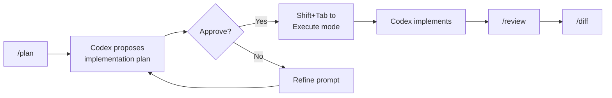

# Codex CLI Slash Commands Complete Reference: All 45 Commands in v0.131


Codex CLI v0.131.0 ships with 45 slash commands — more than triple the count from early 2026[^1]. Most guides still reference the original dozen. This article catalogues every command available in the TUI as of May 2026, organised by function, with usage patterns that senior developers actually need.

## How Slash Commands Work

Type `/` in the Codex CLI composer to open the command picker. Tab-completion filters the list as you type. Most commands accept inline arguments (e.g. `/plan refactor the auth module`) and execute immediately[^2].

Slash commands are distinct from CLI subcommands like `codex exec` or `codex mcp`. They operate *inside* an active interactive session, not from the shell.

## Model and Performance Control

These commands govern which model processes your prompts and how fast it responds.

| Command | Purpose | Example |
|---------|---------|---------|
| `/model` | Switch the active model mid-session | `/model gpt-5.4-mini` |
| `/fast` | Toggle the Fast service tier (1.5× speed, higher credit burn) | `/fast on` |
| `/personality` | Choose a communication style: `friendly`, `pragmatic`, or `none` | `/personality pragmatic` |

`/fast` works with GPT-5.5 (2.5× credit consumption) and GPT-5.4 (2× consumption)[^3]. API key users cannot access Fast mode — it requires a ChatGPT subscription. Use `/personality none` to strip all personality instructions and reclaim token budget for task context.

```toml
# Persist these in ~/.codex/config.toml instead of setting per-session
model = "gpt-5.4-mini"
service_tier = "fast"

[features]
fast_mode = true
```

## Session Management

Commands for controlling conversation flow, branching, and resuming prior work.

| Command | Purpose |
|---------|---------|
| `/clear` | Wipe the terminal and start a fresh chat within the same CLI process |
| `/new` | Start a new conversation thread without leaving the CLI |
| `/resume` | Reload a previous saved conversation from the session list |
| `/fork` | Clone the current conversation into a new thread, preserving the original |
| `/side` | Open an ephemeral side conversation without derailing the main thread |
| `/exit` | Close the interactive session |
| `/quit` | Alias for `/exit` |

### Branching Patterns

`/fork` creates a persistent branch — the original transcript survives, and you can `/resume` either branch later. Use it when you want to try an alternative architectural approach without losing progress[^4].

`/side` creates a *throwaway* branch. Ask a quick question, then return to the main thread with no transcript pollution. Useful for ad-hoc queries mid-refactor:

```
/side what's the maximum connection pool size for pg 16?
```

The side conversation's output stays visible for reference but does not enter the main thread's context window.

## Workflow and Mode Switching

These commands change how Codex interacts with your codebase.

| Command | Purpose |
|---------|---------|
| `/plan` | Switch to plan mode — Codex reads files and proposes a plan without writing anything |
| `/goal` | Set a persistent objective that survives across turns (experimental) |
| `/review` | Ask Codex to review your working tree, focusing on behaviour changes and missing tests |
| `/diff` | Display the Git diff, including staged changes, unstaged changes, and untracked files |
| `/compact` | Summarise earlier conversation to free context tokens |



### Plan-Execute-Review Cycle

The canonical workflow is `/plan` → review the proposal → `Shift+Tab` to switch to Execute mode → `/review` to validate → `/diff` to inspect changes[^5]. This keeps the agent from racing ahead on an approach you haven't sanctioned.

### Context Compaction

`/compact` is essential for long sessions. When context pressure rises, Codex replaces earlier turns with a compressed summary. The model preserves task-critical details — file paths, decisions made, error signatures — whilst discarding conversational boilerplate[^6].

### Persistent Goals

`/goal` sets an objective that persists across turns:

```
/goal raise test coverage in src/auth to 90% without mocking external calls
/goal          # view the current goal
/goal pause    # temporarily suspend
/goal resume   # reactivate
/goal clear    # remove entirely
```

This is an experimental feature requiring the `goals` feature flag[^7].

## Permissions and Security

Commands for adjusting the agent's autonomy boundary during a session.

| Command | Purpose |
|---------|---------|
| `/permissions` | Switch approval mode: auto-approve, on-request, or manual |
| `/approve` | Retry a specific action that the auto-reviewer denied |
| `/hooks` | Review, trust, or disable lifecycle hooks |

`/permissions` maps to the `--ask-for-approval` CLI flag. Tightening mid-session (e.g. from `never` to `on-request`) takes effect immediately without restarting[^8].

`/approve` is narrow by design: it retries only the most recently denied action, not a blanket override. This prevents accidental escalation when the auto-reviewer blocks a sandbox boundary crossing or a side-effecting MCP call[^9].

## Context and File Attachment

Commands for injecting additional context into the conversation.

| Command | Purpose |
|---------|---------|
| `/ide` | Include open files, current selection, and other IDE context |
| `/mention` | Attach a specific file to the conversation |
| `/memories` | Configure whether threads use or generate persistent memories |

`/mention` is equivalent to the `@` mention syntax in the composer. Both support tab-completion across files, directories, plugins, and skills as of v0.131.0's unified mentions system[^10].

`/memories` controls two dimensions independently:

```
/memories generate off    # this thread won't create new memories
/memories use on          # this thread will consume existing memories
```

## Agent and Extension Management

Commands for working with subagents, plugins, skills, apps, and MCP tools.

| Command | Purpose |
|---------|---------|
| `/agent` | Switch the active agent thread when running parallel subagents |
| `/skills` | Browse and invoke task-specific skills |
| `/apps` | Browse connectors (apps) and insert them as `$app-slug` mentions |
| `/plugins` | Browse installed and marketplace plugins |
| `/mcp` | List configured MCP tools and their status |

### Subagent Switching

When you've delegated work to subagents, `/agent` lets you switch focus between threads. Each thread maintains its own context, approval state, and model configuration[^11].

### Skill Invocation

`/skills` opens a picker showing all available skills. Select one and Codex loads its `SKILL.md` into context. You can also invoke skills implicitly by starting a prompt with `$skill-name`[^12].

## TUI Customisation

Commands for tailoring the terminal interface to your preferences.

| Command | Purpose |
|---------|---------|
| `/vim` | Toggle Vim modal editing in the composer |
| `/raw` | Toggle raw scrollback mode for cleaner copy-paste |
| `/keymap` | Remap TUI keyboard shortcuts |
| `/statusline` | Configure which fields appear in the TUI footer |
| `/title` | Customise terminal window or tab title fields |
| `/theme` | Choose a syntax-highlighting theme with live preview |

`/vim` was added in v0.131.0 and supports normal, insert, and visual modes within the composer. You can set it as the default:

```toml
[tui]
default_mode = "vim"
```

`/raw` is useful when you need to copy a large block of output without TUI chrome interfering. Toggle it on, select and copy, then toggle it off to return to the rich display[^13].

### Reasoning Controls

Whilst not slash commands, the keyboard shortcuts `Alt+,` (lower reasoning effort) and `Alt+.` (raise reasoning effort) pair naturally with `/model` for fine-grained control over response quality and speed[^14].

## Diagnostics and System

Commands for inspecting configuration, reporting issues, and managing authentication.

| Command | Purpose |
|---------|---------|
| `/status` | Display session configuration, model, approval mode, and token usage |
| `/debug-config` | Print the full configuration layer stack and requirements diagnostics |
| `/experimental` | Toggle experimental feature flags |
| `/feedback` | Submit session logs to the Codex maintainers |
| `/init` | Generate an `AGENTS.md` scaffold in the current directory |
| `/logout` | Clear stored authentication credentials |

`/debug-config` is the session equivalent of `codex doctor`. It shows which configuration layers are active, their precedence, any `requirements.toml` constraints from enterprise governance, and flag overrides. Invaluable when a setting isn't behaving as expected[^15].

## Background Process Management

Commands for monitoring and controlling background work.

| Command | Purpose |
|---------|---------|
| `/ps` | Show experimental background terminals and their status |
| `/stop` | Cancel all running background terminals |
| `/copy` | Copy the latest completed Codex output to the clipboard |

`/ps` lists any background processes spawned by Codex during the session — useful when the agent kicks off a long-running build or test suite in the background and you need to check progress[^16].

## Quick Reference Card

For rapid lookup, here are all 45 commands in alphabetical order:

```
/agent       /approve     /apps        /clear       /compact
/copy        /debug-config /diff       /exit        /experimental
/fast        /feedback    /fork        /goal        /hooks
/ide         /init        /keymap      /logout      /mcp
/memories    /mention     /model       /new         /permissions
/personality /plan        /plugins     /ps          /quit
/raw         /resume      /review      /sandbox-add-read-dir
/side        /skills      /status      /statusline  /stop
/theme       /title       /vim
```

Note: `/sandbox-add-read-dir` is Windows-only and grants read access to additional directories at runtime[^17].

## Building Custom Slash Commands

Codex does not currently support user-defined slash commands directly. However, you can achieve similar effects through:

1. **Skills** — Package a workflow as a skill with a `SKILL.md` file, then invoke it via `/skills` or `$skill-name`[^12]
2. **Hooks** — Attach scripts to lifecycle events (pre-tool-use, post-tool-use, on-turn-end) for automated validation[^18]
3. **Plugins** — Bundle skills, hooks, and MCP servers together and distribute via the marketplace[^19]

## What Changed in v0.131.0

The following commands were added or significantly enhanced in the v0.131.0 release cycle[^1]:

- **`/vim`** — New. Modal Vim editing in the composer with configurable default mode
- **`/approve`** — New. Retry auto-review denials without restarting
- **`/agent`** — Enhanced. Now supports the multi-environment session architecture
- **`/apps`** — Enhanced. Backed by app-server plugin metadata with unified search
- **`/statusline`** — New. Interactive footer configuration with blended token usage display
- **`/title`** — New. Terminal title customisation
- **`/debug-config`** — New. Configuration layer diagnostics

The unified `@` mentions system also changed how `/mention` works — it now searches files, directories, plugins, and skills through a single picker[^10].

## Citations

[^1]: [Codex CLI v0.131.0 Release Notes](https://github.com/openai/codex/releases) — GitHub, May 2026
[^2]: [Slash Commands in Codex CLI](https://developers.openai.com/codex/cli/slash-commands) — OpenAI Developer Documentation
[^3]: [Codex Speed Configuration](https://developers.openai.com/codex/speed) — OpenAI Developer Documentation
[^4]: [Features — Codex CLI](https://developers.openai.com/codex/cli/features) — OpenAI Developer Documentation
[^5]: [Best Practices — Codex](https://developers.openai.com/codex/learn/best-practices) — OpenAI Developer Documentation
[^6]: [Codex Prompting Guide](https://developers.openai.com/cookbook/examples/gpt-5/codex_prompting_guide) — OpenAI Cookbook
[^7]: [Codex /goal Command](https://developers.openai.com/codex/cli/features) — OpenAI Developer Documentation
[^8]: [Agent Approvals and Security](https://developers.openai.com/codex/agent-approvals-security) — OpenAI Developer Documentation
[^9]: [Auto-Review Documentation](https://developers.openai.com/codex/concepts/sandboxing) — OpenAI Developer Documentation, May 2026
[^10]: [Codex Changelog — v0.131.0](https://developers.openai.com/codex/changelog) — OpenAI, May 18, 2026
[^11]: [Subagents — Codex](https://developers.openai.com/codex/subagents) — OpenAI Developer Documentation
[^12]: [Agent Skills — Codex](https://developers.openai.com/codex/skills) — OpenAI Developer Documentation
[^13]: [Codex CLI Features — Raw Scrollback](https://developers.openai.com/codex/cli/features) — OpenAI Developer Documentation
[^14]: [Codex Changelog — TUI Reasoning Controls](https://developers.openai.com/codex/changelog) — OpenAI, May 2026
[^15]: [Config Reference — Codex](https://developers.openai.com/codex/config-reference) — OpenAI Developer Documentation
[^16]: [Codex CLI Features — Background Terminals](https://developers.openai.com/codex/cli/features) — OpenAI Developer Documentation
[^17]: [Command Line Options — Codex CLI](https://developers.openai.com/codex/cli/reference) — OpenAI Developer Documentation
[^18]: [Hooks — Codex](https://developers.openai.com/codex/hooks) — OpenAI Developer Documentation
[^19]: [Plugins — Codex](https://developers.openai.com/codex/plugins) — OpenAI Developer Documentation
