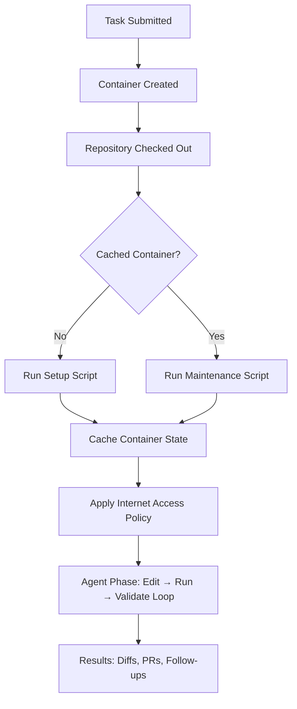
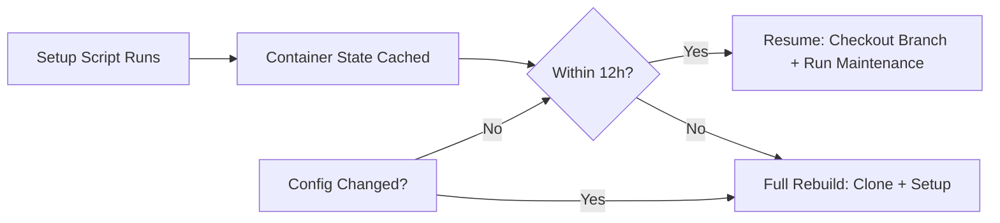
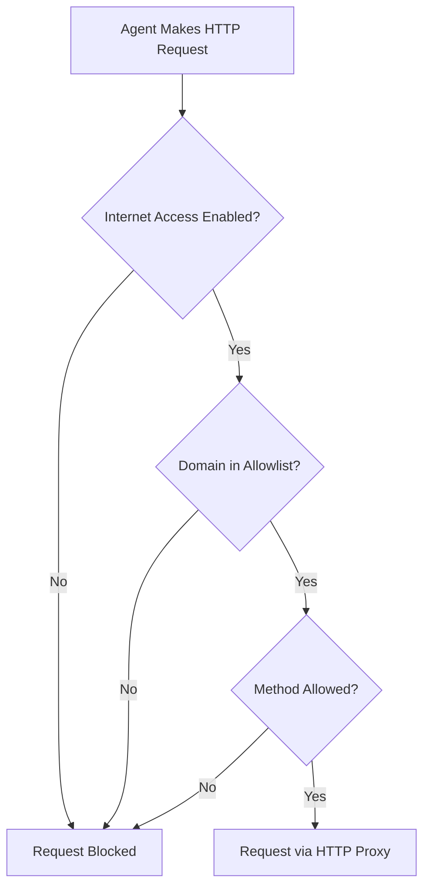

# Codex Cloud Environment Configuration: Setup Scripts, Container Caching, and the codex-universal Image


---

Codex Cloud runs your agent inside an isolated container with your repository checked out and your dependencies installed. Getting that container right — the setup script, the runtime versions, the secrets, the network policy — is the difference between an agent that ships code and one that spends its first ten minutes installing `gcc`. This article covers the full environment configuration surface as of May 2026, from the `codex-universal` base image through setup and maintenance scripts, container caching, secrets management, internet access policies, and the `codex cloud` CLI subcommands that tie it all together.

## The Two-Phase Execution Model

Every Codex Cloud task follows a strict two-phase lifecycle[^1][^2]:



The setup phase runs with full internet access so package managers can pull dependencies[^1]. The agent phase runs offline by default, with configurable internet access if your workflow requires it[^3]. This separation is deliberate: it prevents the agent from fetching arbitrary code at runtime whilst still allowing dependency installation during setup.

Crucially, the two phases run in separate Bash sessions. Environment variables exported in a setup script do not persist into the agent phase[^1]. If you need a variable available to the agent, set it through the Codex environment configuration or write it to `~/.bashrc`.

## The codex-universal Base Image

Every Codex Cloud container starts from `codex-universal`, an Ubuntu 24.04–based polyglot image that OpenAI maintains as an open-source reference implementation[^4]. The image ships with pre-installed runtimes for eight languages, configurable via `CODEX_ENV_*` environment variables[^4][^5]:

| Language | Variable | Supported Versions |
|----------|---------|-------------------|
| Python | `CODEX_ENV_PYTHON_VERSION` | 3.10, 3.11.12, 3.12, 3.13, 3.14.0 |
| Node.js | `CODEX_ENV_NODE_VERSION` | 18, 20, 22 |
| Rust | `CODEX_ENV_RUST_VERSION` | 1.83.0–1.95.0 (11 versions) |
| Go | `CODEX_ENV_GO_VERSION` | 1.22.12, 1.23.8, 1.24.3, 1.25.1 |
| Swift | `CODEX_ENV_SWIFT_VERSION` | 5.10, 6.1, 6.2 |
| Ruby | `CODEX_ENV_RUBY_VERSION` | 3.2.3, 3.3.8, 3.4.4 |
| PHP | `CODEX_ENV_PHP_VERSION` | 8.2, 8.3, 8.4 |
| Java | `CODEX_ENV_JAVA_VERSION` | 11, 17, 21–25 |

Beyond runtimes, the image bundles development tooling you would otherwise spend setup time installing[^4][^5]:

- **Python ecosystem:** `pyenv`, `poetry`, `uv`, `ruff`, `black`, `mypy`, `pyright`, `isort`
- **Node ecosystem:** `corepack`, `yarn`, `pnpm`, `npm`, `bun` 1.2.10
- **Build tools:** `bazelisk`, `cmake`, `ninja-build`, `clang-tidy`
- **Functional languages:** Erlang 27.1.2, Elixir 1.18.3

Pin your runtime versions through the Codex environment settings rather than in your setup script. The image resolves `CODEX_ENV_*` variables at container start via an entrypoint script, which is faster and more cache-friendly than installing from scratch[^4].

### Running codex-universal Locally

You can replicate your cloud environment locally for debugging[^4]:

```bash
docker pull ghcr.io/openai/codex-universal:latest

docker run --rm -it \
  -e CODEX_ENV_PYTHON_VERSION=3.12 \
  -e CODEX_ENV_NODE_VERSION=20 \
  -e CODEX_ENV_RUST_VERSION=1.87.0 \
  -e CODEX_ENV_GO_VERSION=1.23.8 \
  -v $(pwd):/workspace/$(basename $(pwd)) \
  ghcr.io/openai/codex-universal:latest
```

This gives you an identical base to test your setup script before pushing it to Codex Cloud. The image builds for both `linux/amd64` and `linux/arm64`, though only `amd64` runs in production[^4].

## Setup Scripts

For projects using standard package managers — npm, yarn, pnpm, pip, pipenv, or poetry — Codex automatically detects lockfiles and installs dependencies without a custom setup script[^1]. For everything else, you write a Bash script.

### Writing Effective Setup Scripts

A good setup script is idempotent, fast, and cache-aware. Here is a typical example for a Python monorepo with additional system dependencies:

```bash
#!/bin/bash
set -euo pipefail

# System packages the agent needs at runtime
apt-get update && apt-get install -y --no-install-recommends \
  libpq-dev \
  graphviz

# Install Python dependencies
cd /workspace/myproject
poetry install --no-interaction --no-root

# Install pre-commit hooks so the agent can run them
poetry run pre-commit install --install-hooks

# TypeScript SDK in a subdirectory
cd /workspace/myproject/sdk
pnpm install --frozen-lockfile
```

### Common Setup Script Pitfalls

**Exporting environment variables:** Commands like `export DATABASE_URL=...` vanish after the setup phase ends. Write them to `~/.bashrc` instead, or use the Codex environment variables configuration[^1]:

```bash
# Wrong — does not persist
export PYTHONPATH=/workspace/myproject/src

# Correct — persists into agent phase
echo 'export PYTHONPATH=/workspace/myproject/src' >> ~/.bashrc
```

**Installing runtimes in setup:** If you need Python 3.13 and it is available in `CODEX_ENV_PYTHON_VERSION`, pin it in the environment settings rather than running `pyenv install 3.13` in your script. The environment variable approach is resolved at container start and survives caching[^4].

**Non-deterministic installs:** Always use lockfiles (`--frozen-lockfile`, `poetry.lock`, `Cargo.lock`). Without them, cached containers may have different dependency versions than fresh ones.

## Maintenance Scripts

When Codex resumes a cached container, the repository may have moved forward. The maintenance script handles this delta[^1]:

```bash
#!/bin/bash
set -euo pipefail

cd /workspace/myproject
poetry install --no-interaction --no-root
cd /workspace/myproject/sdk
pnpm install --frozen-lockfile
```

Maintenance scripts should be lightweight — they run on every cached resume. Keep expensive operations (system packages, tool compilation) in the setup script where they are cached, and limit the maintenance script to dependency synchronisation.

## Container Caching

Codex caches container state for up to 12 hours after the setup script completes[^1]. The cache lifecycle works as follows:



The cache invalidates automatically when you change any of[^1]:

- The setup script
- The maintenance script
- Environment variables
- Secrets

For Business and Enterprise workspaces, caches are shared across all workspace members[^1]. This means one developer's cache warm-up benefits the entire team — but also means that changing the setup script invalidates the cache for everyone.

### Cache Optimisation Strategies

**Layer your setup script.** Put slow, stable operations (system packages, compiled tools) first and fast, volatile operations (dependency installs) last. When dependencies change but system packages do not, only the maintenance script runs on cached containers.

**Pin specific versions.** Avoid `apt-get install -y python3` without a version pin. If the base image updates, your cached container has one version and fresh builds have another.

**Test with `codex-universal` locally.** Run your setup script inside the Docker image before deploying it to Codex Cloud. If it works locally, it will work in the cloud.

## Secrets Management

Codex Cloud distinguishes between environment variables and secrets[^1]:

| | Environment Variables | Secrets |
|---|---|---|
| **Availability** | Setup + Agent phases | Setup phase only |
| **Storage** | Encrypted at rest | Encrypted at rest |
| **Agent access** | Yes | No — removed before agent starts |
| **Use case** | Config, paths, feature flags | API keys, database credentials, registry tokens |

This design prevents the agent from accidentally leaking credentials in generated code or tool output. If your agent needs to authenticate at runtime (e.g., pushing to a private registry), use a setup script to configure credential helpers that do not expose the raw secret:

```bash
#!/bin/bash
# Setup script — secret is available here
echo "//registry.npmjs.org/:_authToken=${NPM_TOKEN}" > ~/.npmrc
# NPM_TOKEN is removed before the agent starts,
# but ~/.npmrc persists and npm reads it transparently
```

## Internet Access Policies

Agent-phase internet access is configured per environment with three domain allowlist presets[^3]:

1. **None:** Empty allowlist — add specific domains manually
2. **Common dependencies:** Pre-configured list of 70+ domains covering GitHub, npm, PyPI, Maven Central, Docker Hub, Crates.io, Hex.pm, RubyGems, and major cloud providers[^3]
3. **All (unrestricted):** No domain restrictions

You can further restrict access by limiting HTTP methods to `GET`, `HEAD`, and `OPTIONS`, blocking potentially destructive operations like `POST`, `PUT`, and `DELETE`[^3].



All outbound traffic routes through an HTTP/HTTPS proxy for logging and enforcement[^3]. Enabling internet access introduces risks — prompt injection from web content, data exfiltration, and vulnerable dependency downloads — so the principle of least privilege applies: start with `None` and add domains as your workflow requires them[^3].

## The codex cloud CLI

The `codex cloud` subcommand bridges your terminal to cloud task management[^6][^7]:

```bash
# Interactive picker — browse active and finished tasks
codex cloud

# Submit a task directly
codex cloud exec --env ENV_ID "Refactor the auth module to use JWT"

# Best-of-N: submit 3 parallel attempts, pick the best
codex cloud exec --env ENV_ID --attempts 3 "Add pagination to the /users endpoint"

# List recent tasks for scripting
codex cloud list
```

Environment IDs come from your Codex Cloud configuration. Press `Ctrl+O` in the interactive picker to select an environment, or check the web dashboard for the exact value[^7].

### CLI-to-Cloud Delegation Pattern

The best-practices guide recommends a "delegate refactor to the cloud" workflow for large changes[^8]: plan locally in the IDE or CLI, then submit the implementation to a cloud task where the agent has a clean container, full dependency setup, and can run tests without blocking your local machine.

```bash
# Plan locally
codex exec "Outline the steps to migrate from Express to Fastify" \
  --output-schema ./plan-schema.json -o ./migration-plan.json

# Delegate to cloud
codex cloud exec --env production-node20 \
  "Execute this migration plan: $(cat ./migration-plan.json)"
```

## Putting It All Together: A Production Environment

Here is a complete configuration for a Node.js 20 + Python 3.12 monorepo:

**Environment variables:**

```toml
CODEX_ENV_NODE_VERSION = "20"
CODEX_ENV_PYTHON_VERSION = "3.12"
NODE_ENV = "test"
CI = "true"
```

**Secrets:**

- `NPM_TOKEN` — private registry authentication
- `DATABASE_URL` — test database connection string

**Setup script:**

```bash
#!/bin/bash
set -euo pipefail

# Configure private registry access (uses NPM_TOKEN secret)
echo "//registry.npmjs.org/:_authToken=${NPM_TOKEN}" > ~/.npmrc

# Frontend
cd /workspace/monorepo/packages/web
pnpm install --frozen-lockfile

# Backend
cd /workspace/monorepo/packages/api
poetry install --no-interaction

# Shared tooling
cd /workspace/monorepo
pnpm install --frozen-lockfile
```

**Maintenance script:**

```bash
#!/bin/bash
set -euo pipefail
cd /workspace/monorepo && pnpm install --frozen-lockfile
cd /workspace/monorepo/packages/api && poetry install --no-interaction
```

**Internet access:** Common dependencies preset with `GET`/`HEAD`/`OPTIONS` methods only.

## Anti-Patterns

- **Danger: unrestricted internet in agent phase.** The `All` domain preset with all HTTP methods is the cloud equivalent of `danger-full-access`. Use it only for workflows that genuinely need to POST to external APIs, and accept the prompt injection and exfiltration risks.
- **Installing runtimes in setup scripts.** If `CODEX_ENV_*` supports your version, use it. Setup script installs are slower and do not benefit from the base image's pre-built layers.
- **Modifying secrets frequently.** Every secrets change invalidates the container cache for your entire workspace. Batch secrets changes and communicate them to your team.
- **Skipping the maintenance script.** Without it, cached containers resume with stale dependencies from whenever the cache was built (up to 12 hours ago). The maintenance script is your `npm install` on branch switch.
- **Testing setup scripts only in CI.** Pull `codex-universal` locally and test your script there. CI environments may have different base images or network policies.

## Known Limitations

- ⚠️ Container caches last a maximum of 12 hours[^1]. Long-running pipelines or overnight batch jobs may see full rebuilds.
- ⚠️ The `codex-universal` image is a reference implementation. OpenAI notes it is "similar" to the production image but not necessarily identical[^4].
- ⚠️ `linux/arm64` builds exclude OpenJDK 10 and Swift due to `mise` compatibility issues[^4].
- ⚠️ Setup script `export` commands do not persist — this is by design, not a bug[^1].

## Citations

[^1]: OpenAI, "Cloud environments – Codex web," *OpenAI Developers*, [https://developers.openai.com/codex/cloud/environments](https://developers.openai.com/codex/cloud/environments)

[^2]: OpenAI, "Web – Codex," *OpenAI Developers*, [https://developers.openai.com/codex/cloud](https://developers.openai.com/codex/cloud)

[^3]: OpenAI, "Agent internet access – Codex web," *OpenAI Developers*, [https://developers.openai.com/codex/cloud/internet-access](https://developers.openai.com/codex/cloud/internet-access)

[^4]: OpenAI, "codex-universal: Base docker image used in Codex environments," *GitHub*, [https://github.com/openai/codex-universal](https://github.com/openai/codex-universal)

[^5]: OpenAI, "codex-universal Dockerfile," *GitHub*, [https://github.com/openai/codex-universal/blob/main/Dockerfile](https://github.com/openai/codex-universal/blob/main/Dockerfile)

[^6]: OpenAI, "Features – Codex CLI," *OpenAI Developers*, [https://developers.openai.com/codex/cli/features](https://developers.openai.com/codex/cli/features)

[^7]: OpenAI, "Command line options – Codex CLI," *OpenAI Developers*, [https://developers.openai.com/codex/cli/reference](https://developers.openai.com/codex/cli/reference)

[^8]: OpenAI, "Best practices – Codex," *OpenAI Developers*, [https://developers.openai.com/codex/learn/best-practices](https://developers.openai.com/codex/learn/best-practices)
