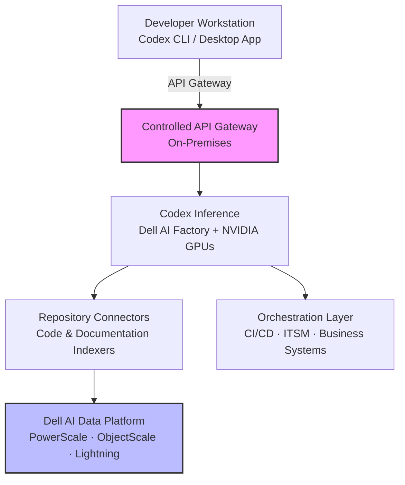
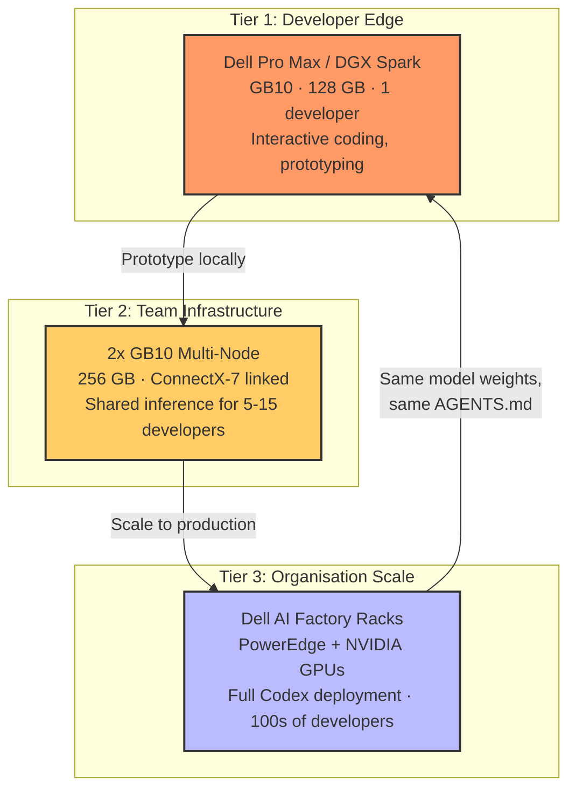
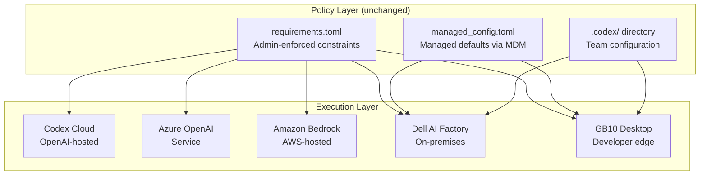
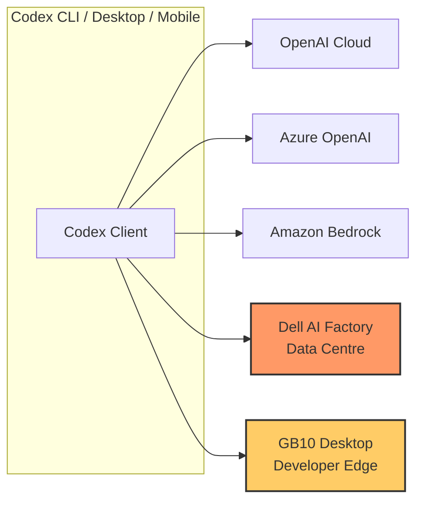

# Codex On-Premises: The Dell AI Factory Partnership, Hybrid Deployment, and What It Means for Data-Sovereign Enterprises


---

On 18 May 2026, OpenAI and Dell Technologies announced a collaboration to bring Codex into hybrid and on-premises enterprise environments [^1]. The timing is not accidental: more than four million developers now use Codex weekly [^2], and the fastest-growing segment of that user base sits inside organisations whose code, documentation, and operational data cannot leave a governed perimeter. This article unpacks what the partnership delivers, where it fits in the existing Codex enterprise stack, and how the NVIDIA GB10 Superchip creates a compelling developer-edge tier that the announcement itself understates.

## Why On-Premises Matters for Coding Agents

Cloud-hosted Codex (whether via ChatGPT Enterprise or the Codex Cloud task surface) works well when source code can transit OpenAI's API boundary. For a significant class of enterprise — defence contractors, financial institutions bound by MAS or PRA rules, healthcare organisations handling PHI, and any company with strict data-residency mandates — that boundary is a hard stop.

Until now, the workaround was Azure OpenAI Service or Amazon Bedrock as intermediary hosting layers [^3]. The Dell partnership introduces a third path: running the Codex inference surface on infrastructure the enterprise already owns, governed by the enterprise's own network and identity policies.

## The Dell AI Factory and AI Data Platform

Two Dell products sit at the centre of the integration:

### Dell AI Factory

The Dell AI Factory with NVIDIA is a modular infrastructure stack combining compute (PowerEdge servers with NVIDIA GPUs), networking, storage, cooling, and management into pre-engineered rack-scale systems [^4]. Over 4,000 customers already deploy it, with early adopters reporting up to 2.6x ROI within the first year [^4]. The AI Factory supports models up to one trillion parameters running locally on deskside workstations through to full rack deployments [^5].

### Dell AI Data Platform

The AI Data Platform provides the storage and data-governance layer. Its architecture spans three internal storage engines — PowerScale for file access, Lightning for parallel file access, and ObjectScale for object storage — with a 12-fold improvement in vector indexing speed and GPU-accelerated SQL analytics developed with NVIDIA and Starburst Data [^5]. For Codex, this is the layer that indexes codebases, documentation, and business-system data without any of it leaving the enterprise perimeter.

## Integration Architecture

The partnership addresses three technical dimensions [^6]:



1. **Secure model hosting** — Controlled API gateways sit close to enterprise data, eliminating the need for code to transit external networks [^6].
2. **Repository connectors** — Indexers for code and documentation repositories feed context to Codex without data leaving the governed perimeter [^6].
3. **Orchestration** — Agentic workflows span CI/CD pipelines and ITSM systems, enabling Codex to participate in the full software delivery lifecycle from inside the firewall [^6].

Dell and OpenAI are also exploring integrations with ChatGPT Enterprise and other API-based OpenAI solutions through the AI Factory, covering data preparation, systems-of-record management, testing, and AI application deployment [^1].

## The Developer Edge: NVIDIA GB10 and Desktop AI

The Dell AI Factory announcement focuses on rack-scale infrastructure — PowerEdge servers, enterprise storage, data-centre cooling. But the most interesting element for individual developers and small teams sits on a desk: the **NVIDIA GB10 Grace Blackwell Superchip**.

### What the GB10 Is

The GB10 combines a 20-core Arm CPU (10 Cortex-X925 performance cores, 10 Cortex-A725 efficiency cores) with a Blackwell-architecture GPU sporting 6,144 CUDA cores and 128 GB of unified LPDDR5X memory [^12]. Peak throughput reaches 1 petaflop at FP4 precision. Two form factors ship today:

| | NVIDIA DGX Spark | Dell Pro Max with GB10 |
|---|---|---|
| **Price** | \$4,699 (Feb 2026 MSRP) [^13] | \$4,600 [^14] |
| **Memory** | 128 GB unified LPDDR5X | 128 GB unified LPDDR5X |
| **OS** | DGX OS (Ubuntu-based) | Ubuntu / DGX OS |
| **Bundled software** | CUDA, JupyterLab, Docker, AI Workbench | CUDA, JupyterLab, Docker, AI Workbench |
| **Max single-node model** | ~200B parameters | ~200B parameters |
| **Multi-node** | 2 units via ConnectX-7 = 256 GB, ~400B params [^15] | 2 units via ConnectX-7 = 256 GB, ~400B params [^15] |
| **Dell AI Factory integration** | Via NVIDIA ecosystem | Native — same management plane as PowerEdge racks |

The Dell Pro Max matters here because it is not a standalone curiosity. It plugs into the same Dell AI Factory management plane as the enterprise racks [^14]. Work prototyped on a deskside GB10 scales to multi-node or data-centre deployment without re-architecture.

### Local Coding Agent Inference on GB10

The 128 GB unified memory is the headline feature for coding agents. It holds large open-weight models — Gemma 4, Qwen 3.6, DeepSeek — entirely in memory, eliminating the quantisation compromises that cripple smaller GPUs. Current community benchmarks on GB10 hardware:

| Model | Quantisation | Tokens/sec | Coding Benchmark | Source |
|---|---|---|---|---|
| Qwen3.6-27B | FP16 | ~160 tok/s | — | NVIDIA Forums [^16] |
| Qwen3.6-35B-A3B (MoE) | Q4 | ~240 tok/s | 73.4% SWE-Bench Verified | BuildFastWithAI [^17] |
| Gemma 4-31B (Dense) | FP16 | ~10 tok/s | 52.0% SWE-Bench Verified | Subterra [^18] |
| Gemma 4-26B-A4B (MoE) | Q4 | ~85 tok/s | — | NVIDIA Forums [^19] |
| Qwen3-80B | Q4 | ~45 tok/s | — | Community reports |

The Qwen3.6-35B-A3B result is striking: 73.4% SWE-Bench Verified running entirely on a desktop device, with token throughput fast enough for interactive coding sessions [^17]. Gemma 4's dense 31B variant trades speed for quality, but its MoE sibling restores practical throughput.

### Pointing Codex CLI at a GB10

Codex CLI accepts any OpenAI-compatible API endpoint. Four local inference engines work today: llama.cpp, Ollama, LM Studio, and vLLM [^20]. The configuration is straightforward:

```toml
# config.toml — Codex CLI targeting a GB10 running Ollama
model = "qwen3.6-35b-a3b"
model_provider = "local_gb10"

[model_providers.local_gb10]
name = "GB10 Local"
base_url = "http://gb10.internal:11434/v1"
env_key = "GB10_API_KEY"
wire_api = "responses"
```

Or for LM Studio:

```toml
model = "gemma-4-26b-a4b"
model_provider = "lm_studio_gb10"

[model_providers.lm_studio_gb10]
name = "LM Studio on GB10"
base_url = "http://gb10.internal:1234/v1"
env_key = "LMSTUDIO_API_KEY"
wire_api = "responses"
```

Dell's LM Link feature adds a particularly useful pattern: a GB10 sits on a desk or in a server room running large models, whilst developers on laptops connect to it remotely via LM Studio's LM Link, treating the GB10 as a shared local inference server without any code leaving the building [^21].

### The Three-Tier On-Premises Architecture

The GB10 does not replace the Dell AI Factory racks. It creates a **developer-edge tier** that completes a three-level on-premises deployment:



**Tier 1 — Developer Edge (1 developer):** A single Dell Pro Max or DGX Spark on a developer's desk. Runs open-weight models locally for interactive coding, prototyping, and offline work. Cost: ~\$4,600. Break-even versus cloud API costs in 6-12 months of daily use [^13].

**Tier 2 — Team Infrastructure (5-15 developers):** Two GB10 units linked via ConnectX-7 networking, providing 256 GB unified memory and support for models up to 400 billion parameters [^15]. Serves as a shared inference node for a small team, accessible via LM Link or a local API gateway.

**Tier 3 — Organisation Scale (100+ developers):** Full Dell AI Factory rack deployment with PowerEdge servers, NVIDIA data-centre GPUs, and the Dell AI Data Platform for codebase indexing. This is the deployment the OpenAI-Dell partnership announcement targets.

The critical design principle: **model weights, AGENTS.md files, skills, and `requirements.toml` policies are portable across all three tiers**. A developer prototypes a workflow on their deskside GB10, the team validates it on the linked pair, and the organisation deploys it at scale — without changing the Codex configuration beyond the `base_url`.

## How This Fits the Existing Codex Enterprise Stack

Codex already ships a layered enterprise governance model. The on-premises deployment does not replace it — it extends the bottom of the stack:



The critical point: **the policy layer is execution-surface agnostic**. A `requirements.toml` deployed via macOS MDM or cloud-managed configuration [^7] enforces the same approval policies, sandbox modes, MCP server allowlists, and model constraints regardless of whether the inference runs on OpenAI's infrastructure, Azure, Bedrock, a Dell rack in the enterprise data centre, or a GB10 on a developer's desk.

### Configuration for On-Premises Deployment

Based on the existing enterprise configuration reference, an on-premises deployment uses the same `config.toml` keys [^8]. The `wire_api` must be set to `"responses"` — the older `"chat"` wire format is no longer supported [^22]:

```toml
# config.toml — on-premises deployment targeting Dell AI Factory
model = "gpt-5.5"
model_provider = "dell_onprem"

[model_providers.dell_onprem]
name = "Dell AI Factory"
base_url = "https://codex.internal.corp:8443/v1"
env_key = "DELL_CODEX_KEY"
wire_api = "responses"

[sandbox]
mode = "auto"                      # enterprise default

[mcp]
# Only approved internal MCP servers
allowed_servers = ["internal-repo-indexer", "jira-mcp", "confluence-mcp"]
```

The `base_url` redirects all inference traffic to the on-premises gateway. For air-gapped deployments, `network_access = false` and `web_search = "disabled"` enforce isolation — matching the posture most data-sovereign enterprises require.

## Data Residency and Compliance Considerations

OpenAI's cloud-hosted surfaces already support data residency in ten regions (US, Europe, UK, Japan, Canada, South Korea, Singapore, Australia, India, and UAE) for eligible Enterprise and API customers [^9]. The Dell partnership extends this to **any location where the enterprise operates physical infrastructure**, removing the dependency on OpenAI's or a cloud provider's regional availability.

The GB10 adds a further dimension: **data residency at the individual developer level**. Code never leaves the device. For organisations where even internal network transit is controlled (defence, intelligence, certain financial trading desks), a GB10 running local inference with no network connectivity represents the most restrictive data-residency posture available.

However, teams should note current compliance boundaries:

| Compliance Area | Cloud Codex (Enterprise) | Dell AI Factory (On-Prem) | GB10 Desktop (Developer Edge) |
|---|---|---|---|
| SOC 2 Type 2 | Covered by OpenAI's audit [^9] | Enterprise's own audit scope | N/A — single-user device |
| HIPAA | Currently "Non-Included Functionality" for PHI [^10] | Pending — depends on architecture | Pending — no PHI guidance yet |
| Data residency | 10 regions via OpenAI | Any enterprise-owned location | The developer's desk |
| Model provenance | OpenAI-managed | Enterprise-managed with Dell lifecycle tools | Developer-managed, open-weight models |
| Air-gapped operation | Not supported | Possible with constraints | Fully supported — no network required |

The HIPAA limitation is significant: even on-premises, if the inference surface still calls back to OpenAI APIs for model weights or telemetry, PHI handling remains constrained. Enterprises targeting PHI workloads should wait for explicit guidance from both OpenAI and Dell on the air-gapped model-hosting architecture before committing.

## Cost Comparison: Cloud vs On-Premises vs Desktop

Dell claims up to 87% cost reduction over two years compared to equivalent public cloud deployments for AI workloads [^5]. For Codex specifically, the economics depend on utilisation density and which tier makes sense:

| Deployment Tier | Cost | Break-Even | Best For |
|---|---|---|---|
| **Cloud Codex** (ChatGPT Enterprise) | Per-seat subscription | Immediate (no capex) | < 50 developers, burst workloads |
| **GB10 Desktop** (Dell Pro Max) | ~\$4,600 one-off | 6-12 months vs cloud API [^13] | Individual developers, offline/air-gapped work |
| **2x GB10 Multi-Node** | ~\$9,200 + networking | 4-8 months at team scale | Small teams (5-15 devs) needing shared inference |
| **Dell AI Factory Rack** | Enterprise pricing | 12-18 months at 500+ devs | Organisation-wide deployment |
| **Hybrid** (GB10 local + cloud burst) | Mixed | Optimal for 50-500 devs | Routine tasks local, complex tasks cloud |

The cached-token economics matter here too. On-premises inference — whether rack-scale or GB10 — can maintain warm context caches without the 5-minute TTL constraints of OpenAI's hosted prompt caching [^11], potentially reducing effective input costs further for long-running agentic sessions.

For the GB10 specifically: at current cloud API pricing of roughly \$2-3/hour for equivalent GPU compute, the device pays for itself in approximately 2,000-2,500 hours of GPU time [^13]. A developer running local inference for 8 hours a day hits break-even in under a year.

## What Platform Teams Should Do Now

The partnership was announced at Dell Technologies World, with expanded PowerRack systems and localised agentic solutions rolling out immediately. Further data platform, cooling, and ecosystem components are scheduled throughout the remainder of 2026 and into early 2027 [^5].

### Immediate Actions

1. **Audit your data-residency constraints** — If your organisation already prohibits code from leaving a governed perimeter, document the specific regulatory or policy requirements. These become your on-premises deployment requirements.

2. **Inventory your Dell footprint** — If you already run Dell AI Factory infrastructure, you have a head start. The Codex integration layers on top of existing storage and compute rather than requiring greenfield deployment.

3. **Pilot a GB10 developer workstation** — Before committing to rack-scale infrastructure, purchase a single Dell Pro Max with GB10 (\$4,600). Install Ollama or LM Studio, load Qwen3.6-35B-A3B, point Codex CLI at it, and benchmark against your actual codebase. This gives you concrete performance data for your business case in under a week.

4. **Test your `requirements.toml` portability** — Deploy your enterprise `requirements.toml` and `managed_config.toml` on a test workstation pointing at a local API endpoint. The policy layer should behave identically regardless of the backing inference surface [^7].

5. **Engage your Dell and OpenAI account teams** — The detailed integration specifications are still forthcoming. Early-access programmes for the Codex-on-Dell-AI-Factory integration are expected to open in Q3 2026.

### What to Avoid

- **Do not assume air-gapped means zero OpenAI connectivity** — Model updates, telemetry, and licence verification may still require periodic connectivity. Clarify the exact network requirements before committing to a fully air-gapped architecture. Note that GB10 running open-weight models (Gemma, Qwen) avoids this dependency entirely.
- **Do not conflate on-premises hosting with automatic compliance** — Running Codex on your own hardware shifts the compliance burden to your organisation's controls. You inherit the audit responsibility.
- **Do not skip the GB10 pilot** — The most common failure mode in enterprise AI infrastructure is over-provisioning before validating the use case. A \$4,600 GB10 answers the question "does local inference work for our workflows?" before a six-figure rack commitment.
- **Do not delay `requirements.toml` adoption** — Whether you deploy on-premises or not, centralised policy enforcement via managed configuration is the foundation of enterprise Codex governance [^7]. Start now.

## The Broader Pattern: Codex Becomes Infrastructure-Agnostic

The Dell partnership fits a clear trajectory. In March 2026, Codex added first-class Amazon Bedrock support with AWS SigV4 signing [^3]. Azure OpenAI Service has been supported since launch. The Dell integration — from deskside GB10 to data-centre rack — makes Codex the first major coding agent to offer a genuine **five-way deployment topology**:



For platform engineering teams, this means Codex configuration can be genuinely portable across execution surfaces. The same `AGENTS.md`, the same skills, the same hooks, the same `requirements.toml` — deployed on whichever infrastructure meets the organisation's security, latency, and cost requirements.

That portability is the real story behind the Dell announcement. The partnership is not just about hardware. It is about Codex becoming an infrastructure-agnostic coding agent that enterprises can deploy wherever their constraints demand — from a \$4,600 box on a developer's desk to a multi-rack AI Factory in a sovereign data centre — without sacrificing the governance, tooling, or developer experience that makes it useful.

---

## Citations

[^1]: OpenAI, "OpenAI and Dell Technologies partner to bring Codex to hybrid and on-premises enterprise environments," openai.com, 18 May 2026. [https://openai.com/index/dell-codex-enterprise-partnership/](https://openai.com/index/dell-codex-enterprise-partnership/)

[^2]: OpenAI, "Codex for (almost) everything," openai.com, 2026. [https://openai.com/index/codex-for-almost-everything/](https://openai.com/index/codex-for-almost-everything/)

[^3]: OpenAI, "Codex Changelog," developers.openai.com, May 2026. [https://developers.openai.com/codex/changelog](https://developers.openai.com/codex/changelog)

[^4]: Dell Technologies, "Dell Technologies Closes the Gap Between AI Ambition and AI Outcomes," dell.com, 18 May 2026. [https://www.dell.com/en-us/dt/corporate/newsroom/announcements/detailpage.press-releases~usa~2026~05~dell-technologies-closes-the-gap-between-ai-ambition-and-ai-outcomes.htm](https://www.dell.com/en-us/dt/corporate/newsroom/announcements/detailpage.press-releases~usa~2026~05~dell-technologies-closes-the-gap-between-ai-ambition-and-ai-outcomes.htm)

[^5]: SiliconANGLE, "Dell targets enterprise AI execution gap with local agentic AI systems and integrated AI infrastructure," siliconangle.com, 18 May 2026. [https://siliconangle.com/2026/05/18/dell-targets-enterprise-ai-execution-gap-local-agentic-ai-systems-integrated-ai-infrastructure/](https://siliconangle.com/2026/05/18/dell-targets-enterprise-ai-execution-gap-local-agentic-ai-systems-integrated-ai-infrastructure/)

[^6]: Let's Data Science, "OpenAI Integrates Codex with Dell Enterprise Infrastructure," letsdatascience.com, 18 May 2026. [https://letsdatascience.com/news/openai-integrates-codex-with-dell-enterprise-infrastructure-81607e07](https://letsdatascience.com/news/openai-integrates-codex-with-dell-enterprise-infrastructure-81607e07)

[^7]: OpenAI, "Managed configuration -- Codex," developers.openai.com, 2026. [https://developers.openai.com/codex/enterprise/managed-configuration](https://developers.openai.com/codex/enterprise/managed-configuration)

[^8]: OpenAI, "Configuration Reference -- Codex," developers.openai.com, 2026. [https://developers.openai.com/codex/config-reference](https://developers.openai.com/codex/config-reference)

[^9]: OpenAI, "Business data privacy, security, and compliance," openai.com, 2026. [https://openai.com/business-data/](https://openai.com/business-data/)

[^10]: OpenAI, "Security and privacy at OpenAI," openai.com, 2026. [https://openai.com/security-and-privacy/](https://openai.com/security-and-privacy/)

[^11]: OpenAI, "Prompt Caching 201," developers.openai.com, 2026. [https://developers.openai.com/cookbook/examples/prompt_caching_201](https://developers.openai.com/cookbook/examples/prompt_caching_201)

[^12]: NVIDIA, "DGX Spark -- Personal AI Supercomputer Powered by Blackwell," nvidia.com, 2026. [https://www.nvidia.com/en-us/products/workstations/dgx-spark/](https://www.nvidia.com/en-us/products/workstations/dgx-spark/)

[^13]: Technetbook, "NVIDIA DGX Spark Price Increases to \$4699 Due to Memory Supply Constraints," technetbooks.com, February 2026. [https://www.technetbooks.com/2026/02/nvidia-dgx-spark-price-increases-to.html](https://www.technetbooks.com/2026/02/nvidia-dgx-spark-price-increases-to.html)

[^14]: Dell Technologies, "Dell Pro Max with GB10: Purpose-built for AI Developers," dell.com, 2026. [https://www.dell.com/en-us/blog/dell-pro-max-with-gb10-purpose-built-for-ai-developers/](https://www.dell.com/en-us/blog/dell-pro-max-with-gb10-purpose-built-for-ai-developers/)

[^15]: Dell Technologies, "Dell Pro Max GB10: Multi-node LLM deployment," infohub.delltechnologies.com, 2026. [https://infohub.delltechnologies.com/p/dell-pro-max-gb10-multi-node-llm-deployment/](https://infohub.delltechnologies.com/p/dell-pro-max-gb10-multi-node-llm-deployment/)

[^16]: NVIDIA Developer Forums, "What's the best speed we can get with Qwen 3.6 27B without quantizing?" forums.developer.nvidia.com, 2026. [https://forums.developer.nvidia.com/t/whats-the-best-speed-we-can-get-with-qwen-3-6-27b-without-quantizing/367561](https://forums.developer.nvidia.com/t/whats-the-best-speed-we-can-get-with-qwen-3-6-27b-without-quantizing/367561)

[^17]: BuildFastWithAI, "Qwen3.6-35B-A3B: 73.4% SWE-Bench, Runs Locally," buildfastwithai.com, 2026. [https://www.buildfastwithai.com/blogs/qwen3-6-35b-a3b-review](https://www.buildfastwithai.com/blogs/qwen3-6-35b-a3b-review)

[^18]: Subterra Technologies, "Gemma 4 on NVIDIA GB10: Quantization Benchmarks for Local Inference," subterratechnologies.com, 2026. [https://www.subterratechnologies.com/blog/gemma-4-on-nvidia-gb10-quantization-benchmarks-for-local-inference](https://www.subterratechnologies.com/blog/gemma-4-on-nvidia-gb10-quantization-benchmarks-for-local-inference)

[^19]: NVIDIA Developer Forums, "Gemma 4 Day-1 Inference on NVIDIA DGX Spark -- Preliminary Benchmarks," forums.developer.nvidia.com, 2026. [https://forums.developer.nvidia.com/t/gemma-4-day-1-inference-on-nvidia-dgx-spark-preliminary-benchmarks/365503](https://forums.developer.nvidia.com/t/gemma-4-day-1-inference-on-nvidia-dgx-spark-preliminary-benchmarks/365503)

[^20]: Medium (Luong Nguyen), "How to run Claude Code/Codex with local models via Llamacpp, Ollama, LMStudio, and vLLM -- 2026," medium.com, April 2026. [https://medium.com/@luongnv89/how-to-run-claude-code-codex-with-local-models-via-llamacpp-ollama-lmstudio-and-vllm-2026-7d00ba7e63a4](https://medium.com/@luongnv89/how-to-run-claude-code-codex-with-local-models-via-llamacpp-ollama-lmstudio-and-vllm-2026-7d00ba7e63a4)

[^21]: Dell Technologies, "LM Studio's LM Link: Local AI Everywhere," dell.com, 2026. [https://www.dell.com/en-us/blog/lm-studio-s-lm-link-local-ai-everywhere/](https://www.dell.com/en-us/blog/lm-studio-s-lm-link-local-ai-everywhere/)

[^22]: OpenAI, "Advanced Configuration -- Codex," developers.openai.com, 2026. [https://developers.openai.com/codex/config-advanced](https://developers.openai.com/codex/config-advanced)
