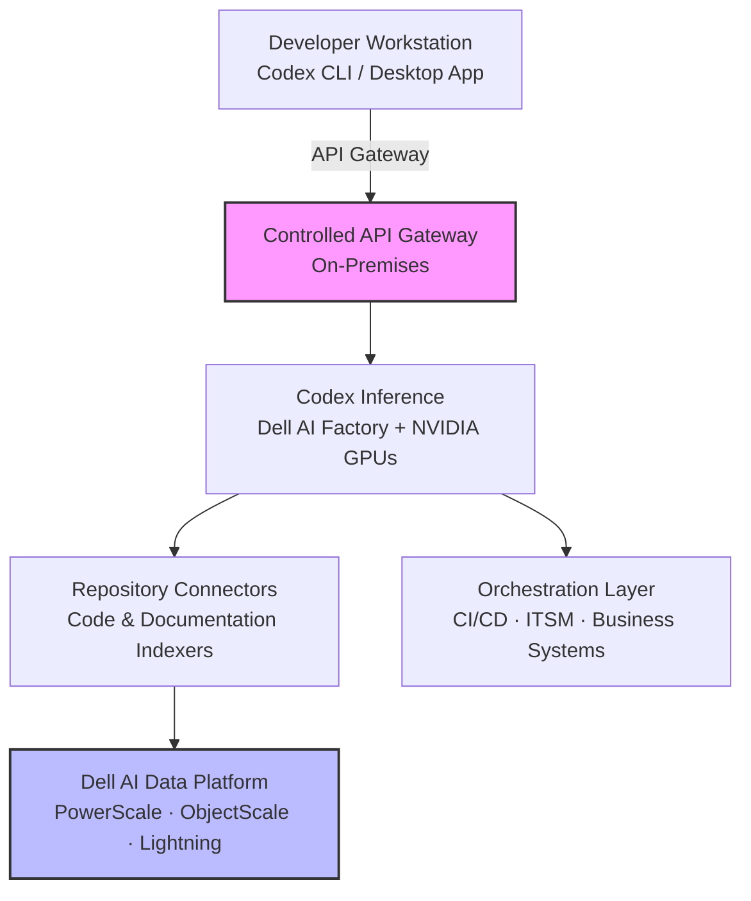
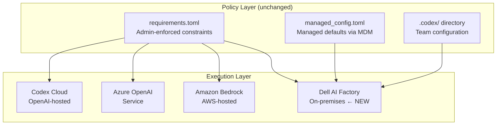
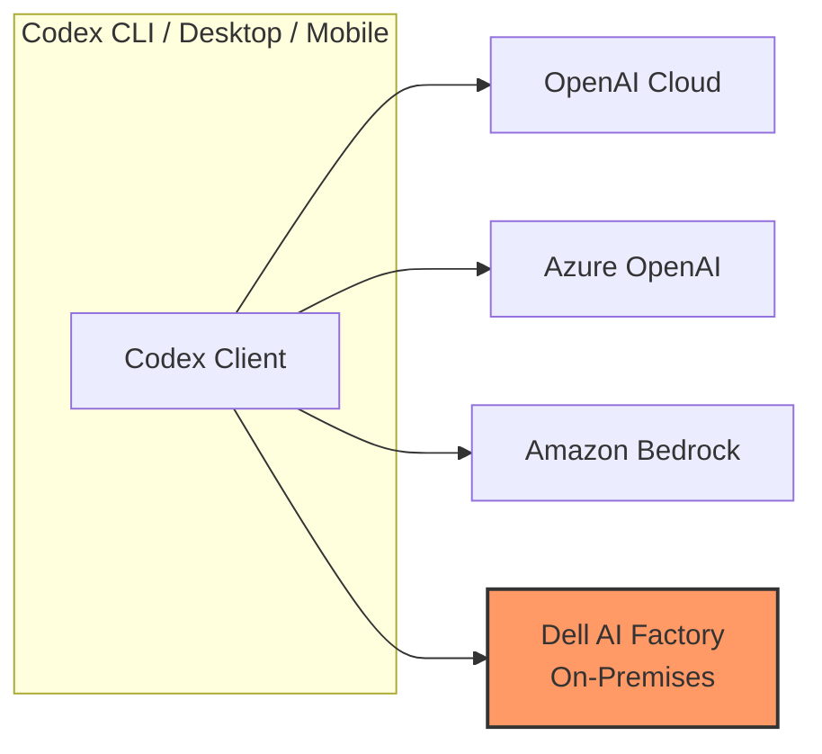

# Codex On-Premises: The Dell AI Factory Partnership, Hybrid Deployment, and What It Means for Data-Sovereign Enterprises


---

On 18 May 2026, OpenAI and Dell Technologies announced a collaboration to bring Codex into hybrid and on-premises enterprise environments [^1]. The timing is not accidental: more than four million developers now use Codex weekly [^2], and the fastest-growing segment of that user base sits inside organisations whose code, documentation, and operational data cannot leave a governed perimeter. This article unpacks what the partnership delivers, where it fits in the existing Codex enterprise stack, and how platform engineering teams should prepare.

## Why On-Premises Matters for Coding Agents

Cloud-hosted Codex (whether via ChatGPT Enterprise or the Codex Cloud task surface) works well when source code can transit OpenAI's API boundary. For a significant class of enterprise — defence contractors, financial institutions bound by MAS or PRA rules, healthcare organisations handling PHI, and any company with strict data-residency mandates — that boundary is a hard stop.

Until now, the workaround was Azure OpenAI Service or Amazon Bedrock as intermediary hosting layers [^3]. The Dell partnership introduces a third path: running the Codex inference surface on infrastructure the enterprise already owns, governed by the enterprise's own network and identity policies.

## The Dell AI Factory and AI Data Platform

Two Dell products sit at the centre of the integration:

### Dell AI Factory

The Dell AI Factory with NVIDIA is a modular infrastructure stack combining compute (PowerEdge servers with NVIDIA GPUs), networking, storage, cooling, and management into pre-engineered rack-scale systems [^4]. Over 4,000 customers already deploy it, with early adopters reporting up to 2.6× ROI within the first year [^4]. The AI Factory supports models up to one trillion parameters running locally on deskside workstations through to full rack deployments [^5].

### Dell AI Data Platform

The AI Data Platform provides the storage and data-governance layer. Its architecture spans three internal storage engines — PowerScale for file access, Lightning for parallel file access, and ObjectScale for object storage — with a 12-fold improvement in vector indexing speed and GPU-accelerated SQL analytics developed with NVIDIA and Starburst Data [^5]. For Codex, this is the layer that indexes codebases, documentation, and business-system data without any of it leaving the enterprise perimeter.

## Integration Architecture

The partnership addresses three technical dimensions [^6]:



1. **Secure model hosting** — Controlled API gateways sit close to enterprise data, eliminating the need for code to transit external networks [^6].
2. **Repository connectors** — Indexers for code and documentation repositories feed context to Codex without data leaving the governed perimeter [^6].
3. **Orchestration** — Agentic workflows span CI/CD pipelines and ITSM systems, enabling Codex to participate in the full software delivery lifecycle from inside the firewall [^6].

Dell and OpenAI are also exploring integrations with ChatGPT Enterprise and other API-based OpenAI solutions through the AI Factory, covering data preparation, systems-of-record management, testing, and AI application deployment [^1].

## How This Fits the Existing Codex Enterprise Stack

Codex already ships a layered enterprise governance model. The on-premises deployment does not replace it — it extends the bottom of the stack:



The critical point: **the policy layer is execution-surface agnostic**. A `requirements.toml` deployed via macOS MDM or cloud-managed configuration [^7] enforces the same approval policies, sandbox modes, MCP server allowlists, and model constraints regardless of whether the inference runs on OpenAI's infrastructure, Azure, Bedrock, or a Dell rack in the enterprise data centre.

### Configuration for On-Premises Deployment

Based on the existing enterprise configuration reference, an on-premises deployment would use the same `config.toml` keys [^8]:

```toml
# config.toml — on-premises deployment targeting Dell AI Factory
model_provider = "openai"          # or custom endpoint
model = "gpt-5.5"
api_base_url = "https://codex.internal.corp:8443/v1"
network_access = false             # air-gapped by default
web_search = "disabled"

[sandbox]
mode = "auto"                      # enterprise default

[mcp]
# Only approved internal MCP servers
allowed_servers = ["internal-repo-indexer", "jira-mcp", "confluence-mcp"]
```

The `api_base_url` key redirects all inference traffic to the on-premises gateway, whilst `network_access = false` and `web_search = "disabled"` enforce air-gapped operation — matching the posture most data-sovereign enterprises require.

## Data Residency and Compliance Considerations

OpenAI's cloud-hosted surfaces already support data residency in ten regions (US, Europe, UK, Japan, Canada, South Korea, Singapore, Australia, India, and UAE) for eligible Enterprise and API customers [^9]. The Dell partnership extends this to **any location where the enterprise operates physical infrastructure**, removing the dependency on OpenAI's or a cloud provider's regional availability.

However, teams should note current compliance boundaries:

| Compliance Area | Cloud Codex (Enterprise) | On-Premises (Dell) |
|---|---|---|
| SOC 2 Type 2 | Covered by OpenAI's audit [^9] | Enterprise's own audit scope |
| HIPAA | Codex currently listed as "Non-Included Functionality" for PHI [^10] | ⚠️ Pending — depends on deployment architecture |
| Data residency | 10 regions via OpenAI | Any enterprise-owned location |
| Model provenance | OpenAI-managed | Enterprise-managed with Dell lifecycle tools |

The HIPAA limitation is significant: even on-premises, if the inference surface still calls back to OpenAI APIs for model weights or telemetry, PHI handling remains constrained. Enterprises targeting PHI workloads should wait for explicit guidance from both OpenAI and Dell on the air-gapped model-hosting architecture before committing. ⚠️

## Cost Comparison: Cloud vs On-Premises

Dell claims up to 87% cost reduction over two years compared to equivalent public cloud deployments for AI workloads [^5]. For Codex specifically, the economics depend on utilisation density:

- **Low utilisation** (< 50 developers): Cloud-hosted Codex via ChatGPT Enterprise subscriptions remains more cost-effective due to amortised infrastructure costs.
- **Medium utilisation** (50–500 developers): Hybrid deployment — routine tasks on-premises, burst capacity via cloud — likely hits the optimal cost/latency balance.
- **High utilisation** (500+ developers): Dedicated on-premises deployment with Dell AI Factory racks becomes compelling, particularly when combined with existing Dell infrastructure agreements.

The cached-token economics matter here too. On-premises inference can maintain warm context caches without the 5-minute TTL constraints of OpenAI's hosted prompt caching [^11], potentially reducing effective input costs further for long-running agentic sessions.

## What Platform Teams Should Do Now

The partnership was announced at Dell Technologies World, with expanded PowerRack systems and localised agentic solutions rolling out immediately. Further data platform, cooling, and ecosystem components are scheduled throughout the remainder of 2026 and into early 2027 [^5].

### Immediate Actions

1. **Audit your data-residency constraints** — If your organisation already prohibits code from leaving a governed perimeter, document the specific regulatory or policy requirements. These become your on-premises deployment requirements.

2. **Inventory your Dell footprint** — If you already run Dell AI Factory infrastructure, you have a head start. The Codex integration layers on top of existing storage and compute rather than requiring greenfield deployment.

3. **Test your `requirements.toml` portability** — Deploy your enterprise `requirements.toml` and `managed_config.toml` on a test workstation pointing at a local API endpoint. The policy layer should behave identically regardless of the backing inference surface [^7].

4. **Engage your Dell and OpenAI account teams** — The detailed integration specifications are still forthcoming. Early-access programmes for the Codex-on-Dell-AI-Factory integration are expected to open in Q3 2026.

### What to Avoid

- **Do not assume air-gapped means zero OpenAI connectivity** — Model updates, telemetry, and licence verification may still require periodic connectivity. Clarify the exact network requirements before committing to a fully air-gapped architecture.
- **Do not conflate on-premises hosting with automatic compliance** — Running Codex on your own hardware shifts the compliance burden to your organisation's controls. You inherit the audit responsibility.
- **Do not delay `requirements.toml` adoption** — Whether you deploy on-premises or not, centralised policy enforcement via managed configuration is the foundation of enterprise Codex governance [^7]. Start now.

## The Broader Pattern: Codex Becomes Infrastructure-Agnostic

The Dell partnership fits a clear trajectory. In March 2026, Codex added first-class Amazon Bedrock support with AWS SigV4 signing [^3]. Azure OpenAI Service has been supported since launch. The Dell integration makes Codex the first major coding agent to offer a genuine four-way deployment topology:



For platform engineering teams, this means Codex configuration can be genuinely portable across execution surfaces. The same `AGENTS.md`, the same skills, the same hooks, the same `requirements.toml` — deployed on whichever infrastructure meets the organisation's security, latency, and cost requirements.

That portability is the real story behind the Dell announcement. The partnership is not just about hardware. It is about Codex becoming an infrastructure-agnostic coding agent that enterprises can deploy wherever their constraints demand — without sacrificing the governance, tooling, or developer experience that makes it useful.

---

## Citations

[^1]: OpenAI, "OpenAI and Dell Technologies partner to bring Codex to hybrid and on-premises enterprise environments," openai.com, 18 May 2026. [https://openai.com/index/dell-codex-enterprise-partnership/](https://openai.com/index/dell-codex-enterprise-partnership/)

[^2]: OpenAI, "Codex for (almost) everything," openai.com, 2026. [https://openai.com/index/codex-for-almost-everything/](https://openai.com/index/codex-for-almost-everything/)

[^3]: OpenAI, "Codex Changelog," developers.openai.com, May 2026. [https://developers.openai.com/codex/changelog](https://developers.openai.com/codex/changelog)

[^4]: Dell Technologies, "Dell Technologies Closes the Gap Between AI Ambition and AI Outcomes," dell.com, 18 May 2026. [https://www.dell.com/en-us/dt/corporate/newsroom/announcements/detailpage.press-releases~usa~2026~05~dell-technologies-closes-the-gap-between-ai-ambition-and-ai-outcomes.htm](https://www.dell.com/en-us/dt/corporate/newsroom/announcements/detailpage.press-releases~usa~2026~05~dell-technologies-closes-the-gap-between-ai-ambition-and-ai-outcomes.htm)

[^5]: SiliconANGLE, "Dell targets enterprise AI execution gap with local agentic AI systems and integrated AI infrastructure," siliconangle.com, 18 May 2026. [https://siliconangle.com/2026/05/18/dell-targets-enterprise-ai-execution-gap-local-agentic-ai-systems-integrated-ai-infrastructure/](https://siliconangle.com/2026/05/18/dell-targets-enterprise-ai-execution-gap-local-agentic-ai-systems-integrated-ai-infrastructure/)

[^6]: Let's Data Science, "OpenAI Integrates Codex with Dell Enterprise Infrastructure," letsdatascience.com, 18 May 2026. [https://letsdatascience.com/news/openai-integrates-codex-with-dell-enterprise-infrastructure-81607e07](https://letsdatascience.com/news/openai-integrates-codex-with-dell-enterprise-infrastructure-81607e07)

[^7]: OpenAI, "Managed configuration – Codex," developers.openai.com, 2026. [https://developers.openai.com/codex/enterprise/managed-configuration](https://developers.openai.com/codex/enterprise/managed-configuration)

[^8]: OpenAI, "Configuration Reference – Codex," developers.openai.com, 2026. [https://developers.openai.com/codex/config-reference](https://developers.openai.com/codex/config-reference)

[^9]: OpenAI, "Business data privacy, security, and compliance," openai.com, 2026. [https://openai.com/business-data/](https://openai.com/business-data/)

[^10]: OpenAI, "Security and privacy at OpenAI," openai.com, 2026. [https://openai.com/security-and-privacy/](https://openai.com/security-and-privacy/)

[^11]: OpenAI, "Prompt Caching 201," developers.openai.com, 2026. [https://developers.openai.com/cookbook/examples/prompt_caching_201](https://developers.openai.com/cookbook/examples/prompt_caching_201)
