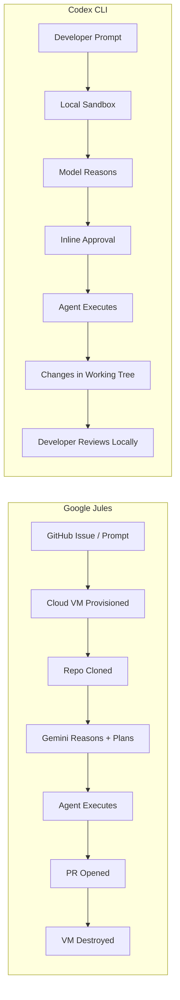
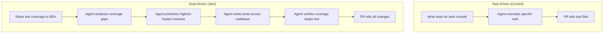
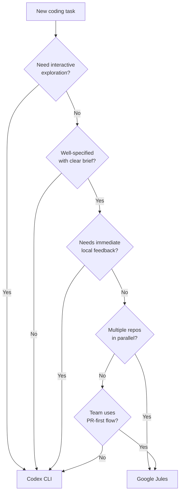

# Google Jules vs Codex CLI: Async Fire-and-Forget vs Interactive Terminal Agent


---

With Google I/O 2026 kicking off today and the announcement of Project Jitro (Jules V2) alongside OpenAI's GPT-5.2-Codex release, the two dominant paradigms in agentic coding are now sharply defined [^1][^2]. Google Jules treats coding tasks as fire-and-forget background jobs that produce pull requests. Codex CLI treats them as interactive terminal sessions where the developer stays in the loop. Both approaches work; neither is universally better. This article breaks down when each wins and how to use them together.

## Architectural Divergence

The fundamental difference is execution surface. Jules runs every task in an isolated Google Cloud VM that clones your repository, executes in a sandboxed environment, and destroys itself after opening a pull request [^3]. Codex CLI runs locally in your terminal inside a platform-native sandbox (Seatbelt on macOS, Bubblewrap/Landlock on Linux) with direct access to your working tree [^4].



This distinction cascades into every design decision:

| Dimension | Google Jules | Codex CLI |
|-----------|-------------|-----------|
| **Execution** | Remote Cloud VM | Local sandbox |
| **Interaction** | Asynchronous; review PR later | Synchronous; approve inline |
| **Output** | Pull request on new branch | Changes in working tree |
| **Context** | Full repo clone per task | Live working directory |
| **Parallelism** | Multiple VMs concurrently | One session per terminal [^5] |
| **Network** | Full internet in VM | Restricted by sandbox policy [^4] |

## Models and Reasoning

Jules uses Gemini 3.1 Pro on paid tiers and Gemini 3 Flash on the free tier [^6]. With the I/O 2026 announcement of Gemini 4's 10-million-token context window, Jules gains the ability to ingest entire large codebases in a single pass, though reliable performance reportedly sits at 5-7 million tokens [^1].

Codex CLI defaults to GPT-5.5 for complex tasks, with GPT-5.4, GPT-5.3-Codex, and GPT-5.3-Codex-Spark as alternatives [^7]. GPT-5.2-Codex, released today, brings improved long-horizon session stability, stronger context compaction, and enhanced cybersecurity capabilities [^2]. Codex CLI context windows top out at roughly 200,000 tokens for GPT-5.3-Codex [^7], making it dependent on context compaction for extended sessions rather than raw window size.

```toml
# Codex CLI: select model in config.toml
model = "gpt-5.5"

# Or switch mid-session with /model
```

Jules model selection is implicit -- tied to your Google AI subscription tier rather than per-task configuration [^6].

## CLI Tooling Compared

Both platforms now have terminal interfaces, but they serve different purposes.

### Jules Tools CLI

Jules Tools launched in October 2025 as a lightweight CLI for managing async tasks [^8]. Its primary commands dispatch work to cloud VMs:

```bash
# Submit a task to Jules
jules task create --repo owner/repo "Add unit tests for the auth module"

# Check task status
jules task list --status running

# Interactive TUI for task management
jules /remote
```

Jules Tools also offers a TUI with `/remote` for dashboarding and `/new` for guided task creation [^8]. Critically, Jules Tools is a **remote control** -- it dispatches and monitors work happening elsewhere.

### Codex CLI

Codex CLI is the execution surface itself. The agent runs locally, reads files from your working tree, and applies changes directly:

```bash
# Interactive session
codex

# Non-interactive execution
codex exec "Refactor the payment module to use the new gateway interface"

# Cloud delegation (closest to Jules pattern)
codex cloud exec "Add integration tests for the auth service"
```

The `codex cloud exec` subcommand is the closest analogue to Jules' model -- it delegates work to a remote environment and returns results [^9]. But the default `codex` invocation keeps you in the loop with inline approvals, live diff rendering, and mid-session steering.

## When Jules Wins

Jules excels when:

1. **The task is well-specified and self-contained.** Bug fixes with reproduction steps, dependency version bumps, test backfill for existing modules -- tasks where the brief is solid and human oversight adds latency rather than value [^3].

2. **You need parallelism across repositories.** Jules spins up independent VMs per task. Five repositories, five simultaneous tasks, five pull requests by morning [^6].

3. **The team's workflow is PR-centric.** If every change flows through code review regardless of author, Jules' PR-first output fits naturally into existing processes [^3].

4. **Suggested and Scheduled Tasks apply.** Jules' proactive features -- suggesting improvements across up to five repositories and running scheduled maintenance tasks -- have no direct Codex CLI equivalent [^10].

## When Codex CLI Wins

Codex CLI excels when:

1. **The task needs interactive exploration.** Understanding an unfamiliar codebase, debugging a flaky test, prototyping a UI -- tasks where you need to steer, ask follow-up questions, and iterate [^4].

2. **You need immediate feedback on changes.** Codex writes directly to your working tree. Run the tests yourself, check the diff, tweak the prompt, continue the session [^4].

3. **Configuration and customisation depth matters.** AGENTS.md, hooks, skills, plugins, MCP servers, approval modes, subagent definitions, execution policies -- Codex CLI offers a deep customisation surface that Jules currently lacks [^11].

4. **Security boundaries are non-negotiable.** Codex CLI's sandbox restricts network access, filesystem writes, and command execution with configurable policies [^4]. Jules runs in a cloud VM with broader permissions by default.

5. **You work in regulated or air-gapped environments.** Codex CLI runs locally with optional self-hosted model providers [^12]. Jules requires Google Cloud connectivity.

## Project Jitro: The Goal-Driven Shift

The most significant announcement from I/O 2026 for coding agents is Project Jitro, the next evolution of Jules [^13]. Where current agents (including both Jules and Codex CLI) are **task-driven** -- you tell them what to do -- Jitro is **goal-driven**: you define a measurable outcome and the agent determines the changes needed.



Jitro's persistent workspace model -- where goals, progress, and tool integrations persist across sessions -- addresses a genuine gap [^13]. The compounding improvements that never make it into sprint backlogs (accessibility compliance, latency reduction, error rate improvements) are precisely the work best suited to a goal-driven agent that chips away continuously.

This has no direct Codex CLI equivalent today. The closest patterns are:

- **Codex Cloud automations** with scheduled cadences [^14]
- **Scored improvement loops** using `codex exec` with structured output and evaluation harnesses [^9]
- **Custom skills** that encode a goal and verification criteria

But none of these compose into the persistent, metric-tracking workspace Jitro promises.

## Using Both Together

The pragmatic approach is to use both. Here is a decision framework:



A practical dual-agent workflow:

1. **Morning triage with Jules**: queue dependency bumps, test backfill, and linter fixes as Jules tasks across your repositories.
2. **Interactive development with Codex CLI**: feature work, debugging, and architecture exploration in the terminal.
3. **Afternoon review**: review Jules PRs alongside your local Codex changes.

For teams already invested in Codex CLI's customisation surface (AGENTS.md, hooks, MCP servers, skills), the natural integration point is `codex cloud exec` for async tasks rather than switching to Jules entirely. For teams with lighter configuration needs and a strong PR review culture, Jules provides a lower-friction path to async agent work.

## Configuration Surface Comparison

| Feature | Codex CLI | Jules |
|---------|-----------|-------|
| **Instruction files** | AGENTS.md (hierarchical, per-directory) [^11] | Repository-level configuration |
| **Tool integration** | MCP servers, plugins, skills [^11] | GitHub integration, Render [^10] |
| **Approval modes** | Auto, suggest, full-auto, per-tool overrides [^4] | Plan approval before execution [^3] |
| **Hooks** | Stable lifecycle hooks (PreToolUse, PostToolUse, etc.) [^15] | Not applicable |
| **Subagents** | Custom agent definitions in TOML [^11] | Single-agent execution |
| **Non-interactive** | `codex exec` with `--output-schema` [^9] | Jules API and Jules Tools CLI [^8] |
| **Scheduling** | Via Codex app automations or cron + `codex exec` [^14] | Native Scheduled Tasks [^10] |
| **Model choice** | Per-session, per-config, mid-session switching [^7] | Tied to subscription tier [^6] |

## Pricing Considerations

Codex CLI is included with paid ChatGPT plans (Plus, Pro, Business, Enterprise), with overflow usage billed at API-style token rates [^16]. Jules operates across three tiers tied to Google AI subscriptions, with a free tier using Gemini 3 Flash and paid tiers using Gemini 3.1 Pro [^6].

For teams already paying for ChatGPT Enterprise or Pro, Codex CLI adds no marginal cost within included quotas. For teams on Google Workspace with Google AI subscriptions, Jules is similarly bundled. The economic decision often follows existing platform commitments rather than per-feature comparison.

## What to Watch

Three developments will reshape this comparison in the coming months:

1. **Jitro's general availability.** If goal-driven agents deliver on the promise, every task-driven tool -- including Codex CLI -- will need an answer to "why am I still writing prompts instead of setting targets?" [^13]

2. **Codex CLI's evolving cloud surface.** The `codex cloud exec` pattern with `--attempts` for best-of-N execution is already moving toward async territory [^9]. Further convergence is likely.

3. **Cross-agent portability.** As more teams run multiple agents, the ability to share configuration (AGENTS.md is already an open standard adopted by multiple tools [^11]) and switch between sync and async execution surfaces becomes the real differentiator.

## Citations

[^1]: Google I/O 2026 Developer Briefing, [byteiota.com](https://byteiota.com/google-io-2026-developer-preview/)
[^2]: "Introducing GPT-5.2-Codex," OpenAI, May 2026, [openai.com](https://openai.com/index/introducing-gpt-5-2-codex/)
[^3]: "Jules: Google's autonomous AI coding agent," Google Blog, [blog.google](https://blog.google/innovation-and-ai/models-and-research/google-labs/jules/)
[^4]: "Features -- Codex CLI," OpenAI Developers, [developers.openai.com](https://developers.openai.com/codex/cli/features)
[^5]: "Codex CLI for Cross-Repository Development," Codex Blog, May 2026, [codex.danielvaughan.com](https://codex.danielvaughan.com)
[^6]: "Google Jules: Gemini Async Coding Agent Guide 2026," Digital Applied, [digitalapplied.com](https://www.digitalapplied.com/blog/google-jules-gemini-async-coding-agent-guide)
[^7]: "Models -- Codex," OpenAI Developers, [developers.openai.com](https://developers.openai.com/codex/models)
[^8]: "Meet Jules Tools: A Command Line Companion for Google's Async Coding Agent," Google Developers Blog, [developers.googleblog.com](https://developers.googleblog.com/en/meet-jules-tools-a-command-line-companion-for-googles-async-coding-agent/)
[^9]: "Non-interactive mode -- Codex," OpenAI Developers, [developers.openai.com](https://developers.openai.com/codex/noninteractive)
[^10]: "Jules from Google Labs introduces proactive coding features," Google Blog, [blog.google](https://blog.google/innovation-and-ai/technology/developers-tools/jules-proactive-updates/)
[^11]: "Custom instructions with AGENTS.md -- Codex," OpenAI Developers, [developers.openai.com](https://developers.openai.com/codex/guides/agents-md)
[^12]: "Advanced Configuration -- Codex," OpenAI Developers, [developers.openai.com](https://developers.openai.com/codex/config-advanced)
[^13]: "Google Project Jitro: Jules V2 Moves from Prompts to Goals," byteiota, [byteiota.com](https://byteiota.com/google-project-jitro-jules-v2-goal-driven-coding-agent/)
[^14]: "Automations -- Codex app," OpenAI Developers, [developers.openai.com](https://developers.openai.com/codex/app/automations)
[^15]: "Hooks -- Codex," OpenAI Developers, [developers.openai.com](https://developers.openai.com/codex/hooks)
[^16]: "Pricing -- Codex," OpenAI Developers, [developers.openai.com](https://developers.openai.com/codex/pricing)
