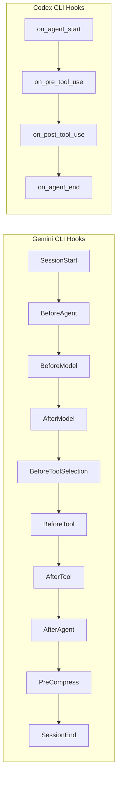
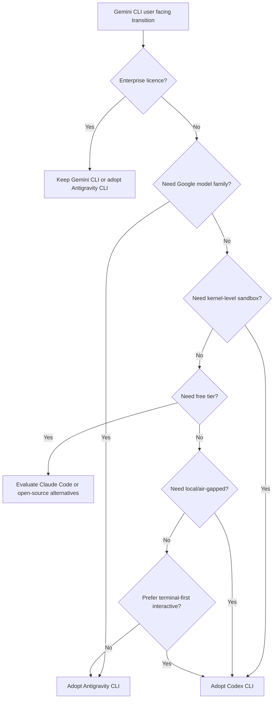

# Migrating from Gemini CLI to Codex CLI: A Practical Guide After the Antigravity Transition


---

Google announced the Gemini CLI to Antigravity CLI transition at Google I/O on 19 May 2026 [^1]. Free and individual paid users lose Gemini CLI access on 18 June 2026 [^1]. Enterprise licence holders keep access, but the writing is on the wall: Google is consolidating around Antigravity as its agent-first development platform [^2].

If you are evaluating alternatives rather than following Google's migration path, Codex CLI is the most feature-complete terminal-native coding agent available today. This guide maps every major Gemini CLI concept to its Codex CLI equivalent, provides concrete configuration translations, and flags the gaps you need to plan around.

## Why Consider Codex CLI Instead of Antigravity?

The Antigravity transition is not a simple rename. Antigravity CLI is a Go rewrite sharing a server-side harness with the Antigravity 2.0 desktop application [^2]. Extensions become Antigravity plugins, the configuration format changes, and the execution model shifts towards asynchronous background agents [^2]. If you are already facing a migration, it is worth evaluating whether Codex CLI better fits your workflow before committing to another Google platform.

Codex CLI offers kernel-level sandboxing via Apple Seatbelt on macOS and Landlock/Bubblewrap on Linux [^3], a mature plugin marketplace with version-aware sharing [^4], and direct access to OpenAI's GPT-5.5 and GPT-5.2-Codex model family [^5]. It also runs entirely locally with no mandatory cloud dependency.

## Configuration File Mapping

Gemini CLI uses a JSON-based settings hierarchy across four levels [^6]. Codex CLI uses TOML configuration files with a three-layer precedence model [^7].

| Gemini CLI | Codex CLI | Notes |
|---|---|---|
| `~/.gemini/settings.json` | `~/.codex/config.toml` | User-level defaults |
| `.gemini/settings.json` | `.codex/config.toml` | Project-level overrides |
| `/etc/gemini-cli/settings.json` | `~/.codex/managed_config.toml` | Enterprise admin overrides |
| `/etc/gemini-cli/system-defaults.json` | `requirements.toml` | Enterprise constraints (deny-list model) |
| `GEMINI.md` | `AGENTS.md` | Project context and agent instructions |
| `.gemini/hooks/` | `.codex/hooks/` or inline in `config.toml` | Lifecycle automation |
| `.gemini/extensions/` | `.codex/plugins/` | Reusable capability bundles |
| `.gemini/skills/` | `.codex/skills/` | Workflow-specific prompt templates |

### Translating a Typical `settings.json`

A common Gemini CLI configuration:

```json
{
  "model": {
    "model": "gemini-3-flash",
    "sessionTurnLimit": 100,
    "compressionThreshold": 80
  },
  "tools": {
    "sandbox": "adaptive",
    "mcpServers": {
      "filesystem": {
        "command": "npx",
        "args": ["-y", "@anthropic/mcp-filesystem-server", "/home/dev/projects"]
      }
    }
  },
  "general": {
    "approvalMode": "unless-allow-listed",
    "vimMode": true
  }
}
```

The Codex CLI equivalent in `config.toml`:

```toml
[model]
default = "gpt-5.5"

[agent]
context_compaction_threshold = 80

[sandbox]
permission_profile = "default"  # "default" maps closest to Gemini's "adaptive"

[tui]
default_mode = "vim"

[[mcp_servers]]
name = "filesystem"
command = "npx"
args = ["-y", "@anthropic/mcp-filesystem-server", "/home/dev/projects"]
```

## Hook Lifecycle Mapping

Gemini CLI supports ten hook events [^8]. Codex CLI hooks fire at four lifecycle points, with tool-name matchers providing equivalent granularity [^9].



| Gemini Hook | Codex Equivalent | Translation Notes |
|---|---|---|
| `SessionStart` | `on_agent_start` | Direct equivalent; use for context loading |
| `SessionEnd` | `on_agent_end` | Direct equivalent; use for cleanup |
| `BeforeTool` | `on_pre_tool_use` with `tool_name` matcher | Filter by tool name regex |
| `AfterTool` | `on_post_tool_use` with `tool_name` matcher | Filter by tool name regex |
| `BeforeModel` | No direct equivalent | Use AGENTS.md prompt engineering instead |
| `AfterModel` | No direct equivalent | Use auto-review policies for output filtering |
| `BeforeToolSelection` | `enabled_tools` / `disabled_tools` in config | Static allow/deny lists rather than dynamic hooks |
| `BeforeAgent` | `on_agent_start` | Closest match; fires once per session |
| `AfterAgent` | `on_agent_end` | Closest match |
| `PreCompress` | No direct equivalent | Codex handles compaction automatically [^10] |

### Translating a BeforeTool Hook

Gemini CLI hook (`settings.json`):

```json
{
  "hooks": {
    "BeforeTool": [{
      "matcher": "write_file|replace",
      "hooks": [{
        "name": "lint-check",
        "type": "command",
        "command": ".gemini/hooks/lint.sh",
        "timeout": 5000
      }]
    }]
  }
}
```

Codex CLI equivalent (`config.toml`):

```toml
[[hooks]]
event = "on_pre_tool_use"
tool_name = "write|apply_patch"
command = ".codex/hooks/lint.sh"
timeout_ms = 5000
```

Key difference: Gemini hooks communicate via JSON on `stdin`/`stdout` [^8]. Codex hooks receive context through environment variables and use exit codes for control flow (exit 0 to proceed, exit 2 to block) [^9]. You will need to rewrite hook scripts that parse `stdin` JSON.

## Context Files: GEMINI.md → AGENTS.md

Both tools use markdown files for project-level agent instructions. The mapping is straightforward but the discovery mechanics differ.

| Feature | Gemini CLI | Codex CLI |
|---|---|---|
| File name | `GEMINI.md` | `AGENTS.md` |
| Discovery | Walks up directory tree to project root markers [^6] | Walks up to git root; merges all found files [^11] |
| Scope | Project-level only | User (`~/.codex/AGENTS.md`) + project + subdirectory |
| Format | Free-form markdown | Free-form markdown with optional YAML frontmatter |

Rename your `GEMINI.md` files to `AGENTS.md`. The content can remain largely unchanged. If you used Gemini-specific directives (model preferences, tool restrictions), move those to `config.toml` instead — `AGENTS.md` should contain behavioural instructions, not configuration [^11].

## Skills Translation

Gemini CLI skills are directories containing a manifest and prompt files within the `.gemini/skills/` directory [^12]. Codex CLI skills follow the same pattern but use a `SKILL.md` file with YAML frontmatter [^13].

Gemini CLI skill structure:

```
.gemini/skills/
  deploy/
    manifest.json
    prompt.md
```

Codex CLI skill structure:

```
.codex/skills/
  deploy/
    SKILL.md          # Contains frontmatter + prompt
    agent.yaml         # Optional agent configuration
```

A Gemini `manifest.json` + `prompt.md` translates to a single Codex `SKILL.md`:

```markdown
---
name: deploy
description: "Deploy the current branch to staging"
model: gpt-5.5
---

# Deploy to Staging

Follow these steps to deploy the current branch...
```

## Extensions → Plugins

Gemini CLI extensions bundle tools, hooks, and skills into distributable packages [^14]. Codex CLI plugins serve the same purpose with a different manifest format [^15].

| Feature | Gemini Extensions | Codex Plugins |
|---|---|---|
| Manifest | `extension.json` | `plugin.toml` |
| Distribution | Git repos | Marketplace + git repos |
| Hook bundling | `hooks/hooks.json` | Inline in `plugin.toml` |
| MCP servers | Supported | Supported with tool filtering |
| Installation | `gemini extensions install <url>` | `codex plugin install <name>` |

The Codex plugin marketplace [^15] provides discoverability that Gemini CLI lacked. Many community-maintained Gemini extensions already have Codex plugin equivalents.

## Approval Mode Mapping

| Gemini CLI Mode | Codex CLI Equivalent | Config Key |
|---|---|---|
| `"always-approve"` | `"suggest"` | `sandbox.permission_profile` |
| `"unless-allow-listed"` | `"default"` | `sandbox.permission_profile` |
| `"yolo"` | ⚠️ Deprecated — use `"auto-edit"` | `sandbox.permission_profile` |

Codex CLI deprecated the old `full-auto` mode in v0.129 in favour of fine-grained permission profiles [^16]. There is no exact equivalent to Gemini's YOLO mode — by design.

## MCP Server Configuration

Both tools support Model Context Protocol servers. The configuration syntax differs but the semantics are identical.

Gemini CLI:

```json
{
  "tools": {
    "mcpServers": {
      "github": {
        "command": "npx",
        "args": ["-y", "@modelcontextprotocol/server-github"],
        "env": { "GITHUB_TOKEN": "$GITHUB_TOKEN" }
      }
    }
  }
}
```

Codex CLI:

```toml
[[mcp_servers]]
name = "github"
command = "npx"
args = ["-y", "@modelcontextprotocol/server-github"]

[mcp_servers.env]
GITHUB_TOKEN = "$GITHUB_TOKEN"
```

Codex CLI additionally supports streamable HTTP MCP servers and OAuth 2.0 authentication flows [^17], which Gemini CLI did not offer natively.

## Model Selection

Gemini CLI defaults to Google's model family. Codex CLI defaults to OpenAI's models but supports multiple providers [^5].

| Use Case | Gemini CLI Model | Codex CLI Equivalent |
|---|---|---|
| Fast iteration | `gemini-3-flash` | `gpt-5.5` or Spark (Cerebras) |
| Complex reasoning | `gemini-3.1-pro` | `gpt-5.5` |
| Cost-sensitive | `gemini-3-flash` | `o4-mini` |
| Local/air-gapped | Not supported | Ollama, LM Studio, MLX via custom providers [^18] |

If you need continued access to Gemini models from Codex CLI, configure a custom provider pointing to the Gemini API via OpenAI-compatible endpoints [^18].

## What You Lose

Be honest about the trade-offs:

- **`BeforeModel` / `AfterModel` hooks**: Codex CLI has no equivalent for intercepting model requests and responses at the HTTP level. Use AGENTS.md instructions and auto-review policies instead.
- **`PreCompress` hook**: No way to run custom logic before context compaction.
- **YOLO mode**: Codex deliberately does not offer unrestricted execution. The closest is `auto-edit` with liberal Starlark rules [^19].
- **Vertex AI billing integration**: Codex uses OpenAI billing or pay-as-you-go tokens [^20]. If your organisation bills through Google Cloud, this requires a procurement change.
- **Free tier**: Gemini CLI offered generous free usage. Codex CLI requires a ChatGPT Pro, Plus, or Team subscription, or pay-as-you-go API access [^20].

## Migration Checklist

1. **Install Codex CLI**: `npm install -g @openai/codex` or download the standalone Rust binary [^3]
2. **Create `~/.codex/config.toml`** from your `~/.gemini/settings.json` using the mapping table above
3. **Rename `GEMINI.md` → `AGENTS.md`** in all repositories; strip Gemini-specific configuration directives
4. **Rewrite hooks**: Convert JSON stdin/stdout scripts to environment-variable-based scripts with exit code control flow
5. **Translate skills**: Merge `manifest.json` + `prompt.md` into single `SKILL.md` files with YAML frontmatter
6. **Migrate MCP servers**: Copy server definitions from JSON to TOML format; add tool filtering if needed
7. **Install plugin equivalents**: Search the Codex marketplace for replacements for your Gemini extensions
8. **Run `codex doctor`**: Validates runtime, authentication, terminal, network, and configuration health [^21]
9. **Run `codex debug-config`**: Confirms the merged configuration matches your expectations [^22]
10. **Test in `suggest` mode first**: Verify hooks and policies behave correctly before escalating permissions

## Decision Flowchart



## Conclusion

The Gemini CLI to Antigravity transition forces a decision point. If you are already rewriting configuration and hooks, take the opportunity to evaluate whether Codex CLI's sandbox model, plugin ecosystem, and model access better serve your workflow. The concepts map cleanly — hooks to hooks, skills to skills, extensions to plugins, GEMINI.md to AGENTS.md — even if the syntax differs. The main friction points are hook script rewrites and billing changes, neither of which should take more than a day for a typical project.

The deadline is 18 June 2026. Start your evaluation now.

## Citations

[^1]: Google Developers Blog, "An important update: Transitioning Gemini CLI to Antigravity CLI", 19 May 2026. [https://developers.googleblog.com/an-important-update-transitioning-gemini-cli-to-antigravity-cli/](https://developers.googleblog.com/an-important-update-transitioning-gemini-cli-to-antigravity-cli/)

[^2]: Google Blog, "I/O 2026 developer highlights: Antigravity, Gemini API, AI Studio", 19 May 2026. [https://blog.google/innovation-and-ai/technology/developers-tools/google-io-2026-developer-highlights/](https://blog.google/innovation-and-ai/technology/developers-tools/google-io-2026-developer-highlights/)

[^3]: OpenAI, "Sandbox — Codex", OpenAI Developers. [https://developers.openai.com/codex/concepts/sandboxing](https://developers.openai.com/codex/concepts/sandboxing)

[^4]: OpenAI, "Codex Changelog — v0.131.0", 18 May 2026. [https://developers.openai.com/codex/changelog](https://developers.openai.com/codex/changelog)

[^5]: OpenAI, "Models — Codex", OpenAI Developers. [https://developers.openai.com/codex/models](https://developers.openai.com/codex/models)

[^6]: Gemini CLI Documentation, "Configuration Reference". [https://geminicli.com/docs/reference/configuration/](https://geminicli.com/docs/reference/configuration/)

[^7]: OpenAI, "Config Basics — Codex", OpenAI Developers. [https://developers.openai.com/codex/config-basic](https://developers.openai.com/codex/config-basic)

[^8]: Gemini CLI Documentation, "Hooks". [https://geminicli.com/docs/hooks/](https://geminicli.com/docs/hooks/)

[^9]: OpenAI, "Hooks — Codex", OpenAI Developers. [https://developers.openai.com/codex/hooks](https://developers.openai.com/codex/hooks)

[^10]: OpenAI, "Features — Codex CLI", OpenAI Developers. [https://developers.openai.com/codex/cli/features](https://developers.openai.com/codex/cli/features)

[^11]: OpenAI, "Custom instructions with AGENTS.md — Codex", OpenAI Developers. [https://developers.openai.com/codex/guides/agents-md](https://developers.openai.com/codex/guides/agents-md)

[^12]: Gemini CLI Documentation, "Skills". [https://github.com/google-gemini/gemini-cli/blob/main/docs/cli/skills.md](https://github.com/google-gemini/gemini-cli/blob/main/docs/cli/skills.md)

[^13]: OpenAI, "Skills — Codex", OpenAI Developers. [https://developers.openai.com/codex/skills](https://developers.openai.com/codex/skills)

[^14]: Gemini CLI Documentation, "Extension Reference". [https://geminicli.com/docs/extensions/reference/](https://geminicli.com/docs/extensions/reference/)

[^15]: OpenAI, "Plugins — Codex", OpenAI Developers. [https://developers.openai.com/codex/plugins](https://developers.openai.com/codex/plugins)

[^16]: OpenAI, "Agent approvals & security — Codex", OpenAI Developers. [https://developers.openai.com/codex/agent-approvals-security](https://developers.openai.com/codex/agent-approvals-security)

[^17]: OpenAI, "MCP — Codex", OpenAI Developers. [https://developers.openai.com/codex/mcp](https://developers.openai.com/codex/mcp)

[^18]: OpenAI, "Advanced Configuration — Codex", OpenAI Developers. [https://developers.openai.com/codex/config-advanced](https://developers.openai.com/codex/config-advanced)

[^19]: OpenAI, "Rules — Codex", OpenAI Developers. [https://developers.openai.com/codex/rules](https://developers.openai.com/codex/rules)

[^20]: OpenAI, "Pricing — Codex", OpenAI Developers. [https://developers.openai.com/codex/pricing](https://developers.openai.com/codex/pricing)

[^21]: OpenAI, "Codex CLI — Doctor Diagnostics", OpenAI Developers. [https://developers.openai.com/codex/cli/reference](https://developers.openai.com/codex/cli/reference)

[^22]: OpenAI, "Codex CLI — Slash Commands", OpenAI Developers. [https://developers.openai.com/codex/cli/slash-commands](https://developers.openai.com/codex/cli/slash-commands)
