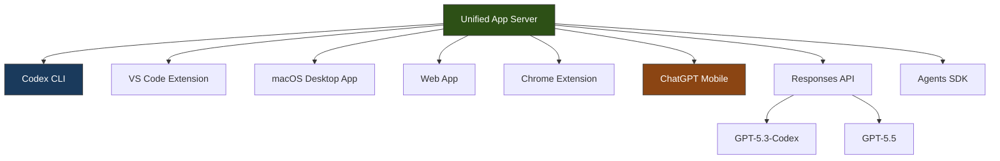
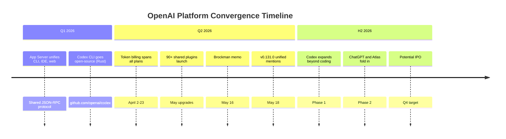

# OpenAI's Unified Agentic Platform: What the ChatGPT-Codex Merger Means for CLI Developers


---

On 16 May 2026, OpenAI co-founder and president Greg Brockman circulated an internal memo confirming that ChatGPT, Codex, and the developer API would be consolidated into a single product organisation [^1]. Thibault Sottiaux, formerly Head of Codex, now leads core product and platform across consumer, enterprise, and developer surfaces, while Nick Turley — the executive who grew ChatGPT to over 900 million weekly active users — pivots to enterprise products [^2]. The announcement landed three days before Google I/O 2026, where Google unveiled Project Jitro (Jules V2) and its goal-driven coding agent paradigm [^3].

For senior developers who have invested in Codex CLI configuration, AGENTS.md hierarchies, plugin ecosystems, and MCP server integrations, this restructuring raises urgent questions. This article unpacks what we know, what remains uncertain, and how to prepare.

## What Brockman Actually Said

The key sentence from the memo: *"We're consolidating our product efforts to execute with maximum focus toward the agentic future, to win across both consumer and enterprise"* [^1]. A follow-up line confirmed the company would *"invest in a single agentic platform and merge ChatGPT and Codex into one unified agentic experience for all"* [^4].

The framing is deliberate. This is not a deprecation announcement — it is a convergence strategy. Brockman cited resource constraints as the driving factor: OpenAI cannot sustain separate product teams and engineering organisations for capabilities that are converging [^2].

## The Architectural Foundation Already Exists

The merger is less radical than it sounds because the underlying infrastructure has been converging since early 2026. By February, OpenAI described a single "App Server" architecture that powers the CLI, the VS Code extension, the web app, the macOS desktop app, and third-party IDE integrations [^5]. The App Server keeps long-running sessions and approval requests consistent across client interfaces via a JSON-RPC protocol.



The v0.131.0 release on 18 May 2026 reinforced this trajectory: the Python SDK migrated to the `openai-codex` package with pinned runtime types and concurrent turn routing, the TUI gained blended token usage display across service tiers, and unified `@` mentions now search files, directories, plugins, and skills in a single picker [^6].

## The Rollout Sequence

OpenAI has outlined a phased approach [^2]:

1. **Phase 1 (current):** Codex expands to cover productivity tasks beyond coding — document drafting, research, scheduling
2. **Phase 2 (unannounced date):** ChatGPT and the research tool Atlas fold into the unified surface
3. **Phase 3 (implied):** A single agentic "super app" with a built-in browser, code-execution layer, and conversational interface

No launch date has been announced for the complete unified product [^4]. This means that, for now, the CLI continues to operate exactly as it does today.

## What Changes for CLI Developers

### What Is Confirmed

- **The CLI is not being deprecated.** It remains one of several client surfaces connecting to the shared App Server [^5].
- **Configuration portability is preserved.** The `config.toml`, `requirements.toml`, and `managed_config.toml` configuration stack applies across all client surfaces through the same precedence hierarchy [^7].
- **AGENTS.md carries forward.** The instruction hierarchy (global → project root → subdirectory, with `.override.md` taking precedence at each level) is baked into the agent loop, not the client [^8].

### What Is Likely

- **Model routing convergence.** As ChatGPT and Codex share one platform, expect a single model routing layer where `codex-mini-latest` and ChatGPT's default model resolve through the same infrastructure. The `model` key in `config.toml` should remain stable [^9].
- **Plugin and skill consolidation.** The 90+ plugins announced in the May upgrades [^10] are already shared across app, web, and CLI surfaces. A unified platform accelerates this — plugins built for ChatGPT productivity tasks become available in CLI sessions.
- **Billing unification.** Token-based billing (introduced 2 April 2026 for Plus, Pro, and Business; extended to Enterprise on 23 April) already spans both products [^11]. A unified platform simplifies this into one credit pool.

### What Remains Uncertain

- **SDK consolidation timeline.** The TypeScript SDK (`@openai/codex-sdk`) and the experimental Python SDK (`openai-codex`) wrap the CLI's App Server. Whether these merge with or replace the existing `openai` Python/TypeScript packages is unannounced.
- **Namespace changes.** Will `codex` CLI commands gain a new parent namespace? Will `codex exec` become a subcommand of a broader `openai` CLI? No indication either way.
- **Enterprise governance scope.** The `requirements.toml` enterprise constraint system currently governs Codex surfaces. Extending it to ChatGPT productivity tasks would require new policy categories.

## Why This Matters Strategically

### The IPO Narrative

OpenAI is targeting a public listing as early as Q4 2026, with Goldman Sachs, JPMorgan, and Morgan Stanley advising on the offering at an \$852 billion post-money valuation [^2]. A simpler product narrative — one platform, one billing model, one developer experience — appeals to institutional investors who struggle to value fragmented product portfolios.

### The Competitive Response

The timing is not coincidental. Google I/O 2026 (19 May) showcased Project Jitro, Google's goal-driven paradigm shift for Jules V2 [^3]. Anthropic's Claude Code has been gaining enterprise traction. By consolidating under Brockman — the co-founder who built GPT-1 through GPT-4 — OpenAI signals that agentic coding is not a side project but the core product strategy [^12].

### The Executive Context

The restructuring follows the departure of three senior leaders in April 2026: Bill Peebles (Sora head), Srinivas Narayanan (enterprise CTO), and Kevin Weil (AI workspace leader) [^2]. Brockman's appointment consolidates authority and eliminates the coordination overhead of separate product organisations.



## What You Should Do Now

### 1. Audit Your Configuration Surface

Your `config.toml`, `requirements.toml`, AGENTS.md files, and MCP server definitions are your durable assets. They survive client changes because they configure the agent, not the interface. Run `codex doctor` to verify your configuration health [^6].

```bash
# Verify configuration loads correctly across surfaces
codex doctor

# Check your AGENTS.md instruction stack
codex --ask-for-approval never "Summarize the current instructions."
```

### 2. Pin Your SDK Dependencies

If you integrate programmatically via the TypeScript or Python SDK, pin your versions explicitly. The `openai-codex` package migration in v0.131.0 already demonstrated that namespace changes happen without deprecation cycles [^6].

```toml
# In your project's requirements or package.json, pin explicitly
# Python
openai-codex = ">=0.131.0,<0.132.0"

# TypeScript (package.json)
# "@openai/codex-sdk": "^0.131.0"
```

### 3. Treat Plugins as Portable Capabilities

Invest in plugins and MCP servers rather than client-specific integrations. The plugin marketplace (`codex plugin install`) and MCP server configuration (`codex mcp add`) are already cross-surface [^10]. Any plugin you configure today will be available on whatever unified surface emerges.

### 4. Monitor the Changelog

The official changelog at `developers.openai.com/codex/changelog` remains the canonical source for breaking changes [^6]. Subscribe to the GitHub releases feed at `github.com/openai/codex/releases` for CLI-specific updates.

### 5. Do Not Panic-Migrate

There is no deprecation timeline. The CLI is open-source, written in Rust, and actively maintained [^13]. Even if the unified platform launches tomorrow, the CLI would continue operating as a client surface connected to the same backend. The worst action is to abandon working configurations based on an organisational announcement.

## Anti-Patterns to Avoid

| Anti-Pattern | Why It Hurts | Better Approach |
|---|---|---|
| Migrating away from Codex CLI preemptively | No deprecation announced; CLI is open-source and actively maintained | Continue investing in CLI workflows |
| Ignoring the consolidation entirely | SDK namespaces and billing may change | Pin dependencies, monitor changelog |
| Building client-specific integrations | Tight coupling to one surface creates migration debt | Use MCP servers and plugins for portability |
| Assuming immediate breaking changes | Phased rollout explicitly stated | Plan for gradual adaptation |

## The Bigger Picture

The ChatGPT-Codex merger reflects a broader industry trend: the convergence of conversational AI and agentic coding into general-purpose agent platforms. Google's Project Jitro pursues the same goal from the opposite direction — starting with goal-driven agent autonomy rather than chat-driven interaction [^3]. Anthropic's Claude Code is evolving along a similar trajectory.

For CLI developers, the practical implication is encouraging: your investment in AGENTS.md instruction stacks, MCP server configurations, plugin workflows, and structured `codex exec` pipelines is not at risk. These are agent-level primitives that persist regardless of which client surface you use to invoke them. The unified platform, when it arrives, should make these primitives available to a wider audience — not replace them.

The real question is not whether the CLI survives, but whether the unified platform inherits the CLI's configurability and composability. That is worth watching closely.

## Citations

[^1]: [OpenAI Unifies ChatGPT, Codex, and Developer API Under Co-Founder Brockman Four Days Before Google I/O](https://www.techtimes.com/articles/316730/20260516/openai-unifies-chatgpt-codex-developer-api-under-co-founder-brockman-four-days-before-google-i-o.htm) — TechTimes, 16 May 2026
[^2]: [OpenAI Merges ChatGPT And Codex, Taps Greg Brockman To Lead Product Strategy Ahead Of Potential IPO](https://www.benzinga.com/markets/tech/26/05/52622210/openai-merges-chatgpt-and-codex-taps-greg-brockman-to-lead-product-strategy-ahead-of-potential-ipo-report) — Benzinga, May 2026
[^3]: [Google's Project Jitro Just Redefined What a Coding Agent Is](https://dev.to/om_shree_0709/googles-project-jitro-just-redefined-what-a-coding-agent-is-heres-what-it-actually-changes-4oc3) — DEV Community, May 2026
[^4]: [OpenAI merges ChatGPT and Codex under Greg Brockman. The side quests are over.](https://thenextweb.com/news/openai-brockman-chatgpt-codex-unified-agentic-platform) — The Next Web, May 2026
[^5]: [SDK — Codex | OpenAI Developers](https://developers.openai.com/codex/sdk) — OpenAI Developer Documentation
[^6]: [Changelog — Codex | OpenAI Developers](https://developers.openai.com/codex/changelog) — OpenAI Developer Documentation, v0.131.0, 18 May 2026
[^7]: [Configuration Reference — Codex | OpenAI Developers](https://developers.openai.com/codex/config-reference) — OpenAI Developer Documentation
[^8]: [Custom instructions with AGENTS.md — Codex | OpenAI Developers](https://developers.openai.com/codex/guides/agents-md) — OpenAI Developer Documentation
[^9]: [Models — Codex | OpenAI Developers](https://developers.openai.com/codex/models) — OpenAI Developer Documentation
[^10]: [Introducing upgrades to Codex | OpenAI](https://openai.com/index/introducing-upgrades-to-codex/) — OpenAI Blog
[^11]: [Pricing — Codex | OpenAI Developers](https://developers.openai.com/codex/pricing) — OpenAI Developer Documentation
[^12]: [OpenAI co-founder Greg Brockman reportedly takes charge of product strategy | TechCrunch](https://techcrunch.com/2026/05/16/openai-co-founder-greg-brockman-reportedly-takes-charge-of-product-strategy/) — TechCrunch, 16 May 2026
[^13]: [openai/codex — GitHub](https://github.com/openai/codex) — OpenAI Codex CLI open-source repository
