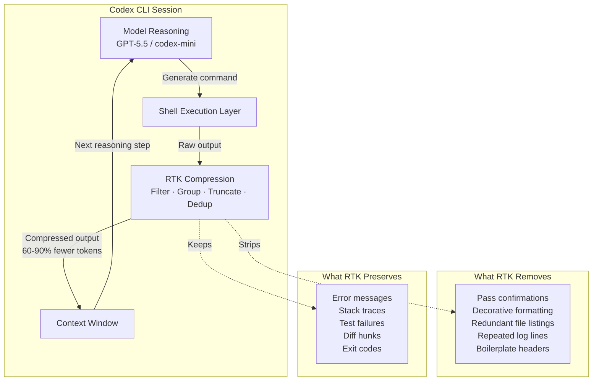

# RTK and Codex CLI: Killing Token Waste at the Shell Boundary


---

Run `git log --oneline -20` in a Codex CLI session and watch what happens. Twenty commit hashes, twenty author names, twenty dates, twenty subject lines — plus decorative graph characters, branch labels, and trailing whitespace. The model reads every token. It acts on almost none of them. Multiply that by the fifty or sixty shell commands a typical coding session fires, and you arrive at a number that should bother you: roughly seventy per cent of your agent's token budget goes to reading shell output it will never act on [^1].

RTK — Rust Token Killer — exists to fix that. It is a single Rust binary that sits between your coding agent and the shell, intercepting command output and compressing it before a single token enters the context window [^2]. The savings are not marginal. Across 2,900 real-world commands, RTK averages 89% compression [^3]. That is not a marketing claim extrapolated from a contrived demo. It is a measured aggregate across git operations, test runners, build tools, package managers, and cloud CLIs.

This article covers what RTK does, how it integrates with Codex CLI specifically, where it falls short, and what the broader pattern of shell-output compression means for the economics and architecture of agentic coding.

## The Problem: Context Windows Are Not Free

Every coding agent — Codex CLI, Claude Code, Cursor, Gemini CLI — operates within a context window. That window is a fixed budget. Every token of shell output that enters it displaces a token that could carry source code, documentation, conversation history, or reasoning.

The economics are straightforward. A typical 30-minute Codex CLI session on a medium-sized project fires roughly 43 shell commands [^1]. Without compression, those commands generate approximately 118,000 tokens of output:

| Operation | Frequency | Tokens (raw) |
|---|---|---|
| `ls` / `tree` | 10x | 2,000 |
| `cat` / file reads | 20x | 40,000 |
| `grep` / search | 8x | 16,000 |
| Test runners | 5x | 25,000 |
| Git operations | — | 35,000 |
| **Total** | ~43 | **~118,000** |

On pay-per-token models, that is direct cost. On subscription plans (Codex Pro at \$200/month, Claude Max at \$200/month), it is indirect cost — you hit rate limits faster, sessions terminate sooner, and long-running agentic tasks lose context mid-flight. Either way, it is waste. The model does not need 4,200 tokens of `git log` output to decide which commit to cherry-pick. It needs the hash and the subject line.

## What RTK Does

RTK applies four compression strategies to shell command output before it enters the context window [^2]:

### 1. Smart Filtering

Strips comments, decorative whitespace, ANSI escape codes, and boilerplate headers that carry no semantic information. A `git status` output drops from multi-line human-readable prose to a compact state summary.

### 2. Grouping

Aggregates similar items. Instead of listing 47 `.tsx` files individually, RTK emits `components/ (47 .tsx files)`. Error messages group by type. Test results group by suite.

### 3. Truncation

Preserves the head and tail of long outputs while cutting the redundant middle. A 500-line build log keeps the first few lines (configuration) and the last few (result), discarding the repetitive compilation steps.

### 4. Deduplication

Collapses repeated log entries into a single instance with an occurrence count. Twelve identical `WARN: deprecated API call` lines become one line with `(x12)`.

Each command type receives purpose-built compression logic. RTK does not apply a generic summariser — it understands the structure of `cargo test` output differently from `kubectl get pods` output. This is why the savings vary by command:

| Command | Compression | Mechanism |
|---|---|---|
| `pytest` | 96% | Failures only; passing tests suppressed |
| `git diff` | 94% | Structural changes only |
| `cargo test` | 91.8% | Failure summaries; pass confirmations dropped |
| `git status` | 80.8% | Compact grouped state format |
| `find` | 78.3% | Tree format with directory counts |
| `grep` | 49.5% | Results grouped by file |

The `grep` number is instructive. Grep output is already relatively dense — most lines carry information the model needs. RTK compresses less aggressively where the signal-to-noise ratio is already high. That is the right trade-off [^3].

## Installing RTK

RTK ships as a single binary with zero external dependencies [^2]. Three installation methods:

```bash
# Homebrew (macOS/Linux)
brew install rtk

# Quick install script
curl -fsSL https://raw.githubusercontent.com/rtk-ai/rtk/refs/heads/master/install.sh | sh

# From source via Cargo
cargo install --git https://github.com/rtk-ai/rtk
```

Pre-built binaries cover macOS (x86_64 and ARM64), Linux (x86_64 and ARM64), and Windows (x86_64) [^2].

## Setting Up RTK with Codex CLI

Here is where it gets interesting — and where the Codex CLI integration differs from Claude Code.

### The Two Integration Tiers

RTK supports coding agents at two levels [^4]:

**Hook-based (transparent rewrite):** The agent types `git status`; RTK intercepts the command before execution and rewrites it to `rtk git status`. The agent never sees the rewrite. It just receives compressed output. Claude Code, Cursor, and Gemini CLI work at this tier.

**Rules-file (prompt guidance):** RTK patches a configuration file (like `AGENTS.md`) with instructions telling the model to prefer `rtk <cmd>` over raw commands. The model must choose to follow these instructions. Codex CLI works at this tier.

The distinction matters. Hook-based integration is guaranteed — every command gets compressed regardless of model behaviour. Rules-file integration is probabilistic — it depends on the model reading and following the instructions in `AGENTS.md`.

### Codex CLI Setup

```bash
# Global installation (recommended)
rtk init -g --codex

# Per-project installation
rtk init --codex

# Verify installation
rtk init --show --codex
```

The `rtk init -g --codex` command does two things [^5]:

1. **Creates `RTK.md`** in `~/.codex/` — a markdown file containing RTK awareness instructions: which commands RTK supports, how to invoke them, and when to prefer `rtk <cmd>` over the raw command.

2. **Patches `AGENTS.md`** in `~/.codex/` — adds an `@RTK.md` reference so Codex CLI loads the RTK instructions into every session's context.

The patching is idempotent. Running `rtk init -g --codex` multiple times will not duplicate the reference [^5].

To uninstall:

```bash
rtk init -g --codex --uninstall
```

### What the AGENTS.md Integration Looks Like

After setup, your global `AGENTS.md` contains an `@RTK.md` mention that Codex CLI resolves at session start. The RTK.md file instructs the model:

- For supported commands (`git`, `cargo`, `npm`, `docker`, `kubectl`, `pytest`, `find`, `grep`, `ls`, and 90+ others), always prefix with `rtk`
- For unsupported or ambiguous commands, run them raw
- Never wrap interactive commands (editors, REPLs) with RTK

The model then runs `rtk git status` instead of `git status`, `rtk cargo test` instead of `cargo test`, and so on. The compressed output enters the context window. The raw output is gone.

### The Gap: Why Codex CLI Does Not Get Hooks (Yet)

Claude Code's `PreToolUse` hook fires before every Bash command, giving RTK a guaranteed interception point. Codex CLI also has hooks — `PreToolUse` and `PostToolUse` fire for shell commands, receiving JSON payloads with the command string [^6]. In theory, a Codex CLI hook could rewrite `git status` to `rtk git status` transparently.

In practice, RTK does not implement this yet. The Codex CLI hook API is newer and less battle-tested than Claude Code's. An open issue on the Codex CLI repository (openai/codex#19001) requests native RTK integration with six community upvotes, but no official response from the OpenAI team beyond a request for clearer problem definition [^7].

This is worth watching. If Codex CLI's hooks mature and RTK adds a hook-based integration, the gap between the two tiers closes — and Codex CLI users get the same guaranteed compression that Claude Code users already enjoy.

### Building Your Own Hook (Advanced)

For teams that want transparent rewriting now, Codex CLI's hook system supports it. A minimal `PreToolUse` hook that rewrites commands:

```bash
#!/usr/bin/env bash
# .codex/hooks/rtk-rewrite.sh
# Rewrites supported commands to use RTK prefix

# Read JSON payload from stdin
INPUT=$(cat)
TOOL_NAME=$(echo "$INPUT" | jq -r '.tool_name')
COMMAND=$(echo "$INPUT" | jq -r '.tool_input.command // empty')

# Only process Bash tool calls
if [ "$TOOL_NAME" != "Bash" ] || [ -z "$COMMAND" ]; then
  echo '{}' # passthrough
  exit 0
fi

# Check if command starts with a supported RTK command
RTK_COMMANDS="git|cargo|npm|pnpm|yarn|pip|pytest|jest|vitest|docker|kubectl|find|grep|ls|tree|cat|head|tail"
if echo "$COMMAND" | grep -qE "^($RTK_COMMANDS)\b"; then
  # Rewrite to RTK prefix
  REWRITTEN="rtk $COMMAND"
  jq -n --arg cmd "$REWRITTEN" '{hookSpecificOutput: {hookEventName: "PreToolUse", modifiedToolInput: {command: $cmd}}}'
else
  echo '{}' # passthrough for unsupported commands
fi
```

Register it in `.codex/config.toml`:

```toml
[[hooks]]
event = "PreToolUse"
command = ".codex/hooks/rtk-rewrite.sh"
timeout_ms = 1000
```

**Caveat:** This is experimental. The `modifiedToolInput` field in Codex CLI hooks is not yet documented as stable. Test thoroughly before deploying to a team.

## Real-World Savings

### Individual Developer

A developer tracked 15,720 commands over several weeks and measured 138 million tokens saved — an 88.9% compression rate [^3]. The `rtk gain` command provides this visibility:

```bash
# Summary statistics
rtk gain

# ASCII graph of savings over 30 days
rtk gain --graph

# Daily breakdown
rtk gain --daily

# Discover missed optimisation opportunities
rtk discover
```

The `rtk discover` command is particularly useful during adoption. It analyses your command history and identifies commands that were run raw but could have been compressed, showing the token cost of each missed opportunity [^8].

### Session-Level Impact

In a controlled comparison of a real refactoring task — renaming a service method across 12 files — one developer measured [^9]:

| Configuration | Tokens | Cost |
|---|---|---|
| Vanilla Claude Code | 74,700 | \$1.12 |
| RTK + Serena MCP | 6,960 | \$0.10 |
| **Reduction** | **90.7%** | **91%** |

The 90.7% figure combines RTK (shell-output compression) with Serena MCP (LSP-based code navigation that eliminates unnecessary file reads). The tools are complementary: Serena reduces the number of file reads; RTK compresses the output of every remaining shell command [^9].

### The Subscription Multiplier

On fixed-cost subscriptions (Codex Pro at \$200/month, Claude Max at \$200/month), token savings translate to session longevity rather than direct bill reduction. An 80% reduction in shell-output tokens means:

- **Longer sessions** — context fills more slowly, so agentic tasks run further before hitting limits
- **More sessions per day** — rate limits are reached later
- **Better reasoning quality** — less noise in the context window means the model's attention mechanism has more room for the code that actually matters

This last point is underappreciated. Context window pollution is not just a cost problem. It is a quality problem. A model reasoning about a refactoring with 118,000 tokens of shell noise in its context performs differently from one with 24,000 tokens of compressed, signal-dense output [^1].

## The 100+ Supported Commands

RTK ships with compression rules for over 100 commands across seven categories [^2]:

### Files and Search
`ls`, `tree`, `find`, `grep`, `rg`, `cat`, `head`, `tail`, `wc`, `read`, `diff`

### Git
`git status`, `git log`, `git diff`, `git show`, `git branch`, `git stash`, `git add`, `git commit`, `git push`, `git pull`, `git fetch`, `git merge`, `git rebase`, `git cherry-pick`

### Test Runners
`pytest`, `jest`, `vitest`, `playwright`, `go test`, `cargo test`, `rspec`, `mix test`, `phpunit`

### Build and Lint
`cargo build`, `cargo clippy`, `tsc`, `eslint`, `next build`, `webpack`, `make`, `cmake`

### Package Managers
`npm`, `pnpm`, `yarn`, `pip`, `pip3`, `bundle`, `cargo`, `go mod`

### Cloud and Containers
`docker ps`, `docker images`, `docker logs`, `kubectl get`, `kubectl describe`, `kubectl logs`, `aws sts`, `aws ec2`, `aws s3`

### GitHub CLI
`gh pr list`, `gh pr view`, `gh issue list`, `gh run list`, `gh run view`

Commands not in the ruleset execute via **passthrough mode** — output reaches the agent uncompressed, but usage is tracked so `rtk discover` can flag missed opportunities [^8].

## Architecture: Where RTK Sits in the Stack

RTK operates at a specific layer in the agentic coding stack:



The critical design constraint: **RTK preserves everything the model needs to act and strips everything it does not.** Test failures, error messages, stack traces, diff hunks, and exit codes pass through intact. Pass confirmations, decorative formatting, and redundant listings are removed [^2].

This is not lossy compression in the audio/video sense, where you accept degraded quality for smaller files. It is closer to lossless compression — the semantic content is preserved while the syntactic overhead is eliminated. The model can still make correct decisions from the compressed output. It just uses fewer tokens to get there.

## RTK Analytics: Measuring What You Save

RTK maintains a local SQLite database (90-day retention, automatic cleanup) that tracks every command's input/output token estimates [^8]. The analytics surface is surprisingly well-built for a command-line tool:

```bash
# Overall savings summary
$ rtk gain
Commands tracked:  7,061
Tokens saved:      24.6M (83.7% avg reduction)
Period:            15 days

# Daily breakdown
$ rtk gain --daily
2026-05-19: 412 commands, 1.2M tokens saved (87%)
2026-05-18: 389 commands, 1.1M tokens saved (85%)
...

# ASCII trend graph
$ rtk gain --graph

# Find commands you ran raw that RTK could have compressed
$ rtk discover
  git log (ran 23x raw) → est. 18,400 tokens recoverable
  npm test (ran 8x raw) → est. 12,000 tokens recoverable
```

Token estimation uses a 4-character-per-token heuristic (roughly ±10% versus actual LLM tokenisation) [^10]. Precise enough for trend analysis; not precise enough for billing reconciliation.

For enterprise teams, RTK Cloud (currently on waitlist) plans per-developer analytics, project-level reports, rate-limit alerts, and SSO/audit logs at \$15/developer/month [^10].

## Security Considerations

RTK is open-source and MIT-licensed, which provides transparency. But it is worth understanding the security surface before deploying it across a team:

### Shell Injection Risk

Some RTK commands (`rtk err`, `rtk test`, `rtk summary`) pass user-provided strings to `sh -c` without full sanitisation [^11]. In the context of a coding agent that already has shell access, this is a limited incremental risk — but it is worth noting for security-sensitive environments.

### Command History Retention

RTK stores full command strings in its local SQLite database for 90 days [^10]. If your commands contain secrets (API keys, connection strings passed as arguments), those secrets persist on disk. Mitigation: exclude sensitive commands from RTK tracking, or set `RTK_TEE_DIR` to a directory with appropriate access controls.

### Telemetry

RTK's telemetry is opt-in and transmits only device hash, version, OS, architecture, and general command types — no command content, file paths, or secrets [^10]. Disable it explicitly if your organisation's policy requires it:

```bash
rtk telemetry disable
```

### Auto-Approval Bypass

When RTK rewrites a command transparently (hook-based agents), the rewritten command may bypass the agent's permission prompt. The agent approves `git status` but what actually executes is `rtk git status`. In the Codex CLI rules-file integration, this is not an issue — the model explicitly chooses to run the `rtk` variant [^4].

## Complementary Tools

RTK is not the only approach to context window optimisation. It is part of a broader landscape:

| Tool | What It Compresses | Approach | Relationship to RTK |
|---|---|---|---|
| **RTK** | Shell command output | Rule-based, per-command | — |
| **Headroom** | All tool outputs, logs, RAG chunks | ML-based, generic | Complementary; ships with RTK binary [^12] |
| **Morph Compact** | Conversation history | Sentence-level compression | Complementary; different layer |
| **SWE-Pruner** | Repository context | Self-adaptive pruning | Complementary; pre-context stage |
| **Prompt Caching** | Repeated context prefixes | Built-in (OpenAI, Anthropic) | Complementary; caches what RTK compresses |

The key insight: these tools operate at different layers of the context pipeline. RTK handles the shell boundary. Headroom handles broader tool output. Morph Compact handles conversation history. Prompt caching handles repeated prefixes. A well-optimised agentic setup uses several of them simultaneously [^12].

## What RTK Cannot Do

Transparency demands acknowledging the limits:

1. **It cannot compress model-generated output.** RTK only handles shell command output. If the model generates verbose reasoning or writes long code blocks, RTK does not touch them.

2. **It cannot guarantee compression on Codex CLI.** The rules-file integration depends on the model following instructions. In testing, GPT-5.5 follows `AGENTS.md` instructions reliably, but edge cases exist — particularly when the model is reasoning about the command itself rather than its output.

3. **It cannot replace reading code.** File reads (`cat`, `read`) receive moderate compression (70%), but the model still needs to read source code. RTK cannot eliminate that need — it can only reduce the overhead around it.

4. **It does not support Windows natively.** WSL works fully, but native Windows lacks shell hooks. The fallback is AGENTS.md injection mode with reduced transparency [^2].

5. **It cannot compress MCP tool output.** If you use MCP servers for code navigation, database queries, or API calls, that output enters the context window uncompressed. Headroom is the better tool for that layer [^12].

## Configuration Reference

### Global Configuration

RTK's configuration file lives at `~/.config/rtk/config.toml` (Linux/macOS) [^10]:

```toml
# Example: aggressive mode by default
[defaults]
level = "aggressive"

# Exclude sensitive commands from tracking
[exclude]
patterns = ["aws sts assume-role", "vault read"]

# Tee directory for raw output recovery
[tee]
dir = "/tmp/rtk-tee"
enabled = true
```

### Per-Project Overrides

Drop an `rtk.toml` in your project root to override global settings:

```toml
# Project-specific: keep full test output for debugging
[overrides.pytest]
level = "minimal"

[overrides."cargo test"]
level = "minimal"
```

### Environment Variables

| Variable | Effect |
|---|---|
| `RTK_DISABLE=1` | Disable RTK for one command |
| `RTK_TEE_DIR=/path` | Save raw output to recovery files |
| `RTK_NO_TELEMETRY=1` | Disable telemetry for this session |

### Global Flags

```bash
rtk -u <cmd>      # Ultra-compact: ASCII icons, inline formatting
rtk -v <cmd>      # Verbose: more detail, less compression
rtk -l aggressive <cmd>  # Aggressive filtering across all rules
```

## The Broader Pattern: Shell Output as a First-Class Optimisation Target

RTK's existence points to a structural problem in how coding agents interact with the shell. Every major agent — Codex CLI, Claude Code, Cursor, Gemini CLI — currently treats shell output as an opaque string. The full output of every command enters the context window verbatim, and the model must parse it, extract what matters, and ignore the rest.

This is wasteful by design. The shell was built for humans reading terminal output, not for language models reading token sequences. Humans benefit from coloured output, decorative formatting, and verbose confirmations. Models do not.

The long-term fix is probably not an external proxy. It is native output compression built into the agent runtime. The open issue requesting RTK integration into Codex CLI (openai/codex#19001) points in this direction [^7]. Claude Code's `PreToolUse` hooks already enable it. Codex CLI's hook system is maturing towards it.

Until then, RTK is the best available tool for solving the problem at the shell boundary. Install it. Measure your savings with `rtk gain`. Discover your missed opportunities with `rtk discover`. And watch for the day when this functionality moves from an external binary into the agent itself.

---

## Quick-Start: RTK + Codex CLI in Five Minutes

```bash
# 1. Install RTK
brew install rtk

# 2. Initialise for Codex CLI (global)
rtk init -g --codex

# 3. Verify
rtk init --show --codex

# 4. Start a Codex CLI session — RTK instructions are now in AGENTS.md
codex

# 5. After your session, check savings
rtk gain
```

That is it. Five commands. The model will start using `rtk` prefixes for supported commands automatically, and your context window will thank you.

---

## Citations

[^1]: Esteban Estrada, "RTK: The Rust Binary That Slashed My Claude Code Token Usage by 70%," codestz.dev, 2026. [https://codestz.dev/experiments/rtk-rust-token-killer](https://codestz.dev/experiments/rtk-rust-token-killer)

[^2]: rtk-ai, "RTK: CLI proxy that reduces LLM token consumption by 60-90%," GitHub, 2026. [https://github.com/rtk-ai/rtk](https://github.com/rtk-ai/rtk)

[^3]: Kilo-Org, "I saved 10M tokens (89%) on my Claude Code sessions with a CLI proxy," GitHub Discussion #5848, 2026. [https://github.com/Kilo-Org/kilocode/discussions/5848](https://github.com/Kilo-Org/kilocode/discussions/5848)

[^4]: RTK Documentation, "Supported Agents," rtk-ai.app, 2026. [https://www.rtk-ai.app/docs/getting-started/supported-agents/](https://www.rtk-ai.app/docs/getting-started/supported-agents/)

[^5]: Zacaria, "feat(init): add Codex CLI support via AGENTS.md + RTK.md workflow," Pull Request #377, rtk-ai/rtk, 2026. [https://github.com/rtk-ai/rtk/pull/377](https://github.com/rtk-ai/rtk/pull/377)

[^6]: OpenAI, "Hooks -- Codex," developers.openai.com, 2026. [https://developers.openai.com/codex/hooks](https://developers.openai.com/codex/hooks)

[^7]: "Add RTK Directly Into Codex CLI to Reduce Token Usage 60-90% by Filtering Shell Command Output," Issue #19001, openai/codex, 2026. [https://github.com/openai/codex/issues/19001](https://github.com/openai/codex/issues/19001)

[^8]: RTK, "RTK -- Rust Token Killer," rtk-ai.app, 2026. [https://www.rtk-ai.app/](https://www.rtk-ai.app/)

[^9]: Esteban Estrada, "RTK: The Rust Binary That Slashed My Claude Code Token Usage by 70%," codestz.dev, 2026. [https://codestz.dev/experiments/rtk-rust-token-killer](https://codestz.dev/experiments/rtk-rust-token-killer)

[^10]: RTK, "RTK -- Rust Token Killer," rtk-ai.app, 2026. [https://www.rtk-ai.app/](https://www.rtk-ai.app/)

[^11]: Zengineer, "RTK: The CLI Proxy That Cuts Your AI Coding Token Bill by 80%," zengineer.blog, 2026. [https://zengineer.blog/blog/tech/rtk-token-killer-deep-dive/](https://zengineer.blog/blog/tech/rtk-token-killer-deep-dive/)

[^12]: Headroom, "Compress tool outputs, logs, files, and RAG chunks before they reach the LLM," GitHub, 2026. [https://github.com/chopratejas/headroom](https://github.com/chopratejas/headroom)
