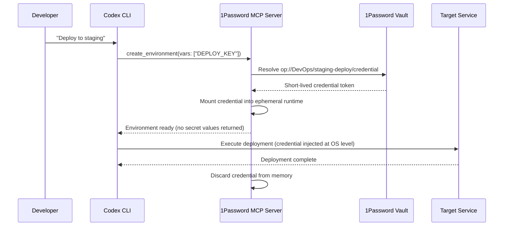
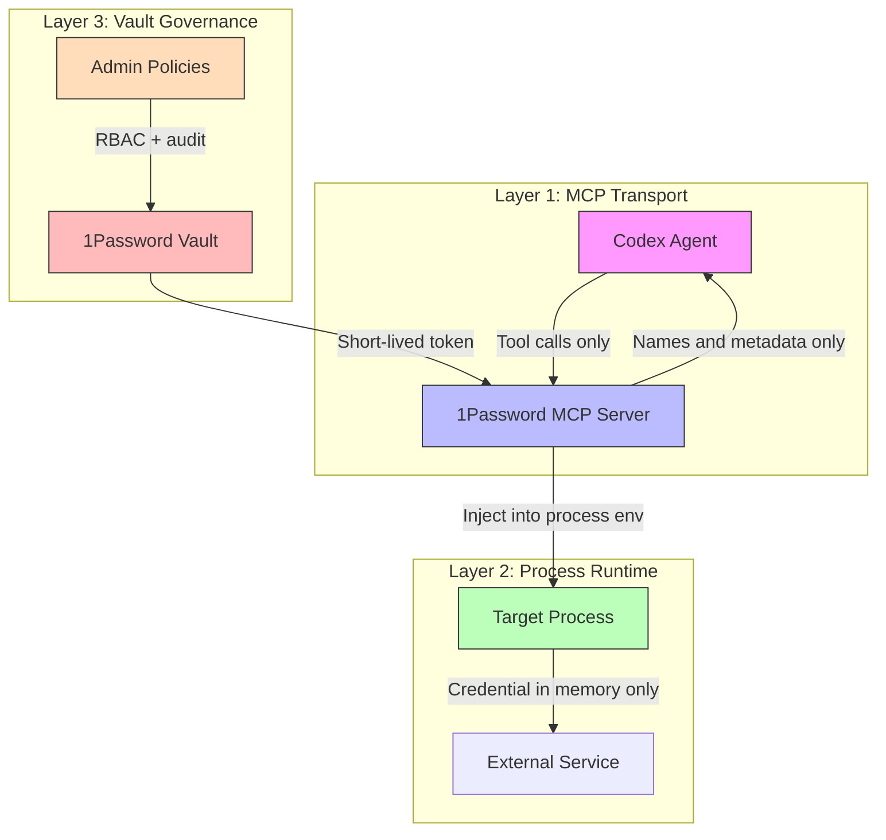

# 1Password Environments MCP Server for Codex: Just-in-Time Credential Access for Coding Agents


---

On 20 May 2026, 1Password announced its Environments MCP Server for Codex — a purpose-built Model Context Protocol integration that gives coding agents access to vaulted credentials without ever exposing secret values to the model's context window, terminal output, or on-disk files [^1][^2]. The announcement marks the first official credential-management partnership for OpenAI's Codex platform and establishes a pattern that every team running agentic coding workflows needs to understand.

## Why Agent Credential Security Matters Now

The core problem is deceptively simple: coding agents need credentials to do useful work — API keys for deployment, database connection strings for migrations, cloud provider tokens for infrastructure provisioning — yet every mechanism developers traditionally use to supply those credentials creates an exposure surface.

Environment variables persist in shell history and process tables. `.env` files get committed to repositories. Hardcoded strings in configuration files are the oldest sin in the book. When a human developer manages these risks, muscle memory and code review catch most mistakes. When an autonomous agent manages them at speed, across dozens of tool calls per session, the blast radius is different entirely [^3].

Previous approaches to agent credential management in Codex fell into three categories:

1. **Shell environment variables** — loaded before the session, visible to every subprocess
2. **Codex Cloud secrets** — encrypted at rest, available during setup phase only, but limited to cloud execution [^4]
3. **MCP server `env` blocks** — credentials written directly into `config.toml`, often in plaintext

None of these implement the principle of least privilege at the granularity that agentic workflows demand.

## The Just-in-Time Pattern

1Password's integration implements what their CTO Nancy Wang describes as the "only viable security model for AI-native development" [^1]:

> A credential that persists is already compromised. That's why just-in-time credentials are the only viable security model for AI-native development.

The pattern works as follows:



The critical architectural decision is what the MCP server *does not* do: it never returns secret values through the MCP channel [^2]. Codex can create environments, list variable names, and invoke applications using secrets — but the actual plaintext values never enter the model's context window. The credential is injected at the operating system process level, used for the duration of the tool call, and then discarded.

## What the MCP Server Exposes

Based on the announcement and integration documentation, the 1Password Environments MCP Server provides three categories of tool [^1][^2][^5]:

| Tool Category | Purpose | Secret Exposure |
|---|---|---|
| **Environment creation** | Provision a runtime environment with named credential references | None — names only |
| **Variable listing** | Enumerate available credentials from authorised vaults | Names and metadata only |
| **Application invocation** | Execute commands with credentials mounted in the process environment | Injected at OS level, never in MCP response |

This is fundamentally different from the community `@takescake/1password-mcp` package, which uses a 1Password Service Account token and returns secret values through the MCP channel [^6]. The official Environments MCP Server treats the MCP transport as an untrusted channel by design.

## Configuration in Codex CLI

### Prerequisites

- 1Password account with the Environments feature enabled
- 1Password CLI (`op`) installed and authenticated
- Codex CLI v0.131.0 or later (for stable MCP server support)

### Basic Setup

Add the MCP server to your Codex configuration:

```toml
# ~/.codex/config.toml (user-scoped)
[mcp_servers."1password-env"]
command = "op"
args = ["mcp-server", "environments"]
startup_timeout_sec = 15
required = true

# Restrict to credential management tools only
enabled_tools = [
  "create_environment",
  "list_variables",
  "run_with_credentials"
]

# Require explicit approval before any credential access
default_tools_approval_mode = "approve"
```

### Enterprise Configuration with requirements.toml

For teams using Codex's managed configuration, enforce the 1Password MCP server as a required component:

```toml
# requirements.toml (enterprise-managed)
[required_mcp_servers."1password-env"]
command = "op"
args = ["mcp-server", "environments"]
required = true

# Lock down approval mode — no team can set this to auto
[required_mcp_servers."1password-env".tools."*"]
approval_mode = "approve"
```

### Using op:// Secret References in AGENTS.md

Rather than documenting actual credential values, reference vaulted secrets by their 1Password URI:

```markdown
<!-- AGENTS.md -->
## Deployment Credentials

When deploying to staging, use the following credential references:
- Database: `op://Engineering/staging-db/connection-string`
- API key: `op://Engineering/staging-api/key`
- AWS role: `op://DevOps/aws-staging/role-arn`

Never hardcode credentials. Always use the 1Password environment tools
to mount credentials at runtime.
```

The `op://` URI syntax follows 1Password's standard secret reference format: `op://<vault-name>/<item-name>/[section-name/]<field-name>` [^7].

## Security Model: Three Isolation Boundaries

The integration enforces credential isolation at three distinct layers:



1. **MCP Transport Isolation** — The MCP channel never carries secret values. Even if an attacker intercepts the JSON-RPC traffic between Codex and the MCP server, they obtain only variable names and environment identifiers.

2. **Process Runtime Isolation** — Credentials exist only in the memory space of the target process for the duration of execution. They are not written to disk, not logged to `history.jsonl`, and not included in context compaction summaries.

3. **Vault Governance** — 1Password's access control layer enforces which vaults, items, and fields are accessible. Combined with Codex's own `default_tools_approval_mode = "approve"`, every credential access requires both vault authorisation and user confirmation [^2][^8].

## Comparison with Existing Approaches

| Approach | Secret in Context Window | Secret on Disk | Audit Trail | Revocation |
|---|---|---|---|---|
| Shell `export` | Yes (if agent reads env) | `.bash_history` | None | Manual |
| `.env` file | Yes (if agent reads file) | Yes | Git blame | Manual |
| Codex Cloud secrets | No | Encrypted at rest | Cloud logs | Dashboard |
| `config.toml` env block | Yes (in config) | Yes (plaintext TOML) | None | Manual edit |
| **1Password Environments MCP** | **No** | **No** | **1Password audit log** | **Instant vault revocation** |

## Practical Workflow: Database Migration with Vaulted Credentials

A common scenario illustrating the pattern:

```bash
# Non-interactive migration with vaulted credentials
codex exec \
  --sandbox workspace-write \
  "Run the pending database migrations against staging. \
   Use the 1Password environment tools to access the \
   staging database credentials from the Engineering vault. \
   Do not output any connection strings or credentials."
```

Codex invokes the `create_environment` tool, the MCP server mounts the database credentials into an ephemeral runtime, the migration tool runs with the connection string available as a process environment variable, and the credential is discarded when the tool call completes. At no point does the connection string appear in the agent's conversation history or the session transcript.

## Anti-Patterns to Avoid

| Anti-Pattern | Why It Fails | Correct Approach |
|---|---|---|
| Using the community `@takescake/1password-mcp` for production secrets | Returns plaintext values through MCP channel [^6] | Use the official Environments MCP Server |
| Setting `default_tools_approval_mode = "auto"` for credential tools | Removes human-in-the-loop for sensitive operations | Keep `"approve"` for all credential access |
| Storing `OP_SERVICE_ACCOUNT_TOKEN` in `config.toml` `env` block | Token persists in plaintext on disk | Use `op` CLI authentication or `env_vars` forwarding |
| Instructing the agent to "print the API key" for verification | Forces the MCP server to surface the value | Trust the audit log; verify by testing the operation |
| Skipping `required = true` in enterprise config | Developers can remove the MCP server and fall back to plaintext | Enforce via `requirements.toml` |

## Broader Implications: The Agent Identity Layer

This integration is part of a larger shift. 1Password's Unified Access platform, announced in March 2026, governs access across three identity types: human users, machine identities (service accounts, CI runners), and now AI agents [^5]. The Environments MCP Server for Codex is the first public implementation of the third category.

The pattern — vault-backed, just-in-time, zero-plaintext-exposure credential access — is likely to become the baseline expectation for any coding agent that touches production systems. 1Password has confirmed plans to extend the same integration pattern to other AI coding tools beyond Codex [^2].

For platform engineering teams, the immediate action is clear: audit how your developers currently supply credentials to Codex sessions, and start planning the migration path from shell environment variables and `.env` files to vault-backed MCP credential injection.

## Citations

[^1]: [1Password extends OpenAI collaboration with Codex MCP server for just-in-time credential access — SiliconANGLE, 20 May 2026](https://siliconangle.com/2026/05/20/1password-extends-openai-collaboration-codex-mcp-server-just-time-credential-access/)
[^2]: [1Password Allies With OpenAI to Secure Codex AI Coding Tool — DevOps.com, 20 May 2026](https://devops.com/1password-allies-with-openai-to-secure-codex-ai-coding-tool/)
[^3]: [Codex CLI Secrets Defence: Env Leakage, Agent Vault, and Runtime Injection — Codex Blog, 10 May 2026](https://codex.danielvaughan.com/2026/05/10/codex-cli-secrets-defence-env-leakage-agent-vault-runtime-injection/)
[^4]: [Codex Cloud Environment Configuration — OpenAI Developers](https://developers.openai.com/codex/cloud-environments)
[^5]: [1Password Secures Coding Agents with New OpenAI Codex Integration — BusinessWire, 20 May 2026](https://www.businesswire.com/news/home/20260520474924/en/1Password-Secures-Coding-Agents-with-New-OpenAI-Codex-Integration)
[^6]: [1Password MCP Server (community) — GitHub](https://github.com/CakeRepository/1Password-MCP)
[^7]: [Use secret references with 1Password CLI — 1Password Developer Documentation](https://developer.1password.com/docs/cli/secret-references/)
[^8]: [Model Context Protocol — Codex, OpenAI Developers](https://developers.openai.com/codex/mcp)
