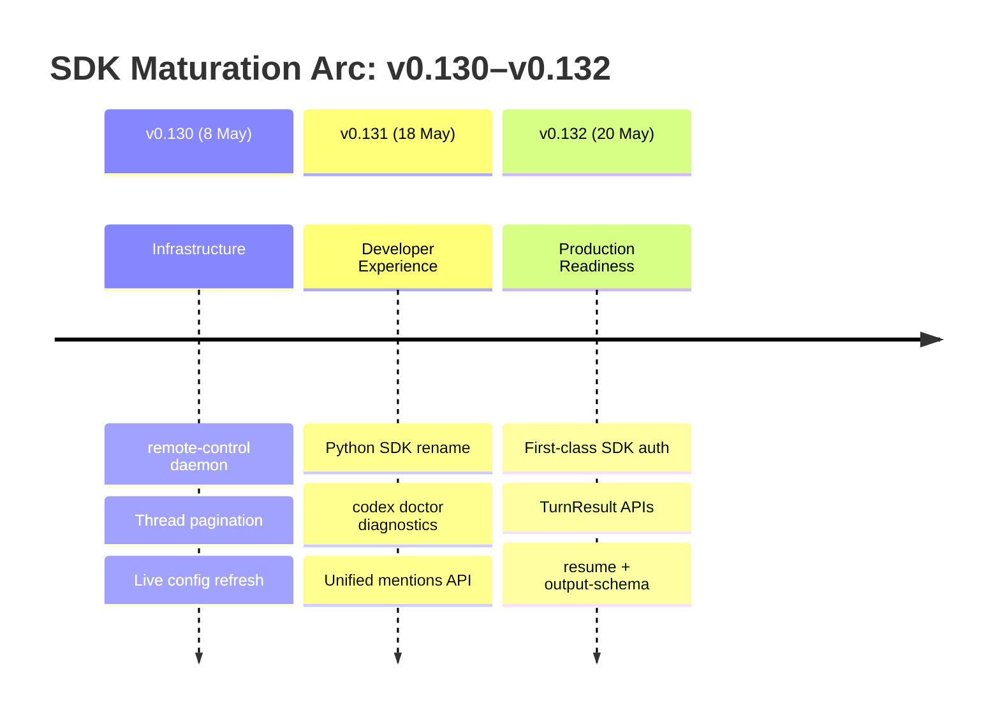

# Codex CLI's SDK Maturation Arc: How v0.130–v0.132 Turned a Terminal Tool into a Programmable Agent Platform


---

Three releases in twelve days. Between 8 May and 20 May 2026, Codex CLI shipped v0.130, v0.131, and v0.132 — and each one quietly pushed the project further from "terminal tool with a good TUI" towards "programmable agent platform with five distinct automation surfaces"[^1][^2][^3]. Most coverage has focused on individual features: remote-control here, unified mentions there, Python SDK auth over there. This article traces the arc across all three releases, maps the five automation surfaces that now exist, and provides a decision framework for choosing which one to use.

## The Problem the Arc Solves

Before May 2026, building production automation with Codex CLI meant one of two things: shell-scripting around `codex exec` or wiring up the app-server's undocumented JSON-RPC protocol yourself[^4]. The first was adequate for one-shot CI tasks but clumsy for multi-turn workflows. The second was powerful but fragile — types changed between releases, authentication required manual token juggling, and there was no official client library to absorb breaking changes.

The v0.130–v0.132 sprint addressed this gap systematically.

## Release-by-Release: What Changed

### v0.130 (8 May 2026): The Infrastructure Layer

v0.130 laid the groundwork with three infrastructure changes[^1]:

1. **`codex remote-control`** — a single command that starts a headless app-server with remote-control support enabled, replacing the previous multi-flag incantation (`codex --headless --enable-remote --daemon`). This gave managed environments a clean entry point for running Codex as a background service.

2. **App-server thread pagination** — clients can now page large threads with `unloaded`, `summary`, or `full` turn item views, preventing memory exhaustion in long-running sessions[^1].

3. **Live configuration refresh** — app-server threads pick up `config.toml` changes without requiring a restart, enabling runtime tuning of model selection, reasoning effort, and approval policies[^1].

These were not user-facing features. They were platform primitives: a stable daemon, efficient data access, and hot-reloadable configuration.

### v0.131 (18 May 2026): The SDK and Diagnostics Layer

v0.131 delivered the developer experience improvements that make a platform usable[^2]:

1. **Python SDK rename to `openai-codex`** — the package moved from an internal naming convention to a public identity, with pinned runtime-generated types, concurrent turn routing, and approval mode controls[^2]. This was a signal: the SDK is no longer experimental.

2. **`codex doctor`** — a first-class diagnostics command covering runtime, authentication, terminal, network, configuration, and local state[^2][^5]. Before this, debugging a broken installation required manual log archaeology. Now a single command produces a structured, redacted JSON report suitable for support tooling.

3. **Unified `@` mentions** — the mention picker now searches files, directories, plugins, and skills in a single interface[^2], which matters for automation because it means the app-server's metadata API exposes a unified resource namespace that custom clients can query.

### v0.132 (20 May 2026): The Authentication and Output Layer

v0.132 closed the final gaps that prevented the Python SDK from being production-ready[^3]:

1. **First-class SDK authentication** — the Python SDK now supports API key login, ChatGPT browser-based PKCE flow, and device-code flow for headless environments[^3]. Previously, SDK users had to manage tokens manually or shell out to `codex login`.

2. **Simplified Turn APIs** — text-only workflows accept plain string inputs and return enriched `TurnResult` objects containing collected items, timing data, and usage statistics[^3][^6]. No more parsing JSON-RPC responses by hand.

3. **`codex exec resume --output-schema`** — the `resume` subcommand now accepts `--output-schema`, enabling multi-step pipelines where each step preserves full session context whilst outputting structured JSON[^3][^7]. This was a long-requested feature (GitHub Issue #14343) that removes the last barrier to chained agent workflows in CI/CD.



## The Five Automation Surfaces

As of v0.132, Codex CLI exposes five distinct surfaces for programmatic use. Each targets a different integration pattern[^4][^6][^8]:

### 1. `codex exec` — The Unix Primitive

Best for one-shot tasks in shell scripts and CI pipelines. Accepts a prompt via argument or `--prompt-file`, streams progress to stderr, prints the final response to stdout. Add `--output-schema` for JSON Schema–validated output and `--json` for full JSONL event streaming[^4].

```bash
codex exec "Analyse src/ for type safety issues" \
  --output-schema ./schemas/type-report.json \
  -o ./reports/types.json \
  --ephemeral
```

### 2. Python SDK (`openai-codex`) — The Embedding Surface

Best for multi-turn automation, custom agent harnesses, and services that need programmatic control over thread lifecycle. As of v0.132, supports native authentication, sync and async clients, and typed `TurnResult` responses[^3][^6].

```python
from codex_app_server import Codex

with Codex() as codex:
    codex.login_api_key(api_key)
    thread = codex.thread_start(model="gpt-5.5")
    result = thread.run("Review the PR diff for security issues")
    print(result.final_response)
    print(f"Tokens used: {result.usage.total_tokens}")
```

### 3. TypeScript SDK (`@openai/codex-sdk`) — The Node Integration

Mirrors the Python SDK for Node.js environments. Thread-based API with `startThread()`, `run()`, and `resumeThread()`[^6].

```typescript
import { Codex } from "@openai/codex-sdk";

const codex = new Codex();
const thread = codex.startThread();
const result = await thread.run("Generate release notes from the last 10 commits");
```

### 4. MCP Server — The Inter-Agent Bridge

Exposes Codex CLI as a Model Context Protocol server that other agents or orchestrators can call. Combined with the OpenAI Agents SDK, this enables multi-agent pipelines where a coordinator delegates coding tasks to Codex[^8][^9].

### 5. GitHub Action (`openai/codex-action@v1`) — The CI Wrapper

Installs the CLI, configures the Responses API proxy, runs `codex exec` under specified permissions, and emits the final message as a GitHub Actions output[^10]. Handles authentication, safety strategy, and user/bot allowlisting declaratively.

```mermaid
flowchart TD
    A[Shell Script] -->|codex exec| B[One-shot task]
    C[Python App] -->|openai-codex SDK| D[Multi-turn threads]
    E[Node.js App] -->|@openai/codex-sdk| D
    F[Agent Orchestrator] -->|MCP Server| G[Delegated coding]
    H[GitHub Actions] -->|codex-action| B
    D --> I[App-Server Process]
    B --> I
    G --> I
    I --> J[Codex Runtime + Sandbox]
```

## Decision Framework: Which Surface to Choose

| Scenario | Recommended Surface | Rationale |
|----------|-------------------|-----------|
| One-shot CI quality gate | `codex exec` | Stateless, composable, exit-code driven |
| Multi-step pipeline with context | `codex exec resume` | Preserves thread state across steps |
| Custom Python service embedding Codex | Python SDK | Native auth, typed results, thread lifecycle |
| Multi-agent orchestration | MCP Server + Agents SDK | Protocol-level delegation with tracing |
| GitHub PR review automation | GitHub Action | Declarative YAML, built-in safety controls |
| Headless background service | `codex remote-control` | Daemon mode with WebSocket management |

## What Is Still Missing

The maturation arc is impressive but incomplete. Three gaps remain as of v0.132:

1. **PyPI distribution** — the Python SDK still requires a local Codex repository checkout and `pip install -e .` from `sdk/python/`[^6]. There is no `pip install openai-codex` from PyPI yet. This limits adoption in environments where cloning the full repository is impractical. ⚠️

2. **Streaming in the SDK** — both `codex exec --json` and the app-server's JSON-RPC protocol support event streaming, but the Python and TypeScript SDKs expose only blocking `run()` calls that return complete results[^6]. Real-time progress callbacks would enable richer integrations. ⚠️

3. **SDK feature parity** — the Python SDK does not yet expose all app-server capabilities. Goal management, plugin lifecycle, and MCP server control are accessible only through the raw JSON-RPC protocol or the TUI[^6]. ⚠️

## Practical Implications

The v0.130–v0.132 arc matters because it changes how teams should think about Codex CLI. It is no longer just a terminal tool you ssh into; it is a platform with multiple integration points, each designed for a different architectural pattern.

For teams currently using `codex exec` in CI: consider whether the Python SDK's multi-turn threading would simplify complex pipelines. For teams building custom developer platforms: the SDK's first-class authentication means you can embed Codex without managing OAuth tokens yourself. For teams evaluating Codex against competitors: the five-surface architecture is Codex CLI's structural advantage — no other coding agent offers this range of programmatic integration points in a single open-source package[^11].

The sprint from v0.130 to v0.132 was quiet — no blog posts, no keynote demos. But it may be the most consequential twelve days in Codex CLI's history: the twelve days it stopped being a tool and started being a platform.

## Citations

[^1]: OpenAI, "Changelog – Codex: v0.130.0 (8 May 2026)," OpenAI Developers, 2026. [https://developers.openai.com/codex/changelog](https://developers.openai.com/codex/changelog)

[^2]: OpenAI, "Changelog – Codex: v0.131.0 (18 May 2026)," OpenAI Developers, 2026. [https://developers.openai.com/codex/changelog](https://developers.openai.com/codex/changelog)

[^3]: OpenAI, "Changelog – Codex: v0.132.0 (20 May 2026)," OpenAI Developers, 2026. [https://developers.openai.com/codex/changelog](https://developers.openai.com/codex/changelog)

[^4]: OpenAI, "Non-interactive mode – Codex," OpenAI Developers, 2026. [https://developers.openai.com/codex/noninteractive](https://developers.openai.com/codex/noninteractive)

[^5]: GitHub Pull Request #22336, "feat(cli): add codex doctor diagnostics," openai/codex, May 2026. [https://github.com/openai/codex/pull/22336](https://github.com/openai/codex/pull/22336)

[^6]: OpenAI, "SDK – Codex," OpenAI Developers, 2026. [https://developers.openai.com/codex/sdk](https://developers.openai.com/codex/sdk)

[^7]: GitHub Pull Request #23123, "Resume automations now support --output-schema," openai/codex, May 2026. [https://github.com/openai/codex/pull/23123](https://github.com/openai/codex/pull/23123)

[^8]: OpenAI, "Use Codex with the Agents SDK," OpenAI Developers, 2026. [https://developers.openai.com/codex/guides/agents-sdk](https://developers.openai.com/codex/guides/agents-sdk)

[^9]: OpenAI, "Building Consistent Workflows with Codex CLI & Agents SDK," OpenAI Cookbook, 2025. [https://developers.openai.com/cookbook/examples/codex/codex_mcp_agents_sdk/building_consistent_workflows_codex_cli_agents_sdk](https://developers.openai.com/cookbook/examples/codex/codex_mcp_agents_sdk/building_consistent_workflows_codex_cli_agents_sdk)

[^10]: OpenAI, "GitHub Action – Codex," OpenAI Developers, 2026. [https://developers.openai.com/codex/github-action](https://developers.openai.com/codex/github-action)

[^11]: Blake Crosley, "Codex CLI v0.130 Reference," blakecrosley.com, May 2026. [https://blakecrosley.com/guides/codex](https://blakecrosley.com/guides/codex)
