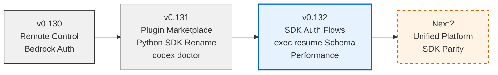

# Codex CLI v0.132.0 Release Guide: Python SDK Authentication, exec resume --output-schema, and Performance Gains


---

Codex CLI v0.132.0 shipped on 20 May 2026 with a release that prioritises two themes: making the Python SDK a proper first-class citizen for programmatic automation, and tightening the non-interactive pipeline story around resumed sessions with structured output [^1]. Below is a senior-developer walkthrough of every significant change, what it unlocks, and how to adopt it.

## Python SDK: First-Class Authentication

Prior to v0.132.0, the Python SDK (`openai-codex` package, renamed from `codex_app_server` in v0.131.0 [^2]) required users to pre-configure authentication externally — either by setting `CODEX_ACCESS_TOKEN` in the environment or by running `codex login` in a separate terminal session. The SDK itself had no awareness of credential flows.

v0.132.0 changes that. The SDK now supports three authentication methods natively [^1] [^3]:

### API Key Login

The simplest path for CI/CD and server-side automation:

```python
from openai_codex import Codex, AuthConfig

codex = Codex(auth=AuthConfig(api_key=os.environ["OPENAI_API_KEY"]))
```

This authenticates at standard OpenAI API rates rather than through a ChatGPT subscription [^3].

### ChatGPT Browser Flow

For interactive desktop use, the SDK can trigger the same browser-based OAuth PKCE flow that `codex login` uses:

```python
from openai_codex import Codex, AuthConfig

codex = Codex(auth=AuthConfig(method="chatgpt"))
# Opens default browser for ChatGPT sign-in
```

Tokens are cached in the same credential store used by the CLI (`~/.codex/auth.json` or OS keyring), so a single login persists across both CLI and SDK sessions [^3].

### Device-Code Flow

For headless servers, SSH sessions, and containers where no browser is available:

```python
from openai_codex import Codex, AuthConfig

codex = Codex(auth=AuthConfig(method="device_code"))
# Prints a URL and one-time code; user completes auth on any browser
```

This mirrors `codex login --device-auth` [^3] and is the recommended path for CI runners that need ChatGPT-tier access without storing long-lived API keys.

### Account Inspection and Logout

The SDK also exposes account lifecycle methods:

```python
info = codex.account_info()
print(info.email, info.workspace_id, info.plan)

codex.logout()  # Revokes cached tokens
```

### Simplified Turn APIs

Text-only workflows no longer need to construct structured input objects. Pass a plain string:

```python
async with AsyncCodex(auth=AuthConfig(api_key=os.environ["OPENAI_API_KEY"])) as codex:
    thread = await codex.thread_start(model="gpt-5.4")
    result = await thread.run("Refactor the auth module to use dependency injection")

    print(result.final_response)      # Assistant's last message
    print(result.timing.wall_seconds) # Wall-clock duration
    print(result.usage.total_tokens)  # Token consumption
```

The `TurnResult` object now bundles collected items, timing breakdowns, and usage metrics — previously these required parsing raw JSON-RPC events [^1].

## exec resume with --output-schema

The `codex exec` non-interactive mode gained `resume` in v0.128.0 [^4], but until now resumed sessions could not enforce structured output. v0.132.0 closes that gap.

### The Problem

Consider a CI pipeline that starts a long-running refactoring task:

```bash
codex exec "migrate all Jest tests to Vitest" \
  --output-schema vitest-migration.schema.json \
  -o result.json
```

If the session hits a token limit or needs human input, it pauses. Previously, resuming it dropped the schema constraint:

```bash
# Pre-v0.132.0: no --output-schema on resume
codex exec resume --last "continue the migration"
```

The resumed session would produce free-form text instead of the structured JSON the downstream pipeline expected.

### The Fix

```bash
codex exec resume --last \
  --output-schema vitest-migration.schema.json \
  -o result.json \
  "continue the migration"
```

The schema is re-applied to the resumed session, and Codex validates the final output against it before writing to `result.json` [^1] [^5].

### Practical Pattern: Retry Loop with Schema Enforcement

```bash
#!/usr/bin/env bash
set -euo pipefail

SCHEMA="response.schema.json"
OUTPUT="result.json"
MAX_RETRIES=3

codex exec "analyse the codebase for security vulnerabilities" \
  --model gpt-5.5 \
  --output-schema "$SCHEMA" \
  -o "$OUTPUT" 2>/dev/null || true

for i in $(seq 1 $MAX_RETRIES); do
  if jq empty "$OUTPUT" 2>/dev/null; then
    echo "Valid JSON output on attempt $i"
    exit 0
  fi
  echo "Resuming (attempt $((i+1)))..."
  codex exec resume --last \
    --output-schema "$SCHEMA" \
    -o "$OUTPUT" \
    "continue and complete the analysis" 2>/dev/null || true
done

echo "Failed after $MAX_RETRIES retries" >&2
exit 1
```

## Performance: Batched Terminal Capability Probes

A quiet but measurable improvement: TUI startup now batches terminal capability checks instead of running them sequentially [^1].

Previously, Codex probed capabilities one at a time — colour depth, Unicode support, Kitty graphics protocol, sixel support, true-colour mode, and others. On slow terminal emulators or high-latency SSH connections, this added 200–400ms to startup.

v0.132.0 fires all probes in a single batch and collects responses asynchronously. The practical effect is a snappier launch, particularly noticeable on:

- Remote SSH sessions through jump hosts
- Windows Terminal with WSL2
- Older terminal emulators without instant response to escape sequences

No configuration change is required — the improvement is automatic.

## Remote Executor: Unified Authentication

Remote executors (used by `codex remote-control` and registry-backed environments [^6]) previously required separate credential flows — a pattern that created friction when switching between local and remote workflows.

v0.132.0 unifies this: remote executor registration now uses the same Codex authentication stack as everything else [^1]. If you have authenticated via `codex login`, remote executors inherit those credentials automatically.

```toml
# config.toml — remote executor now uses standard auth
[remote]
executor = "registry.example.com/my-env:latest"
# No separate auth block needed; uses ~/.codex/auth.json
```

## Image Fidelity in App-Server Turns

For teams using the app-server (JSON-RPC) path for multi-turn sessions, v0.132.0 preserves original image resolution across user inputs and tool outputs [^1]. Previously, images passed through the app-server were downsampled to reduce payload size. This caused issues for workflows involving:

- Screenshot-based UI testing via `view_image`
- Architecture diagram analysis
- Design review with pixel-level comparison

The fix maintains the original resolution whilst compressing transfer encoding, keeping WebSocket payload sizes manageable.

## Goal Continuations: Smarter Halting

The `/goal` persistent objectives feature (introduced in v0.128.0 [^7]) now halts automatically when it detects usage limits or repeated blockers [^1]. Previously, a goal continuation could burn through tokens retrying a fundamentally blocked action — for example, repeatedly attempting to install a package that requires root privileges in a sandboxed environment.

v0.132.0 detects these patterns and stops the continuation with a diagnostic message explaining why it halted, rather than exhausting the token budget.

## Session Picker Improvements

Two quality-of-life fixes for the `codex resume` session picker [^1]:

1. **Renamed threads** now display as `name (thread-id)` rather than showing only the UUID
2. **Paste support** in the search field — previously, pasting a thread ID into the picker's search was silently ignored on some terminal emulators

## Upgrade Path

```bash
# npm global install
npm install -g @anthropic-ai/codex@0.132.0

# Or update via codex itself
codex update

# Verify
codex --version
# 0.132.0
```

For the Python SDK:

```bash
pip install --upgrade openai-codex
```

The release is backwards-compatible with existing `config.toml` files and `AGENTS.md` configurations. No migration steps are required [^1].

## What This Release Signals



The v0.130–v0.132 arc tells a clear story: OpenAI is systematically removing friction from programmatic Codex usage. The Python SDK is no longer a thin wrapper around a binary — it is becoming a proper automation platform with its own authentication, structured results, and session management [^8]. Combined with the Brockman memo's unified platform direction [^9], this positions the SDK as the stable interface that will survive the ChatGPT-Codex consolidation.

For teams building CI/CD integrations or embedding Codex in internal tools, v0.132.0 is the release where the SDK becomes production-ready for authentication-sensitive workflows.

## Citations

[^1]: [Codex CLI Changelog — v0.132.0](https://developers.openai.com/codex/changelog), OpenAI Developers, 20 May 2026.
[^2]: [Codex CLI v0.131.0 Changelog](https://developers.openai.com/codex/changelog), OpenAI Developers, 18 May 2026.
[^3]: [Authentication — Codex CLI](https://developers.openai.com/codex/auth), OpenAI Developers.
[^4]: [Command Line Options — Codex CLI Reference](https://developers.openai.com/codex/cli/reference), OpenAI Developers.
[^5]: [Features — Codex CLI](https://developers.openai.com/codex/cli/features), OpenAI Developers.
[^6]: [Codex CLI v0.130 Reference](https://blakecrosley.com/guides/codex), Blake Crosley, May 2026.
[^7]: [Codex /goal: What It Does, How to Use It](https://blog.laozhang.ai/en/posts/codex-goal), LaoZhang AI Blog, 2026.
[^8]: [SDK — Codex](https://developers.openai.com/codex/sdk), OpenAI Developers.
[^9]: [OpenAI's Unified Agentic Platform](https://openai.com/index/introducing-upgrades-to-codex/), OpenAI Blog, May 2026.
