# codex doctor: The Diagnostics Command That Replaces Manual Log Archaeology


---

Before Codex CLI v0.131.0, diagnosing a broken installation meant spelunking through `~/.codex/log/codex-tui.log`, manually inspecting `auth.json` token expiry, cross-referencing sandbox policy files, and hoping you remembered which environment variable controlled which behaviour[^1][^2]. The new `codex doctor` command collapses all of that into a single, structured diagnostic report covering runtime, authentication, terminal, network, configuration, and local state[^3][^4].

This article walks through every diagnostic section, explains the flags that control output format, and shows how to integrate `codex doctor` into CI pipelines and support workflows.

## Why a dedicated diagnostics command?

Codex CLI's surface area has grown substantially. A typical installation now involves:

- Multiple authentication modes (API key, ChatGPT browser PKCE, device-code flow)[^5]
- MCP server connections with OAuth and Streamable HTTP transport[^6]
- Sandbox policies governed by both local `config.toml` and enterprise `requirements.toml`[^7]
- Plugin marketplace installations with hook bindings[^8]
- An app-server daemon managing background sessions[^3]

When something breaks, the failure could originate in any of these layers. `codex doctor` systematically checks each one and surfaces anomalies in a promoted **Notes** block at the top of its output[^4].

## Running the command

```bash
# Full detailed output (default)
codex doctor

# Compact summary view
codex doctor --summary

# Machine-readable JSON (redacted for safe sharing)
codex doctor --json

# Expand truncated lists
codex doctor --all

# Strip ANSI colours for piping/logging
codex doctor --no-color
```

The `--json` flag is particularly important for support workflows. It produces a structured, redacted report keyed by stable check IDs, making it safe to attach to GitHub issues without leaking credentials[^4].

## Diagnostic sections

The report is organised into five sections, each containing multiple checks. Every check reports a status: `ok`, `idle`, `note`, `warning`, or `fail`[^4].

```mermaid
flowchart TD
    A[codex doctor] --> B[Notes]
    A --> C[Environment]
    A --> D[Configuration]
    A --> E[Updates]
    A --> F[Connectivity]
    A --> G[Background Server]

    B --> B1[Promoted anomalies]
    C --> C1[Runtime provenance]
    C --> C2[Install consistency]
    C --> C3[Search tool availability]
    C --> C4[Terminal metadata]
    C --> C5[Database health]
    D --> D1[config.toml parse status]
    D --> D2[Auth mode details]
    D --> D3[MCP server config]
    D --> D4[Sandbox policy]
    D --> D5[Feature flags]
    E --> E1[Update cache state]
    E --> E2[Latest version check]
    F --> F1[WebSocket handshake]
    F --> F2[HTTP endpoint reachability]
    F --> F3[Provider-specific checks]
    G --> G1[App-server daemon status]
    G --> G2[SQLite integrity]
    G --> G3[Rollout statistics]
```



### 1. Notes

The Notes block appears first and promotes the most actionable findings from all other sections. Typical entries include:

- **Available update** — a newer CLI version exists but hasn't been applied
- **Large rollout directory** — accumulated rollout traces consuming significant disc space
- **Optional MCP failures** — an MCP server marked optional is unreachable
- **Mixed auth signals** — conflicting authentication modes detected (e.g. both an API key and a ChatGPT browser session active simultaneously)[^4]

### 2. Environment

This section validates the runtime foundation:

| Check | What it verifies |
|---|---|
| Runtime provenance | Node.js version, installation method (npm global, npx, Homebrew) |
| Install consistency | Whether the binary matches the expected package version; detects npm-managed installs on Windows correctly[^3] |
| Search readiness | Availability of bundled and system search tools (ripgrep, fd) used by `@` mentions and file context |
| Terminal metadata | `$TERM` value, tmux/zellij detection, multiplexer configuration that affects TUI rendering |
| Database health | SQLite integrity checks on state and log databases[^4] |

The install consistency check is worth highlighting. A common support issue arises when developers have multiple Node.js version managers (nvm, fnm, volta) and the global `codex` binary resolves to a stale installation. `codex doctor` detects this mismatch directly[^4].

### 3. Configuration

Configuration diagnostics parse and validate the active configuration stack:

- **config.toml parse status** — reports syntax errors with line numbers rather than silent fallback behaviour
- **Authentication mode** — identifies the active auth method and warns about conflicting signals[^5]
- **MCP server configuration** — lists configured servers and their transport types, flagging unreachable optional servers and policy violations against `requirements.toml`[^6][^7]
- **Sandbox policy** — reports the effective sandbox mode, network access settings, and filesystem write permissions
- **Feature flags** — lists enabled flags and any overrides applied via environment variables or config[^4]

### 4. Updates

A straightforward section checking:

- Whether the local update cache is stale
- The latest available version from the npm registry
- Whether the current version is behind and by how many releases[^3]

### 5. Connectivity

Provider-aware network validation is where `codex doctor` earns its keep for enterprise environments:

```bash
# Example connectivity output (abbreviated)
Connectivity
  WebSocket handshake ........... ok  (upgrade 101 in 43ms)
  API endpoint (api.openai.com) . ok  (200 in 112ms)
  ChatGPT auth .................. idle (no browser session)
  Azure OpenAI .................. idle (not configured)
  Custom provider ............... idle (not configured)
```

The command tests WebSocket connectivity with HTTP upgrade status reporting, then checks reachability for each configured provider endpoint[^4]. Behind a corporate proxy, this immediately reveals whether the issue is DNS, TLS interception, or endpoint blocking — information that previously required separate `curl` and `wscat` commands.

### 6. Background Server

The final section inspects the app-server daemon:

- **Daemon status** — running, stopped, or crashed with PID and uptime
- **SQLite integrity** — validates the session database hasn't been corrupted by unclean shutdowns
- **Rollout statistics** — active and archived rollout file counts, total disc usage, and average trace sizes[^4][^9]

## Integrating with support workflows

### Attaching to GitHub issues

The `--json` output is designed for safe sharing. Credentials, tokens, and sensitive configuration values are automatically redacted:

```bash
# Generate a redacted report and copy to clipboard
codex doctor --json | pbcopy
```

Paste the output directly into a GitHub issue. The OpenAI support team can parse the stable check IDs programmatically[^4].

### Automatic attachment via /feedback

When you run `/feedback` inside a Codex session, the system now automatically attaches a redacted `codex-doctor-report.json` to the log upload. It also derives Sentry tags for the overall status and any failing checks, enabling the support team to triage issues before reading the full report[^4].

### CI pipeline health checks

For teams running `codex exec` in CI/CD pipelines, a pre-flight `codex doctor` check catches configuration drift before it causes cryptic task failures:

```bash
#!/usr/bin/env bash
# ci-preflight.sh — run before codex exec in CI

set -euo pipefail

DOCTOR_OUTPUT=$(codex doctor --json --no-color)
STATUS=$(echo "$DOCTOR_OUTPUT" | jq -r '.overall_status')

if [ "$STATUS" = "fail" ]; then
  echo "::error::codex doctor reported failures:"
  echo "$DOCTOR_OUTPUT" | jq '.checks[] | select(.status == "fail")'
  exit 1
fi

echo "codex doctor: $STATUS"
```

This pattern is particularly valuable after Codex CLI version upgrades, where configuration schema changes can silently break `config.toml` parsing[^5][^10].

### Enterprise fleet diagnostics

For organisations using managed configuration via `requirements.toml`, `codex doctor` reports which managed-configuration layer is active on a developer's machine[^7]. Combined with `--json`, this enables fleet-wide health aggregation:

```bash
# Collect diagnostics across developer machines
codex doctor --json > "/shared/diagnostics/$(hostname)-$(date +%Y%m%d).json"
```

## Relationship to other diagnostic tools

`codex doctor` doesn't replace existing diagnostic surfaces — it complements them:

| Tool | Scope | When to use |
|---|---|---|
| `codex doctor` | System-wide health snapshot | Installation issues, auth problems, pre-support triage |
| `/feedback` | Session-specific diagnostics | Mid-session errors, request IDs for server-side logs |
| `/debug-config` | Active configuration layers | Config precedence confusion during a session[^11] |
| `codex debug` | Rollout trace reduction | Inspecting recorded tool/session/multi-agent traces[^9] |
| `~/.codex/log/codex-tui.log` | Detailed event logs | Stack traces, error sequences, timing analysis[^1] |

```mermaid
flowchart LR
    subgraph Pre-session
        A[codex doctor] --> B{Issue found?}
        B -->|Yes| C[Fix config/auth/network]
        B -->|No| D[Start session]
    end
    subgraph In-session
        D --> E[/feedback for session issues]
        D --> F[/debug-config for config questions]
    end
    subgraph Post-session
        G[codex debug] --> H[Trace analysis]
        I[codex-tui.log] --> J[Event archaeology]
    end
```

## Common diagnostic patterns

**"Codex won't authenticate"** — Run `codex doctor` and check the Configuration section for mixed auth signals. A common cause is having both `OPENAI_API_KEY` set in the environment and an active ChatGPT browser session, causing ambiguous provider resolution[^4][^5].

**"MCP server won't connect"** — The Connectivity section tests each configured MCP server endpoint. Check for `fail` status entries showing HTTP error codes or timeout durations. Cross-reference with the Configuration section's MCP server list to confirm the transport type matches what the server expects[^6].

**"TUI renders incorrectly in tmux"** — The Environment section reports terminal metadata including `$TERM` value and multiplexer detection. Incorrect `$TERM` settings under tmux (e.g. `xterm` instead of `tmux-256color`) cause rendering artefacts that `codex doctor` flags as a `note`[^4].

**"CI pipeline failures after upgrade"** — Run the CI preflight script above. The Updates section shows version drift, whilst Configuration catches schema changes in `config.toml` that the new version doesn't parse cleanly[^10].

## Limitations

`codex doctor` examines the local client state. It cannot diagnose:

- Server-side rate limiting or capacity issues (use `/feedback` request IDs for these)
- Codex Cloud task failures (use the Codex Cloud dashboard)
- Model-specific behaviour differences (use `codex exec` with `--output-schema` for reproducible testing)[^5]

⚠️ The `codex doctor` documentation page has not yet appeared on the official CLI reference at the time of writing, though the command is functional in v0.131.0+ and the PR implementing it has been merged[^4].

## Citations

[^1]: SmartScope, "Codex CLI Logs: Location, Debug Flags & 401 Error Fix (2026)," May 2026. [https://smartscope.blog/en/generative-ai/chatgpt/codex-cli-diagnostic-logs-deep-dive/](https://smartscope.blog/en/generative-ai/chatgpt/codex-cli-diagnostic-logs-deep-dive/)

[^2]: Milvus AI Quick Reference, "How do I troubleshoot errors or issues when using Codex CLI?" 2026. [https://milvus.io/ai-quick-reference/how-do-i-troubleshoot-errors-or-issues-when-using-codex-cli](https://milvus.io/ai-quick-reference/how-do-i-troubleshoot-errors-or-issues-when-using-codex-cli)

[^3]: OpenAI, "Changelog — Codex CLI v0.131.0," May 18, 2026. [https://developers.openai.com/codex/changelog](https://developers.openai.com/codex/changelog)

[^4]: GitHub Pull Request #22336, "feat(cli): add codex doctor diagnostics," openai/codex, May 2026. [https://github.com/openai/codex/pull/22336](https://github.com/openai/codex/pull/22336)

[^5]: OpenAI, "Codex CLI v0.132.0 Changelog — Python SDK Authentication," May 20, 2026. [https://developers.openai.com/codex/changelog](https://developers.openai.com/codex/changelog)

[^6]: OpenAI, "MCP Server Management — Codex CLI," 2026. [https://developers.openai.com/codex/cli](https://developers.openai.com/codex/cli)

[^7]: OpenAI, "Codex CLI Features — Managed Configuration," 2026. [https://developers.openai.com/codex/cli/features](https://developers.openai.com/codex/cli/features)

[^8]: OpenAI, "Codex CLI Command Line Options — Plugin Marketplace," 2026. [https://developers.openai.com/codex/cli/reference](https://developers.openai.com/codex/cli/reference)

[^9]: GitHub Pull Request #18880, "Add debug trace reduction command," openai/codex, 2026. [https://github.com/openai/codex/pull/18880](https://github.com/openai/codex/pull/18880)

[^10]: Uniflow, "Codex CLI Install Troubleshooting — Setup Error Fixes," 2026. [https://www.uniflow.kr/en/codex-cli-install-setup-troubleshooting-guide/](https://www.uniflow.kr/en/codex-cli-install-setup-troubleshooting-guide/)

[^11]: OpenAI, "Codex CLI Slash Commands Reference," 2026. [https://developers.openai.com/codex/cli/reference](https://developers.openai.com/codex/cli/reference)
