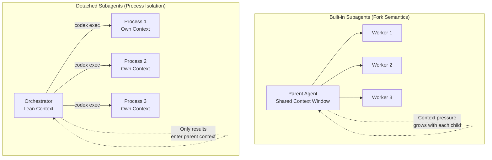

# Detached Subagent Patterns for Codex CLI: Context-Free Orchestration Beyond Built-in Fork Semantics


---

Codex CLI's built-in subagent system uses fork semantics: child agents inherit the parent's context window, sandbox policy, and runtime overrides [^1]. This works well for parallel exploration tasks where shared context is an advantage. It falls apart when the parent agent needs to remain lean — when spawning children erodes the orchestrator's own reasoning capacity, or when child tasks are long-running enough to outlive the parent session.

A growing set of community tools solves this by running subagents as **detached processes**, each with its own context window, invoked via `codex exec` under the hood. This article examines the three most mature approaches, compares them with the built-in system, and offers a decision framework for choosing between them.

## The Context Pressure Problem

Built-in subagents share the parent's context through fork semantics [^1]. When you ask Codex to "spawn a reviewer and a security auditor in parallel," the parent agent manages the orchestration — spawning threads, routing follow-ups, waiting for results, and consolidating responses. The parent's context window absorbs the coordination overhead.

For two or three lightweight subagents, this is fine. For five specialist agents each producing multi-page analysis, the parent's context fills rapidly. Context compaction kicks in, summaries lose nuance, and the orchestrator's ability to synthesise results degrades.



The detached pattern inverts the trade-off: each child runs in its own process with a fresh context window, and only the final results flow back to the orchestrator. The parent stays lean at the cost of losing shared state between children.

## Three Community Approaches

### obra/external-subagents: Manifest-Driven CLI

Jesse Vincent's `external-subagents` is the most feature-complete detached orchestrator [^2]. It is a TypeScript CLI that spawns independent Codex sessions via `codex exec --json`, tracking each by session ID in a `.codex-subagent` directory.

**Key commands:**

| Command | Purpose |
|---------|---------|
| `start` | Launch a new thread with role and policy |
| `send` | Resume a thread with follow-up prompts |
| `peek` / `watch` | Monitor thread progress without blocking |
| `wait` | Block until one or more threads complete |
| `list` | Display active threads with diagnostics |
| `archive` | Store finished thread logs |

**Manifest batching** is the standout feature. Define an entire multi-agent workflow in a single JSON file:

```json
{
  "threads": [
    {
      "label": "security-audit",
      "role": "security-reviewer",
      "prompt": "Audit src/ for injection vulnerabilities",
      "policy": "read-only"
    },
    {
      "label": "test-coverage",
      "role": "test-engineer",
      "prompt": "Identify untested critical paths in src/auth/",
      "policy": "read-only"
    },
    {
      "label": "perf-review",
      "role": "performance-analyst",
      "prompt": "Profile database query patterns in src/db/",
      "policy": "read-only"
    }
  ]
}
```

Launch all three with `subagents start --manifest review-tasks.json`. Each thread runs in its own process, returns asynchronously, and the orchestrator polls with `subagents status` or blocks with `subagents wait --all`.

**Controller isolation** prevents cross-session interference — threads are tagged with the spawning session's ID, and another controller cannot access them [^2].

### codex-subagents-mcp: Single-Tool MCP Server

Leonard Sellem's `codex-subagents-mcp` (now succeeded by `codex-specialized-subagents`) takes a different architectural stance [^3]. Rather than a CLI wrapper, it exposes a single MCP tool — `delegate` — that the parent agent calls like any other tool:

```
subagents.delegate(agent="review", task="Summarise and review the last commit")
```

Each delegation:

1. Creates a temporary working directory with a persona-specific `AGENTS.md`
2. Optionally mirrors the repository via `git worktree` for full isolation
3. Executes `codex exec --profile <agent-profile>` with isolated context
4. Returns results as structured JSON

**Agent definitions live as files** — markdown or JSON in a registry directory, version-controlled alongside the codebase. This makes agent personas reviewable in pull requests:

```markdown
---
name: security-reviewer
profile: security
description: Reviews code for OWASP Top 10 vulnerabilities
---

You are a security-focused code reviewer. Focus on:
- SQL injection, XSS, CSRF patterns
- Authentication and authorisation flaws
- Secrets in source code
- Dependency vulnerabilities
```

The single-tool surface area is a deliberate security choice — one MCP tool to audit rather than a full command vocabulary [^3]. Profile binding maps each agent to a Codex execution profile defined in `config.toml`, inheriting model selection, sandbox mode, and approval policy.

### betterup/codex-cli-subagents: Minimal Python Proof-of-Concept

BetterUp's implementation is the simplest of the three [^4]. A Python executor spawns isolated Codex subprocesses, each with a dedicated home directory under `tmp/codex-home/`. Agent definitions use YAML frontmatter in markdown files.

The project is intentionally minimal — two demo agents (word-counter, file-writer), CLI wrappers for invocation, and workspace-write sandboxing with no network access. It serves better as a reference implementation than a production tool, but it demonstrates that the detached pattern requires surprisingly little code: the core executor is under 200 lines of Python.

## Comparison Matrix

| Aspect | Built-in Subagents | obra/external-subagents | codex-subagents-mcp | betterup |
|--------|-------------------|------------------------|--------------------|---------|
| Context model | Shared (fork) | Fully isolated | Fully isolated | Fully isolated |
| Interface | Native TUI | CLI commands | MCP tool (`delegate`) | Python CLI |
| Batching | Implicit parallelism | JSON manifest | Per-call | Per-call |
| Monitoring | TUI thread display | `peek` / `watch` / `status` | MCP response | File output |
| Persona system | Custom TOML agents | Persona mapping | File-based registry | YAML frontmatter |
| Session persistence | Inherited from parent | `.codex-subagent/` directory | Temp workdir (ephemeral) | `tmp/codex-home/` |
| Nesting depth | Configurable (`max_depth`) | Unlimited (but manual) | Single level | Single level |
| Maturity | Production (official) | Active development (71 commits) | Archived (successor exists) | Proof-of-concept |

## When to Use Each Pattern

**Use built-in subagents when:**

- Tasks are short-lived and benefit from shared context (parallel code exploration, multi-file analysis)
- You need the orchestrator to synthesise results intelligently — it can see all child context
- The total context budget across all children stays within comfortable limits
- You want zero additional tooling — it works out of the box with `max_threads` in `config.toml` [^1]

**Use detached subagents when:**

- The parent agent must remain lean for long-horizon orchestration (project management, multi-phase migrations)
- Child tasks are long-running or may outlive the parent session
- You need more than six concurrent specialist agents (the built-in default `max_threads` cap)
- Child tasks require different sandbox policies, models, or MCP server configurations than the parent
- Audit requirements demand isolated session logs per agent role

**Use obra/external-subagents specifically when:**

- You want manifest-driven batch orchestration — define the entire workflow in one JSON file
- You need resumable threads (`send` to continue a paused child)
- Multiple orchestrators must coordinate without interference (controller isolation)

**Use codex-subagents-mcp specifically when:**

- The parent agent should invoke children as MCP tools rather than shell commands
- Agent personas must be version-controlled and PR-reviewable
- You prefer a minimal attack surface (single `delegate` tool)

## Practical Pattern: Hybrid Orchestration

The most effective production pattern combines both approaches. Use built-in subagents for fast, context-sharing tasks and detach long-running specialists:

```toml
# config.toml — hybrid setup
[agents]
max_threads = 4  # Built-in subagents for quick tasks

[mcp_servers.specialist-agents]
command = "codex-specialized-subagents"
args = ["serve"]
# Long-running specialists invoked via MCP
```

In the parent's `AGENTS.md`:

```markdown
## Agent delegation policy

For tasks under 2 minutes (code search, quick review, test runs):
use built-in subagents via /subagent.

For tasks over 2 minutes (security audits, migration analysis,
full test suites): delegate via the specialist-agents MCP server.

Never spawn more than 3 built-in subagents simultaneously to
preserve orchestrator context budget.
```

This gives the orchestrator a natural decision boundary: lightweight work stays in-process for shared context benefits, whilst heavyweight work gets isolated to protect the parent's reasoning capacity.

## Limitations and Trade-Offs

Detached subagents sacrifice three things that built-in subagents provide for free:

1. **Shared state**: Children cannot see each other's progress. If agent B needs agent A's output, the orchestrator must explicitly ferry results — adding latency and context consumption.

2. **Intelligent consolidation**: Built-in subagents let the parent synthesise results with full visibility into child reasoning. Detached children return only their final output; the reasoning trace stays in their isolated session logs.

3. **Configuration simplicity**: Built-in subagents inherit everything from the parent. Detached subagents require explicit configuration — profiles, sandbox policies, model selection — per child.

The community tools also carry the usual open-source maturity caveats. obra/external-subagents has 21 stars and no formal releases [^2]. codex-subagents-mcp is archived in favour of a successor [^3]. betterup's implementation is explicitly a demo [^4]. Teams adopting these patterns should expect to maintain their own forks or contribute upstream.

## What This Pattern Signals

The emergence of three independent implementations of the same architectural pattern — detached, process-isolated subagents — suggests a genuine gap in the built-in system. The official subagent documentation acknowledges the fork-semantics model but does not address context pressure from large agent fleets [^1].

If the v0.130–v0.132 trajectory is any guide — with the Python SDK gaining first-class authentication [^5] and `codex exec` gaining `resume --output-schema` [^5] — the non-interactive pipeline story is strengthening in ways that make detached orchestration increasingly viable without community wrappers. The building blocks are converging; the orchestration layer may follow.

For now, teams running five or more specialist agents in a single workflow should evaluate the detached pattern. The context savings are real, the community tools are functional if not polished, and the worst case is falling back to built-in subagents if the coordination overhead proves too high.

## Citations

[^1]: [Subagents — Codex CLI](https://developers.openai.com/codex/subagents), OpenAI Developers.
[^2]: [obra/external-subagents](https://github.com/obra/external-subagents), Jesse Vincent, GitHub.
[^3]: [codex-subagents-mcp](https://github.com/leonardsellem/codex-subagents-mcp), Leonard Sellem, GitHub.
[^4]: [codex-cli-subagents](https://github.com/betterup/codex-cli-subagents), BetterUp, GitHub.
[^5]: [Codex CLI Changelog — v0.132.0](https://developers.openai.com/codex/changelog), OpenAI Developers, 20 May 2026.
