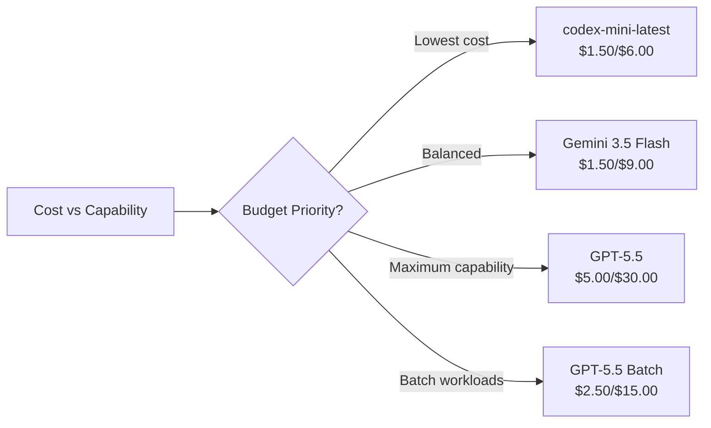
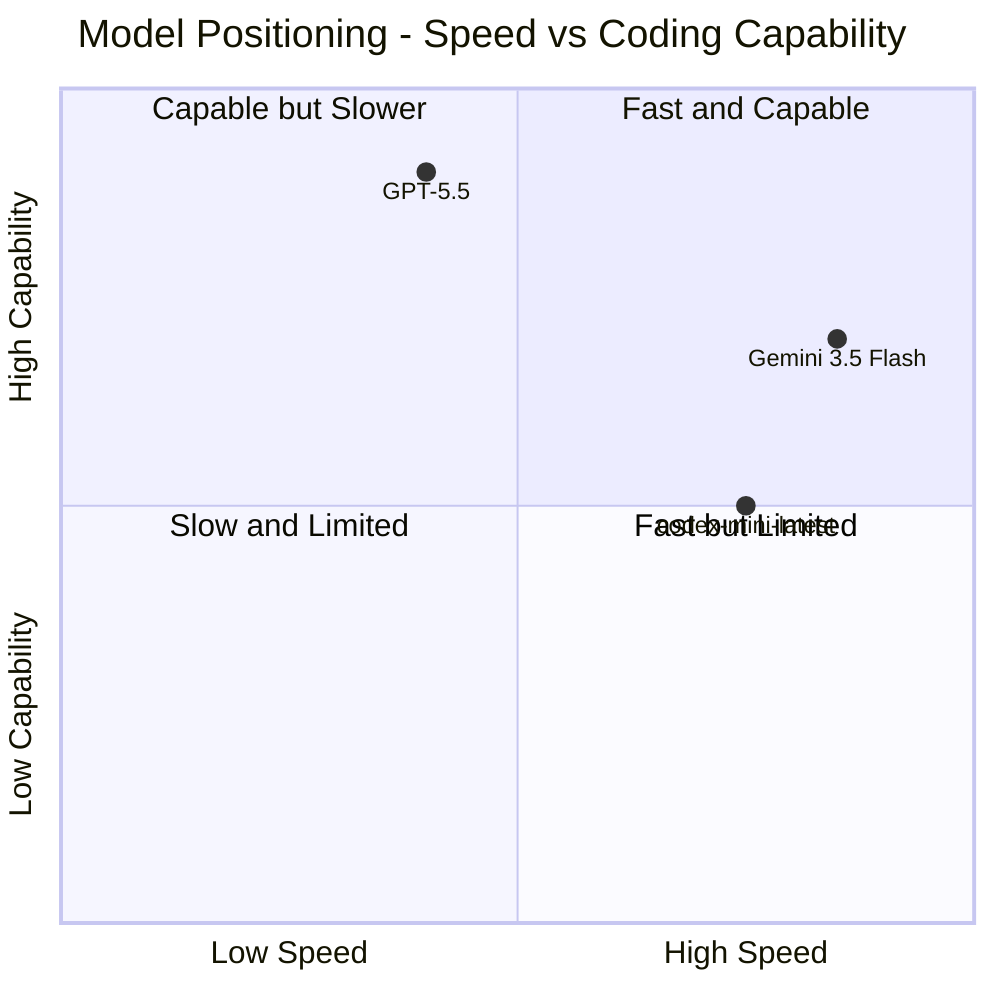

# Gemini 3.5 Flash vs GPT-5.5 and codex-mini: Coding Model Benchmark Comparison After Google I/O 2026


---

Google I/O 2026 dropped Gemini 3.5 Flash on 19 May with a bold claim: it beats Gemini 3.1 Pro on coding benchmarks whilst running four times faster than comparable frontier models [^1]. Meanwhile, GPT-5.5 has held the top spot on Terminal-Bench 2.0 and SWE-Bench Verified since its 23 April launch [^2]. And sitting quietly in the corner, `codex-mini-latest` — the fine-tuned o4-mini variant that ships as Codex CLI's default — continues to offer a fundamentally different trade-off: speed and cost over raw capability [^3].

This article lays out the numbers, compares the architectures, and offers practical guidance on which model to configure in your `config.toml` for different workflows.

## The Contenders

### Gemini 3.5 Flash

Google's latest Flash-tier model, generally available from 19 May 2026. Built for speed and agentic tasks, it inherits the Flash line's focus on low latency and cost efficiency whilst pushing into territory previously reserved for Pro-tier models [^1].

- **Context window:** 1,048,576 tokens input / 65,536 tokens output [^4]
- **Speed:** ~4x faster output tokens per second than comparable frontier models [^1]
- **Pricing:** \$1.50 / \$9.00 per 1M input/output tokens; cached input at \$0.15 [^4]

### GPT-5.5

OpenAI's current flagship, launched 23 April 2026. A general-purpose frontier model that doubled pricing over GPT-5.4 but delivered measurable gains across coding, reasoning, and reduced hallucinations [^2].

- **Context window:** 1,000,000 tokens (922K input / 128K output) [^5]
- **Speed:** Not publicly benchmarked in tokens/second by OpenAI
- **Pricing:** \$5.00 / \$30.00 per 1M input/output tokens; cached input at \$0.50 [^6]

### codex-mini-latest

A fine-tuned variant of o4-mini, optimised for low-latency code Q&A and editing within Codex CLI. Not a frontier model — a purpose-built tool [^3].

- **Context window:** 200K tokens [^3]
- **Speed:** Optimised for interactive terminal responsiveness
- **Pricing:** \$1.50 / \$6.00 per 1M input/output tokens; cached input at \$0.375 [^3]

## Head-to-Head Benchmarks

### Terminal-Bench 2.0

Terminal-Bench 2.0 evaluates 89 real-world terminal tasks including compiling code, training models, server administration, and security workflows [^7]. It is the closest proxy we have for how models perform inside agentic coding tools like Codex CLI.

| Model | Terminal-Bench 2.0 Score |
|-------|------------------------|
| GPT-5.5 | **82.7%** [^2] |
| Gemini 3.5 Flash | 76.2% (Terminal-Bench 2.1) [^4] |
| GPT-5.3-Codex | 77.3% [^7] |
| Claude Opus 4.7 | 82.0% [^7] |

GPT-5.5 leads by 6.5 points over Gemini 3.5 Flash. Note the version discrepancy: Google reports against Terminal-Bench 2.1, whilst OpenAI reports against 2.0. The benchmarks share a common task core but 2.1 adds additional agentic evaluation scenarios [^7].

⚠️ Direct comparison between Terminal-Bench 2.0 and 2.1 scores should be treated with caution — the task sets are not identical.

### SWE-Bench

SWE-Bench tests models on real GitHub issues, requiring them to write patches that pass existing test suites [^8].

| Model | SWE-Bench Verified | SWE-Bench Pro |
|-------|--------------------|---------------|
| GPT-5.5 | **88.7%** [^2] | 58.6% [^2] |
| Gemini 3.5 Flash | — | 55.1% [^4] |
| GPT-5.3-Codex | 85.0% [^8] | **56.8%** [^9] |
| Gemini 3.1 Pro | 80.6% [^8] | 54.2% [^4] |

GPT-5.5 dominates SWE-Bench Verified. On SWE-Bench Pro — a harder variant that better reflects production complexity — the gap narrows considerably. GPT-5.3-Codex's specialised fine-tuning gives it an edge on Pro despite lower Verified scores, demonstrating that agentic fine-tuning matters more than raw model capability for complex multi-step tasks [^9].

⚠️ Google has not published a Gemini 3.5 Flash score for SWE-Bench Verified. The absence likely reflects the Flash tier's positioning as a speed-first model rather than a frontier reasoning model.

### Agentic and Tool-Use Benchmarks

Gemini 3.5 Flash shines on agentic benchmarks that test tool coordination and multi-step planning [^4]:

| Benchmark | Gemini 3.5 Flash | Gemini 3.1 Pro | Delta |
|-----------|-------------------|----------------|-------|
| MCP Atlas | **83.6%** | 78.2% | +5.4 |
| Finance Agent v2 | **57.9%** | 43.0% | +14.9 |
| GDPval-AA | **1,656 Elo** | 1,314 Elo | +342 |

These scores are not directly comparable to GPT-5.5 as OpenAI does not report against these specific benchmarks. However, MCP Atlas evaluates MCP server integration — a capability directly relevant to Codex CLI's plugin ecosystem [^4].

## The Speed Factor

Google's "4x faster" claim for Gemini 3.5 Flash refers to output tokens per second compared to comparable frontier models [^1]. In practical terms, this means:

- **Interactive coding sessions:** Gemini 3.5 Flash returns completions noticeably faster, reducing the wait-think-wait cycle
- **Batch processing:** Higher throughput translates directly to lower wall-clock time for `codex exec` style batch runs
- **Cost efficiency:** Faster completion means fewer compute-seconds billed on time-based pricing tiers

For Codex CLI users, `codex-mini-latest` already optimises for interactive latency within its capability envelope. The speed comparison that matters is Gemini 3.5 Flash vs GPT-5.5 for users who need frontier-level capability with faster turnaround.

## Pricing Comparison

Cost per million tokens tells one story. Cost per task tells another.

| Model | Input ($/1M) | Output ($/1M) | Cached Input ($/1M) |
|-------|-------------|---------------|---------------------|
| codex-mini-latest | **\$1.50** | **\$6.00** | \$0.375 |
| Gemini 3.5 Flash | **\$1.50** | \$9.00 | **\$0.15** |
| GPT-5.5 | \$5.00 | \$30.00 | \$0.50 |
| GPT-5.5 (Batch) | \$2.50 | \$15.00 | \$0.25 |



GPT-5.5 costs 3.3x more per output token than `codex-mini-latest` and 3.3x more than Gemini 3.5 Flash [^6]. The question is whether the 6–8 percentage point benchmark advantage justifies that premium for your specific workloads.

OpenAI notes that GPT-5.5 generates 19–34% fewer completion tokens for longer prompts compared to GPT-5.4, partially offsetting the per-token price increase [^6].

## Context Windows Compared

All three models now offer million-token-class context, but the details differ:

| Model | Max Input | Max Output | Codex CLI Limit |
|-------|-----------|------------|-----------------|
| Gemini 3.5 Flash | 1,048,576 | 65,536 | N/A (not natively supported) |
| GPT-5.5 | 922,000 | 128,000 | 400,000 [^5] |
| codex-mini-latest | 200,000 | — | 200,000 [^3] |

GPT-5.5's 128K output limit is double Gemini 3.5 Flash's 64K, making it better suited for large-scale code generation tasks. However, Codex CLI currently caps GPT-5.5 at 400K tokens — less than half the API limit [^5].

## Model Selection for Codex CLI Users

### When to use codex-mini-latest (default)

- Interactive coding sessions where latency matters more than depth
- Code Q&A, small refactors, and file edits
- Cost-sensitive workflows running many short tasks
- When you want the model that Codex CLI is specifically tuned around

### When to switch to GPT-5.5

Configure in your project or user `config.toml`:

```toml
[model]
name = "gpt-5.5"
```

Use GPT-5.5 when you need:

- Complex multi-file refactoring requiring deep reasoning
- Bug triage across large codebases (leverage the larger context window)
- Tasks where Terminal-Bench/SWE-Bench scores predict real-world success
- Maximum accuracy on unfamiliar frameworks or languages

### When Gemini 3.5 Flash is worth considering

Gemini 3.5 Flash is not natively available in Codex CLI's model picker. However, it is accessible through third-party integrations and the Gemini API directly. Consider it when:

- You are using Google's Antigravity or building custom agentic pipelines
- Speed is the primary constraint and 76% Terminal-Bench is sufficient
- You need strong MCP tool-use capability (83.6% on MCP Atlas) [^4]
- Budget is constrained and GPT-5.5's premium is not justified

## The Honest Assessment



**GPT-5.5 wins on raw coding benchmarks** — 82.7% vs 76.2% on Terminal-Bench, 88.7% vs unreported on SWE-Bench Verified. If you are solving hard problems and cost is secondary, it is the best model available today [^2].

**Gemini 3.5 Flash wins on speed and value** — 4x faster output, 40% cheaper than Gemini 3.1 Pro, and competitive agentic benchmark scores. For teams building high-throughput pipelines, the speed advantage compounds [^1].

**codex-mini-latest wins on integration** — it is the model Codex CLI is built and tested against. The fine-tuning for instruction following and code style within the CLI's specific interaction patterns means benchmark scores understate its practical effectiveness in that context [^3].

Google's "beats Pro on coding" claim is accurate but narrowly scoped: Gemini 3.5 Flash beats *Gemini 3.1 Pro*, not GPT-5.5. The marketing invites a comparison Google carefully avoids making explicitly [^1].

## What to Watch

- **Gemini 3.5 Pro** is expected later in 2026. If Flash already matches 3.1 Pro, the Pro tier could close the gap with GPT-5.5 significantly
- **SWE-Bench Pro** is replacing SWE-Bench Verified as the primary evaluation standard, which may reshuffle rankings [^8]
- **codex-mini** updates — OpenAI has been iterating the Codex model family (GPT-5.1-Codex-Mini, GPT-5.3-Codex), and the `latest` alias may point to a newer checkpoint at any time [^9]
- **Terminal-Bench 2.1 adoption** — as more models report against 2.1, cross-model comparisons will become more reliable

## Citations

[^1]: Google Blog, "Gemini 3.5: frontier intelligence with action", Koray Kavukcuoglu, 19 May 2026. [https://blog.google/innovation-and-ai/models-and-research/gemini-models/gemini-3-5/](https://blog.google/innovation-and-ai/models-and-research/gemini-models/gemini-3-5/)

[^2]: OpenAI, "Introducing GPT-5.5", 23 April 2026. [https://openai.com/index/introducing-gpt-5-5/](https://openai.com/index/introducing-gpt-5-5/)

[^3]: OpenAI Developer Docs, "codex-mini-latest Model". [https://platform.openai.com/docs/models/codex-mini-latest](https://platform.openai.com/docs/models/codex-mini-latest)

[^4]: LLM Stats, "Gemini 3.5 Flash: Benchmarks, Pricing, and Complete Specs", May 2026. [https://llm-stats.com/blog/research/gemini-3.5-flash-launch](https://llm-stats.com/blog/research/gemini-3.5-flash-launch)

[^5]: Framia.pro, "GPT-5.5 Context Window: 1M Tokens — What It Means for You", April 2026. [https://framia.pro/page/en-US/news/gpt-5-5-context-window-1m-tokens](https://framia.pro/page/en-US/news/gpt-5-5-context-window-1m-tokens)

[^6]: Apidog, "GPT-5.5 Pricing: Full Breakdown of API, Codex, and ChatGPT Costs", April 2026. [https://apidog.com/blog/gpt-5-5-pricing/](https://apidog.com/blog/gpt-5-5-pricing/)

[^7]: Terminal-Bench, "Terminal-Bench 2.0 Leaderboard", May 2026. [https://www.tbench.ai/leaderboard/terminal-bench/2.0](https://www.tbench.ai/leaderboard/terminal-bench/2.0)

[^8]: SWE-Bench Leaderboard, May 2026. [https://www.marc0.dev/en/leaderboard](https://www.marc0.dev/en/leaderboard)

[^9]: MorphLLM, "Best AI for Coding (2026): Every Model Ranked by Real Benchmarks". [https://www.morphllm.com/best-ai-model-for-coding](https://www.morphllm.com/best-ai-model-for-coding)
