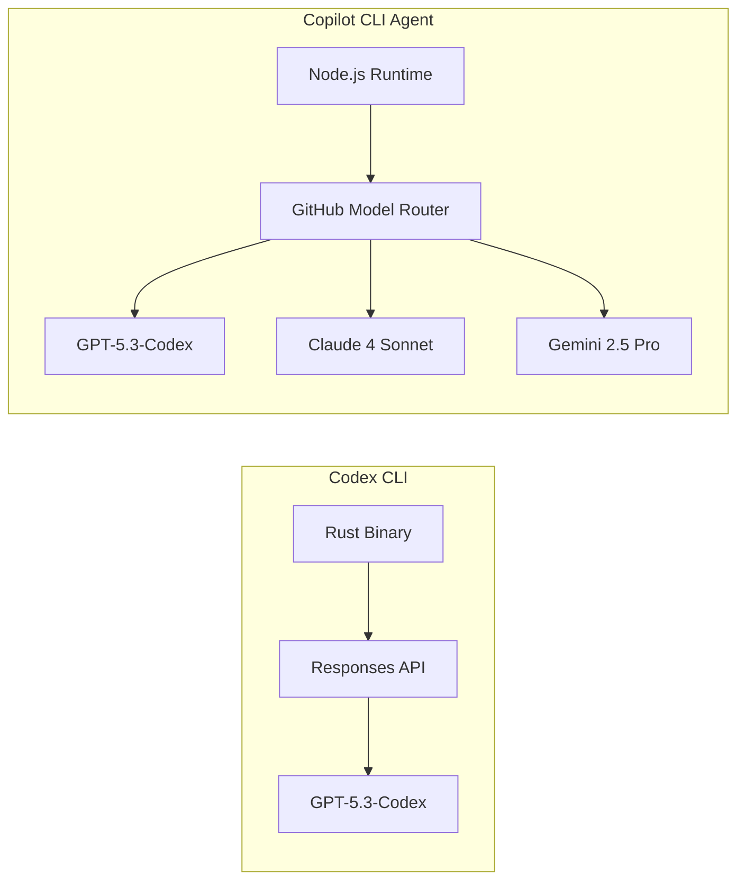

# GitHub Copilot CLI Agent vs Codex CLI: Same Model, Different Harness — Two Terminal Agents Compared


---

On 17 May 2026, GitHub quietly switched the default model for Copilot Business and Enterprise users to GPT-5.3-Codex — the same model that powers OpenAI's Codex CLI[^1]. Two competing terminal coding agents now share identical reasoning capabilities. The differentiator is no longer the model; it is the harness around it. This article compares the two tools across architecture, sandboxing, automation, extensibility, and cost — so you can decide which fits your workflow.

## Architecture: Rust Native vs Node.js Wrapper

Codex CLI is a Rust binary, open-sourced at `github.com/openai/codex` in February 2026[^2]. It compiles to a single executable with no runtime dependencies. The TUI, sandbox enforcement, and agent loop all live in one process, communicating with OpenAI's Responses API over HTTPS.

GitHub Copilot CLI Agent is an npm package (`@github/copilot`), GA since February 2026 and substantially updated throughout May[^3]. It runs on Node.js, ships as part of the broader Copilot platform, and connects to GitHub's model-routing infrastructure — which now proxies requests to OpenAI, Anthropic, and Google models depending on plan tier and user selection[^4].



The practical difference: Codex CLI is single-provider by design. You get OpenAI models, full stop. Copilot CLI offers multi-model selection — useful when you want Claude for prose-heavy tasks or Gemini for context-window-intensive analysis, but it introduces routing complexity and occasional latency variance between providers[^4].

## Sandboxing: OS-Level vs Worktree Isolation

Codex CLI enforces sandboxing at the operating system level. On macOS it uses Seatbelt profiles, on Linux it combines Bubblewrap with Landlock LSM, and on Windows it applies DACL restrictions[^2][^5]. The sandbox is mandatory in `read-only` mode by default; you explicitly opt into `workspace-write` when the agent needs to modify files.

Copilot CLI takes a different approach: worktree and workspace isolation. It creates Git worktrees for agent operations, limiting blast radius through repository boundaries rather than syscall filtering[^3]. This is simpler to reason about but weaker in adversarial scenarios — a compromised agent process retains full OS-level access within the worktree.

| Property | Codex CLI | Copilot CLI Agent |
|----------|-----------|-------------------|
| Isolation layer | OS kernel (Seatbelt, Landlock, DACL) | Git worktree boundaries |
| Default mode | Read-only sandbox | Workspace-scoped |
| Network restriction | Configurable allow-list | Not restricted by default |
| Escape complexity | Requires kernel exploit | Requires escaping worktree path |

For enterprise environments with strict security postures, Codex CLI's kernel-level sandboxing is the stronger guarantee. For teams that trust their CI runners and want simpler setup, Copilot's worktree model is adequate.

## Automation Surfaces

This is where the tools diverge most sharply. Codex CLI now exposes five distinct automation surfaces as of v0.132[^6]:

1. **`codex exec`** — one-shot CLI primitive with `--output-schema` for structured JSON output
2. **`codex exec resume`** — multi-stage pipelines preserving full session context
3. **Python SDK (`openai-codex`)** — programmatic multi-turn threads with native authentication
4. **TypeScript SDK (`@openai/codex-sdk`)** — Node.js equivalent
5. **MCP Server** — inter-agent delegation via Model Context Protocol

Copilot CLI's automation story centres on GitHub Actions integration, which is deeply native — Copilot agents can be triggered from PR events, issue comments, and scheduled workflows without additional configuration[^3][^7]. Its `/fleet` command spawns parallel subagents for concurrent task execution, and `/delegate` hands off PR-specific workflows to specialised agents[^3].

```mermaid
flowchart TD
    subgraph Codex Automation
        CE[codex exec] --> SO[Structured Output]
        CR[codex exec resume] --> MP[Multi-stage Pipelines]
        PS[Python SDK] --> MT[Multi-turn Threads]
        MS[MCP Server] --> IA[Inter-agent Delegation]
    end

    subgraph Copilot Automation
        GA[GitHub Actions] --> PR[PR Event Triggers]
        FL[/fleet] --> PA[Parallel Subagents]
        DL[/delegate] --> PW[PR Workflows]
        RM[/remote] --> CL[Cloud Execution]
    end
```

The key trade-off: Codex CLI is a **general-purpose automation primitive** — it composes with Unix pipes, cron, and any CI system. Copilot CLI is a **GitHub-native automation agent** — it excels when your entire workflow lives within the GitHub ecosystem.

## Extensibility: MCP and Plugins

Both tools support the Model Context Protocol, but with different emphasis. Codex CLI treats MCP as a first-class extension mechanism: `codex mcp add` registers external tool servers, and any MCP-compliant server becomes available to the agent loop[^2][^8]. The May 2026 upgrades added 90+ shared plugins accessible across all Codex surfaces[^9].

Copilot CLI ships with a built-in GitHub MCP server that exposes repository search, issue management, PR operations, and code navigation without additional configuration[^3]. Third-party MCP servers can be added, but the primary extension model is GitHub's own plugin marketplace — enterprise-managed, with admin-controlled allow-lists[^7].

For teams building custom tooling, Codex CLI's open MCP ecosystem offers more flexibility. For teams that want curated, governance-ready extensions, Copilot's managed marketplace is more practical.

## Interactive Features

Both tools have invested heavily in their TUI experiences during May 2026. A side-by-side comparison of notable interactive commands:

| Capability | Codex CLI | Copilot CLI Agent |
|-----------|-----------|-------------------|
| Plan-then-execute | `/plan` + `Shift+Tab` | `/plan` |
| Parallel agents | Subagent delegation | `/fleet` (parallel subagents) |
| Context compaction | `/compact` | `/memory compact` |
| Code critique | `/review` | `/rubber-duck` |
| Model switching | `/model gpt-5.5` | `/model claude-4-sonnet` |
| Vim mode | `/vim` (v0.131+) | Not available |
| Diagnostics | `codex doctor` | `copilot doctor` |

Copilot's `/rubber-duck` command — which critiques your approach without writing code — is a standout feature for design-phase thinking[^3]. Codex CLI's `/review` serves a similar but narrower purpose, focusing on code already written rather than approaches being considered.

## Cost Model

Codex CLI bills per token through the OpenAI API. You pay for exactly what you use, with prompt caching reducing costs by up to 80% on resumed sessions[^10]. There is no subscription required — an API key is sufficient.

Copilot CLI is included in all GitHub Copilot plans (Individual, Business, Enterprise). As of 1 June 2026, GitHub transitions to usage-based billing with included allowances per plan tier[^7]. Business users receive a monthly premium-request allocation; overage is billed per request. The included allowance makes light usage effectively free, but heavy automation workloads can exceed allocations quickly.

| Dimension | Codex CLI | Copilot CLI Agent |
|-----------|-----------|-------------------|
| Billing model | Per-token (OpenAI API) | Usage-based with plan allowance |
| Entry cost | API key only | Copilot subscription required |
| Heavy automation | Predictable per-token cost | May exceed included allowance |
| Prompt caching | Up to 80% input cost reduction | Not user-visible |

## When to Choose Which

**Choose Codex CLI when:**
- You need OS-level sandboxing for security-sensitive environments
- Your automation spans multiple CI systems beyond GitHub
- You want open-source transparency and the ability to audit the agent loop
- You build custom tooling via MCP servers and need maximum extensibility
- Your team already operates on the OpenAI API

**Choose Copilot CLI Agent when:**
- Your workflow is GitHub-native (PRs, Issues, Actions)
- You want multi-model selection (Claude, Gemini, GPT) in one tool
- Your organisation already pays for Copilot Business or Enterprise
- You value `/fleet` parallel subagents for large-scale concurrent tasks
- Enterprise plugin governance matters more than open extensibility

## The Convergence Trajectory

The most interesting development is not the competition — it is the convergence. Both tools now run GPT-5.3-Codex as their primary model. Both support MCP. Both offer plan-then-execute workflows, context compaction, and diagnostics commands. OpenAI's merger of ChatGPT and Codex into a unified agentic platform[^11] and GitHub's expansion of Copilot beyond code completion suggest these tools are converging on the same destination from different starting points.

The question for 2026 is not which tool wins, but whether the terminal agent category consolidates around a shared protocol layer — MCP being the leading candidate — that makes the harness interchangeable and the model the only variable that matters.

For now, both tools deserve a place in a senior developer's evaluation. The model is the same. The harness is the choice.

## Citations

[^1]: [GitHub Copilot model updates — GPT-5.3-Codex default for Business and Enterprise](https://github.blog/changelog/) — GitHub Blog Changelog, 17 May 2026
[^2]: [openai/codex — GitHub](https://github.com/openai/codex) — OpenAI Codex CLI open-source repository
[^3]: [GitHub Copilot CLI Agent — Features and Documentation](https://docs.github.com/en/copilot/using-github-copilot/using-github-copilot-in-the-command-line) — GitHub Documentation, May 2026
[^4]: [GitHub Copilot multi-model support announcement](https://github.blog/changelog/2026-05-copilot-multi-model/) — GitHub Blog, May 2026
[^5]: [Sandboxing — Codex | OpenAI Developers](https://developers.openai.com/codex/concepts/sandboxing) — OpenAI Developer Documentation
[^6]: [Changelog — Codex v0.132.0](https://developers.openai.com/codex/changelog) — OpenAI Developer Documentation, 20 May 2026
[^7]: [GitHub Copilot pricing and billing changes](https://docs.github.com/en/copilot/about-github-copilot/plans-for-github-copilot) — GitHub Documentation, May 2026
[^8]: [MCP Configuration — Codex](https://developers.openai.com/codex/guides/mcp) — OpenAI Developer Documentation
[^9]: [Introducing upgrades to Codex](https://openai.com/index/introducing-upgrades-to-codex/) — OpenAI Blog, May 2026
[^10]: [Non-interactive mode — Codex](https://developers.openai.com/codex/noninteractive) — OpenAI Developer Documentation
[^11]: [OpenAI Merges ChatGPT And Codex, Taps Greg Brockman To Lead Product Strategy](https://www.benzinga.com/markets/tech/26/05/52622210/openai-merges-chatgpt-and-codex-taps-greg-brockman-to-lead-product-strategy-ahead-of-potential-ipo-report) — Benzinga, May 2026
