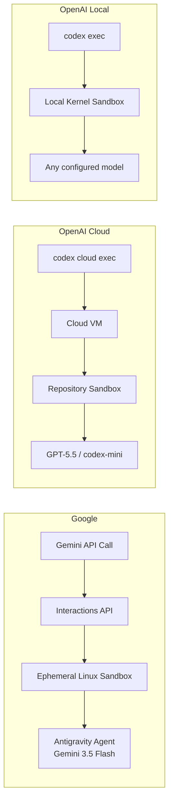
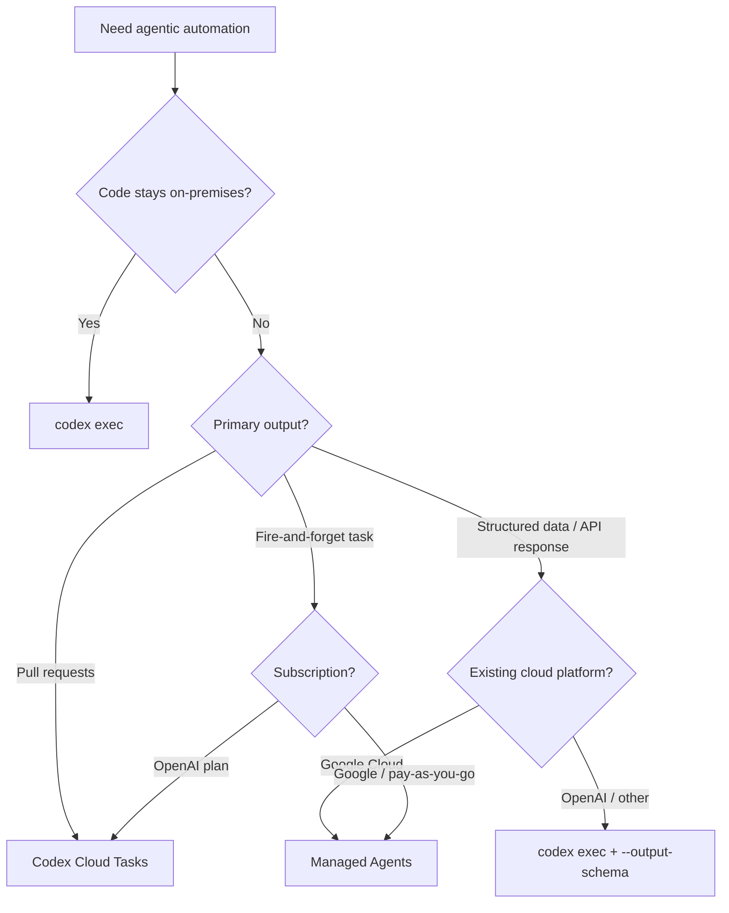

# Managed Agents in the Gemini API vs Codex Cloud Tasks: Agent-as-a-Service Showdown


---

At Google I/O 2026, Ali Çevik introduced Managed Agents in the Gemini API — a single API call that provisions an ephemeral Linux sandbox, drops in an agent powered by Gemini 3.5 Flash, and lets it reason, execute code, manage files, and browse the web autonomously [^1]. It is the most direct competitive response yet to OpenAI's Codex Cloud tasks and the local `codex exec` command, both of which let developers fire off agentic coding work without an interactive session.

This article compares the three surfaces head-to-head: Google's Managed Agents, Codex Cloud tasks, and `codex exec`. If your team is building agentic automation into CI/CD pipelines, internal tooling, or batch workflows, this is the decision framework you need.

## Architecture at a Glance



### Google Managed Agents

A Managed Agent is an ephemeral, sandboxed execution unit provisioned via the Interactions API [^2]. Each call creates an isolated Ubuntu-based environment with Python 3.12 and Node.js 22 pre-installed [^3]. The agent has three default tools — `code_execution`, `google_search`, and `url_context` — with filesystem operations activated automatically when an environment is specified [^4]. Environments persist for seven days of inactivity, allowing multi-turn sessions by passing back the environment ID [^4].

The basic invocation is remarkably terse:

```python
interaction = client.interactions.create(
    agent="antigravity-preview-05-2026",
    input="Refactor the auth module to use JWT",
    environment="remote",
)
```

Custom agents are defined through `AGENTS.md` (instructions) and `SKILL.md` files (capabilities) mounted under `.agents/skills/` in the sandbox, or passed inline at interaction time [^5]. This filesystem-native configuration approach mirrors Codex CLI's own `AGENTS.md` convention, though the two implementations are not interchangeable.

### Codex Cloud Tasks

Codex Cloud takes a repository-centric approach [^6]. You connect a GitHub account at `chatgpt.com/codex`, configure cloud environments with repository selection, setup steps, and tool choices, then submit tasks that run in background VMs pre-loaded with your codebase. Output is typically a pull request or a diff applied via the IDE extension.

From the terminal:

```bash
codex cloud exec --env ENV_ID "Summarise open bugs and propose fixes"
```

Tasks support `--attempts 1-4` for best-of-N runs, and the `codex cloud list` subcommand returns recent tasks for scripting [^7]. Internet access is configurable per environment, and `@codex` mentions on GitHub issues and PRs can trigger tasks directly [^6].

### codex exec (Local)

The local `codex exec` (alias `codex e`) runs non-interactively in a kernel-level sandbox on your own machine [^8]. It is the lightest-weight option — no cloud provisioning, no network round-trip for the sandbox itself.

```bash
codex exec \
  --sandbox workspace-write \
  --model gpt-5.5 \
  --output-schema schema.json \
  "Generate the API client from openapi.yaml"
```

Key flags include `--output-schema` for structured JSON output validated against a schema, `--json` for newline-delimited event streaming, and `--output-last-message` for capturing the final response [^8]. The `--sandbox` flag offers three levels: `read-only`, `workspace-write`, and `danger-full-access`.

## Comparison Matrix

| Dimension | Google Managed Agents | Codex Cloud Tasks | codex exec (Local) |
|---|---|---|---|
| **Execution** | Ephemeral cloud sandbox | Persistent cloud VM | Local kernel sandbox |
| **Model** | Gemini 3.5 Flash [^1] | GPT-5.5 / codex-mini [^9] | Any configured model |
| **Invocation** | Single API call | CLI or GitHub mention | CLI command |
| **Output** | Interaction result + files | Pull request / diff | stdout / JSON / file |
| **Repo integration** | Mount sources at creation | Pre-loaded from GitHub | Local working directory |
| **Multi-turn** | Environment ID reuse [^4] | Task threads | `resume` subcommand [^8] |
| **Sandbox lifetime** | 7 days idle [^3] | Per-environment config | Session duration |
| **Structured output** | Not yet supported [^4] | Via PR structure | `--output-schema` [^8] |
| **MCP support** | Provisioned per sandbox [^10] | Via plugins | Via plugins [^11] |
| **Network** | Unrestricted (configurable allowlist) [^3] | Configurable per env [^6] | Host network |
| **Billing** | Token-based pay-as-you-go [^3] | Plan-inclusive [^6] | API token costs only |

## Sandbox Security Models

The security posture differs fundamentally.

**Google** uses OS-level isolation for each agent instance with an egress proxy for credential injection — credentials are never exposed inside the sandbox [^3]. Network access defaults to unrestricted outbound with optional domain allowlisting.

**Codex Cloud** runs each task in its own cloud VM with repository-scoped access. Enterprise workspaces require admin setup before access is granted [^6], giving organisations a governance gate.

**codex exec** relies on kernel-level sandboxing (seccomp-bpf on Linux, Seatbelt on macOS) with three configurable levels [^8]. The `--dangerously-bypass-approvals-and-sandbox` flag exists for isolated CI runners but should never appear outside ephemeral build environments.

For regulated industries, Codex CLI's local execution keeps code and credentials on-premises entirely — a compliance advantage that neither cloud-based alternative can match.

## When to Use Which

### Google Managed Agents

Best for **fire-and-forget tasks** where you want agent execution without managing infrastructure. The single API call model suits teams already invested in the Google Cloud ecosystem, particularly those using the Gemini Enterprise Agent Platform [^12]. The Interactions API integrates with LangChain, LlamaIndex, CrewAI, and Google ADK [^3], making it a natural fit for multi-framework agent orchestration.

However, Managed Agents are in preview with notable limitations: no structured output, no temperature control, no `file_search` or `computer_use` tools, and no audio/video input [^4]. MCP server support is provisioned per sandbox but the broader MCP ecosystem integration is still maturing [^10].

### Codex Cloud Tasks

Best for **repository-centric automation** — feature branches, bug fixes, PR generation. The GitHub-native integration (including `@codex` mentions) makes it the most natural choice for teams whose workflow revolves around pull requests [^6]. The `--attempts` flag for best-of-N is unique to Codex Cloud and valuable for non-deterministic tasks like test generation.

The trade-off is platform lock-in: you need a Plus, Pro, Business, Edu, or Enterprise plan [^6], and the execution environment is OpenAI's cloud, not yours.

### codex exec

Best for **CI/CD pipelines, structured queries, and air-gapped environments**. The `--output-schema` flag turns Codex into a structured data extraction tool [^8], and `--json` event streaming enables real-time progress monitoring in build systems. Local execution means zero data leaves your network.

The v0.131.0 release added `codex doctor` for diagnostics [^11], and the Python SDK (`openai-codex`) now supports concurrent turn routing and approval modes [^11], making programmatic integration increasingly robust.

## The Programmatic Layer: SDK Comparison

Both platforms offer SDKs for embedding agent execution in applications.

The **Gemini Interactions API** follows a request-response pattern with environment reuse for multi-turn flows [^2]. Framework adapters (LangChain, ADK) provide higher-level abstractions. Agent-to-Agent (A2A) protocol support is announced but not yet generally available [^12].

The **openai-codex Python SDK** uses JSON-RPC to communicate with the local app-server [^13]. It supports thread-based conversation management with `thread_start()` and sequential `thread.run()` calls, plus an `AsyncCodex` class for asynchronous workflows. This is lower-level than the Gemini approach but offers finer-grained control over the execution lifecycle.

```python
# OpenAI Codex Python SDK
from openai_codex import Codex

codex = Codex()
thread = codex.thread_start(model="gpt-5.5")
result = thread.run("Analyse the auth module for security issues")
print(result.final_response)
```

## Pricing Considerations

Google's Managed Agents use a **pay-as-you-go model** based on Gemini token consumption and tool usage, with typical interactions consuming 100k to 3M tokens [^3]. The Gemini Enterprise Agent Platform adds compute billing (vCPU-hours and GiB-hours) with a free tier of 50 vCPU-hours and 100 GiB-hours of RAM per month [^14]. During preview, sandbox compute is not charged.

Codex Cloud tasks are **included with OpenAI subscription plans** (Plus, Pro, Business, Edu, Enterprise) [^6], making them effectively unlimited within plan constraints. `codex exec` costs only the API tokens consumed by the chosen model.

For teams running hundreds of automated agent tasks per month, the pricing model difference is material: Google's per-invocation billing can spike with heavy use, whilst OpenAI's plan-inclusive model offers more predictable costs — provided you are already paying for a subscription.

## Decision Flowchart



## What Comes Next

Google's Managed Agents are in preview — expect `file_search`, `computer_use`, structured outputs, and full A2A governance to land in the coming months [^4] [^12]. OpenAI's v0.131.0 release signals continued investment in the local-first model with remote environment management now supporting daemon-managed `codex remote-control` and registry-backed environments [^11].

The convergence is clear: both platforms are building towards "agent-as-a-service" where developers define intent and the platform handles provisioning, execution, and output. The question is not whether to adopt agentic automation, but which execution model — ephemeral sandbox, persistent cloud VM, or local kernel sandbox — fits your team's security posture, workflow, and billing preferences.

## Citations

[^1]: Çevik, A. (2026, May 19). "Introducing Managed Agents in the Gemini API." Google Blog. [https://blog.google/innovation-and-ai/technology/developers-tools/managed-agents-gemini-api/](https://blog.google/innovation-and-ai/technology/developers-tools/managed-agents-gemini-api/)

[^2]: Google AI for Developers. "Agents Overview — Gemini API." [https://ai.google.dev/gemini-api/docs/agents](https://ai.google.dev/gemini-api/docs/agents)

[^3]: Google AI for Developers. "Agents Overview — Sandbox Environment and Pricing." [https://ai.google.dev/gemini-api/docs/agents](https://ai.google.dev/gemini-api/docs/agents)

[^4]: Google AI for Developers. "Antigravity Agent — Gemini API." [https://ai.google.dev/gemini-api/docs/antigravity-agent](https://ai.google.dev/gemini-api/docs/antigravity-agent)

[^5]: Google AI for Developers. "Set up your coding assistant with Gemini MCP and Skills." [https://ai.google.dev/gemini-api/docs/coding-agents](https://ai.google.dev/gemini-api/docs/coding-agents)

[^6]: OpenAI Developers. "Web — Codex (Cloud)." [https://developers.openai.com/codex/cloud](https://developers.openai.com/codex/cloud)

[^7]: OpenAI Developers. "Command line options — Codex CLI." [https://developers.openai.com/codex/cli/reference](https://developers.openai.com/codex/cli/reference)

[^8]: OpenAI Developers. "Command line options — codex exec." [https://developers.openai.com/codex/cli/reference](https://developers.openai.com/codex/cli/reference)

[^9]: OpenAI Developers. "Models — Codex." [https://developers.openai.com/codex/models](https://developers.openai.com/codex/models)

[^10]: "Google I/O '26 Fills Out Enterprise Agent Stack with Managed Agents, ADK 2.0." Virtualization Review, 19 May 2026. [https://virtualizationreview.com/articles/2026/05/19/google-io-26-fills-out-enterprise-agent-stack-with-managed-agents-adk-2,-d-,0.aspx](https://virtualizationreview.com/articles/2026/05/19/google-io-26-fills-out-enterprise-agent-stack-with-managed-agents-adk-2,-d-,0.aspx)

[^11]: OpenAI Developers. "Changelog — Codex v0.131.0." [https://developers.openai.com/codex/changelog](https://developers.openai.com/codex/changelog)

[^12]: Google Cloud. "Agent Platform overview — Gemini Enterprise Agent Platform." [https://docs.cloud.google.com/gemini-enterprise-agent-platform/overview](https://docs.cloud.google.com/gemini-enterprise-agent-platform/overview)

[^13]: OpenAI Developers. "SDK — Codex." [https://developers.openai.com/codex/sdk](https://developers.openai.com/codex/sdk)

[^14]: Google Cloud. "Gemini Enterprise Agent Platform pricing." [https://cloud.google.com/products/gemini-enterprise-agent-platform/pricing](https://cloud.google.com/products/gemini-enterprise-agent-platform/pricing)
