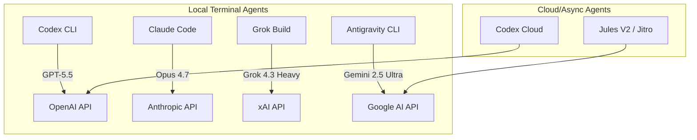
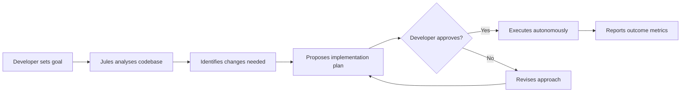
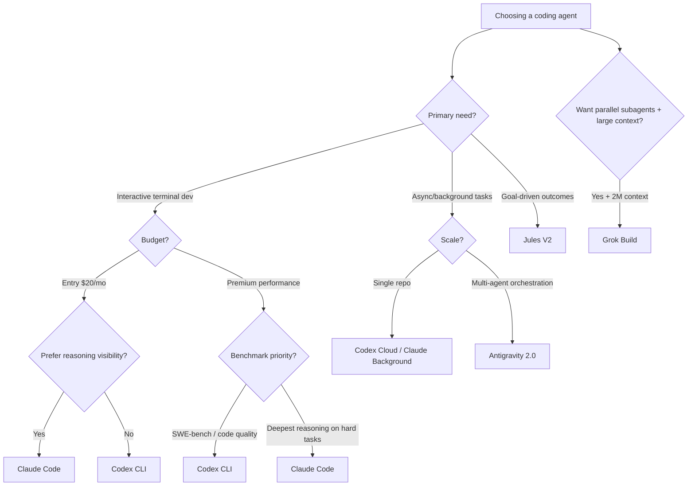

# The Post-Google I/O Coding Agent Landscape: Codex CLI vs Antigravity 2.0 vs Jules V2 vs Claude Code vs Grok Build


---

Google I/O 2026 landed on 19 May and reshaped the terminal coding agent market overnight. Antigravity 2.0 replaced Gemini CLI[^1], Jules V2 (Project Jitro) introduced goal-driven development[^2], and xAI's Grok Build entered early beta the same week[^3]. Combined with OpenAI's Codex CLI v0.131[^4] and Anthropic's Claude Code running Opus 4.7[^5], senior engineers now face a genuine five-way choice. This article provides a structured comparison as of 20 May 2026.

## Architecture at a Glance



All five tools run in a local terminal, but they differ fundamentally in execution model: Codex CLI and Claude Code are **interactive** (human-in-the-loop per action), Grok Build uses **plan-then-execute** with parallel subagents, Antigravity 2.0 offers **multi-agent orchestration** with background scheduling, and Jules V2 operates as a **proactive, goal-driven** agent that can work asynchronously without prompting[^2].

## Model Foundations

| Agent | Primary Model | Context Window | SWE-bench Verified |
|-------|--------------|----------------|-------------------|
| Codex CLI | GPT-5.5 | 1M tokens | 88.7%[^6] |
| Claude Code | Opus 4.7 | 200K tokens | 87.6%[^6] |
| Grok Build | Grok 4.3 Heavy (16-agent MoE) | 2M tokens | Not yet submitted |
| Antigravity 2.0 | Gemini 2.5 Ultra | 2M tokens | 82.1%[^6] |
| Jules V2 | Gemini 2.5 Ultra | 2M tokens | Shared with Antigravity |

On Terminal-Bench 2.0, which tests realistic shell tasks, Codex CLI + GPT-5.5 leads at 82.0%, with Claude Code (Opus 4.7) reporting 69.4%[^7]. Grok Build and Antigravity have not yet appeared on the public leaderboard.

## Execution Models Compared

### Codex CLI: Interactive with Review Agent

Codex CLI v0.131 introduced a built-in review agent that critiques diffs before commit[^4]. The workflow is prompt-execute-review, with the developer approving each action. Its 45 slash commands give fine-grained control over session state[^8].

```bash
# Codex CLI typical workflow
codex "refactor the auth module to use dependency injection"
# Agent executes, review agent validates, developer approves commit
```

### Claude Code: Deep Reasoning with Self-Verification

Claude Code's differentiator is Opus 4.7's visible thought process — developers can watch reasoning chains unfold[^5]. Task budgets (new in 4.7) let the model self-allocate tokens across an agentic loop[^9]. Background mode enables fire-and-forget for longer tasks.

### Antigravity 2.0: Multi-Agent Orchestration

The headline feature is native multi-agent orchestration with subagent spawning[^1]. The OS-in-12-hours demo at I/O launched 93 subagents simultaneously[^10]. The built-in Chromium browser and cross-platform terminal sandboxing are unique differentiators. The new Antigravity SDK provides programmatic control for custom deployments[^1].

### Grok Build: Parallel Subagents by Default

Grok Build spawns up to 8 concurrent subagents by default[^3]. Plan Mode is always-on — the agent generates a step-by-step plan that developers approve, modify, or reject before execution begins. It claims local-first operation with no source code transmission to xAI servers[^3].

### Jules V2 (Project Jitro): Goal-Driven Development

Jules V2 represents a paradigm shift. Rather than task-based prompting, developers define outcomes: "Reduce authentication errors by 15% this sprint" or "Get test coverage to 85%"[^2]. The agent autonomously identifies codebase changes to achieve the goal. A persistent workspace tracks goals, insights, and tool integrations[^11].



## Security and Sandboxing

| Feature | Codex CLI | Claude Code | Grok Build | Antigravity 2.0 | Jules V2 |
|---------|-----------|-------------|------------|-----------------|----------|
| Local execution | Yes | Yes | Yes | Yes | Cloud |
| Terminal sandbox | toml-configured | Permission prompts | Claimed local-first | Cross-platform sandbox | Cloud sandbox |
| Source code leaves machine | Via API calls | Via API calls | Claimed no[^3] | Via API calls | Yes (cloud) |
| Credential masking | Hooks | Manual | Unknown | Built-in[^1] | Cloud-managed |
| Git policy enforcement | Hooks | Manual | Plan approval | Hardened policies[^1] | PR-based |

## Pricing Comparison (May 2026)

| Agent | Entry Tier | Mid Tier | Premium Tier |
|-------|-----------|----------|--------------|
| Codex CLI | \$20/mo (Plus)[^12] | \$100/mo (Pro) | \$200/mo (Pro 20x) |
| Claude Code | \$20/mo (Pro)[^13] | \$100/mo (Max 5x) | \$200/mo (Max 20x) |
| Grok Build | \$99/mo intro (\$299 standard)[^3] | — | SuperGrok Heavy |
| Antigravity 2.0 | \$20/mo (AI Pro)[^14] | \$100/mo (AI Ultra) | \$200/mo (AI Ultra 20x) |
| Jules V2 | Included with AI Ultra[^14] | — | — |

The three major platforms (OpenAI, Anthropic, Google) have converged on identical tier structures: \$20/\$100/\$200. Grok Build is the outlier at \$99/mo introductory, making it the most expensive entry point for a beta product.

## Enterprise Considerations

**Codex CLI** offers enterprise governance through config layering (user/project/enterprise TOML files), hook-based policy enforcement, and the `codex doctor` diagnostics command[^4]. The Python SDK (`openai-codex`) supports programmatic integration.

**Claude Code** provides Team plans at \$100/seat/month with centralised billing[^13]. Opus 4.7 is available on AWS Bedrock, Google Vertex AI, and Microsoft Foundry[^9].

**Antigravity 2.0** launched the Gemini Enterprise Agent Platform alongside managed agents in the Gemini API[^1]. A single API call provisions a fully sandboxed agent with remote execution.

**Grok Build** supports ACP (Agent Coordination Protocol) and is compatible with existing MCP servers and Anthropic skills[^3], positioning it as a multi-ecosystem tool despite being single-vendor for its model.

## Decision Flowchart



## What Changed Since the Terminal Agent Showdown (4 May)

The earlier three-way comparison[^15] covered Codex CLI, Claude Code, and Gemini CLI. Since then:

1. **Gemini CLI is deprecated** — replaced by Antigravity CLI with a migration deadline of 18 June 2026[^1]
2. **Grok Build entered the market** — adding a fourth local terminal agent with unique parallel subagent architecture[^3]
3. **Jules V2 introduced goal-driven development** — a fundamentally different interaction paradigm[^2]
4. **Codex CLI v0.131** shipped the review agent, 45 slash commands, plugin marketplace, and remote workflows[^4]
5. **Claude Opus 4.7** brought task budgets, background mode, and high-resolution vision[^9]

## Honest Trade-offs

- **Codex CLI** wins on benchmarks and ecosystem maturity but requires OpenAI lock-in and has the smallest context window (1M vs 2M)
- **Claude Code** has the deepest reasoning and most stable production track record but trails on Terminal-Bench and has the smallest context window (200K)
- **Antigravity 2.0** offers the most ambitious multi-agent architecture but is brand new, unproven at scale, and forces a migration from Gemini CLI
- **Grok Build** has the largest context and parallel subagents but is early beta, expensive, and benchmarks are unverified
- **Jules V2** is genuinely novel in its goal-driven approach but is waitlist-only and requires trusting a cloud agent with full repo access

## Recommendation

For teams choosing in June 2026: **Claude Code remains the safest default** for interactive development — Opus 4.7's self-verification reduces the worst agentic failure modes, the \$20 Pro entry point is accessible, and multi-cloud availability (Bedrock, Vertex, Foundry) avoids vendor lock-in. **Codex CLI is the performance pick** if you prioritise benchmark scores and terminal ergonomics. **Antigravity 2.0 is worth evaluating** if you need multi-agent orchestration or are already in Google's ecosystem. **Grok Build** is interesting for large-context monorepo work but too early to recommend for production. **Jules V2** is one to watch — goal-driven development may be the future, but it is not yet the present.

---

## Citations

[^1]: Google Developers Blog, "All the news from the Google I/O 2026 Developer keynote", 19 May 2026. https://developers.googleblog.com/all-the-news-from-the-google-io-2026-developer-keynote/

[^2]: DevOps.com, "Google's Next Coding Agent Could Change How Developers Think About Their Work", May 2026. https://devops.com/googles-next-coding-agent-could-change-how-developers-think-about-their-work/

[^3]: xAI, "Introducing Grok Build", May 2026. https://x.ai/news/grok-build-cli

[^4]: OpenAI, "Codex CLI Changelog", May 2026. https://developers.openai.com/codex/changelog

[^5]: Anthropic, "Introducing Claude Opus 4.7", April 2026. https://www.anthropic.com/news/claude-opus-4-7

[^6]: SWE-bench Verified Leaderboard, May 2026. https://www.swebench.com/verified.html

[^7]: Terminal-Bench 2.0 Leaderboard, May 2026. https://www.tbench.ai/leaderboard/terminal-bench/2.0

[^8]: OpenAI, "Codex CLI Slash Commands", 2026. https://developers.openai.com/codex/cli

[^9]: GitHub Changelog, "Claude Opus 4.7 is generally available", 16 April 2026. https://github.blog/changelog/2026-04-16-claude-opus-4-7-is-generally-available/

[^10]: Digit.in, "Google I/O 2026: Google claims Antigravity 2.0 created an operating system in 12 hours", 19 May 2026. https://www.digit.in/news/general/google-io-2026-google-claims-antigravity-20-created-an-operating-system-in-12-hours-brings-vibe-coding-to-android.html

[^11]: ByteIota, "Google Project Jitro: Jules V2 Moves from Prompts to Goals", 2026. https://byteiota.com/google-project-jitro-jules-v2-goal-driven-coding-agent/

[^12]: OpenAI, "Codex Pricing", 2026. https://developers.openai.com/codex/pricing

[^13]: Anthropic, "Plans & Pricing", 2026. https://claude.com/pricing

[^14]: Google, "Everything new in our Google AI subscriptions, fresh from I/O 2026", May 2026. https://blog.google/products-and-platforms/products/google-one/google-ai-subscriptions/

[^15]: Daniel Vaughan, "Terminal Agent Showdown", 4 May 2026. Previously published in this knowledge base.
