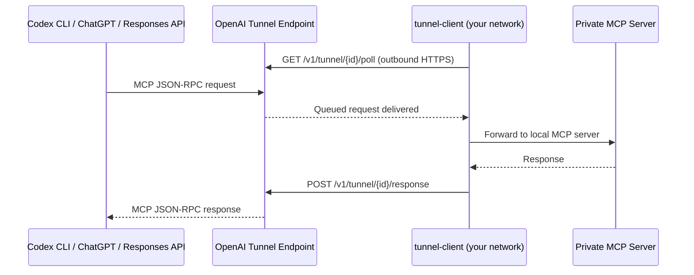
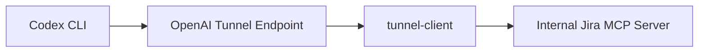
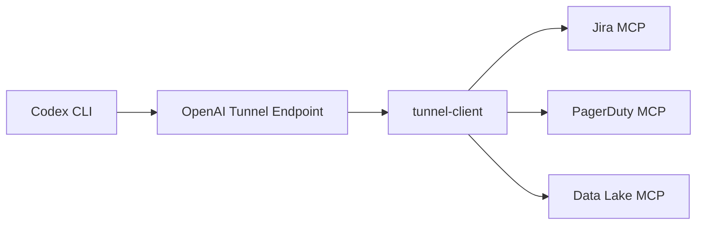

# Secure MCP Tunnel: Connecting Codex CLI to Private MCP Servers Without Opening Inbound Ports


---

Enterprise teams running internal MCP servers — wrapping proprietary databases, CI systems, or compliance tools — face a persistent tension: Codex and ChatGPT need to reach those servers, but security policy forbids punching inbound holes through the firewall. OpenAI's Secure MCP Tunnel, announced on 19 May 2026 [^1], resolves this by routing all traffic through an outbound-only HTTPS connection initiated from inside the private network.

This article covers the architecture, deployment, and Codex CLI integration of the `tunnel-client`, the open-source Go binary that bridges your private MCP servers to OpenAI's hosted tunnel endpoint.

## The Problem: MCP Servers Behind the Firewall

Codex CLI's MCP integration supports two transports: **stdio** (local child process) and **Streamable HTTP** (remote URL) [^2]. Streamable HTTP works well for publicly reachable servers, but enterprise internal tools — a Jira wrapper, a PagerDuty bridge, a proprietary data lake query server — sit behind VPNs, private subnets, or zero-trust perimeters.

Before Secure MCP Tunnel, teams had three unsatisfying options:

1. **Expose the MCP server publicly** — unacceptable for most security teams.
2. **Run Codex CLI on the same network** — works for individual developers but breaks for Codex Cloud tasks, ChatGPT threads, and the Responses API.
3. **Build a custom reverse proxy** — engineering overhead, bespoke authentication, no standard observability.

The tunnel eliminates all three by keeping the MCP server entirely within the customer-controlled environment whilst giving OpenAI products a stable endpoint to call [^3].

## Architecture: Outbound-Only Long Polling

The Secure MCP Tunnel uses a long-polling architecture rather than persistent WebSocket connections, which simplifies firewall traversal.



Key architectural properties:

- **Outbound-only**: `tunnel-client` initiates all connections via HTTPS. No inbound firewall rules required [^3].
- **Long polling**: The client uses `GET /v1/tunnel/{tunnel_id}/poll` to retrieve queued requests and `POST /v1/tunnel/{tunnel_id}/response` to return results [^4].
- **Multi-channel routing**: A `main` channel targets the primary MCP binding, with additional configured channels routing to separate MCP servers. A `harpoon` channel handles allowlisted outbound HTTP callouts for OAuth metadata discovery [^4].
- **Transport flexibility**: The client can forward to MCP servers via Streamable HTTP, stdio, or in-memory transport [^4].

## Prerequisites

Before deploying, ensure you have:

| Requirement | Source |
|---|---|
| `tunnel_id` | Platform tunnel settings at `platform.openai.com` [^3] |
| Runtime API key with Tunnels **Read** + **Use** permissions | Organisation API keys page [^4] |
| MCP server accessible via stdio or HTTP from the client host | Your infrastructure |
| Outbound HTTPS from the host running `tunnel-client` | Network policy |

Tunnel creation and management requires a ChatGPT Business or Enterprise workspace [^3].

## Deploying tunnel-client

### Installation

Download the latest binary from the [openai/tunnel-client](https://github.com/openai/tunnel-client/releases/latest) releases page [^4]. The current release is v0.0.8 (May 2026). Alternatively, build from source:

```bash
git clone https://github.com/openai/tunnel-client.git
cd tunnel-client
make admin-ui
go build -o bin/tunnel-client ./cmd/client
```

### Profile Initialisation

The `tunnel-client` uses profiles to store connection configuration. Initialise one for a local stdio MCP server:

```bash
export CONTROL_PLANE_API_KEY="sk-..."

tunnel-client init \
  --sample sample_mcp_stdio_local \
  --profile local-jira \
  --tunnel-id tunnel_0123456789abcdef0123456789abcdef \
  --mcp-command "python /opt/mcp-servers/jira-server.py"
```

For an HTTP-based MCP server already running on your network:

```bash
tunnel-client init \
  --sample sample_mcp_http \
  --profile internal-datalake \
  --tunnel-id tunnel_0123456789abcdef0123456789abcdef \
  --mcp-server-url https://mcp.internal.example.com/mcp
```

### Validation and Launch

Always run diagnostics before starting the daemon:

```bash
# Validate configuration, connectivity, and permissions
tunnel-client doctor --profile local-jira --explain

# Start the tunnel
tunnel-client run --profile local-jira
```

The `doctor` command checks control-plane reachability, API key permissions, MCP server availability, and profile consistency [^4]. Keep the client running — discovery and tool calls depend on active polling.

## Security Model

The tunnel's security posture is built around several layers:

### Network Isolation

The private MCP server address never leaves your network. `tunnel-client` uses it locally to forward requests; the address is not transmitted to OpenAI [^3]. All communication with the control plane occurs over outbound HTTPS.

### Enterprise TLS Options

For organisations requiring mutual TLS, the client supports client certificate authentication:

```bash
tunnel-client run --profile local-jira \
  --control-plane.client-cert /etc/pki/tunnel/client.crt \
  --control-plane.client-key /etc/pki/tunnel/client.key
```

When mTLS is configured against default OpenAI endpoints, traffic automatically routes through `https://mtls.api.openai.com` [^4].

### Permission Model

The tunnel uses a tiered permission structure [^4]:

| Role | Required Permissions |
|---|---|
| Runtime user (runs `tunnel-client`) | Tunnels **Read** + **Use** |
| Tunnel manager (creates/configures tunnels) | Tunnels **Read** + **Manage** (+ **Use** if running daemon) |
| Admin key creator | Platform admin-key permissions |

### OAuth Handling

If your MCP server uses OAuth, the tunnel handles metadata discovery by fetching Protected Resource Metadata on startup and using `authorization_servers[0]` from the PRMD as the source of truth [^4]. The authorisation server itself must be reachable — it is not automatically tunnelled.

## Integrating with Codex CLI

The `tunnel-client` ships with first-class Codex CLI integration via dedicated subcommands [^4]:

```bash
# Check Codex CLI installation status
tunnel-client codex status

# Install or upgrade Codex CLI
tunnel-client codex install
tunnel-client codex upgrade

# Install a tunnel-backed MCP server as a Codex plugin
tunnel-client codex plugin install

# Start an interactive Codex session with tunnel context
tunnel-client codex assistant "Review the latest Jira tickets"
```

The `codex plugin install` command registers the tunnel-backed MCP server in your Codex CLI's `config.toml`, making the private server's tools available in interactive sessions, `codex exec` pipelines, and Codex Cloud tasks.

For manual configuration, add the tunnel-backed URL to your Codex CLI config:

```toml
# ~/.codex/config.toml
[mcp_servers.internal-jira]
url = "https://tunnel.api.openai.com/v1/mcp/tunnel_0123456789abcdef"
bearer_token_env_var = "OPENAI_API_KEY"
startup_timeout_sec = 15
tool_timeout_sec = 120
```

## Observability and Operations

### Health Endpoints

The `tunnel-client` exposes four operational endpoints [^3] [^4]:

| Endpoint | Purpose |
|---|---|
| `/healthz` | Liveness check for orchestrators |
| `/readyz` | Readiness probe — confirms control-plane connectivity |
| `/metrics` | Prometheus-compatible metrics |
| `/ui` | Admin interface with channel status and log controls |

### Admin UI

The embedded admin UI provides:

- **Overview tab**: Channel availability and disable reasons at a glance.
- **Logs tab**: Runtime log-level adjustment (debug/info/warn) without restart.
- **Export**: Generates a redacted support bundle containing logs, metrics snapshot, and runtime configuration — safe to share with OpenAI support [^4].

### Containerised Deployment

For production environments, run `tunnel-client` as a container:

```bash
docker run -d \
  --name mcp-tunnel \
  -e CONTROL_PLANE_API_KEY="sk-..." \
  -e CONTROL_PLANE_TUNNEL_ID="tunnel_..." \
  -p 8080:8080 \
  --restart unless-stopped \
  openai/tunnel-client:latest \
  run --profile /config/profile.yaml
```

The Docker image ships with the admin UI pre-built. Expose port 8080 internally for health checks and metrics scraping.

## Architecture Patterns

### Pattern 1: Single Team, Single MCP Server

The simplest deployment — one `tunnel-client` instance bridging one internal tool:



### Pattern 2: Multi-Server Hub

Route multiple MCP servers through one `tunnel-client` using channel configuration:



The `main` channel handles the primary MCP binding, whilst additional channels route to separate server bindings [^4].

### Pattern 3: Per-Environment Isolation

Deploy separate tunnel instances per environment (staging, production) with distinct `tunnel_id` values and permission scopes. This ensures a staging Codex session cannot accidentally invoke production tools.

## Comparison with Alternatives

| Approach | Inbound ports | Multi-surface | Observability | Effort |
|---|---|---|---|---|
| Public MCP server | Yes | Yes | Custom | Medium |
| VPN + Streamable HTTP | No | CLI only | Custom | High |
| Reverse proxy (nginx/Caddy) | Yes | Partial | Custom | High |
| Docker MCP Gateway [^5] | No | CLI only | Built-in | Medium |
| **Secure MCP Tunnel** | **No** | **All OpenAI surfaces** | **Built-in** | **Low** |

The tunnel's key advantage is **multi-surface support**: the same private MCP server becomes accessible from Codex CLI, Codex Cloud, ChatGPT, and the Responses API through a single `tunnel_id` [^3].

## Limitations and Caveats

- **ChatGPT Business or Enterprise required**: The tunnel feature is not available on Plus or free plans [^3].
- **Latency overhead**: Long polling adds round-trip latency compared to direct stdio or local HTTP connections. For latency-sensitive tools, consider running MCP servers locally via stdio when using Codex CLI directly.
- **OAuth server reachability**: The authorisation server used by your MCP server must be independently reachable; it is not tunnelled automatically [^3].
- **Early release**: The tunnel-client is at v0.0.8 as of May 2026 [^4]. Expect API surface changes. Pin your binary version in production deployments.

## Getting Started Checklist

1. Create a tunnel in [Platform settings](https://platform.openai.com/settings/organization/tunnels)
2. Generate a runtime API key with Tunnels Read + Use permissions
3. Download `tunnel-client` from [GitHub releases](https://github.com/openai/tunnel-client/releases/latest)
4. Run `tunnel-client init` with your MCP server command or URL
5. Run `tunnel-client doctor --explain` to validate
6. Start the tunnel with `tunnel-client run`
7. Register in Codex CLI with `tunnel-client codex plugin install`
8. Test with `tunnel-client codex assistant "list available tools"`

## Citations

[^1]: OpenAI API Changelog, "Secure MCP Tunnel", 19 May 2026. [https://developers.openai.com/api/docs/changelog](https://developers.openai.com/api/docs/changelog)

[^2]: OpenAI, "Model Context Protocol — Codex", 2026. [https://developers.openai.com/codex/mcp](https://developers.openai.com/codex/mcp)

[^3]: OpenAI, "Secure MCP Tunnels Guide", 2026. [https://developers.openai.com/api/docs/guides/secure-mcp-tunnels](https://developers.openai.com/api/docs/guides/secure-mcp-tunnels)

[^4]: OpenAI, "tunnel-client", GitHub repository, 2026. [https://github.com/openai/tunnel-client](https://github.com/openai/tunnel-client)

[^5]: Docker, "Connect Codex to MCP Servers via Docker MCP Toolkit", 2026. [https://www.docker.com/blog/connect-codex-to-mcp-servers-mcp-toolkit/](https://www.docker.com/blog/connect-codex-to-mcp-servers-mcp-toolkit/)
