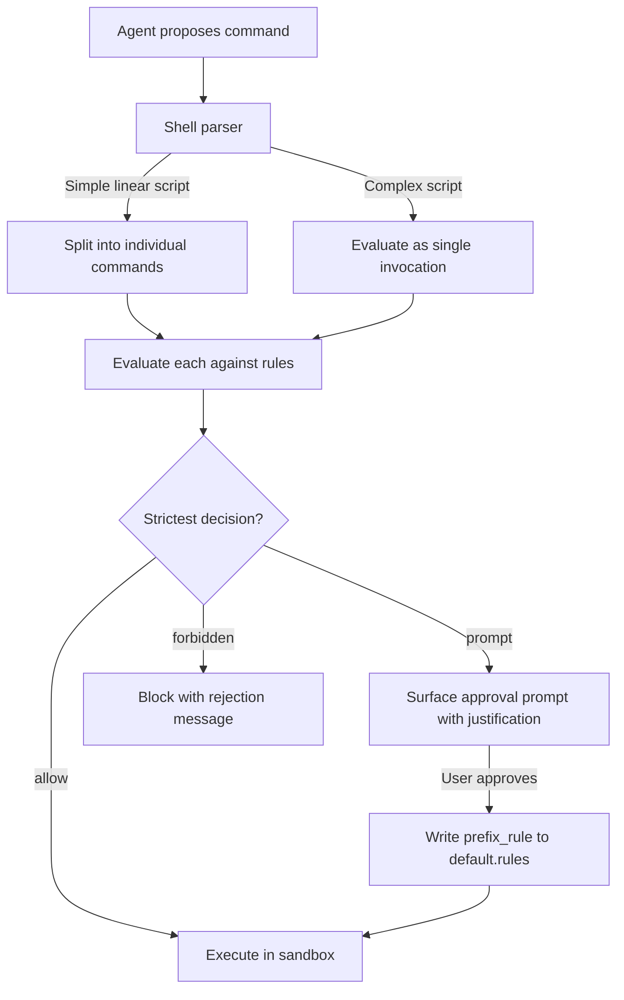
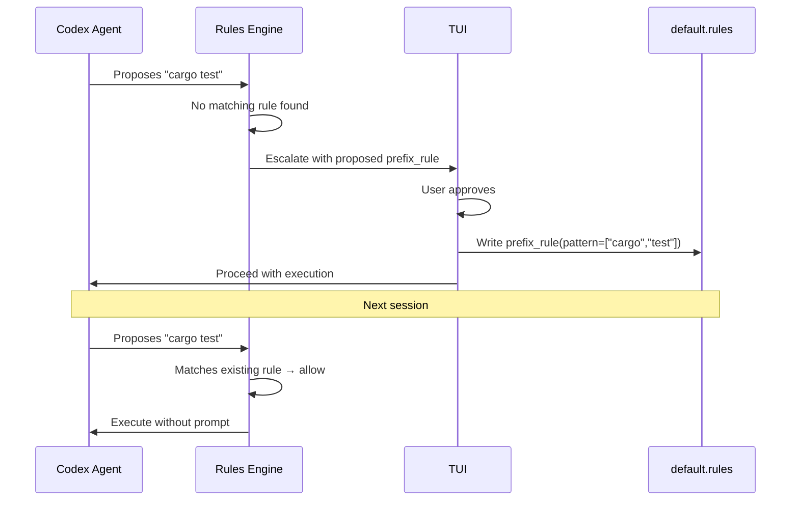
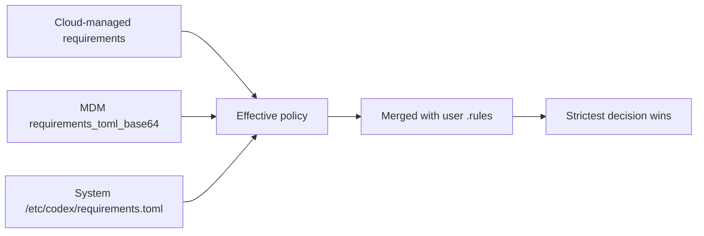

# Codex CLI Execution Policy Rules: Starlark-Based Command Governance, Smart Approvals, and Enterprise Allowlists


---

Every time Codex CLI proposes a shell command, something has to decide whether that command runs silently, pauses for approval, or gets blocked outright. The **execution policy rules** system — built on Starlark `.rules` files and the `codex execpolicy` subsystem — is the mechanism that makes that decision. Despite being central to Codex's security model, the rules engine is under-documented relative to its importance: it sits between the agent loop and every command invocation, and it is the layer enterprise administrators use to enforce governance at scale.

This article covers the full surface: Starlark syntax, pattern matching semantics, shell command parsing, the `host_executable()` constraint, smart approvals, enterprise enforcement via `requirements.toml`, and practical rule-set patterns for teams.

## Architecture: Where Rules Fit



The rules engine evaluates *after* the agent generates a command but *before* sandbox execution [^1]. When the agent proposes a compound shell expression like `git add . && rm -rf /tmp/cache`, Codex's parser determines whether it can safely split the expression into independent commands for individual evaluation [^2].

## Rule File Locations and Loading Order

Codex scans `rules/` directories under every active configuration layer at startup [^1]:

| Layer | Path | Notes |
|---|---|---|
| User | `~/.codex/rules/default.rules` | Personal allowlists; TUI writes here |
| Team Config | Locations defined in team config | Shared across the organisation |
| Project | `<repo>/.codex/rules/*.rules` | Loads only when the project layer is trusted |

All matching rules merge. Higher-precedence layers do not replace lower-precedence rules — instead, the **strictest decision wins** across all loaded rules [^1].

## The `prefix_rule()` Function

Every rule is a `prefix_rule()` call written in Starlark [^3], a Python-like language designed for safe, side-effect-free evaluation.

### Signature

```python
prefix_rule(
    pattern,                # required: list of tokens or token unions
    decision = "allow",     # optional: "allow" | "prompt" | "forbidden"
    justification = "",     # optional: human-readable rationale
    match = [],             # optional: examples that must match
    not_match = [],         # optional: examples that must not match
)
```

### Parameters in Detail

**`pattern`** — A non-empty list defining the command prefix to match. Each element is either a literal string or a list of alternatives at that argument position [^1]:

```python
# Matches: gh pr view, gh pr list
# Does not match: gh pr merge
prefix_rule(
    pattern = ["gh", "pr", ["view", "list"]],
    decision = "allow",
    justification = "Read-only GitHub PR operations are safe",
)
```

**`decision`** — The action when the rule matches. When multiple rules match the same command, Codex applies the most restrictive: `forbidden` > `prompt` > `allow` [^1].

**`justification`** — Surfaced in approval prompts (for `prompt` decisions) and rejection messages (for `forbidden` decisions). Recommended practice: include the *why* and suggest an alternative [^1]:

```python
prefix_rule(
    pattern = ["git", "push", "--force"],
    decision = "forbidden",
    justification = "Force-push risks overwriting team history. Use git push --force-with-lease instead.",
)
```

**`match` / `not_match`** — Validation examples evaluated at rule load time. Think of them as unit tests for your policy [^4]:

```python
prefix_rule(
    pattern = ["docker", ["build", "run"]],
    decision = "prompt",
    justification = "Container operations need review for resource usage",
    match = [["docker", "build", "."], "docker run nginx"],
    not_match = [["docker", "ps"], "docker images"],
)
```

If any `match` example fails to trigger the rule, or any `not_match` example incorrectly triggers it, Codex reports an error at startup rather than silently loading a broken policy.

## Shell Command Parsing

Codex does not naïvely evaluate the raw command string. Its parser applies two strategies [^2]:

### Safe Splitting

When a compound command uses only safe operators (`&&`, `||`, `;`, `|`) with no variable expansion, redirections, environment assignments, or wildcards, Codex splits it into individual commands and evaluates each independently:

```bash
# Codex splits this into two evaluations:
# 1. ["git", "add", "."]         → checked against rules
# 2. ["npm", "test"]             → checked against rules
git add . && npm test
```

### Conservative Parsing

Complex shell features prevent splitting. Redirections, command substitutions, control flow, and variable expansion cause the entire invocation to be evaluated as a single `["bash", "-lc", "<full script>"]` command [^2]:

```bash
# Cannot split — evaluated as single invocation:
git log --oneline | grep "fix" > fixes.txt
```

This conservative approach means rules for `git` alone will not match the above command. Teams relying on complex shell pipelines should write rules that account for the `bash -lc` wrapper pattern.

## The `host_executable()` Constraint

Beyond `prefix_rule()`, the rules system provides `host_executable()` to constrain executable path resolution [^4]:

```python
host_executable(
    name = "git",
    paths = ["/opt/homebrew/bin/git", "/usr/bin/git"],
)
```

When defined, basename fallback resolution only occurs for listed paths. Without this entry, Codex resolves any executable matching the basename. This prevents path-injection attacks where a malicious binary shadows a legitimate tool [^4].

## Testing Rules with `codex execpolicy check`

Before deploying rules to a team, validate them with the `execpolicy check` subcommand [^1]:

```bash
# Test a single command against your rules
codex execpolicy check --pretty \
  --rules ~/.codex/rules/default.rules \
  -- gh pr view 7888 --json title,body,comments
```

The output is JSON showing the strictest decision and all matching rules with their justifications:

```json
{
  "decision": "allow",
  "matches": [
    {
      "matched_prefix": ["gh", "pr", "view"],
      "decision": "allow",
      "justification": "Read-only GitHub PR operations are safe"
    }
  ]
}
```

Combine multiple rule files with repeated `--rules` flags. Use the `--resolve-host-executables` flag to enable basename fallback for absolute paths [^4].

## Smart Approvals and the TUI Feedback Loop

When smart approvals are enabled (the default), Codex proposes a `prefix_rule` during escalation requests [^1]. If you approve a command in the TUI, Codex writes a corresponding rule to `~/.codex/rules/default.rules` so the same command pattern is auto-approved in future sessions.

This creates a progressive allowlist: the first time Codex runs `cargo test`, you approve it. Every subsequent `cargo test` invocation matches the written rule and executes without interruption. Over time, your `default.rules` file becomes a curated record of trusted command patterns.



## Enterprise Enforcement with `requirements.toml`

For enterprise teams, personal allowlists are insufficient. Administrators enforce restrictive rules through `requirements.toml`, which constrains what users can override [^5]:

```toml
# requirements.toml — admin-enforced policy
[rules]
# Requirements rules MUST specify decision as "prompt" or "forbidden"
# "allow" is not permitted in requirements — it would weaken security

[[rules.prefix_rules]]
pattern = ["rm", "-rf"]
decision = "forbidden"
justification = "Recursive deletion blocked by organisation policy"

[[rules.prefix_rules]]
pattern = ["curl"]
decision = "prompt"
justification = "Network requests require explicit approval per security policy"
```

Key constraints on `requirements.toml` rules [^5]:

- The `decision` field is **mandatory** (unlike regular rules where it defaults to `"allow"`)
- Only `"prompt"` and `"forbidden"` decisions are valid — `"allow"` is prohibited because requirements exist to *restrict*, not to weaken
- Requirements rules merge with regular `.rules` files, and the strictest decision still wins

### Delivery Mechanisms

Enterprise requirements reach developer machines through three channels, with this precedence order [^5]:



Administrators deploy cloud-managed requirements from the **Codex Policies** page in the admin console, enabling different constraint sets for different groups without distributing device-level files [^5].

## Practical Rule-Set Patterns

### Pattern 1: The Safe Git Workflow

```python
# Allow read-only git operations
prefix_rule(
    pattern = ["git", ["status", "log", "diff", "show", "branch"]],
    decision = "allow",
    justification = "Read-only git operations",
    match = ["git status", "git log --oneline"],
)

# Prompt for mutations
prefix_rule(
    pattern = ["git", ["commit", "merge", "rebase", "cherry-pick"]],
    decision = "prompt",
    justification = "Mutations to git history require review",
)

# Block destructive operations
prefix_rule(
    pattern = ["git", "push", "--force"],
    decision = "forbidden",
    justification = "Use --force-with-lease to prevent overwriting team commits",
)
```

### Pattern 2: Language-Specific Build Tools

```python
# Node.js — allow test and lint, prompt for install
prefix_rule(pattern = ["npm", "test"], decision = "allow")
prefix_rule(pattern = ["npm", "run", "lint"], decision = "allow")
prefix_rule(pattern = ["npm", "install"], decision = "prompt",
    justification = "Package installation modifies node_modules and lockfile")

# Go — allow standard toolchain
prefix_rule(pattern = ["go", ["build", "test", "vet", "fmt"]], decision = "allow")
prefix_rule(pattern = ["go", "install"], decision = "prompt",
    justification = "Installing binaries modifies GOPATH")
```

### Pattern 3: CI Pipeline Lockdown

For `codex exec` in CI, pair rules with `--approval-policy on-request` [^6]:

```python
# ci-policy.rules — loaded via codex exec --rules ci-policy.rules
prefix_rule(pattern = ["make", ["build", "test", "lint"]], decision = "allow")
prefix_rule(pattern = ["docker", "build"], decision = "allow")

# Block everything network-facing
prefix_rule(pattern = ["curl"], decision = "forbidden",
    justification = "CI builds must not make external requests")
prefix_rule(pattern = ["wget"], decision = "forbidden",
    justification = "CI builds must not make external requests")
```

### Pattern 4: Executable Path Pinning

```python
# Pin critical tools to known-good paths
host_executable(
    name = "git",
    paths = ["/usr/bin/git", "/opt/homebrew/bin/git"],
)
host_executable(
    name = "node",
    paths = ["/usr/local/bin/node", "/opt/homebrew/bin/node"],
)
```

## Limitations and Caveats

- **Experimental status**: The rules system is explicitly labelled experimental and may change in future releases [^1]. Production deployments should version-control rule files and test against each CLI upgrade.
- **No glob or regex in patterns**: Pattern elements are literal strings or unions of literals. You cannot write `pattern = ["rm", "-r*"]` to match `-rf`, `-r`, and `-ri` — each variant needs explicit enumeration [^4].
- **Complex shell scripts bypass splitting**: Any command with redirections, variable expansion, or control flow evaluates as a single `bash -lc` invocation, meaning your granular per-tool rules will not match [^2].
- **No conditional logic**: Starlark rules are purely declarative. You cannot write rules that depend on file paths, environment variables, or time of day. ⚠️ There is no documented mechanism for context-aware rule evaluation.

## Citations

[^1]: [Rules – Codex | OpenAI Developers](https://developers.openai.com/codex/rules)
[^2]: [Execution Policy – Codex | OpenAI Developers](https://developers.openai.com/codex/exec-policy)
[^3]: [Starlark Language Specification – bazelbuild/starlark](https://github.com/bazelbuild/starlark/blob/master/spec.md)
[^4]: [codex-rs/execpolicy/README.md – openai/codex on GitHub](https://github.com/openai/codex/blob/main/codex-rs/execpolicy/README.md)
[^5]: [Managed Configuration – Codex | OpenAI Developers](https://developers.openai.com/codex/enterprise/managed-configuration)
[^6]: [Command Line Options – Codex CLI | OpenAI Developers](https://developers.openai.com/codex/cli/reference)
