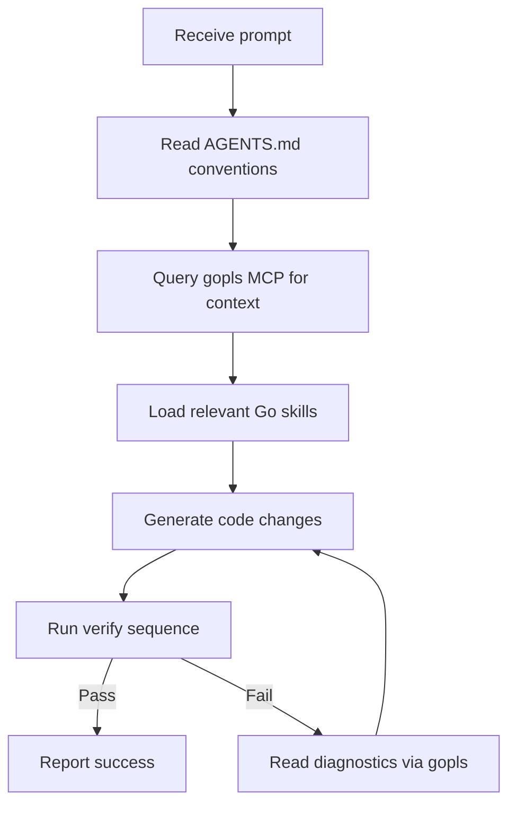

# Codex CLI for Go Development Teams: gopls MCP, Agent Skills, and Go 1.26 Workflows


---

Go teams adopting Codex CLI face a specific configuration challenge: the language's strong conventions around error handling, concurrency, and module structure mean that a generic agent setup produces code that compiles but feels wrong. An `if err != nil` block that logs _and_ returns, a goroutine launched without a defined exit strategy, a test file missing table-driven subtests — none of these trigger compiler errors, yet all violate idioms that experienced Go developers enforce instinctively.

This article covers the three layers that turn Codex CLI into an effective Go pair programmer: the **gopls MCP server** for semantic code intelligence, **Go-specific agent skills** for idiomatic generation, and an **AGENTS.md template** that encodes your team's conventions. Everything targets Go 1.26 [^1] and Codex CLI v0.132 [^2].

## gopls as an MCP Server

Since gopls v0.20, the Go language server ships with a built-in MCP server [^3]. This gives Codex CLI access to the same semantic analysis that powers your editor — symbol resolution, cross-references, package APIs, diagnostics, and vulnerability checks — without a separate third-party wrapper.

### Installation

```bash
# Ensure gopls v0.20+
go install golang.org/x/tools/gopls@latest

# Add to Codex CLI
codex mcp add gopls -- gopls mcp
```

Verify with:

```bash
codex mcp list
```

You should see `gopls` listed with `enabled` status [^4].

### Available Tools

The gopls MCP server exposes twelve tools [^3]:

| Tool | Purpose |
|---|---|
| `go_context` | Workspace module and build context |
| `go_diagnostics` | Workspace-wide vet and analysis diagnostics |
| `go_file_context` | Imports, declarations, and scope for a file |
| `go_file_diagnostics` | Per-file diagnostic messages |
| `go_file_metadata` | Module path, package, and build tags |
| `go_package_api` | Exported API surface of a package |
| `go_references` | Find all references to a symbol |
| `go_rename_symbol` | Compute a safe rename across the module |
| `go_search` | Full-text search across the workspace |
| `go_symbol_references` | Symbol-level cross-reference lookup |
| `go_workspace` | Module graph and workspace root |
| `go_vulncheck` | Run `govulncheck` against the module |

### Attached vs Detached Mode

gopls MCP runs in two modes [^3]:

- **Detached** (default with `gopls mcp`): standalone process, reads saved files only. Best for Codex CLI since the agent works on disk.
- **Attached** (via `gopls serve -mcp.listen=localhost:8092`): shares memory with an active LSP session, sees unsaved buffers. Useful when running Codex CLI alongside an editor.

For most Codex CLI workflows, detached mode is the correct choice — the agent saves files before analysing them.

### Alternative: Community gopls-mcp Wrappers

Two community wrappers — Yantrio/mcp-gopls and hloiseau/mcp-gopls — predate the official integration [^5] [^6]. They offer additional capabilities such as test execution, coverage analysis, and code action application. If you need these, install via:

```bash
codex mcp add gopls-mcp -- gopls-mcp
```

The hloiseau wrapper includes a quick-start page with Codex CLI-specific instructions and an `AGENTS.md` prompt snippet [^4].

## Go-Specific Agent Skills

Skills fill the gap between what gopls analyses and what Codex generates. The **cc-skills-golang** library by Samuel Berthe provides 35+ atomic skills covering conventions, error handling, concurrency, testing, security, and Go 1.26 modernisation [^7].

### Installation

```bash
npx skills add https://github.com/samber/cc-skills-golang --skill '*'
```

Skills are auto-discovered from `~/.agents/skills/` (user-level) or `.agents/skills/` (project-level) [^8]. They load lazily — the full skill body is injected only when the agent invokes it by name — keeping context windows lean.

### Key Skills for Go Teams

| Skill | What it enforces |
|---|---|
| `golang-code-style` | `gofmt`, naming conventions, receiver consistency |
| `golang-error-handling` | Context wrapping with `fmt.Errorf("...: %w", err)`, single-handling rule |
| `golang-concurrency` | Defined goroutine exit strategies, channel ownership, `sync.WaitGroup` patterns |
| `golang-testing` | Table-driven subtests, `t.Helper()`, goroutine leak detection with `goleak` |
| `golang-security` | `gosec` rules, SQL injection prevention, `crypto/rand` over `math/rand` |
| `golang-modernize` | Go 1.26 idioms: `new(int64(300))`, `errors.AsType[E]()`, `go fix` modernisers |

### The Single-Handling Rule

One skill worth highlighting: `golang-error-handling` enforces the rule that errors should be handled exactly once. Either log and return a default, or wrap and propagate — never both. This eliminates the most common anti-pattern Codex produces in Go code when unconstrained [^9].

```go
// ❌ Anti-pattern: log AND return
if err != nil {
    log.Printf("failed to connect: %v", err)
    return fmt.Errorf("connecting to database: %w", err)
}

// ✅ Correct: wrap and propagate (let the caller decide)
if err != nil {
    return fmt.Errorf("connecting to database: %w", err)
}
```

## AGENTS.md for Go Projects

The `AGENTS.md` file carries the conventions that Codex cannot infer from source code alone. Here is a production-grade template for Go 1.26 projects:

```markdown
# AGENTS.md

## Build & Test
- Build: `go build ./...`
- Test: `go test -race -count=1 ./...`
- Lint: `golangci-lint run ./...`
- Verify sequence: `go mod tidy && gofmt -w . && go fix ./... && go vet ./... && golangci-lint run && go test -race ./...`

## Code Style
- Follow Effective Go and the Go Code Review Comments wiki
- Error messages: lowercase, no trailing punctuation
- Wrap errors with `fmt.Errorf("context: %w", err)`
- Handle errors exactly once — never log AND return
- Prefer named return values only when they aid documentation

## Testing
- Table-driven subtests with `t.Run()`
- Mark helpers with `t.Helper()`
- Use `go.uber.org/goleak` for goroutine leak detection in `TestMain`
- Aim for >80% coverage on business logic packages

## Concurrency
- Every goroutine must have a defined exit strategy
- Prefer `context.Context` cancellation over bare channel signals
- Document channel ownership in comments

## Go 1.26
- Use `new(T(value))` instead of `var x T; ptr := &x` for pointer creation
- Use `errors.AsType[E]()` for type-safe error unwrapping
- Run `go fix ./...` after refactors to apply standard modernisers

## Security
- Run `gosec -severity high ./...` — treat findings as blocking
- Run `govulncheck ./...` — fail on any known vulnerability
- Never use `math/rand` for security-sensitive values
```

### Subdirectory Overrides

For high-trust directories, add a scoped `AGENTS.md`:

```markdown
<!-- payments/AGENTS.md -->
# Payment Service Constraints
- Run `gosec -severity medium` (stricter than the project default)
- All database queries must use parameterised statements
- No `reflect` or `unsafe` usage without explicit approval
```

## CI/CD Integration with codex exec

The `ci` profile runs Codex non-interactively in pipelines. A typical Go CI workflow:

```bash
# Fix a failing test, verify, and output structured results
codex exec \
  --sandbox workspace-write \
  --output-schema ./ci-schema.json \
  "Fix the failing test in pkg/auth. Run the full verify sequence from AGENTS.md before reporting."
```

### GitHub Actions Example


```yaml
name: codex-fix
on:
  workflow_dispatch:
    inputs:
      issue:
        description: "Issue to fix"
        required: true

jobs:
  fix:
    runs-on: ubuntu-latest
    steps:
      - uses: actions/checkout@v4
      - uses: actions/setup-go@v5
        with:
          go-version: '1.26'
      - uses: openai/codex-action@v1
        with:
          api-key: ${{ secrets.OPENAI_API_KEY }}
          prompt: |
            Fix issue #${{ inputs.issue }}.
            Follow the verify sequence in AGENTS.md.
          sandbox: workspace-write
```


## The Verification Flow

When all three layers are configured, Codex CLI follows a predictable cycle for Go changes:



The gopls MCP provides the _what_ (diagnostics, symbol context), the skills provide the _how_ (idiomatic patterns), and AGENTS.md provides the _must_ (team rules that override defaults).

## Go 1.26 Considerations

Go 1.26, released 10 February 2026 [^1], introduced changes that affect code generation:

- **Enhanced `new()` with expressions**: `ptr := new(int64(300))` replaces the two-step `var x int64 = 300; ptr := &x` pattern. The `golang-modernize` skill instructs Codex to prefer the new form [^7].
- **Self-referential generic types**: generic types may now refer to themselves in their own type parameter lists, simplifying recursive data structures [^1].
- **Green Tea GC default**: the experimental garbage collector from Go 1.25 is now the default, reducing GC pause times. No code changes required, but benchmarks may shift [^1].
- **`go fix` modernisers**: the rewritten `go fix` command includes dozens of analysers that automatically update code to use newer idioms [^1]. AGENTS.md should include `go fix ./...` in the verify sequence.

⚠️ The `errors.AsType[E]()` function referenced in some Go 1.26 community guides may be a proposal that landed in a point release rather than the initial 1.26.0 — verify availability against your exact Go version before including it in AGENTS.md.

## Practical Tips

1. **Start with gopls MCP before adding skills.** The semantic tools alone eliminate a class of errors where Codex generates code referencing non-existent symbols or wrong package APIs.

2. **Pin your golangci-lint version in CI.** Codex may suggest the latest, but teams need reproducible linter results. Specify the version explicitly in your GitHub Actions workflow.

3. **Use `codex exec resume` for multi-step refactors.** A common pattern: first pass generates the changes, second pass runs `go fix ./...` and `golangci-lint`, third pass addresses any remaining issues.

4. **Configure `go_vulncheck` in gopls MCP for dependency reviews.** When reviewing pull requests that update `go.mod`, the MCP-backed vulnerability check runs against the actual call graph, not just the dependency list.

## Citations

[^1]: [Go 1.26 Release Notes](https://go.dev/doc/go1.26) — The Go Programming Language
[^2]: [Codex CLI Changelog v0.132.0](https://developers.openai.com/codex/changelog) — OpenAI Developers
[^3]: [Gopls: Model Context Protocol Support](https://go.dev/gopls/features/mcp) — The Go Programming Language
[^4]: [Codex CLI Setup for gopls-mcp](https://gopls-mcp.org/quick-start/codex/) — gopls-mcp.org
[^5]: [Yantrio/mcp-gopls](https://github.com/Yantrio/mcp-gopls) — GitHub
[^6]: [hloiseau/mcp-gopls](https://github.com/hloiseau/mcp-gopls) — GitHub
[^7]: [samber/cc-skills-golang](https://github.com/samber/cc-skills-golang) — GitHub (35+ Go agent skills)
[^8]: [Agent Skills — Codex CLI](https://developers.openai.com/codex/skills) — OpenAI Developers
[^9]: [Codex CLI for Go Teams: Skills, AGENTS.md and Go 1.26 Workflows](https://codex.danielvaughan.com/2026/03/30/codex-cli-go-teams/) — Codex Blog
