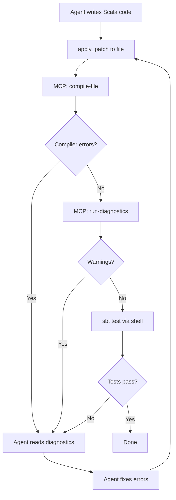

# Codex CLI for Scala Development Teams: Metals MCP, sbt, and Idiomatic Functional Workflows


---

Dedicated language-specific Codex CLI articles exist for Go, Rust, Ruby/Rails, Python/Django/FastAPI, C/C++, Elixir/Phoenix, Swift, Kotlin/Android, Java/Spring, PHP/Laravel, and .NET — but not for Scala, despite it being a top-20 language powering some of the most demanding data-processing and financial-services systems in production. The gap matters because Scala's combination of advanced type systems, functional programming idioms, and JVM interop creates failure modes that generic agent configurations miss entirely.

This article covers three layers that turn Codex CLI into an effective Scala pair programmer: the **Metals MCP server** for semantic code intelligence, **sbt integration patterns** for compilation and testing, and an **AGENTS.md template** that encodes Scala-specific conventions. Everything targets Scala 3.9 LTS [^1], sbt 2.x [^2], and Codex CLI v0.132 [^3].

## Why Scala Needs Special Agent Configuration

AI coding models default to Scala 2-style syntax — `implicit` keyword over `given`/`using`, classic `for`-comprehensions over direct-style effect handling, verbose pattern matching over Scala 3 enums [^4]. Without explicit guidance, a Codex session generates code that compiles against Scala 3 but fails code review because it violates the idioms your team adopted precisely to benefit from the language's evolution.

Three Scala-specific concerns demand configuration:

1. **Type inference depth.** Scala's type system is substantially more expressive than Go or Python. Agents that over-annotate produce noise; agents that under-annotate produce code that confuses Metals and slows incremental compilation.
2. **Effect system conventions.** Teams standardise on Cats Effect, ZIO, or direct-style effects. Mixing paradigms within a codebase creates maintenance nightmares that generic agents blithely produce.
3. **Build tool semantics.** sbt's incremental compilation, cross-building, and multi-project layouts require specific commands and directory conventions that differ from Maven or Gradle patterns.

## Layer 1: Metals MCP Server

Metals [^5] is the Scala language server that powers IDE features across VS Code, IntelliJ, Neovim, and Emacs. Since Metals v1.5.3 [^6], it ships with a built-in MCP server that exposes semantic code intelligence to AI agents. Connecting it to Codex CLI gives the agent compiler feedback, symbol navigation, and project-aware code generation.

### The Nine MCP Tools

Metals currently exposes nine tools through its MCP interface [^7]:

| Tool | Purpose | Agent Impact |
|------|---------|-------------|
| `compile-file` | Compile a single Scala file | Immediate error feedback without full rebuild |
| `compile-full` | Compile the entire project | Verify cross-module changes |
| `inspect` | Inspect a Scala symbol (members, constructors, signatures) | Navigate unfamiliar codebases |
| `get-usages` | Find all references to a symbol | Safe refactoring |
| `typed-glob-search` | Search symbols by substring and kind | Discover APIs without reading every file |
| `run-diagnostics` | Current compiler diagnostics state | Check for latent errors |
| `list-modules` | List available project modules | Multi-module project navigation |
| `run-tests` | Execute test suites | Verify changes |
| `goto-definition` | Navigate to symbol source | Understand implementation details |

The single most valuable tool for agent workflows is `compile-file` — it creates a tight feedback loop where the agent writes code, compiles it, receives errors, and corrects immediately without waiting for a full `sbt compile` cycle [^7].

### Connecting Metals MCP to Codex CLI

The recommended approach uses `metals-standalone-client` [^8], a headless launcher that starts Metals and exposes its MCP server without requiring an IDE:

```bash
# Install metals-standalone-client
curl -Lo metals-standalone-client \
  https://github.com/jpablo/metals-standalone-client/releases/latest/download/metals-standalone-client-linux
chmod +x metals-standalone-client

# Launch against your project
./metals-standalone-client --workspace /path/to/your-project
```

The client discovers your Metals installation via Coursier, performs the LSP handshake, and writes a `.mcp.json` file at your project root with the connection URL [^8].

Configure Codex CLI to connect in `config.toml`:

```toml
[mcp_servers.metals]
type = "sse"
url = "http://localhost:7101/mcp"
enabled = true

# Restrict to semantic tools — keep the surface small
enabled_tools = [
  "compile-file",
  "compile-full",
  "inspect",
  "get-usages",
  "typed-glob-search",
  "run-diagnostics"
]
```

For project-scoped configuration, add to `.codex/config.toml` in your repository root so every team member inherits the same Metals MCP setup.

### The Feedback Loop

With Metals connected, the agent loop changes fundamentally:



This loop catches type errors, missing implicits, and exhaustivity warnings _before_ the agent moves on — preventing the cascading failures that plague unguided Scala code generation.

## Layer 2: sbt Integration Patterns

### Essential AGENTS.md Build Commands

sbt's interactive shell and triggered execution model require specific guidance. Include these commands in your AGENTS.md:

```markdown
## Build Commands

- Compile: `sbt compile`
- Test all: `sbt test`
- Test single suite: `sbt "testOnly com.example.MySpec"`
- Triggered test: `sbt "~testOnly com.example.MySpec"` (auto-reruns on save)
- Clean build: `sbt clean compile`
- Format: `sbt scalafmtAll` (requires sbt-scalafmt plugin)
- Lint: `sbt "scalafix --check"` (requires sbt-scalafix plugin)
- Multi-project compile: `sbt "project core" compile`
```

### Cross-Building and Multi-Project Layouts

Scala projects frequently cross-build against multiple Scala versions and use multi-project sbt builds. The agent needs to understand the project topology:

```toml
# .codex/config.toml — project-scoped
[sandbox_workspace_write]
# sbt downloads dependencies to ~/.cache/coursier and ~/.sbt
writable_roots = ["~/.cache/coursier", "~/.sbt", "~/.ivy2"]
```

For multi-module projects, create directory-level AGENTS.md overrides:

```
project-root/
├── AGENTS.md              # Global conventions
├── core/
│   └── AGENTS.override.md # Core module specifics
├── api/
│   └── AGENTS.override.md # API layer specifics
└── build.sbt
```

### Incremental Compilation Awareness

sbt's Zinc incremental compiler [^2] is one of Scala's strongest productivity features, but agents that run `sbt clean compile` on every iteration destroy the incremental cache. Your AGENTS.md should explicitly state:

```markdown
## Build Rules

- NEVER run `sbt clean` unless explicitly asked. Use `sbt compile` for incremental builds.
- After changing build.sbt, run `sbt reload` before `sbt compile`.
- Use `compile-file` MCP tool for single-file checks before running full `sbt compile`.
```

## Layer 3: AGENTS.md Template for Scala Teams

The following template encodes the conventions that prevent the most common agent failures in Scala codebases:

```markdown
# AGENTS.md — Scala 3 Project

## Language Version
This project uses **Scala 3.9 LTS**. Use Scala 3 syntax exclusively:
- `given`/`using` instead of `implicit`
- `enum` instead of sealed trait hierarchies for ADTs
- `extension` methods instead of implicit classes
- Indentation-based syntax (significant indentation) is preferred
- `export` clauses for selective forwarding

## Effect System
This project uses **Cats Effect 3**. All effectful code must return `IO[A]`.
- Never use `Future` — all async code uses `IO`
- Use `Resource[IO, A]` for anything that needs cleanup
- Prefer `cats.syntax.all.*` imports over individual syntax imports
- Use `EitherT` or `OptionT` only when the monad transformer
  genuinely simplifies the code; prefer pattern matching on `IO[Either[E, A]]`

## Error Handling
- Domain errors: sealed `enum` ADTs in the `errors` package
- Use `MonadError` / `ApplicativeError` for effect-level errors
- Never catch `Throwable` — catch specific exception types
- Log errors with context using structured logging (log4cats)

## Testing
- Framework: **MUnit** with `munit-cats-effect` for IO-based tests
- Test command: `sbt test`
- Single suite: `sbt "testOnly com.example.*Spec"`
- Property-based tests: ScalaCheck generators in `src/test/scala/generators/`
- Test naming: `test("description of behaviour")`

## Formatting and Linting
- Run `sbt scalafmtAll` before committing
- Run `sbt "scalafix --check"` to verify lint rules
- Max line length: 120 characters
- Imports: use `import cats.syntax.all.*` not individual imports

## Project Structure
```
src/main/scala/com/example/
├── domain/       # Case classes, enums, value types
├── errors/       # Error ADTs
├── services/     # Business logic (tagless final or direct IO)
├── http/         # HTTP routes (http4s)
├── persistence/  # Database access (doobie/skunk)
└── config/       # Application configuration (ciris/pureconfig)
```

## Build
- Build tool: sbt 2.x
- NEVER run `sbt clean` unless explicitly requested
- Use `sbt compile` for incremental compilation
- After modifying build.sbt: `sbt reload` then `sbt compile`
```

### Scala 2 vs Scala 3 Guardrails

The most frequent agent failure is generating Scala 2 syntax in a Scala 3 project [^4]. Add explicit negative examples:

```markdown
## Anti-Patterns — Do NOT Generate

```scala
// WRONG: Scala 2 implicit
implicit val encoder: Encoder[User] = deriveEncoder

// CORRECT: Scala 3 given
given Encoder[User] = Encoder.derived

// WRONG: Scala 2 implicit class
implicit class StringOps(s: String):
  def toSlug: String = ...

// CORRECT: Scala 3 extension
extension (s: String)
  def toSlug: String = ...

// WRONG: sealed trait + case objects
sealed trait Color
case object Red extends Color

// CORRECT: Scala 3 enum
enum Color:
  case Red, Green, Blue
```
```

## Codex CLI Configuration Profile

Create a named Scala profile for quick switching:

```toml
# ~/.codex/config.toml

[profiles.scala]
model = "gpt-5.5"
model_reasoning_effort = "high"
approval_policy = "on-request"

[profiles.scala.mcp_servers.metals]
type = "sse"
url = "http://localhost:7101/mcp"
enabled = true
enabled_tools = [
  "compile-file",
  "compile-full",
  "inspect",
  "get-usages",
  "typed-glob-search",
  "run-diagnostics"
]
```

Activate with:

```bash
codex --profile scala
```

Use `gpt-5.5` for Scala work — the type system complexity benefits from higher reasoning capability [^9]. For subagents handling simpler tasks (test generation, formatting), drop to `gpt-5.4-mini` with `model_reasoning_effort = "medium"`.

## Practical Workflow: Adding an HTTP Endpoint

Here is a concrete workflow for adding a new endpoint to an http4s service:

```bash
codex --profile scala
```

Then prompt:

```
Add a GET /api/v1/users/:id endpoint to the UserRoutes.
It should return 200 with the user JSON or 404 with an error body.
Use the existing UserService.findById method.
Write an MUnit test covering both cases.
```

The agent will:

1. Use `inspect` MCP tool to examine `UserService` and `UserRoutes` signatures
2. Generate the route using http4s DSL with `IO` effects
3. Call `compile-file` to verify the route compiles
4. Generate the MUnit test with `munit-cats-effect`
5. Run `sbt "testOnly *UserRoutesSpec"` to verify

### Hooks for Scala Quality Gates

Add a `PreToolUse` hook that runs `scalafmt` before any shell command commits changes:

```toml
# .codex/config.toml

[[hooks]]
event = "PostToolUse"
tool_name = "apply_patch"
command = "sbt scalafmtAll 2>/dev/null; true"
timeout_ms = 30000
```

This ensures every file the agent modifies is formatted before the next compilation cycle, preventing formatting drift that pollutes diffs.

## Effect System Guidance by Stack

Different Scala teams use different effect systems. Adjust the AGENTS.md effect section accordingly:

| Stack | Key AGENTS.md Rule | Import Pattern |
|-------|-------------------|----------------|
| **Cats Effect** | All effects return `IO[A]`; use `Resource` for lifecycle | `import cats.effect.*` |
| **ZIO** | All effects return `ZIO[R, E, A]`; use ZLayer for DI | `import zio.*` |
| **Direct Style** (Scala 3.5+) | Use `boundary`/`break` and `CanThrow` capabilities [^10] | `import scala.util.boundary` |
| **Ox** | Use structured concurrency with `supervised` blocks | `import ox.*` |

⚠️ Direct-style effects and the Ox library represent newer patterns — verify that your team's Scala version and compiler plugins support them before adding to AGENTS.md.

## Common Agent Failures in Scala

| Failure | Root Cause | Fix |
|---------|-----------|-----|
| Generates `implicit` instead of `given` | Model defaults to Scala 2 training data | Explicit Scala 3 mandate in AGENTS.md |
| Missing type annotations on public APIs | Agent relies on inference for everything | Rule: "Annotate all public method return types" |
| Mixes `Future` with `IO` | Model conflates JVM concurrency primitives | Specify single effect system in AGENTS.md |
| Runs `sbt clean compile` repeatedly | No awareness of incremental compilation | Explicit build rules section |
| Generates Java-style null checks | Model falls back to Java patterns | Rule: "Use `Option`, never null" |
| Ignores exhaustivity warnings | Treats warnings as non-blocking | Connect Metals MCP for warning-as-error feedback |

## Comparison with Other Language Setups

The Scala setup follows the same three-layer pattern as the Go [^11] and Rust [^12] articles but differs in key ways:

- **MCP server**: Metals MCP provides compiler-level feedback comparable to gopls MCP and rust-analyzer MCP, but Metals' `inspect` tool is uniquely valuable for navigating Scala's deeper type hierarchies.
- **Build tool**: sbt's incremental compilation and multi-project support require more nuanced build commands than `go build` or `cargo build`.
- **AGENTS.md**: Scala requires more explicit negative examples (Scala 2 vs 3) because the model's training data spans both language versions.

## What This Does Not Cover

This article focuses on Codex CLI configuration for Scala teams. It does not cover:

- Spark or big-data-specific workflows (these warrant a dedicated article given the cluster execution model)
- Play Framework web applications (covered in part by the general sbt patterns here, but Play's route file conventions deserve separate treatment)
- Scala.js cross-compilation workflows

## Citations

[^1]: Scala 3.9 LTS release roadmap — [https://www.scala-lang.org/blog/2025/02/20/scala-3-roadmap-for-2025.html](https://www.scala-lang.org/blog/2025/02/20/scala-3-roadmap-for-2025.html) — Scala 3.9 designated as next LTS distribution, Q2 2026

[^2]: sbt 2.x documentation — [https://www.scala-sbt.org/2.x/docs/](https://www.scala-sbt.org/2.x/docs/) — sbt with Zinc incremental compiler

[^3]: OpenAI Codex CLI Changelog v0.132.0 — [https://developers.openai.com/codex/changelog](https://developers.openai.com/codex/changelog) — Python SDK auth, exec resume --output-schema

[^4]: SoftwareMill, "A Beginner's Guide to Using Scala Metals With its Model Context Protocol Server" — [https://softwaremill.com/a-beginners-guide-to-using-scala-metals-with-its-model-context-protocol-server/](https://softwaremill.com/a-beginners-guide-to-using-scala-metals-with-its-model-context-protocol-server/) — Notes agents default to Scala 2 syntax

[^5]: Metals — Scala Language Server — [https://scalameta.org/metals/](https://scalameta.org/metals/)

[^6]: Metals v1.5.3 release notes — [https://scalameta.org/metals/blog/2025/05/13/strontium/](https://scalameta.org/metals/blog/2025/05/13/strontium/) — Introduced MCP server support

[^7]: Metals MCP tools reference — [https://softwaremill.com/a-beginners-guide-to-using-scala-metals-with-its-model-context-protocol-server/](https://softwaremill.com/a-beginners-guide-to-using-scala-metals-with-its-model-context-protocol-server/) — Nine tools including compile-file, inspect, get-usages

[^8]: metals-standalone-client — [https://github.com/jpablo/metals-standalone-client](https://github.com/jpablo/metals-standalone-client) — Headless Metals launcher with MCP support

[^9]: OpenAI Models documentation — [https://developers.openai.com/codex/models](https://developers.openai.com/codex/models) — GPT-5.5 recommended for complex coding tasks

[^10]: Scala 3 boundary/break documentation — [https://docs.scala-lang.org/scala3/reference/experimental/boundary-break.html](https://docs.scala-lang.org/scala3/reference/experimental/boundary-break.html) — Direct-style error handling

[^11]: Codex CLI for Go Development Teams — [https://codex.danielvaughan.com/2026/05/21/codex-cli-for-go-development-teams-gopls-mcp-skills-agents-md-workflows/](https://codex.danielvaughan.com/2026/05/21/codex-cli-for-go-development-teams-gopls-mcp-skills-agents-md-workflows/)

[^12]: Codex CLI for Rust Development Teams — [https://codex.danielvaughan.com/2026/04/29/codex-cli-rust-teams-rust-analyzer-mcp-cargo-hooks-agent-driven-workflows/](https://codex.danielvaughan.com/2026/04/29/codex-cli-rust-teams-rust-analyzer-mcp-cargo-hooks-agent-driven-workflows/)
