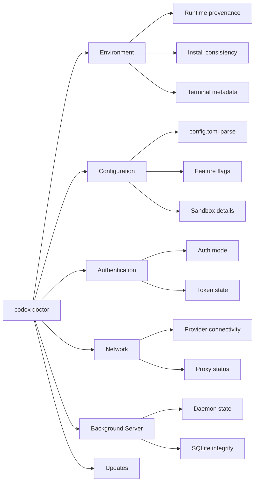
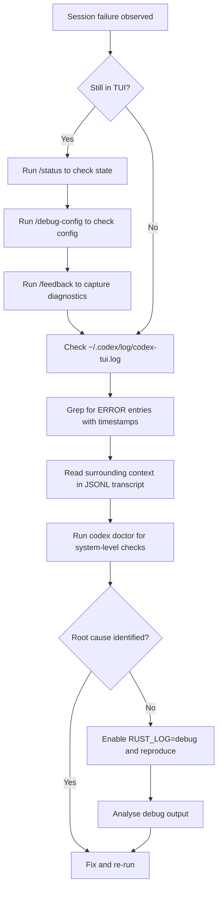

# Codex CLI Log Files and Debug Tracing: The Complete Diagnostic Toolkit for When Sessions Fail


---

Something broke. The agent hung mid-refactor, an MCP server silently disconnected, or authentication failed three turns into a goal workflow. You need to know *what actually happened* — not what the TUI chose to render.

Codex CLI is a Rust binary with a layered diagnostic surface: runtime log files, session transcript archives, environment-variable-driven trace levels, structured diagnostic commands, and OpenTelemetry export. Most developers never look beyond the TUI's error toast. This article maps the full toolkit so you can diagnose failures systematically instead of restarting and hoping for the best.

## The Log File System

### Runtime Logs

The TUI writes timestamped log messages to `~/.codex/log/codex-tui.log` [^1]. The default log level captures `INFO` and above from the two primary crates:

```bash
# Default effective level (set internally)
RUST_LOG=codex_core=info,codex_tui=info
```

The non-interactive `codex exec` mode defaults to `RUST_LOG=error` and prints messages inline to stderr rather than to a file [^1]. This means exec failures in CI pipelines appear in your build log without any additional configuration.

To tail the TUI log in a second terminal while working interactively:

```bash
tail -f ~/.codex/log/codex-tui.log
```

### Session Transcripts

Every interactive and exec session is persisted as a JSONL file under `~/.codex/sessions/YYYY/MM/DD/` [^2]. Each file is named `rollout-<session-id>.jsonl` and contains the complete event stream: user prompts, model responses, tool calls, tool results, approval decisions, and token usage counters [^2].

These transcripts serve two purposes. First, they power `codex resume` and `codex fork` — when you reopen a session, the model reconstructs context by replaying the transcript rather than restoring internal state [^3]. Second, they are the authoritative audit trail for post-mortem analysis.

You can extract specific events with `jq`:

```bash
# Show all tool calls from a session
cat ~/.codex/sessions/2026/05/21/rollout-abc123.jsonl \
  | jq 'select(.type == "tool_call")'

# Count tokens consumed per turn
cat ~/.codex/sessions/2026/05/21/rollout-abc123.jsonl \
  | jq 'select(.usage != null) | .usage'
```

Community tools like `codex-trace` [^4] and `codex-transcript-viewer` [^5] render these JSONL files as browsable HTML timelines, making it easier to spot where a session diverged from expectations.

## Controlling Log Verbosity with RUST_LOG

Because Codex CLI is built in Rust using the `tracing` crate ecosystem, it honours the standard `RUST_LOG` environment variable [^1]. The syntax follows the `env_logger` / `tracing-subscriber` conventions:

```bash
# Global debug — verbose, useful for authentication or startup issues
RUST_LOG=debug codex

# Trace a specific crate — surgical when you suspect a sandbox or MCP issue
RUST_LOG=info,codex_core=debug codex

# Full trace — extremely verbose, generates large log files
RUST_LOG=trace codex

# Trace only the exec path for CI debugging
RUST_LOG=codex_exec=trace,codex_core=debug codex exec "run tests"
```

You can also control the output format:

```bash
# JSON-structured logs for machine parsing
RUST_LOG_FORMAT=json RUST_LOG=debug codex

# Compact single-line format
RUST_LOG_FORMAT=compact RUST_LOG=debug codex
```

**Caution:** Trace-level logging can expose sensitive data — model prompts, environment variable values, and MCP payloads all appear in trace output. A known issue (#17320) documented excessive SQLite WAL writes when `TRACE` was enabled, caused by logging every database operation [^6]. Use trace sparingly and clean up log files afterwards.

## The Diagnostic Commands

### `codex doctor`

Shipped in v0.131.0, `codex doctor` is the single most useful diagnostic entry point [^7]. It runs a comprehensive health check across six sections:



The default output is human-readable with hierarchical sections and a `Notes` block that promotes anomalies to the top [^8]. Three flags adjust output:

| Flag | Effect |
|------|--------|
| `--summary` | Compact single-paragraph output |
| `--json` | Structured JSON keyed by check ID — designed for support tooling and CI preflight |
| `--all` | Expand truncated lists (feature flags, MCP servers) |

In CI pipelines, `codex doctor --json` makes an excellent preflight gate:

```bash
# Fail the pipeline if doctor finds errors
codex doctor --json | jq -e '.checks | to_entries | all(.value.status == "ok")'
```

### `/debug-config`

The `/debug-config` slash command prints the effective configuration after all layers have merged — system (`/etc/codex/config.toml`), user (`~/.codex/config.toml`), project (`.codex/config.toml`), profile selection, and CLI overrides [^9]. It also displays `requirements.toml` enforcement status, showing which settings are locked by an enterprise administrator.

When a setting behaves unexpectedly, `/debug-config` immediately reveals which layer is responsible. This replaces the tedious process of manually inspecting each config file.

### `/feedback`

The `/feedback` command collects the current session's diagnostic context — including recent log entries, configuration snapshot, and Sentry-tagged metadata — and submits it to the Codex team [^10]. The submission includes a request ID that support can use to correlate your report with server-side telemetry.

Use `/feedback` *before* restarting a broken session. Once you close the TUI, the in-memory diagnostic context is lost (though the JSONL transcript persists on disc).

### `codex debug` Subcommands

Two experimental debug subcommands exist for deeper investigation [^11]:

- **`codex debug app-server send-message-v2`** — sends a single JSON-RPC message to the app-server, useful for testing protocol-level behaviour in custom integrations.
- **`codex debug models`** — dumps the raw model catalogue as JSON. Add `--bundled` to skip the remote refresh and inspect only the locally cached catalogue.

### `/status`

The `/status` slash command displays the current session's active model, approval policy, sandbox mode, and cumulative token usage [^12]. It is the quickest way to confirm that a profile or CLI override took effect.

## Common Failure Patterns and Where to Look

### Authentication Failures (401 Unauthorized)

**Symptoms:** Session starts, then fails on the first model call with a 401 error.

**Diagnostic path:**

1. Check `~/.codex/auth.json` for token expiry timestamps [^1].
2. Run `codex login status` to verify the active auth mode.
3. Run `codex doctor` — the Authentication section reports token state and refresh capability.
4. If using device-code flow in CI, ensure `CODEX_API_KEY` is set rather than relying on browser-based tokens.

### MCP Server Handshake Timeouts

**Symptoms:** Tools from an MCP server silently disappear mid-session. The TUI shows no error — the server is simply disabled.

**Diagnostic path:**

1. Tail the log: `tail -f ~/.codex/log/codex-tui.log | grep -i mcp`.
2. Look for handshake timeout entries with the server name.
3. Use `/mcp` in the TUI to check which servers are active.
4. Test the server independently: `codex mcp get <server-name> --json`.

### Sandbox Denials (macOS Seatbelt)

**Symptoms:** Shell commands fail with permission errors despite correct `sandbox_mode` configuration.

**Diagnostic path:**

1. Run the failing command with `--log-denials` to capture macOS Seatbelt denial events [^11].
2. Check `codex doctor` — the Environment section reports sandbox mode and platform-specific details.
3. On macOS, run `log stream --predicate 'process == "sandboxd"'` in a separate terminal to see kernel-level denials in real time [^13].

### WebSocket Disconnection Loops

**Symptoms:** The TUI repeatedly shows reconnection messages. Common with `--remote` connections.

**Diagnostic path:**

1. Grep the log for `code=1006` (abnormal closure) to confirm the pattern [^1].
2. Check network stability and proxy configuration.
3. Verify the remote app-server is running: `codex remote-control` should report daemon status.

## OpenTelemetry Export for Production Monitoring

For teams running Codex CLI at scale — across developer workstations or in CI — the built-in OpenTelemetry integration exports structured traces to any OTLP-compatible backend [^14]:

```toml
# ~/.codex/config.toml
[otel]
enabled = true
exporter = "otlp-grpc"           # or "otlp-http", "otlp-file"
endpoint = "http://localhost:4317"
environment = "development"
log_user_prompt = false           # Redact prompts from traces
```

Exported spans cover the full agent loop: API request latency, tool execution duration, approval wait time, and compaction events. Combined with `codex doctor --json`, this gives platform engineering teams a complete observability stack for Codex CLI deployments.

## Putting It All Together: A Diagnostic Workflow

When a session fails, follow this sequence:



The key principle: always capture diagnostics *before* restarting. The JSONL transcript survives restarts, but the in-memory log tail, TUI state, and `/feedback` context do not.

## Summary

Codex CLI's diagnostic surface is broader than most developers realise. The runtime log at `~/.codex/log/codex-tui.log`, the session transcripts under `~/.codex/sessions/`, the `RUST_LOG` environment variable, `codex doctor`, `/debug-config`, `/feedback`, and OpenTelemetry export together form a complete toolkit for diagnosing any failure mode — from authentication errors to sandbox denials to MCP server disconnects.

The difference between spending five minutes fixing a problem and spending an hour guessing is knowing which log file to open first.

## Citations

[^1]: SmartScope, "Codex CLI Logs: Location, Debug Flags & 401 Error Fix (2026)," [https://smartscope.blog/en/generative-ai/chatgpt/codex-cli-diagnostic-logs-deep-dive/](https://smartscope.blog/en/generative-ai/chatgpt/codex-cli-diagnostic-logs-deep-dive/)

[^2]: Verdent Guides, "Codex CLI Resume, Continue, and Save Chat Explained," [https://www.verdent.ai/guides/codex-cli-resume-continue-save-chat](https://www.verdent.ai/guides/codex-cli-resume-continue-save-chat)

[^3]: OpenAI, "Features – Codex CLI," [https://developers.openai.com/codex/cli/features](https://developers.openai.com/codex/cli/features)

[^4]: PixelPaw-Labs, "codex-trace: OpenAI Codex CLI session log viewer," [https://github.com/PixelPaw-Labs/codex-trace](https://github.com/PixelPaw-Labs/codex-trace)

[^5]: masonc15, "codex-transcript-viewer: Turn Codex CLI session logs into browsable HTML transcripts," [https://github.com/masonc15/codex-transcript-viewer](https://github.com/masonc15/codex-transcript-viewer)

[^6]: GitHub Issue #17320, "Excessive SQLite WAL writes during streaming due to TRACE logs ignoring RUST_LOG," [https://github.com/openai/codex/issues/17320](https://github.com/openai/codex/issues/17320)

[^7]: OpenAI, "Changelog – Codex CLI v0.131.0," [https://developers.openai.com/codex/changelog](https://developers.openai.com/codex/changelog)

[^8]: GitHub PR #22336, "feat(cli): add codex doctor diagnostics," [https://github.com/openai/codex/pull/22336](https://github.com/openai/codex/pull/22336)

[^9]: OpenAI, "Slash commands in Codex CLI," [https://developers.openai.com/codex/cli/slash-commands](https://developers.openai.com/codex/cli/slash-commands)

[^10]: OpenAI, "Best practices – Codex," [https://developers.openai.com/codex/learn/best-practices](https://developers.openai.com/codex/learn/best-practices)

[^11]: OpenAI, "Command line options – Codex CLI," [https://developers.openai.com/codex/cli/reference](https://developers.openai.com/codex/cli/reference)

[^12]: OpenAI, "Slash commands in Codex CLI – /status," [https://developers.openai.com/codex/cli/slash-commands](https://developers.openai.com/codex/cli/slash-commands)

[^13]: OpenAI, "Security – Codex," [https://developers.openai.com/codex/security](https://developers.openai.com/codex/security)

[^14]: OpenAI, "Advanced Configuration – Codex," [https://developers.openai.com/codex/config-advanced](https://developers.openai.com/codex/config-advanced)
