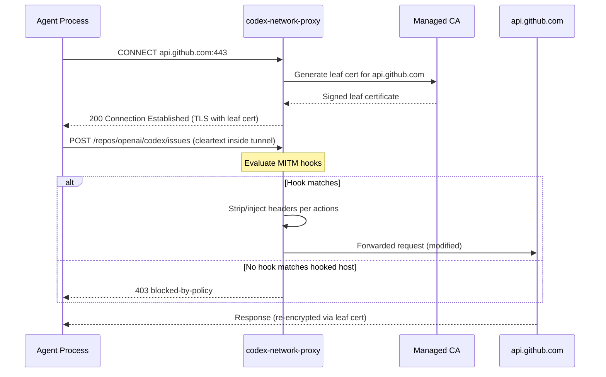
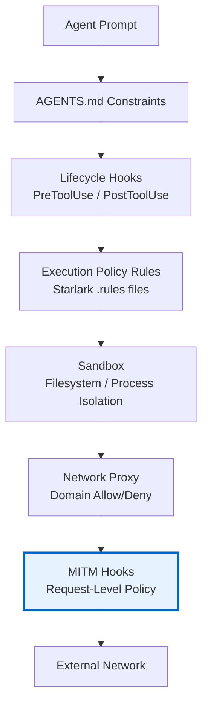

# Codex CLI MITM Hooks: HTTPS Request Interception, Header Mutation, and Network-Level Policy Enforcement


---

Codex CLI's sandbox has always controlled *what* an agent can do on disk and *whether* it can reach the network. But controlling *how* it talks to the network — which headers it sends, which API endpoints it can POST to, which credentials leak into outbound requests — required teams to bolt on external proxies or accept coarse-grained allow/deny rules.

That changed on 20 May 2026, when three PRs landed in the `openai/codex` repository introducing **MITM hooks**: a declarative, per-host HTTPS interception system built into the managed network proxy [^1][^2][^3]. MITM hooks let you intercept HTTPS traffic *after* TLS termination, match requests by method, path, query parameters, and headers, then mutate or strip headers before forwarding — all configured in your existing `config.toml` permission profile.

This article covers the architecture, configuration surface, practical patterns, and security implications for teams adopting MITM hooks in their Codex CLI deployments.

## How the Managed Network Proxy Works

Every sandboxed Codex CLI session routes outbound traffic through `codex-network-proxy`, a local policy enforcement engine written in Rust [^4]. The proxy binds two listeners by default:

- **HTTP proxy** on `127.0.0.1:3128`
- **SOCKS5 proxy** on `127.0.0.1:8081`

It enforces an allowlist-first domain policy: if no `allow` entries are configured, all requests are blocked. Deny rules always override allow rules. In `limited` mode, only `GET`, `HEAD`, and `OPTIONS` methods are permitted [^4].

The challenge with HTTPS traffic is that the proxy cannot inspect the HTTP method, path, or headers inside an encrypted `CONNECT` tunnel without terminating TLS. This is where MITM comes in.



## MITM Hook Architecture

MITM hooks operate at a layer *below* the existing lifecycle hooks (`PreToolUse`, `PostToolUse`). Where lifecycle hooks intercept tool invocations at the agent level, MITM hooks intercept raw HTTPS requests at the transport level [^1].

The proxy generates and manages a local Certificate Authority under `$CODEX_HOME/proxy/` (`ca.pem` and `ca.key`). When MITM is enabled — either because `mode = "limited"` or because MITM hooks are configured — the proxy terminates TLS using per-host leaf certificates signed by this CA, giving it visibility into request method, path, headers, and query parameters [^4].

### Evaluation Flow

When a request arrives for a host with configured hooks:

1. The proxy normalises the hostname and looks up the hook list.
2. Each hook is evaluated in declaration order against method, path prefix, query, and header constraints.
3. **First match wins** — the matched hook's actions are applied.
4. If hooks exist for the host but *none* match, the request is **blocked** with `blocked-by-policy` [^2].
5. If no hooks exist for the host, normal allow/deny policy applies.

This default-deny behaviour for hooked hosts is a deliberate security choice: once you declare interest in inspecting traffic to a host, all unmatched traffic to that host is blocked.

## Configuration

MITM hooks live inside the permission profile's `network.mitm` section in `config.toml`. The user-facing TOML shape uses named hooks and reusable action blocks [^3]:

```toml
[permissions.workspace.network.mitm]
enabled = true

[permissions.workspace.network.mitm.hooks.github_write]
host = "api.github.com"
methods = ["POST", "PUT"]
path_prefixes = ["/repos/openai/"]
action = ["strip_auth"]

[permissions.workspace.network.mitm.actions.strip_auth]
strip_request_headers = ["authorization"]
```

### Hook Fields

| Field | Type | Description |
|-------|------|-------------|
| `host` | string | Target hostname (exact match, normalised to lowercase) |
| `methods` | string array | HTTP methods to match (e.g. `["POST", "PUT", "DELETE"]`) |
| `path_prefixes` | string array | Path prefix matchers; supports `literal:` and `pattern:` glob syntax |
| `action` | string array | References to named action blocks |

### Matcher Fields (Advanced)

Beyond method and path, hooks support fine-grained matching [^1]:

| Matcher | Syntax | Example |
|---------|--------|---------|
| `query` | `{ "param_name" = ["value1", "pattern:v*"] }` | Match specific query parameters |
| `headers` | `{ "x-custom" = ["literal:expected"] }` | Match request header values |
| `body` | Reserved | Not yet supported; config validation rejects body matchers |

Value matchers support two prefixes:
- `literal:value` — exact string match
- `pattern:glob*` — glob pattern match via compiled `GlobMatcher`

Plain strings without a prefix are treated as exact matches.

### Action Blocks

Actions define what happens to matched requests before forwarding [^1]:

```toml
[permissions.workspace.network.mitm.actions.inject_service_token]
strip_request_headers = ["authorization", "x-api-key"]

[[permissions.workspace.network.mitm.actions.inject_service_token.inject_request_headers]]
name = "authorization"
secret_env_var = "CODEX_GITHUB_TOKEN"
prefix = "Bearer "

[[permissions.workspace.network.mitm.actions.inject_service_token.inject_request_headers]]
name = "x-audit-source"
secret_file = "/etc/codex/audit-key"
```

| Action | Description |
|--------|-------------|
| `strip_request_headers` | Remove listed headers from the request before forwarding |
| `inject_request_headers` | Add headers with values resolved from environment variables or files |

Injected headers resolve secrets at proxy startup via two sources [^1]:
- `secret_env_var` — reads the value from an environment variable
- `secret_file` — reads and trims a file on disk

An optional `prefix` field prepends a string (e.g. `"Bearer "`) to the resolved secret value.

## Practical Patterns

### Pattern 1: Stripping Leaked Credentials

The most immediate use case is preventing agent-generated code from accidentally forwarding ambient credentials to APIs:

```toml
[permissions.ci.network.mitm.hooks.strip_all_auth]
host = "api.github.com"
methods = ["POST", "PUT", "PATCH", "DELETE"]
path_prefixes = ["/"]
action = ["strip_credentials"]

[permissions.ci.network.mitm.actions.strip_credentials]
strip_request_headers = ["authorization", "x-api-key", "cookie"]
```

This ensures that even if agent-generated `curl` commands include an `Authorization` header sourced from the shell environment, the proxy strips it before the request reaches GitHub.

### Pattern 2: Credential Rotation via Injection

For CI/CD pipelines where the agent needs *controlled* API access, combine stripping with injection:

```toml
[permissions.ci.network.mitm.hooks.github_controlled_access]
host = "api.github.com"
methods = ["GET", "POST", "PUT"]
path_prefixes = ["/repos/myorg/"]
action = ["rotate_github_token"]

[permissions.ci.network.mitm.actions.rotate_github_token]
strip_request_headers = ["authorization"]

[[permissions.ci.network.mitm.actions.rotate_github_token.inject_request_headers]]
name = "authorization"
secret_env_var = "CI_GITHUB_TOKEN"
prefix = "Bearer "
```

The agent can make requests to `api.github.com` within `/repos/myorg/`, but the authorisation header is always the CI-scoped token — never whatever the agent might have found in the environment.

### Pattern 3: Write-Blocking Internal APIs

Prevent the agent from making mutations to sensitive internal services while allowing reads:

```toml
[permissions.workspace.network.mitm.hooks.internal_read_only]
host = "internal-api.company.com"
methods = ["GET", "HEAD", "OPTIONS"]
path_prefixes = ["/"]
action = ["allow_reads"]

[permissions.workspace.network.mitm.actions.allow_reads]
# No strip or inject — just allow the matched request through
```

Because hooked hosts default-deny unmatched requests, `POST`, `PUT`, `DELETE`, and `PATCH` requests to `internal-api.company.com` are automatically blocked without needing explicit deny rules.

### Pattern 4: Path-Scoped API Access

Restrict agent access to specific API endpoints, not just entire hosts:

```toml
[permissions.workspace.network.mitm.hooks.registry_read]
host = "registry.npmjs.org"
methods = ["GET"]
path_prefixes = ["/"]
action = ["pass_through"]

[permissions.workspace.network.mitm.hooks.registry_publish]
host = "registry.npmjs.org"
methods = ["PUT"]
path_prefixes = ["/-/package/"]
action = ["inject_publish_token"]

[permissions.workspace.network.mitm.actions.pass_through]
# Empty action — allows matched requests through unmodified

[permissions.workspace.network.mitm.actions.inject_publish_token]
strip_request_headers = ["authorization"]

[[permissions.workspace.network.mitm.actions.inject_publish_token.inject_request_headers]]
name = "authorization"
secret_env_var = "NPM_PUBLISH_TOKEN"
prefix = "Bearer "
```

## Enterprise Enforcement via requirements.toml

MITM hooks configured in permission profiles can be enforced at the enterprise level through `requirements.toml`, OpenAI's managed configuration delivery mechanism [^5]. Enterprise administrators can mandate specific MITM policies across all developer workstations, ensuring that:

- All outbound requests to production APIs are credential-stripped
- Only approved CI tokens reach sensitive endpoints
- OTEL audit events capture every policy decision for compliance

The proxy emits structured OpenTelemetry events (`codex.network_proxy.policy_decision`) for every allow, deny, and hook-matched decision, including host, port, method, and policy source — enabling integration with existing SIEM infrastructure [^4].

## Relationship to Existing Security Layers

MITM hooks complement rather than replace Codex CLI's existing defence-in-depth model:



| Layer | Controls | Granularity |
|-------|----------|-------------|
| AGENTS.md | Agent behaviour guidance | Intent-level |
| Lifecycle hooks | Tool invocation gating | Tool-level |
| Execution policy | Shell command governance | Command-level |
| Sandbox | Filesystem and process isolation | OS-level |
| Domain policy | Network host access | Host-level |
| **MITM hooks** | **Request method, path, headers** | **Request-level** |

MITM hooks are the finest-grained network control available, operating on individual HTTPS requests after TLS termination.

## Limitations and Caveats

- **Body matching is reserved.** The config model includes a `body` field, but validation currently rejects it with "reserved for a future release" [^1]. Request body inspection is not yet supported.
- **No response interception.** MITM hooks operate on *outbound requests* only. Response headers and bodies pass through unmodified.
- **CA trust required.** Applications running inside the sandbox must trust the managed CA certificate. Most language runtimes respect `SSL_CERT_FILE`, but some (notably Java, Electron) need explicit configuration [^6].
- **Performance overhead.** TLS termination and re-encryption adds latency to every HTTPS request through a hooked host. For high-throughput workloads, profile the impact.
- **macOS and Linux only.** The managed proxy is not yet available on Windows sandboxed sessions, though the Windows sandbox has its own network policy layer [^4].
- **SOCKS5 and MITM.** SOCKS5 traffic remains blocked in limited mode and does not support MITM hook evaluation.

## Getting Started

To enable MITM hooks on an existing Codex CLI installation (v0.133+):

1. Add the `[permissions.<profile>.network.mitm]` section to your `~/.codex/config.toml`
2. Define at least one hook with a host, methods, and path_prefixes
3. Define at least one action block referenced by your hook
4. Start a new session — the proxy will automatically generate the CA and enable MITM

Verify the proxy is active with `codex doctor`, which reports network proxy status as part of its diagnostic output [^7].

## Citations

[^1]: GitHub PR #18868 — "Add MITM hook config model", openai/codex, 20 May 2026. [https://github.com/openai/codex/pull/18868](https://github.com/openai/codex/pull/18868)

[^2]: GitHub PR #20659 — "Wire MITM hooks into runtime enforcement", openai/codex, 20 May 2026. [https://github.com/openai/codex/pull/20659](https://github.com/openai/codex/pull/20659)

[^3]: GitHub PR #18240 — "Use named MITM permissions config", openai/codex, 20 May 2026. [https://github.com/openai/codex/pull/18240](https://github.com/openai/codex/pull/18240)

[^4]: codex-network-proxy README, openai/codex repository, main branch. [https://github.com/openai/codex/tree/main/codex-rs/network-proxy](https://github.com/openai/codex/tree/main/codex-rs/network-proxy)

[^5]: OpenAI Codex Managed Configuration documentation. [https://developers.openai.com/codex/config-advanced](https://developers.openai.com/codex/config-advanced)

[^6]: OpenAI Codex CLI — "Behind TLS-Inspecting Proxies" configuration guide. [https://developers.openai.com/codex/config-basic](https://developers.openai.com/codex/config-basic)

[^7]: OpenAI Codex CLI Features documentation — codex doctor. [https://developers.openai.com/codex/cli/features](https://developers.openai.com/codex/cli/features)
