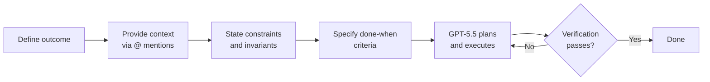
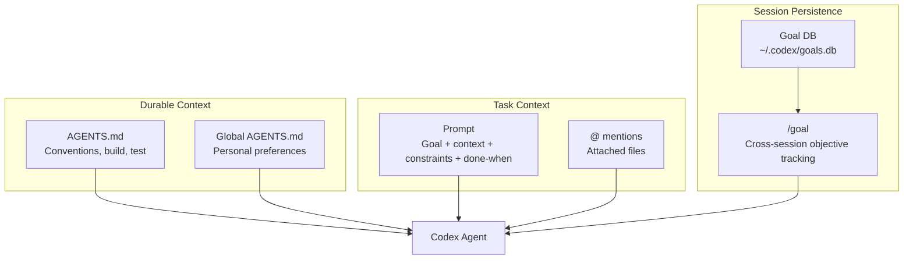

# Codex CLI Prompt Engineering in the GPT-5.5 Era: Outcome-First Patterns, Anti-Patterns, and the Prompts That Ship Code on the First Turn


---

The single most common question in the OpenAI developer forum is some variation of *"Why does Codex produce garbage for me but magic for everyone else?"* [^1]. The answer is almost never the model. It is the prompt. Codex CLI v0.133, released today, runs the same GPT-5.5 engine whether you write a one-liner or a structured four-part directive — but the output quality diverges dramatically depending on how you frame the work [^2].

This article codifies the prompting patterns that consistently produce first-turn results for senior developers, drawing on OpenAI's official prompting guide [^3], the Codex Cookbook's GPT-5 prompting notebook [^4], community workflows that have matured since GPT-5.5 shipped on 23 April 2026 [^5], and hard-won lessons from production Codex deployments.

## The Four-Part Prompt Anatomy

OpenAI's best practices page distils the effective Codex prompt into four elements [^1]:

1. **Goal** — the outcome you want, not the steps to get there
2. **Context** — relevant files, folders, docs, examples, or error output
3. **Constraints** — conventions, architecture rules, safety requirements
4. **Done when** — the verifiable end state

This is not a suggestion. It is the structure the model's preamble is tuned to expect. Omit any section and GPT-5.5 fills the gap with assumptions — assumptions that cost tokens and often produce rework.

### A Concrete Example

**Weak prompt:**
```
Add JSON output to the CLI.
```

**Strong prompt:**
```
Goal: Add a --json flag to the transform command that outputs
results as JSON instead of plain text.

Context: The CLI entry point is src/cli.ts. The transform module
is src/transform/index.ts. See the existing --verbose flag
implementation for the pattern to follow.

Constraints: Use the existing OutputFormatter interface. Do not
add new dependencies. Conform to the project's strict TypeScript
config (no explicit any).

Done when: `cargo test` passes, `./cli transform --json input.txt`
produces valid JSON to stdout, and the help text includes the new
flag.
```

The difference is not verbosity for its own sake. Every line in the strong prompt eliminates a decision the model would otherwise make autonomously — and possibly incorrectly [^3].

## Outcome-First Prompting for GPT-5.5

GPT-5.5 represents a shift from instruction-following to outcome-oriented reasoning [^5]. Earlier models needed step-by-step directions. GPT-5.5 performs best when you describe *what good looks like* and let the model choose the implementation path [^4].



In practice this means:

- **Do** write: *"Reduce the home page time-to-interactive below 1 second."*
- **Don't** write: *"First, open src/pages/Home.tsx. Then find the useEffect on line 42. Replace it with useMemo…"*

The model has been trained to plan before acting [^4]. When you pre-specify the plan, you override its internal planner and often produce worse results because your plan omits context the model would have gathered autonomously.

## The AGENTS.md Boundary

A recurring anti-pattern is stuffing durable rules into the prompt. Every project-wide convention — build commands, test runners, code style, architectural constraints — belongs in `AGENTS.md`, not in your prompt [^1] [^6].

```
# AGENTS.md (project root)

## Build & Test
- Build: `pnpm build`
- Test: `pnpm test`
- Lint: `pnpm lint --fix`

## Code Conventions
- TypeScript strict mode, no `any`
- Errors propagate; no silent catches
- New components go in src/components/<Name>/

## Verification
- All changes must pass `pnpm test` before completion
- Run `pnpm lint` after every file edit
```

The prompt then shrinks to task-specific intent:

```
Refactor the PaymentForm component to use the new
PaymentIntent API. Done when existing tests pass and
the Stripe test-mode checkout flow works end-to-end.
```

`AGENTS.md` is loaded automatically at session start and survives context compaction [^6]. Prompt text does not. Anything you need the agent to remember across turns belongs in the file, not the prompt.

### Hierarchical AGENTS.md

Codex supports global (`~/.codex/AGENTS.md`), repository-level (`.codex/AGENTS.md`), and subdirectory-specific overrides [^1]. Use this hierarchy to layer concerns:

| Level | Contains |
|---|---|
| Global | Personal preferences, shell environment, default model |
| Repository | Build commands, conventions, architecture rules |
| Subdirectory | Module-specific constraints (e.g., `packages/api/AGENTS.md` for API-specific rules) |

## Reasoning Effort: When to Turn the Dial

Codex CLI exposes four reasoning levels — Low, Medium, High, and Extra High — tuneable via `Alt+,` and `Alt+.` in the TUI [^7]. The OpenAI prompting guide recommends Medium as the default for interactive coding [^4]. But the choice should match the task:

| Task type | Reasoning | Why |
|---|---|---|
| Renaming variables, formatting | Low | Mechanical transformation, no planning needed |
| Feature implementation, bug fixes | Medium | Balanced speed and intelligence |
| Architecture decisions, complex refactoring | High | Needs multi-step planning |
| Cross-codebase migrations, security audits | Extra High | Requires deep analysis across many files |

**Anti-pattern:** Running every prompt at Extra High reasoning. The token cost scales roughly 3× from Medium to Extra High [^4], and the model spends more time *thinking* about simple tasks, which can introduce unnecessary complexity.

## Verification Steps: The Highest-ROI Prompt Investment

OpenAI's prompting page states it plainly: *"Codex produces higher-quality outputs when it can verify its work."* [^3]. Include explicit verification commands in your prompt or `AGENTS.md`:

```
Done when:
1. `pytest tests/ -x` passes
2. `mypy src/ --strict` reports zero errors
3. The /api/health endpoint returns 200
```

Without verification criteria, the model declares victory after the last `apply_patch`. With them, it runs the checks and self-corrects on failures — often across multiple cycles — before presenting the result. This single pattern eliminates the majority of rework in typical Codex sessions.

## The Plan-First Decision

Not every prompt benefits from planning. The official guidance [^1] is:

- **Skip planning** for clear, bounded tasks: *"Fix the off-by-one error in pagination"*
- **Use `/plan`** for ambiguous or multi-step tasks: *"Migrate our auth system from JWT to session cookies"*

Plan Mode (`/plan` or `Shift+Tab`) prevents the model from writing code until you approve the approach [^1]. For complex work, this is not optional — it is the difference between a productive session and a context-exhausting spiral.

```mermaid
flowchart TD
    A[New task] --> B{Clear scope<br/>and approach?}
    B -->|Yes| C[Direct prompt<br/>with done-when]
    B -->|No| D[/plan first]
    D --> E[Review plan]
    E --> F{Approve?}
    F -->|Yes| G[Execute]
    F -->|No| D
    C --> G
    G --> H[Verify]
```

For tasks that span more than one session, combine `/plan` with `/goal`:

```
/goal Migrate the authentication system from JWT to session
cookies. Done when: all auth tests pass, the login flow works
in the staging environment, and no JWT references remain in
the codebase.
```

Goals persist across sessions and survive process restarts as of v0.133 [^2]. The model will resume where it left off, checking its progress against your done-when criteria.

## Context Injection: @ Mentions and Beyond

GPT-5.5's million-token context window [^5] does not mean you should dump your entire repository into the prompt. Targeted context produces better results:

- **`@src/auth/middleware.ts`** — attach specific files to the conversation [^8]
- **`@src/auth/`** — attach an entire directory listing
- **`@CHANGELOG.md`** — provide project history for migration context
- **`/ide`** — include files open in your IDE

The `@` mention picker (unified in v0.131 [^8]) searches files, directories, plugins, and skills in a single fuzzy-search interface. Use it liberally — every file you attach explicitly is one fewer file the model has to guess about.

**Anti-pattern:** Attaching dozens of files "just in case". Each file consumes context tokens. Attach only what is directly relevant to the task. For exploration tasks, let the model use its built-in file search tools instead.

## Five Anti-Patterns That Waste Tokens

### 1. The Step-by-Step Micromanager

```
First open file X. Then find line Y. Then change Z to W.
Then save. Then run tests.
```

This overrides the model's planner and prevents it from discovering better approaches. State the outcome; let the model plan.

### 2. The Kitchen-Sink Prompt

```
Implement the feature, write tests, update docs, refactor
the adjacent module, fix the linting errors, and update
the changelog.
```

Each sub-task deserves its own turn or subagent. Overloaded prompts produce partial completions and context exhaustion [^1].

### 3. The Missing Verification

```
Add the new endpoint.
```

No done-when criteria means the model stops after writing code. Add: *"Done when `curl localhost:3000/api/new-endpoint` returns 200 and the integration test passes."*

### 4. The AGENTS.md Bypass

Repeating project conventions in every prompt instead of committing them to `AGENTS.md`. The model's context compaction may discard your inline rules mid-session; `AGENTS.md` content is preserved [^6].

### 5. The Static Reasoning Level

Using the same reasoning effort for every task. Toggle with `Alt+,`/`Alt+.` based on task complexity. Simple renames do not need Extra High reasoning [^7].

## Prompt Templates for Common Workflows

### Bug Fix

```
Bug: [describe the symptom and how to reproduce]
Context: @src/module/file.ts, error output from `pnpm test`
Constraints: Do not change the public API. Minimal diff.
Done when: The reproduction case no longer triggers the bug
and `pnpm test` passes.
```

### Feature Implementation

```
Goal: [describe the feature outcome]
Context: @src/relevant/files, @docs/spec.md
Constraints: Follow existing patterns in @src/similar/feature.
No new dependencies without justification.
Done when: [specific test commands] pass and [user-visible
behaviour] works as described.
```

### Code Review

```
/review

Focus on: security implications, error handling completeness,
and conformance to our TypeScript strict config. Flag any
changes that affect the public API.
```

### Refactoring

```
/plan Refactor [module] to [target architecture].
Preserve all existing tests. Add new tests for any
extracted components. Done when: `pnpm test` passes,
no increase in cyclomatic complexity per function,
and the module's public API is unchanged.
```

## The Compound Pattern: AGENTS.md + Prompt + /goal

The highest-performing Codex workflows combine all three layers:

1. **AGENTS.md** handles durable project context — build commands, conventions, architecture rules
2. **The prompt** provides task-specific intent — what to build, what context to use, what "done" means
3. **`/goal`** persists the objective across turns and sessions — ensuring the model tracks progress towards completion



When these layers are properly separated, your prompts become short and focused — because the durable context is already loaded, and the goal tracker handles multi-session continuity. The prompt's only job is to direct *this turn's* work.

## What GPT-5.5 Changed About Prompting

Two concrete shifts since GPT-5.5 replaced GPT-5.4 as the default Codex model [^5]:

1. **Shorter prompts work better.** GPT-5.5's improved instruction following means you can often omit explicit steps. *"Migrate the auth module to Supabase"* works where GPT-5.4 needed a paragraph of instructions.

2. **Anti-patterns in constraints are more effective.** GPT-5.5 reliably honours negative constraints like *"Do not add string-matching patches to pass one test. If a test exposes a bad loop, fix the underlying evaluator."* [^4]. This single-line constraint prevents the model from gaming test suites.

The model also benefits from the `phase` parameter in its response protocol — separating commentary from tool calls from final answers [^4]. This means well-structured prompts produce cleaner, more predictable output sequences.

## Summary

Effective Codex CLI prompting in v0.133 comes down to five principles:

1. **State outcomes, not steps** — let GPT-5.5's planner do its job
2. **Always include done-when criteria** — verification is not optional
3. **Separate durable context into AGENTS.md** — prompts are for task-specific intent
4. **Match reasoning effort to task complexity** — Medium for most work, High/Extra High for hard problems
5. **Use `/plan` for ambiguity, direct prompts for clarity** — the wrong mode wastes tokens either way

The developers who ship the most with Codex CLI are not the ones with the longest prompts. They are the ones who wrote `AGENTS.md` once, wired up the right MCP servers, and keep their prompts focused on *what* they want — not *how* to get there [^1].

## Citations

[^1]: [Best Practices — Codex, OpenAI Developers](https://developers.openai.com/codex/learn/best-practices) — Official best practices covering prompt structure, AGENTS.md, planning, and common mistakes.
[^2]: [Codex CLI v0.133.0 Release — GitHub](https://github.com/openai/codex/releases) — v0.133.0 stable release notes, 21 May 2026, including goals enabled by default.
[^3]: [Prompting — Codex, OpenAI Developers](https://developers.openai.com/codex/prompting) — Official prompting guidance covering verification steps and task decomposition.
[^4]: [Codex Prompting Guide — OpenAI Cookbook](https://developers.openai.com/cookbook/examples/gpt-5/codex_prompting_guide) — GPT-5-era prompting patterns covering autonomy, phase parameters, reasoning effort, and apply_patch format.
[^5]: [Introducing GPT-5.5 — OpenAI](https://openai.com/index/introducing-gpt-5-5/) — GPT-5.5 capabilities announcement, 23 April 2026, including outcome-first reasoning and million-token context.
[^6]: [AGENTS.md — Codex, OpenAI Developers](https://developers.openai.com/codex/agents-md) — Official documentation on the AGENTS.md instruction file, hierarchical loading, and context compaction survival.
[^7]: [Codex CLI Changelog — v0.126.0](https://developers.openai.com/codex/changelog) — Alt+, and Alt+. reasoning effort controls introduced.
[^8]: [Codex CLI Changelog — v0.131.0](https://developers.openai.com/codex/changelog) — Unified @ mention picker searching files, directories, plugins, and skills.
