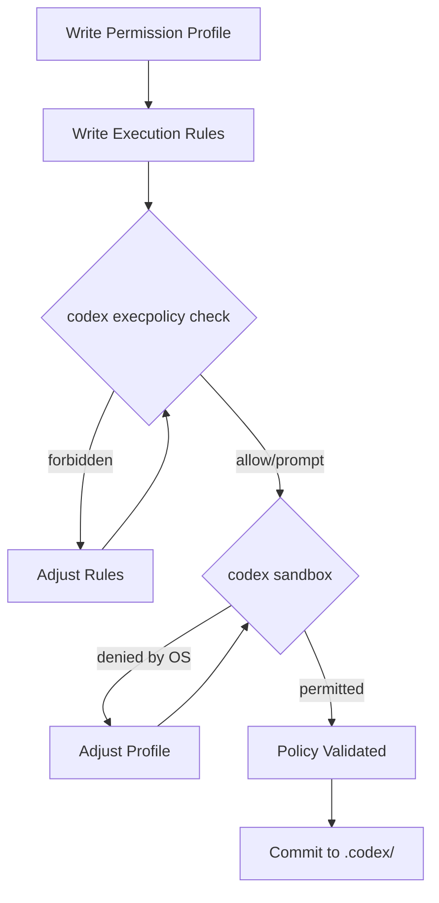

# Codex CLI Security Testing Tools: `codex sandbox`, `codex execpolicy`, and Offline Policy Validation


Codex CLI ships two subcommands that most developers never discover: `codex sandbox` and `codex execpolicy check`. Together, they let you validate your security configuration offline — running real commands under sandbox policies and testing execution rules against sample invocations — without starting an agent session or spending a single API token. For teams rolling out Codex CLI with governance requirements, these tools close the gap between writing a policy and knowing it actually works.

## The Problem: Untested Policies

Codex CLI's security model rests on two layers: **sandbox mode** (filesystem and network boundaries enforced by the OS) and **approval policy** (when Codex must pause for human authorisation) [^1]. On top of these sit **permission profiles** (named compositions of filesystem and network rules) and **execution policy rules** (Starlark-based command governance) [^2] [^3].

The challenge is that these policies are configuration — and configuration that is never tested is configuration that will fail when it matters. Before v0.125, the only way to verify a sandbox profile was to start an interactive session, prompt the agent to run a command, and observe whether it was allowed or denied. That feedback loop was slow, expensive, and non-deterministic.

The `codex sandbox` and `codex execpolicy check` subcommands solve this by providing deterministic, offline validation.

## `codex sandbox`: Running Commands Under Policy

The `codex sandbox` subcommand executes an arbitrary shell command under Codex's OS-enforced sandbox, using the same platform mechanisms that govern agent tool calls [^1]:

- **macOS**: Seatbelt sandbox profiles [^4]
- **Linux/WSL**: bubblewrap + seccomp with Landlock fallback [^4]
- **Windows**: Native restricted tokens and firewall rules, or WSL2 sandbox [^5]

### Basic Usage

```bash
# Run a command under the default workspace-write sandbox
codex sandbox -- ls -la /etc/passwd

# Run under a named permission profile
codex sandbox --permissions-profile ci-locked -- npm test

# Set working directory explicitly
codex sandbox -C /path/to/project -- cargo build
```

The command after `--` runs inside the sandbox exactly as it would during an agent session. If the sandbox denies an operation, the command fails — giving you immediate, deterministic feedback.

### Platform-Specific Flags

On macOS, two additional flags provide richer diagnostics:

```bash
# Log all sandbox denials to stderr
codex sandbox --log-denials -- curl https://example.com

# Allow access to a specific Unix socket (e.g., Docker)
codex sandbox --allow-unix-socket /var/run/docker.sock -- docker ps
```

The `--log-denials` flag is invaluable during profile development. Rather than a cryptic "Permission denied", you see exactly which Seatbelt operation was blocked, including the path, operation type, and the rule that triggered the denial [^4].

### Using Permission Profiles

The `--permissions-profile` flag loads a named profile from your configuration stack. Profiles are defined in `config.toml` under `[permissions.<name>]` tables [^2]:

```toml
[permissions.ci-locked]
default_permissions = "ci-locked"

[permissions.ci-locked.filesystem.":root"]
"." = "read"

[permissions.ci-locked.filesystem.":workspace_roots"]
"." = "write"
"**/*.env" = "deny"

[permissions.ci-locked.network]
enabled = true

[permissions.ci-locked.network.domain_rules]
"registry.npmjs.org" = "allow"
"github.com" = "allow"
"*" = "deny"
```

You can then validate this profile without running the agent:

```bash
# Should succeed: npm install reaches npmjs.org
codex sandbox --permissions-profile ci-locked -- npm install

# Should fail: curl to arbitrary host is denied
codex sandbox --permissions-profile ci-locked -- curl https://evil.example.com

# Should fail: reading .env files is denied
codex sandbox --permissions-profile ci-locked -- cat .env
```

### Including Managed Configuration

Enterprise teams using `requirements.toml` for fleet-wide policy enforcement can test how managed configuration composes with local profiles [^6]:

```bash
codex sandbox --permissions-profile ci-locked --include-managed-config -- npm test
```

This loads the managed requirements layer on top of the named profile, mirroring the exact sandbox state an agent would see in a managed deployment.

## `codex execpolicy check`: Validating Execution Rules

While `codex sandbox` tests OS-level containment, `codex execpolicy check` validates the Starlark-based execution policy rules that govern whether commands are allowed, prompted, or forbidden before the sandbox is even consulted [^3].

### How Execution Rules Work

Rules live in `.rules` files under `rules/` directories adjacent to active config layers [^3]:

```
~/.codex/rules/default.rules          # User-level rules
.codex/rules/project.rules            # Project-level rules (trusted projects only)
```

Each rule is a `prefix_rule()` call in Starlark:

```python
# Allow common git read operations
prefix_rule(
    pattern=["git", ["status", "log", "diff", "show", "branch"]],
    decision="allow",
    justification="Read-only git operations are safe",
    match=["git status", "git log --oneline"],
)

# Forbid force-push
prefix_rule(
    pattern=["git", "push", "--force"],
    decision="forbidden",
    justification="Force-push is destructive and banned by team policy",
    match=["git push --force origin main"],
)

# Require approval for package installation
prefix_rule(
    pattern=["npm", "install"],
    decision="prompt",
    justification="Package installation should be reviewed",
    match=["npm install lodash"],
)
```

### Testing Rules Offline

The `codex execpolicy check` command evaluates a command against one or more rule files and emits a JSON verdict:

```bash
codex execpolicy check \
  --rules ~/.codex/rules/default.rules \
  --pretty \
  -- git push --force origin main
```

Output:

```json
{
  "decision": "forbidden",
  "matching_rules": [
    {
      "pattern": ["git", "push", "--force"],
      "decision": "forbidden",
      "justification": "Force-push is destructive and banned by team policy"
    }
  ]
}
```

The `--pretty` flag formats the JSON for human readability. Without it, you get compact JSON suitable for piping into `jq` or other automation [^3].

### Stacking Multiple Rule Files

The `--rules` flag is repeatable, letting you test how user-level and project-level rules compose:

```bash
codex execpolicy check \
  --rules ~/.codex/rules/default.rules \
  --rules .codex/rules/project.rules \
  --pretty \
  -- rm -rf node_modules
```

When multiple rules match, the strictest decision wins: `forbidden` beats `prompt`, which beats `allow` [^3].

### Shell Script Handling

Execution policy evaluation handles shell scripts intelligently. For "safe" scripts — those using only plain words and safe operators (`&&`, `||`, `;`, `|`) — Codex splits the chain and evaluates each command independently [^3]:

```bash
# Each command in the chain is evaluated separately
codex execpolicy check --pretty --rules rules.rules \
  -- "npm test && git add . && git commit -m 'fix tests'"
```

For scripts with advanced features (redirects, variable expansion, subshells), the entire invocation is treated as a single opaque command [^3].

## Combining Both Tools in Practice

The real power emerges when you use both subcommands together in a validation workflow:



### CI Pipeline Integration

Both tools exit with meaningful codes, making them suitable for CI gates. A GitHub Actions workflow that validates security policy on every PR:

```yaml
name: Validate Codex Security Policy
on:
  pull_request:
    paths:
      - '.codex/rules/**'
      - '.codex/config.toml'

jobs:
  validate-policy:
    runs-on: ubuntu-latest
    steps:
      - uses: actions/checkout@v4
      - name: Install Codex CLI
        run: npm i -g @openai/codex

      - name: Validate execution rules
        run: |
          # Test that allowed commands pass
          codex execpolicy check \
            --rules .codex/rules/default.rules \
            -- git status
          codex execpolicy check \
            --rules .codex/rules/default.rules \
            -- npm test

          # Test that forbidden commands are blocked
          ! codex execpolicy check \
            --rules .codex/rules/default.rules \
            -- rm -rf /
          ! codex execpolicy check \
            --rules .codex/rules/default.rules \
            -- git push --force

      - name: Validate sandbox profile
        run: |
          codex sandbox --permissions-profile ci-locked \
            -- echo "sandbox permits echo"
```

### Table-Driven Validation

For comprehensive policy testing, a shell script that validates a matrix of commands against expected decisions:

```bash
#!/usr/bin/env bash
set -euo pipefail

RULES="--rules .codex/rules/default.rules"
FAIL=0

validate() {
  local expected="$1"; shift
  local actual
  actual=$(codex execpolicy check $RULES -- "$@" 2>/dev/null \
    | jq -r '.decision')
  if [[ "$actual" != "$expected" ]]; then
    echo "FAIL: expected=$expected actual=$actual cmd=$*"
    FAIL=1
  else
    echo "PASS: $expected — $*"
  fi
}

validate "allow"     git status
validate "allow"     git log --oneline
validate "allow"     npm test
validate "prompt"    npm install lodash
validate "forbidden" git push --force origin main
validate "forbidden" rm -rf /

exit $FAIL
```

## The `host_executable()` Function

For security-critical commands, execution rules can pin to specific executable paths using `host_executable()` [^3]:

```python
prefix_rule(
    pattern=[host_executable("/usr/bin/git"), "push"],
    decision="prompt",
    justification="Only the system git binary is trusted for push",
)
```

This prevents an attacker from placing a malicious `git` earlier in `$PATH`. You can verify the resolution with `codex execpolicy check`:

```bash
# This uses the system git — should match the rule
codex execpolicy check --rules rules.rules --pretty -- /usr/bin/git push

# This uses a different path — may not match
codex execpolicy check --rules rules.rules --pretty -- ./malicious-git push
```

## Limitations and Caveats

Several boundaries are worth noting:

- **`codex sandbox` requires platform support**: On Linux, `bubblewrap` must be installed. On Ubuntu 24.04, AppArmor profile loading may be needed for user namespace creation [^4].
- **`codex execpolicy` is preview**: The Starlark rules system is labelled experimental and may change [^3].
- **Permission profiles do not govern MCP servers or browser tools**: The sandbox applies only to local command execution, not to app connectors, MCP tool calls, or computer-use surfaces [^2].
- **Deny-read glob patterns on Linux require `glob_scan_max_depth`**: Unbounded `**` patterns must specify a scan depth to pre-expand matches before sandbox startup [^2].
- **`codex sandbox` does not test approval policy**: It tests OS-level containment only. Approval flow behaviour (whether the TUI would prompt) is not exercised.

## When to Use Each Tool

| Scenario | Tool |
|----------|------|
| Verify filesystem deny rules block `.env` access | `codex sandbox` |
| Verify network domain allowlist permits npm registry | `codex sandbox` |
| Confirm `git push --force` is forbidden by policy | `codex execpolicy check` |
| Test rule precedence across user and project layers | `codex execpolicy check` |
| CI gate on security policy changes | Both |
| Debug macOS Seatbelt denials | `codex sandbox --log-denials` |
| Validate managed enterprise requirements compose correctly | `codex sandbox --include-managed-config` |

## Conclusion

`codex sandbox` and `codex execpolicy check` transform security policy from hope-based configuration into testable infrastructure. They cost nothing to run — no API calls, no tokens, no agent sessions — and they fit naturally into CI pipelines. If you are deploying Codex CLI with any governance requirements, these two commands should be the first thing you reach for after writing your policies.

## Citations

[^1]: [Agent Approvals & Security — Codex, OpenAI Developers](https://developers.openai.com/codex/agent-approvals-security)
[^2]: [Permissions — Codex, OpenAI Developers](https://developers.openai.com/codex/permissions)
[^3]: [Rules — Codex, OpenAI Developers](https://developers.openai.com/codex/rules)
[^4]: [Sandbox — Codex, OpenAI Developers](https://developers.openai.com/codex/concepts/sandboxing)
[^5]: [Windows Sandbox Engineering — Codex CLI, Codex Resources](https://codex.danielvaughan.com/2026/05/14/codex-cli-windows-sandbox-engineering/)
[^6]: [Enterprise Managed Configuration — Codex CLI, Codex Resources](https://codex.danielvaughan.com/2026/05/11/codex-cli-enterprise-managed-configuration/)
