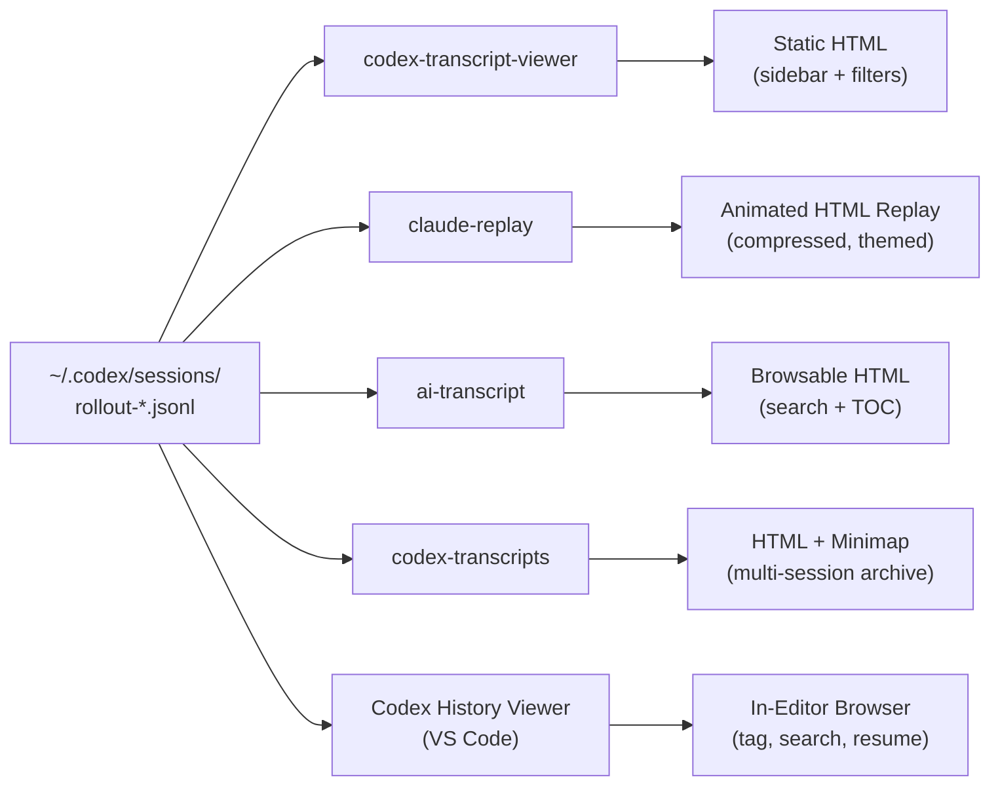

# Codex CLI Session Transcripts: JSONL Format, Replay Tools, and Audit Analysis


Every Codex CLI session generates a complete JSONL transcript — every prompt, model response, tool call, approval decision, and token counter, timestamped and persisted to disc. Most developers ignore these files until something goes wrong. That is a mistake. Session transcripts are the richest source of truth for debugging agent failures, auditing what an agent actually did, optimising token spend, and sharing reproducible context with teammates. This article covers the transcript format itself, the growing ecosystem of community replay and viewer tools, and practical patterns for extracting value from your session history.

## Where Transcripts Live

Codex CLI writes one JSONL file per session under `$CODEX_HOME/sessions/`, organised by date [^1]:

```
~/.codex/sessions/
  2026/
    05/
      21/
        rollout-2026-05-21T09-14-33-a1b2c3d4.jsonl
        rollout-2026-05-21T11-42-07-e5f6a7b8.jsonl
```

The filename encodes the session start timestamp and a UUID fragment. The `codex resume` command reads these files to reconstruct prior conversations [^2], and the `/status` slash command displays the active session ID.

`$CODEX_HOME` defaults to `~/.codex` on macOS and Linux. On Windows, it follows `%APPDATA%\codex\` [^1].

## The JSONL Event Schema

When running `codex exec --json`, the same event stream that gets persisted to the rollout file is emitted to stdout as JSON Lines [^3]. Each line is a self-contained JSON object with a `type` field. The principal event types are:

| Event Type | Purpose |
|---|---|
| `thread.started` | Session initialisation; contains `thread_id` |
| `turn.started` | A new model turn begins |
| `item.started` / `item.completed` | Individual actions within a turn |
| `turn.completed` | Turn finished; contains `usage` object |
| `turn.failed` | Turn errored out |
| `error` | Top-level error event |

### Item Types

The `item` payload carried by `item.started` and `item.completed` events uses a `type` field to distinguish action kinds [^3] [^4]:

```json
{
  "type": "item.completed",
  "item": {
    "id": "item_3",
    "type": "command_execution",
    "command": "bash -lc 'cargo test'",
    "aggregated_output": "running 42 tests\ntest result: ok.",
    "exit_code": 0,
    "status": "completed"
  }
}
```

The documented item types are:

- **`agent_message`** — Model text output. Field: `text` [^3].
- **`command_execution`** — Shell command. Fields: `command`, `aggregated_output`, `exit_code`, `status` [^4].
- **`file_change`** — Patch application. Fields: `changes[].path`, `changes[].kind` (`add`, `delete`, `update`), `status` [^4].
- **`mcp_tool_call`** — MCP server tool invocation. Fields: `server`, `tool`, `arguments`, `result`, `error`, `status` [^4].
- **`reasoning`** — Chain-of-thought summary [^3].
- **`web_search`** — Web search action [^3].
- **`plan_update`** — Plan step progression [^3].

⚠️ The schema evolved between early 2026 releases: `item_type` was renamed to `type`, and `assistant_message` became `agent_message` [^4]. Community tools handle both variants, but if you are writing custom parsers, check for both.

### Token Usage

`turn.completed` events include a `usage` object [^3]:

```json
{
  "type": "turn.completed",
  "usage": {
    "input_tokens": 24763,
    "cached_input_tokens": 24448,
    "output_tokens": 122,
    "reasoning_output_tokens": 0
  }
}
```

The `reasoning_output_tokens` field was surfaced in v0.131.0 [^5], enabling accurate cost attribution for reasoning-heavy models like o4-mini.

## The Replay and Viewer Ecosystem

A healthy community ecosystem has emerged for converting raw JSONL transcripts into shareable, browsable artefacts. The four principal tools as of May 2026 are summarised below.



### codex-transcript-viewer

A Python CLI that converts a single JSONL file into a self-contained HTML viewer with no external dependencies [^6]. The output renders user messages, agent responses, tool calls with expandable output, reasoning summaries, system events, and token counters. A sidebar offers text search and preset filters (Default, No tools, User only, Answers, All).

```bash
uv tool install codex-transcript-viewer
codex-transcript-viewer ~/.codex/sessions/2026/05/21/rollout-*.jsonl
open rollout-*.html
```

Best for: **quick single-session review** — the output is lightweight enough to attach to a pull request or incident report.

### claude-replay

Despite the name, claude-replay auto-detects Codex CLI JSONL and maps Codex tool calls to a normalised vocabulary (`exec_command` → `Bash`, `apply_patch` → `Edit`/`Write`) [^7]. This cross-agent normalisation is its distinguishing feature: teams running both Codex and Claude Code get a consistent replay format.

Key CLI flags:

```bash
claude-replay ~/.codex/sessions/2026/05/21/rollout-*.jsonl \
  -o replay.html \
  --theme tokyo-night \
  --speed 2 \
  --no-thinking \
  --redact "ghp_.*" \
  --turns 5-15
```

Transcript data is deflate-compressed and base64-encoded into the HTML, reducing file size by 60–70% [^7]. The `--watch` flag monitors the source file for live regeneration during active sessions.

Best for: **cross-agent teams** needing a single viewer format, and **sharing externally** with compressed, redacted replays.

### ai-transcript

A lightweight Python tool (no mandatory dependencies) that renders Codex and Claude Code sessions into standalone HTML with full-text search across turns and an auto-expanding sidebar table of contents [^8]. Supports parallel rendering for batch processing (`--recent 20`), PII redaction, and layout/typography customisation.

```bash
codex-transcript ~/.codex/sessions/2026/05/21/rollout-*.jsonl -o transcript.html
```

Best for: **bulk rendering** of session archives with privacy controls.

### codex-transcripts

Adapted from Simon Willison's `claude-code-transcripts` project [^9], this tool generates single-file HTML viewers with fold/unfold sections, a minimap with range filtering, search, and keyboard shortcuts (press `?` to see them). Multi-session selection produces an archive page linking to individual viewers.

```bash
uvx codex-transcripts  # interactive picker
```

It also offers an experimental TUI viewer for in-terminal browsing and can publish transcripts as GitHub Gists.

Best for: **navigating large sessions** with the minimap, and **publishing transcripts** to Gists.

### Codex History Viewer (VS Code Extension)

For developers who prefer staying in-editor, the Codex History Viewer extension (v2.2.0, released 21 May 2026) provides a chronological tree browser, full-text search with regex and boolean operators, tagging, pinning, and — critically — the ability to resume sessions directly through the official Codex VS Code extension [^10]. It also supports cross-agent handoff between Codex and Claude Code sessions.

Best for: **daily workflow integration** — browsing, tagging, and resuming past sessions without leaving the editor.

## Practical Patterns

### Pattern 1: Post-Incident Audit Trail

When an agent makes an unexpected change in production, the rollout JSONL is your forensic record. Extract every `file_change` event to see exactly what was modified:

```bash
jq 'select(.type == "item.completed" and .item.type == "file_change")' \
  rollout-*.jsonl
```

Pipe the output into your incident management system or attach the rendered HTML to a post-mortem document.

### Pattern 2: Token Cost Analysis

Aggregate `turn.completed` events to build a per-session cost breakdown:

```bash
jq -s '[.[] | select(.type == "turn.completed") | .usage] |
  { total_input: (map(.input_tokens) | add),
    total_cached: (map(.cached_input_tokens) | add),
    total_output: (map(.output_tokens) | add),
    total_reasoning: (map(.reasoning_output_tokens) | add) }' \
  rollout-*.jsonl
```

The `cached_input_tokens` field reveals how much context was served from the prompt cache — a direct measure of whether your `AGENTS.md` and project context are being reused efficiently.

### Pattern 3: Tool Call Frequency Profiling

Identify which tools an agent reaches for most often across a week of sessions:

```bash
jq -r 'select(.type == "item.completed") | .item.type' \
  ~/.codex/sessions/2026/05/*/rollout-*.jsonl | sort | uniq -c | sort -rn
```

If `command_execution` dominates and `file_change` is low, the agent may be spending excessive turns on exploratory shell commands rather than making direct edits — a signal to refine your `AGENTS.md` instructions.

### Pattern 4: Shareable Session Replays for Code Review

Generate a redacted replay and link it in a pull request description so reviewers can see the agent's reasoning:

```bash
claude-replay rollout-*.jsonl \
  --redact "OPENAI_API_KEY=.*" \
  --redact "ghp_.*" \
  --no-thinking \
  -o session-replay.html
```

This is particularly valuable for teams adopting agentic workflows where reviewers need to understand *why* the agent made specific architectural decisions [^7].

### Pattern 5: Regression Detection Across Sessions

Compare tool call trajectories between a known-good session and a failing one. Export both to JSON, diff the `item.type` sequences, and look for divergence points:

```bash
jq -r 'select(.type | startswith("item.")) | "\(.type) \(.item.type // "")"' \
  good-session.jsonl > trajectory-good.txt
jq -r 'select(.type | startswith("item.")) | "\(.type) \(.item.type // "")"' \
  bad-session.jsonl > trajectory-bad.txt
diff trajectory-good.txt trajectory-bad.txt
```

## Known Limitations

- **No official export command.** Codex CLI does not ship a built-in transcript exporter [^2]. The community tools fill this gap, but expect occasional breakage when the JSONL schema evolves.
- **Rollout file durability.** A known issue (GitHub #21196) documents cases where rollout JSONL files are lost whilst thread metadata persists, causing `resume` failures [^11]. Back up `~/.codex/sessions/` if session history matters to your workflow.
- **Schema instability.** The event schema is not formally versioned. Field renames (`item_type` → `type`, `assistant_message` → `agent_message`) have broken parsers in the past [^4]. Defensive parsing with fallback field lookups is recommended.
- **No built-in redaction.** Sensitive data (API keys, tokens, file contents) appears in plain text in rollout files. Use community tools' `--redact` flags before sharing, or configure your shell environment to avoid leaking secrets into command output.

## Conclusion

Codex CLI session transcripts are an underused asset. The JSONL format is straightforward to parse, the community tooling is mature enough for production use, and the patterns above require nothing more than `jq` and a browser. Whether you need forensic audit trails, cost analysis, or shareable session replays for code review, the data is already sitting in `~/.codex/sessions/` — waiting to be read.

## Citations

[^1]: [Codex CLI Features — Session Storage](https://developers.openai.com/codex/cli/features) — OpenAI Developer Documentation, 2026.
[^2]: [Codex CLI Reference — Resume](https://developers.openai.com/codex/cli/reference) — OpenAI Developer Documentation, 2026.
[^3]: [Non-interactive Mode — codex exec --json](https://developers.openai.com/codex/noninteractive) — OpenAI Developer Documentation, 2026.
[^4]: [Codex exec --json Event Cheatsheet](https://takopi.dev/reference/runners/codex/exec-json-cheatsheet/) — takopi.dev, 2026.
[^5]: [Codex Changelog — v0.131.0](https://developers.openai.com/codex/changelog) — OpenAI Developer Documentation, May 2026.
[^6]: [codex-transcript-viewer — GitHub](https://github.com/masonc15/codex-transcript-viewer) — masonc15, 2026.
[^7]: [claude-replay — GitHub](https://github.com/es617/claude-replay) — es617, 2026.
[^8]: [ai-transcript — GitHub](https://github.com/forhadahmed/ai-transcript) — forhadahmed, 2026.
[^9]: [codex-transcripts — GitHub](https://github.com/prateek/codex-transcripts) — prateek, 2026.
[^10]: [Codex History Viewer — VS Code Marketplace](https://marketplace.visualstudio.com/items?itemName=hiztam.codex-history-viewer) — HizTam, v2.2.0, May 2026.
[^11]: [GitHub Issue #21196 — Data loss: resumed-thread errors due to missing rollout JSONL files](https://github.com/openai/codex/issues/21196) — openai/codex, May 2026.
