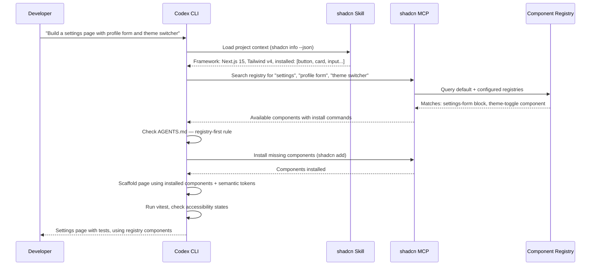

# Codex CLI + shadcn/ui: Agent-Driven Design System Workflows with MCP Server, Skills, and CLI v4


---

The shadcn/ui March 2026 release — CLI v4, the official skills system, and the shadcn MCP server — turned what was already the most popular component toolkit in the React ecosystem into the first design system explicitly optimised for agentic development [^1]. Codex CLI can now discover, install, review, and scaffold shadcn components without the developer ever opening a browser or reading a docs page.

This article covers the three integration layers — MCP server for tool-level registry access, the shadcn skill for context injection, and AGENTS.md conventions for design system governance — and shows how they compose into a production workflow where Codex CLI becomes a design-system-aware frontend collaborator.

## Why This Matters

Frontend component work is one of the highest-friction tasks for coding agents. Without design system context, agents generate inconsistent markup: raw Tailwind colour values instead of semantic tokens, custom implementations instead of existing registry components, and Card wrappers around everything [^2]. The shadcn/ui integration stack solves this by giving Codex CLI three things it previously lacked: a searchable component catalogue, project-specific configuration awareness, and pattern enforcement rules.

## Layer 1: The shadcn MCP Server

The shadcn MCP server exposes the full component registry as a set of tools that Codex CLI can call during sessions [^3]. It bridges natural language requests to registry operations: browsing available components, searching across multiple registries, and installing components into the project.

### Configuration

Add the server to your Codex CLI configuration:

```toml
# ~/.codex/config.toml (user-level)
# or .codex/config.toml (project-level)

[mcp_servers.shadcn]
command = "npx"
args = ["shadcn@latest", "mcp"]
```

For team projects, prefer the project-level `.codex/config.toml` so every developer — and every CI run — gets the same MCP tooling [^4].

### What the MCP Server Provides

The server exposes tools for:

- **Component browsing** — list all available components, blocks, and templates from any configured registry
- **Cross-registry search** — find components by name or functionality across the default registry and any private or third-party registries configured in `components.json`
- **Natural-language installation** — add components using conversational prompts, with the server translating to the correct `shadcn add` invocations
- **Documentation lookup** — fetch component docs, examples, and API references directly from the registry

### Private Registry Support

Configure additional registries in your project's `components.json`:

```json
{
  "registries": {
    "@acme": "https://registry.acme.com/{name}.json"
  }
}
```

Authentication for private registries uses environment variables in `.env.local`, which Codex CLI can read when the sandbox permits file system access [^3].

### Practical Impact

Without the MCP server, asking Codex CLI to "add a data table with sorting and pagination" produces a bespoke implementation. With it, the agent first searches the registry, finds the existing `data-table` block (which bundles Table, DropdownMenu, and column helpers), and installs it — preserving your theme tokens and avoiding redundant code.

## Layer 2: The shadcn Skill

While the MCP server handles tool-level operations, the shadcn skill provides *context* — the project configuration, component conventions, and CLI command knowledge that Codex CLI needs to make correct decisions [^5].

### Installation

```bash
pnpm dlx skills add shadcn/ui
```

This creates a skill file that Codex CLI loads automatically when it detects a `components.json` in the project root.

### How the Skill Works

On each interaction, the skill executes `shadcn info --json` and injects the result into the agent's context [^1]. This provides:

| Context Field | Example Value | Agent Benefit |
|---|---|---|
| Framework | `next` / `vite` / `remix` | Correct import paths and routing patterns |
| Tailwind version | `4` | Uses v4 `@theme` syntax, not v3 `@apply` chains |
| Base library | `radix` / `base` | Correct primitive APIs |
| Icon library | `lucide` | Consistent icon imports |
| Installed components | `["button", "card", "dialog", ...]` | Reuses existing components instead of re-adding |
| Path aliases | `@/components/ui` | Correct import resolution |

The skill also provides complete CLI command reference covering `init`, `add`, `search`, `view`, `docs`, `diff`, `info`, and `build` — including flags, dry-run capabilities, and smart merge workflows [^5].

### The Discovery-Before-Creation Pattern

The skill enforces a critical behavioural rule: *search the registry before generating code*. When Codex CLI encounters a UI request, the skill ensures it runs `shadcn search` or uses the MCP tools to check for existing components before writing a single line of JSX [^6]. This prevents the most common agent failure mode in frontend work — reinventing components that already exist in the project's configured registries.

## Layer 3: AGENTS.md Design System Governance

The MCP server and skill handle tooling and context. AGENTS.md handles *governance* — the rules that ensure Codex CLI's output matches your team's design system conventions [^7].

### A Production AGENTS.md Template

```markdown
# Frontend Conventions

## Stack
- React 19, TypeScript strict mode
- Next.js 15 (App Router)
- Tailwind CSS v4 with OKLCH colour system
- shadcn/ui for all component primitives
- Vitest + Testing Library for unit tests
- Playwright for browser automation

## Component Rules
- Functional components only — no class components
- Do NOT add useMemo/useCallback by default; trust the React Compiler
- Use shadcn/ui components when they add real structure or accessible behaviour
- Do NOT wrap every region in Card — use Card only for meaningful grouped objects
- Use semantic colour tokens (text-muted-foreground, bg-card) — never raw Tailwind values
- All custom components MUST include data-slot attributes for styling hooks

## Completion Criteria
A frontend task is complete only when:
1. Design plan is produced before code
2. Component tree is explicitly stated
3. States are implemented: hover, loading, empty, error, disabled, focus-visible, mobile, overflow
4. Accessibility: focus management, aria attributes, keyboard navigation
5. `pnpm vitest run` passes
6. `pnpm playwright test` passes (if E2E tests exist)

## Registry Workflow
1. ALWAYS run `shadcn search <term>` before creating a new component
2. If a registry component exists, use `shadcn add <component>` — do not copy-paste
3. For registry updates, use `shadcn diff` to review changes before merging
4. For new shared components, follow registry:item format for team distribution
```

### Subdirectory Overrides

For monorepo setups, place a more specific `AGENTS.md` in each application directory. A design system package might have stricter rules (no application-specific logic, mandatory Storybook stories), while the consuming application has looser constraints:

```
apps/
  web/AGENTS.md          # Application rules
  admin/AGENTS.md        # Admin panel conventions
packages/
  ui/AGENTS.md           # Design system package rules — stricter
```

## The Complete Workflow

When all three layers are active, a typical Codex CLI frontend session follows this flow:



## CLI v4 Inspection Flags for Agent Workflows

shadcn CLI v4 introduced three inspection flags that are particularly valuable in agentic workflows [^1]:

- **`--dry-run`** — simulates what `shadcn add` will write without touching the file system. Codex CLI can use this in plan mode to show the developer exactly which files will be created or modified before committing to the installation.
- **`--diff`** — compares registry versions against local modifications. Essential for keeping forked components in sync with upstream updates without losing custom changes.
- **`--view`** — inspects the raw payload a registry item will add. Useful for Codex CLI to verify that a third-party registry component meets security and quality standards before installation.

In a PostToolUse hook, you can gate component installations behind a dry-run check:

```toml
# .codex/config.toml
[[hooks]]
event = "PostToolUse"
match_tool = "shell"
match_content = "shadcn add"
command = "echo 'Component installed — verify with: shadcn diff'"
```

## Community Skills: Component Discovery and Review

Beyond the official shadcn skill, the community `shadcn-skills` package provides two specialised skills [^6]:

**Component Discovery** activates when working on tables, forms, modals, or animations. It searches over 30 community registries beyond the project's configured `components.json`, returning the top two or three matches with ready-to-use installation commands.

**Component Review** audits custom components against shadcn design patterns, checking:

- **Structure** — `data-slot` attributes and primitive composition patterns
- **Spacing** — flex/grid gap usage rather than margin utilities
- **Design tokens** — semantic colours (`text-muted-foreground`, `bg-card`) instead of raw Tailwind values
- **Composability** — `className` composition and variant patterns via `cva`
- **Accessibility** — mobile-first design, touch targets, focus states, `prefers-reduced-motion`

The review adapts to five visual themes (Vega, Nova, Maia, Lyra, Mira) based on the project's preset configuration [^6].

## Registry:base — Distributing Entire Design Systems

CLI v4's `registry:base` type allows distributing a complete design system as a single installable payload: components, dependencies, CSS variables, fonts, and configuration [^1]. This is transformative for teams using Codex CLI across multiple projects:

```bash
# Initialise a new project with your team's design system
pnpm dlx shadcn@latest init --preset ACME-2026

# Or apply a preset to an existing project
pnpm dlx shadcn@latest init --preset ACME-2026 --overwrite
```

When Codex CLI encounters a project initialised from a `registry:base` preset, the skill automatically picks up the full configuration — colours, typography scale, spacing tokens, and component variants — ensuring every agent-generated component stays on-brand.

## Presets and the shadcn/create Workflow

The Presets engine compresses design system configuration into shareable codes [^1]. You build a preset on `shadcn/create`, preview it live, and grab the code. This code encapsulates colours, themes, icon library, fonts, and border radius settings.

For teams, this means a design lead can craft the visual language in the browser, export a preset code, and every developer's Codex CLI session inherits those decisions automatically through `shadcn info --json`.

## Common Pitfalls

**Over-wrapping with Card.** Agents default to wrapping every section in a Card component. Enforce the rule in AGENTS.md: Card is for meaningful grouped objects, not layout regions [^2].

**Raw Tailwind values.** Without the skill, agents use `text-gray-500` instead of `text-muted-foreground`. The skill's context injection and the component review skill both catch this, but the AGENTS.md rule provides the authoritative constraint.

**Ignoring installed components.** Agents sometimes generate a custom modal when Dialog is already installed. The skill's `shadcn info --json` output includes the installed component list, but you should also add an explicit AGENTS.md rule: "Check installed components before creating new UI primitives."

**Tailwind v3 syntax in v4 projects.** Without version context, agents generate `@apply` chains and `theme()` functions that are deprecated in Tailwind v4. The skill resolves this by injecting the Tailwind version, but verify your AGENTS.md also specifies the version explicitly.

## Cost and Performance Considerations

The shadcn MCP server adds a tool-call round trip for each registry search or install. In practice, this adds 1–3 seconds per operation — negligible compared to the time saved by avoiding manual component selection.

For `codex exec` batch workflows (such as scaffolding multiple pages), consider pre-installing required components in a setup step to avoid repeated MCP calls:

```bash
# Pre-install components before the batch run
shadcn add button card dialog input table tabs

# Then run the batch scaffold
codex exec "Scaffold the five admin pages listed in specs/admin-pages.md"
```

## Conclusion

The shadcn/ui integration stack — MCP server for registry tools, the official skill for project context, and AGENTS.md for design system governance — turns Codex CLI into a design-system-aware frontend agent. Components are discovered before they are reinvented, semantic tokens replace hardcoded values, and every generated component follows the team's established patterns.

The key insight is that these three layers serve different purposes and all three are needed: the MCP server provides *capability* (the agent can search and install), the skill provides *knowledge* (the agent understands the project's configuration), and AGENTS.md provides *intent* (the agent knows what the team considers correct). Remove any one layer and the workflow degrades — capable but uninformed, informed but unable to act, or active but undirected.

---

## Citations

[^1]: shadcn/ui, "March 2026 - shadcn/cli v4," shadcn/ui Changelog, March 2026. [https://ui.shadcn.com/docs/changelog/2026-03-cli-v4](https://ui.shadcn.com/docs/changelog/2026-03-cli-v4)

[^2]: wzx2002, "codex-frontend-skill SKILL.md — Frontend component conventions for Codex CLI," GitHub, 2026. [https://github.com/wzx2002/codex-frontend-skill/blob/main/SKILL.md](https://github.com/wzx2002/codex-frontend-skill/blob/main/SKILL.md)

[^3]: shadcn/ui, "MCP Server — shadcn/ui documentation," 2026. [https://ui.shadcn.com/docs/mcp](https://ui.shadcn.com/docs/mcp)

[^4]: OpenAI, "Advanced Configuration — Codex CLI," OpenAI Developers, 2026. [https://developers.openai.com/codex/config-advanced](https://developers.openai.com/codex/config-advanced)

[^5]: shadcn/ui, "Skills — shadcn/ui documentation," 2026. [https://ui.shadcn.com/docs/skills](https://ui.shadcn.com/docs/skills)

[^6]: mattbx, "shadcn-skills — Skills for building better shadcn/ui apps," GitHub, 2026. [https://github.com/mattbx/shadcn-skills](https://github.com/mattbx/shadcn-skills)

[^7]: OpenAI, "Agent Skills — Codex CLI," OpenAI Developers, 2026. [https://developers.openai.com/codex/skills](https://developers.openai.com/codex/skills)
