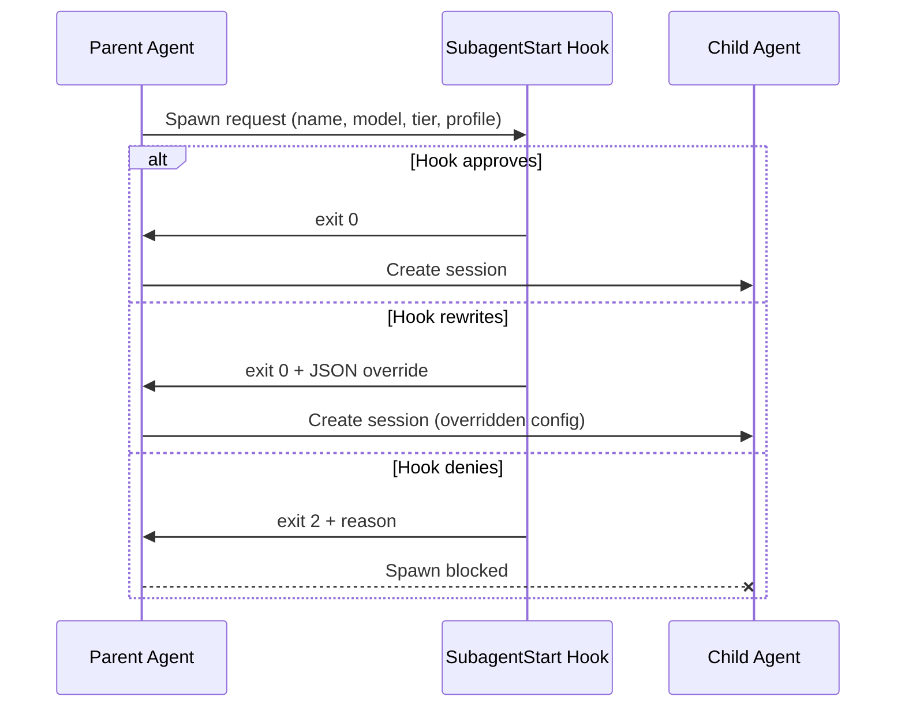
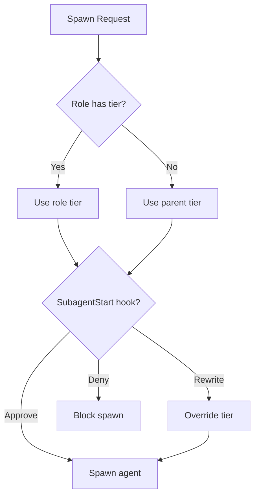

# Codex CLI v0.133.0-alpha: SubagentStart Hooks, Goal DB, and Permission Profile APIs — Signals for Multi-Agent Orchestration


---

Between the stable v0.132.0 release on 20 May 2026 and the same evening, OpenAI shipped three alpha pre-releases — v0.133.0-alpha.1 through alpha.3 — containing roughly 58 commits [^1]. None of these features are stable. All carry the usual alpha caveats. But taken together, they sketch a coherent direction: Codex CLI is evolving from a tool that *runs* subagents into a platform that *governs* them.

This article dissects the key signals in the alpha channel: a SubagentStart lifecycle hook for spawn-time orchestration gates, a dedicated goal database for persistent cross-session goal tracking, permission profile list and picker APIs for programmatic profile discovery, role-defined spawn service tiers for per-role cost control, context baselines for full-history agent forks, plugin ID in MCP tool metadata for provenance audit, and a package builder for distributable Codex packages.

> **Alpha warning:** Every feature discussed here is pre-release and subject to change or removal. Pin to a stable release for production workloads.

## The Orchestration Gap in v0.132

Codex CLI v0.132.0 shipped multi-agent collaboration as a mature feature set: `spawn_agent`, `send_input`, `resume_agent`, `wait_agent`, and `close_agent` [^2]. Subagents inherit their parent's sandbox policy. The `agents.max_threads` cap (default 6) and `agents.max_depth` (default 1) provide basic guardrails [^3].

What v0.132 lacked was *spawn-time governance* — the ability to intercept, inspect, and conditionally gate agent creation before the child session starts burning tokens. In a fleet of eight subagents (the current per-developer cap), an unchecked spawn against the wrong model tier or with insufficient permissions can waste both money and context window.

## SubagentStart Hook

The alpha introduces `SubagentStart` as a new hook event type, complementing the existing `SessionStart`, `PreToolUse`, `PostToolUse`, `PermissionRequest`, `UserPromptSubmit`, and `Stop` events [^4]. Where `SessionStart` fires when a *session* begins, resumes, or is cleared, `SubagentStart` fires specifically when a subagent is about to be spawned.

```toml
[hooks.SubagentStart]
matcher = "worker"

[[hooks.SubagentStart.hooks]]
type = "command"
command = "scripts/validate-spawn.sh"
timeout = 5000
statusMessage = "Validating subagent spawn..."
```

The hook receives the proposed agent name, model, service tier, and permission profile as environment variables. The script can:

- **Approve** (exit 0) — spawn proceeds
- **Deny** (exit 2) — spawn is blocked, error surfaced to the parent
- **Rewrite** (exit 0 with JSON on stdout) — override the model, tier, or profile before spawn

This pattern mirrors how `PreToolUse` already gates tool execution [^5], but operates at the orchestration layer rather than the tool layer.

### Why This Matters

For enterprise teams running Codex CLI in CI pipelines via `codex exec`, SubagentStart hooks enable:

1. **Cost gates** — reject spawns requesting `fast` tier when the pipeline budget allows only `flex`
2. **Model governance** — enforce that worker agents use `o4-mini` rather than `o3` for routine tasks
3. **Audit logging** — emit structured spawn events to an observability pipeline before any child session starts



## Dedicated Goal Database

Codex v0.131.0 introduced persisted `/goal` workflows with app-server APIs, model tools, and TUI controls for create, pause, resume, and clear [^6]. The alpha takes this further with a dedicated goal database — a local SQLite store that persists goal state independently of individual sessions.

Previously, goal state was tied to the session that created it. If a session ended or was cleared, goal context was lost unless explicitly resumed. The dedicated goal DB decouples goal lifecycle from session lifecycle, enabling:

- **Cross-session goal continuity** — start a goal in one terminal session, resume it hours later in another
- **Goal queries from subagents** — child agents can read parent goals without full-history forking
- **Smart halting** — the existing goal continuation feature (which pauses on usage limits or blockers) now persists halt state to the DB, surviving process restarts [^7]

The goal DB is stored alongside existing Codex state at `~/.codex/goals.db` and is queryable through the existing `codex exec` automation surface.

## Permission Profile List and Picker APIs

v0.132.0 expanded permission profiles with built-in defaults (`:read-only`, `:workspace`, `:danger-full-access`), sandbox CLI profile selection, and active-profile metadata for clients [^8]. The alpha adds two programmatic APIs:

### Profile List API

A new `codex profiles list` subcommand (and corresponding SDK method) returns all available profiles — built-in, user-defined, and organisation-enforced — as structured JSON:

```bash
codex profiles list --json
```

```json
[
  {
    "name": ":workspace",
    "source": "built-in",
    "filesystem": { "**": "read", ".": "write" },
    "network": { "enabled": false }
  },
  {
    "name": "ci-pipeline",
    "source": "user",
    "filesystem": { "**": "read", "./dist": "write", "**/*.env": "deny" },
    "network": { "enabled": true, "domains": { "registry.npmjs.org": "allow" } }
  }
]
```

### Profile Picker API

The picker API surfaces profile metadata in a format consumable by TUI selectors, IDE extensions, and MCP clients. This enables tools to present profile choices contextually — for example, a CI harness can auto-select a profile based on the pipeline stage without hardcoding profile names.

Together, these APIs enable the pattern of *programmatic profile discovery before spawn*, which pairs directly with SubagentStart hooks: the hook script can query available profiles, select the most restrictive one that satisfies the task requirements, and rewrite the spawn configuration accordingly.

## Role-Defined Spawn Service Tiers

Codex already supports a global `service_tier` setting (`flex` or `fast`) and per-profile tier overrides [^9]. The alpha extends this to agent roles: each named agent definition can specify its own service tier preference.

```toml
[agents.worker]
description = "Execution-heavy implementation"
config_file = "worker-config.toml"
service_tier = "flex"

[agents.explorer]
description = "Read-heavy codebase analysis"
config_file = "explorer-config.toml"
service_tier = "flex"

[agents.reviewer]
description = "Code review with deep reasoning"
config_file = "reviewer-config.toml"
service_tier = "fast"
```

When combined with SubagentStart hooks, this creates a layered cost-control model:



For Pro \$200 subscribers with 20x limits [^10], this means reviewers can use `fast` tier for deep reasoning whilst workers burn through `flex` tokens for routine implementation — all governed by configuration rather than prompt engineering.

## Context Baselines for Full-History Forks

MultiAgentV2 already supports full-history fork mode, where `fork_turns` defaults to "all" (mapping to `SpawnAgentForkMode::FullHistory`) [^11]. The alpha introduces *context baselines* — a mechanism to snapshot the parent's context at a specific point and use that snapshot as the child's starting state.

This solves a practical problem: full-history forks include *everything*, including exploratory dead ends and retracted instructions. Context baselines let the parent mark a "clean state" checkpoint, so forked children start with curated context rather than raw history.

⚠️ The exact API surface for context baselines is not yet documented in the public changelog. The feature appears in commit references but may ship with a different interface in the stable release.

## Plugin ID in MCP Tool Metadata

When Codex calls an MCP tool, the alpha now includes the originating plugin's ID in the tool call metadata [^12]. This is a small change with significant governance implications:

- **Audit trails** can trace which plugin invoked which MCP tool
- **PostToolUse hooks** can apply different policies based on plugin provenance
- **Enterprise compliance** teams can allowlist specific plugin-tool combinations

```json
{
  "tool": "mcp.database.query",
  "plugin_id": "com.example.db-tools",
  "status": "completed",
  "duration_ms": 342
}
```

## Deny-Canonical Filesystem Permissions

The alpha strengthens the permission system with deny-canonical semantics: managed `deny-read` entries from organisation-enforced `requirements.toml` are now preserved as the canonical (authoritative) state across all permission transitions [^13].

Previously, certain execution paths — explicit escalation, prefix-rule allows, sandbox-denial retries, or app-server legacy overrides — could rebuild the runtime policy without those managed deny entries. The fix ensures that administrator-enforced deny rules are immutable once active, regardless of how the permission profile is subsequently modified.

This is particularly relevant for enterprise deployments where `requirements.toml` enforces that agents cannot read credential files:

```toml
[permissions.enforced.filesystem]
"**/*.env" = "deny"
"**/.credentials/**" = "deny"
"**/secrets/**" = "deny"
```

## Codex Package Builder

The alpha includes a package builder (`codex package`) for creating distributable Codex packages [^14]. Whilst the plugin system (introduced earlier in 2026) handles *workflow* distribution through the `.codex-plugin/plugin.json` manifest [^15], the package builder targets *environment* distribution — bundling a complete Codex configuration (profiles, agent definitions, hooks, MCP server configs) into a single transferable artefact.

⚠️ The package builder is at an early stage and the archive format is not yet finalised. Treat it as an intent signal rather than a production feature.

## The Convergence Pattern

The individual features are useful. The *combination* is transformative. Consider the flow for an enterprise CI pipeline:

```mermaid
flowchart LR
    A[codex exec] --> B[Load package]
    B --> C[SessionStart hook:<br/>validate environment]
    C --> D[Parent agent<br/>decomposes task]
    D --> E[SubagentStart hook:<br/>gate spawn]
    E --> F[Profile picker API:<br/>select least-privilege profile]
    F --> G[Role tier:<br/>assign cost tier]
    G --> H[Context baseline:<br/>curate fork state]
    H --> I[Child agents execute]
    I --> J[Plugin ID audit:<br/>trace MCP calls]
    J --> K[Goal DB:<br/>persist progress]
    K --> L[PostToolUse hook:<br/>validate outputs]
```



Each layer addresses a different governance concern — identity, cost, permissions, context, provenance, persistence — and they compose through Codex's existing hook and configuration architecture rather than requiring a separate orchestration framework.

## Practical Implications

**For individual developers:** The goal DB and context baselines are the most immediately useful features. Cross-session goal persistence means you can start a refactoring goal before lunch and resume it after.

**For team leads:** Role-defined service tiers provide cost predictability. Instead of hoping developers choose the right model, you can encode tier policies in the shared `config.toml`.

**For platform engineers:** SubagentStart hooks + profile picker APIs + deny-canonical permissions form a governance stack that can enforce organisational policies without modifying agent prompts.

**For everyone:** These are alpha features. Test them in isolation, report issues against the [openai/codex](https://github.com/openai/codex) repository, and do not depend on their current API surface for production workflows.

## What to Watch

The gap between v0.133.0-alpha.3 and the stable v0.133.0 release will reveal which features survive the stabilisation process. Key questions:

1. Will SubagentStart hooks support async approval (e.g., Slack-based spawn approval for expensive agents)?
2. Will the goal DB expose a query API beyond `codex exec`, enabling external dashboards?
3. Will the package builder converge with the plugin system, or remain a separate distribution channel?

The alpha channel is where OpenAI shows its hand. What v0.133.0-alpha signals is that Codex CLI's multi-agent story is moving from "can spawn agents" to "can govern agent fleets" — and that shift matters far more than any individual feature.

---

## Citations

[^1]: [GitHub Releases — openai/codex](https://github.com/openai/codex/releases) — v0.133.0-alpha.1 through alpha.3 released 20 May 2026, approximately 58 commits between v0.132.0 and alpha.1.

[^2]: [Codex Subagents Documentation](https://developers.openai.com/codex/subagents) — Multi-agent collaboration tools: spawn_agent, send_input, resume_agent, wait_agent, close_agent.

[^3]: [Codex Configuration Reference](https://developers.openai.com/codex/config-reference) — agents.max_threads (default 6), agents.max_depth (default 1).

[^4]: [Codex Hooks Documentation](https://developers.openai.com/codex/hooks) — Existing hook events: SessionStart, PreToolUse, PostToolUse, PermissionRequest, UserPromptSubmit, Stop.

[^5]: [Codex Hooks Documentation](https://developers.openai.com/codex/hooks) — PreToolUse can deny, allow, or rewrite tool calls.

[^6]: [Codex Changelog — v0.131.0](https://developers.openai.com/codex/changelog) — Persisted /goal workflows with app-server APIs, model tools, and TUI controls.

[^7]: [Codex Changelog — v0.132.0](https://developers.openai.com/codex/changelog) — Goal continuation smart halting on usage limits/blockers.

[^8]: [Codex Permissions Documentation](https://developers.openai.com/codex/permissions) — Built-in profiles: :read-only, :workspace, :danger-full-access.

[^9]: [Codex Configuration Reference](https://developers.openai.com/codex/config-reference) — service_tier setting and profiles.<name>.service_tier override.

[^10]: [OpenAI Pricing](https://openai.com/pricing) — Pro \$200 tier with 20x limits, restructured April 2026.

[^11]: [GitHub Issue #20077 — openai/codex](https://github.com/openai/codex/issues/20077) — MultiAgentV2 spawn_agent defaults to full-history fork (SpawnAgentForkMode::FullHistory).

[^12]: [Codex Advanced Configuration](https://developers.openai.com/codex/config-advanced) — MCP tool metadata includes plugin provenance information.

[^13]: [GitHub PR #15977 — openai/codex](https://github.com/openai/codex/pull/15977) — Preserve managed deny-read during escalation; deny-canonical filesystem permissions.

[^14]: [GitHub Releases — openai/codex](https://github.com/openai/codex/releases) — Codex package builder referenced in v0.133.0-alpha commit history.

[^15]: [Codex Plugins Documentation](https://pas7.com.ua/blog/en/codex-plugins-explained-2026) — Plugin system with .codex-plugin/plugin.json manifest for distributable workflow bundles.
