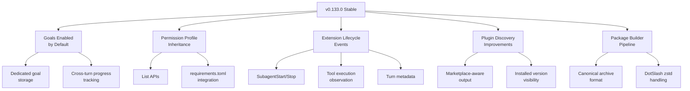
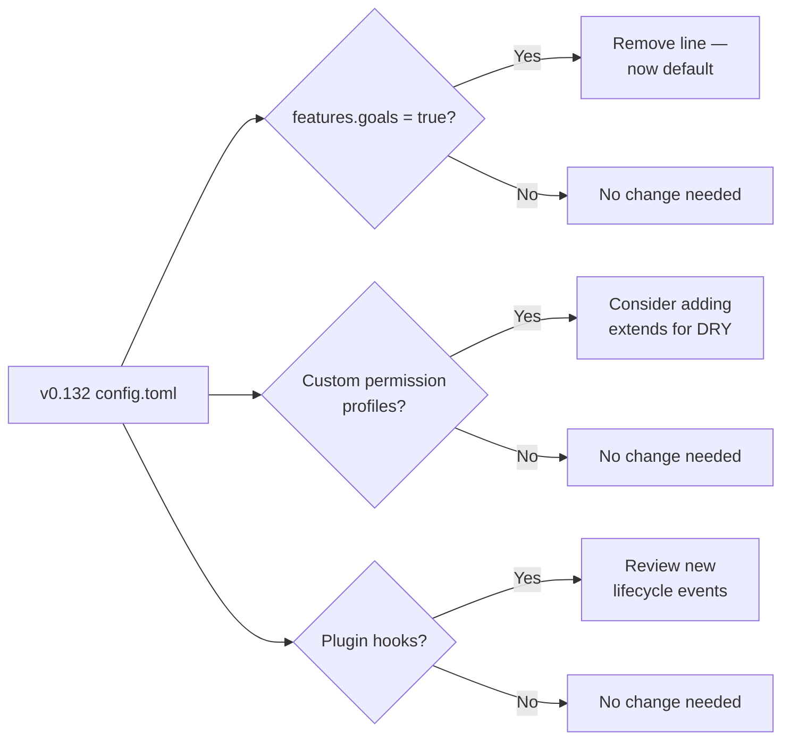

# Codex CLI v0.133.0 Release Guide: Goals Enabled by Default, Permission Profile Inheritance, and Extension Lifecycle Events


---

Codex CLI v0.133.0 landed on 21 May 2026 with over 80 merged pull requests [^1]. The headline change is deceptively simple — goals are now on by default — but the full release reshapes three critical surfaces: long-horizon task persistence, enterprise permission governance, and the extension observation API. This guide covers what shipped, what changed in configuration, and how to migrate from v0.132.

## What Shipped: The Five Pillars of v0.133.0



### 1. Goals Enabled by Default with Dedicated Storage

In v0.132 and earlier, goal mode required an explicit feature flag in `~/.codex/config.toml` [^2]:

```toml
# v0.132: opt-in
[features]
goals = true
```

That flag is no longer necessary. v0.133.0 enables goals by default across CLI, IDE extension, and Codex App [^3]. Goals now persist in a dedicated storage layer rather than ephemeral session state, meaning progress tracking survives session restarts, context compaction, and terminal crashes [^4].

The practical difference: when you set a goal with `/goal "Migrate the auth module from JWT to PASETO"`, the objective, its sub-tasks, and their completion status are now written to a purpose-built database within the app-server rather than embedded in the conversation context. This eliminates the failure mode where context compaction silently drops goal state mid-session.

**Migration note:** If you previously set `features.goals = true`, the key is now ignored. You can safely remove it. If you want to *disable* goals (uncommon, but useful in constrained CI environments), set `features.goals = false` explicitly.

### 2. Permission Profile Inheritance and List APIs

Permission profiles — the named bundles controlling filesystem access, network policy, and workspace roots — gain three capabilities in v0.133.0 [^5]:

**Inheritance.** Profiles can now extend a parent profile, reducing duplication across team configurations:

```toml
[permissions.ci-deploy]
extends = ":workspace"

[permissions.ci-deploy.network]
enabled = true

[permissions.ci-deploy.network.domains]
"registry.npmjs.org" = "allow"
"api.github.com" = "allow"
```

The `extends` key accepts any built-in profile (`:read-only`, `:workspace`, `:danger-full-access`) or a custom profile defined in the same configuration scope. Child profiles override parent settings at the key level — a child's `network.enabled = true` overrides a parent's `network.enabled = false`, but unspecified keys fall through to the parent [^6].

**List APIs.** The app-server now exposes JSON-RPC methods for programmatic profile discovery: listing available profiles, querying their effective permissions after inheritance resolution, and reading the currently active profile [^7]. This enables external tooling — CI pipelines, fleet management scripts, compliance dashboards — to inspect what a given Codex session is permitted to do without parsing TOML.

**Managed requirements.toml integration.** Enterprise administrators can now push permission profile constraints through the managed `requirements.toml` channel [^8]. Combined with inheritance, this allows a central security team to define a restrictive base profile while individual teams extend it with the specific domains and paths their projects require.

### 3. Extension Lifecycle Events

The extension observation API — the system through which plugins and external tooling observe Codex session behaviour — gains five new event types [^9]:

| Event | Fires When | Typical Use |
|---|---|---|
| `SubagentStart` | A subagent is about to spawn | Spawn-time governance gates |
| `SubagentStop` | A subagent completes or is terminated | Cost tracking, cleanup triggers |
| `ToolExecution` | Any tool (MCP or built-in) executes | Audit logging, security monitoring |
| `TurnMetadata` | A turn completes with timing and token data | Usage dashboards, budget alerts |
| `AsyncApproval` | An approval request is submitted or resolved | Compliance workflow integration |

These events complement the existing `SessionStart`, `PreToolUse`, `PostToolUse`, `PermissionRequest`, `UserPromptSubmit`, and `Stop` events [^10]. The key architectural change is that extensions can now observe the *full* agent lifecycle rather than just the outer session boundary and tool-call boundaries.

For plugin authors, observing these events requires declaring the `lifecycle_events` capability in the plugin manifest:

```json
{
  "name": "my-observability-plugin",
  "version": "1.0.0",
  "capabilities": ["lifecycle_events"],
  "hooks": {
    "SubagentStart": { "type": "command", "command": "scripts/log-spawn.sh" },
    "SubagentStop": { "type": "command", "command": "scripts/log-complete.sh" }
  }
}
```

### 4. Plugin Discovery Improvements

The `codex plugin list` command now returns marketplace-aware output showing whether each installed plugin has a newer version available, the plugin's marketplace source, and its installation root [^11]. The `codex plugin inspect` command surfaces bundled hooks and their enablement state.

For teams managing shared plugin sets, the remote collection support means a URL or registry reference in `requirements.toml` can point to a curated plugin bundle that Codex resolves at startup [^12].

### 5. Canonical Package Builder Pipeline

The infrastructure story is less visible to end users but significant for distribution. v0.133.0 introduces a canonical package archive format that unifies how Codex binaries, npm packages, DotSlash entries, and SDK runtimes are built, signed, and distributed [^13]. The immediate benefits include faster installer downloads (zstd compression replaces gzip in DotSlash archives), platform-sharded CI reducing release build times, and a foundation for enterprise air-gapped distribution.

## Upgrading from v0.132

### Self-Update

The simplest path:

```bash
codex update
```

Or via npm:

```bash
npm install -g @openai/codex@latest
```

Verify the version:

```bash
codex --version
# Expected: 0.133.0
```

### Configuration Changes



**Breaking changes:** None. v0.133.0 is backwards-compatible with v0.132 configurations. The `features.goals = true` key is now a no-op but does not cause errors.

**Deprecated keys:** The undocumented `goals.experimental_storage` key from early alpha builds has been removed. If present in your configuration, Codex prints a startup warning and ignores it.

### Bug Fixes Worth Noting

Several fixes in v0.133.0 address longstanding pain points:

- **TUI startup directory selection** (#23538): The TUI now correctly respects the `--cd` flag and project-scoped working directory configuration, fixing a regression where some sessions launched in the wrong directory [^14].
- **Plan-mode Enter key with modifiers** (#23536): Pressing Shift+Enter in plan mode no longer accidentally submits the plan; it inserts a newline as expected [^14].
- **Stale background terminal events** (#23231): Background terminal poll events from terminated processes are now cleaned up, preventing ghost entries in `/ps` output [^14].
- **AGENTS.md loading reliability** (#23343, #23232): Instruction files with certain Unicode characters or deeply nested directory structures are now loaded correctly [^14].
- **App-server startup races** (#23516, #23578): Race conditions during rapid session creation (common in multi-agent workflows) have been resolved, fixing intermittent "connection refused" errors when spawning subagents [^14].

## Practical Patterns for v0.133.0 Features

### Pattern 1: Goal-Driven Migration with Progress Persistence

With goals enabled by default, long-horizon migrations become more reliable:

```bash
codex
> /goal "Migrate all 47 API handlers from Express to Hono, updating tests and OpenAPI specs for each"
```

The agent creates trackable sub-tasks, and you can check progress at any time with `/goal status`. If your session crashes or you close the terminal, `codex resume` picks up with full goal awareness — the sub-task completion state persists independently of the conversation context.

### Pattern 2: Inherited Permission Profiles for Team Governance

Define a restrictive base profile at the organisation level, then extend per-team:

```toml
# In managed requirements.toml (pushed by admin)
[permissions.org-base]
[permissions.org-base.filesystem]
":workspace_roots"."**" = "write"
[permissions.org-base.filesystem.deny]
"../.env*" = "read"
"../**/*credentials*" = "read"
[permissions.org-base.network]
enabled = false

# In team's .codex/config.toml
[permissions.frontend-team]
extends = "org-base"
[permissions.frontend-team.network]
enabled = true
[permissions.frontend-team.network.domains]
"registry.npmjs.org" = "allow"
"cdn.jsdelivr.net" = "allow"
```

The frontend team inherits the filesystem restrictions and credential protections from `org-base` while gaining the network access their build tooling requires [^15].

### Pattern 3: Extension-Driven Cost Monitoring

The new `SubagentStop` and `TurnMetadata` events enable real-time cost tracking without parsing JSONL transcripts after the fact:

```bash
#!/bin/bash
# scripts/track-cost.sh — called by SubagentStop hook
EVENT=$(cat)
TOKENS=$(echo "$EVENT" | jq '.usage.total_tokens // 0')
MODEL=$(echo "$EVENT" | jq -r '.model // "unknown"')
echo "$(date -u +%Y-%m-%dT%H:%M:%SZ) model=$MODEL tokens=$TOKENS" >> ~/.codex/cost-log.tsv
```

Wire it in via `config.toml`:

```toml
[hooks.SubagentStop]
[[hooks.SubagentStop.hooks]]
type = "command"
command = "scripts/track-cost.sh"
timeout = 3000
```

## Version Comparison: v0.131 → v0.132 → v0.133

| Capability | v0.131 | v0.132 | v0.133 |
|---|---|---|---|
| Goals | Feature flag, session-scoped | Feature flag, session-scoped | **Default on, dedicated DB** |
| Permission profiles | Static, per-config | Static, per-config | **Inheritance, list APIs** |
| Extension events | 7 event types | 7 event types | **12 event types** |
| Plugin discovery | Basic list | Marketplace install | **Version-aware, remote collections** |
| Package format | npm + DotSlash | npm + DotSlash | **Canonical archive, zstd** |
| Python SDK | `openai-codex` migration | First-class auth, TurnResult | Stable, no changes |
| `codex doctor` | New | Stable | Stable |
| `codex remote-control` | New | Enhanced | **Foreground mode, status reporting** |

## Who Should Upgrade Immediately

- **Teams using goals:** The migration from session-scoped to dedicated storage is the single largest reliability improvement for long-horizon workflows. Upgrade and remove the feature flag.
- **Enterprise administrators:** Permission profile inheritance and managed `requirements.toml` integration significantly reduce the configuration burden for multi-team deployments.
- **Plugin authors:** The five new lifecycle events open up observability use cases that were previously impossible without parsing raw JSONL transcripts.
- **CI pipelines:** The `codex remote-control` improvements (foreground mode, readiness waiting, machine status) make headless agent management more predictable.

## Known Limitations

- Goal storage migration from older alpha builds may require a one-time `codex goals migrate` command if you were running v0.133.0-alpha.1 through alpha.3 [^1]. Stable-to-stable upgrades (v0.132 → v0.133) handle this automatically.
- Permission profile inheritance is limited to single-parent chains — there is no multiple-inheritance or mixin support [^6].
- Extension lifecycle events are delivered best-effort; if a hook script times out, the event is dropped rather than blocking the agent loop [^9].
- The canonical package builder is an internal infrastructure improvement — end users interact with it only through faster downloads and the existing `codex update` / `npm install` paths [^13].

## Citations

[^1]: [OpenAI Codex GitHub Releases — v0.133.0](https://github.com/openai/codex/releases/tag/rust-v0.133.0)
[^2]: [Codex CLI Features Documentation](https://developers.openai.com/codex/cli/features)
[^3]: [Codex Changelog — 21 May 2026 (v26.519)](https://developers.openai.com/codex/changelog)
[^4]: [GitHub PR #23300 — Dedicated goal storage](https://github.com/openai/codex/pull/23300)
[^5]: [GitHub PR #22928 — Permission profile list APIs](https://github.com/openai/codex/pull/22928)
[^6]: [GitHub PR #23412 — Permission profile inheritance](https://github.com/openai/codex/pull/23412)
[^7]: [Codex Configuration Reference — permissions namespace](https://developers.openai.com/codex/config-reference)
[^8]: [Codex Advanced Configuration — managed requirements.toml](https://developers.openai.com/codex/config-advanced)
[^9]: [GitHub PR #22782 — Extension lifecycle events: SubagentStart](https://github.com/openai/codex/pull/22782)
[^10]: [Codex CLI Hooks Documentation](https://developers.openai.com/codex/hooks)
[^11]: [GitHub PR #23372 — Plugin discovery marketplace-aware output](https://github.com/openai/codex/pull/23372)
[^12]: [GitHub PR #23727 — Remote plugin collection support](https://github.com/openai/codex/pull/23727)
[^13]: [GitHub PR #23513 — Canonical package builder pipeline](https://github.com/openai/codex/pull/23513)
[^14]: [OpenAI Codex GitHub Releases — v0.133.0 bug fixes](https://github.com/openai/codex/releases/tag/rust-v0.133.0)
[^15]: [Codex Enterprise Managed Configuration Guide](https://developers.openai.com/codex/config-advanced)
