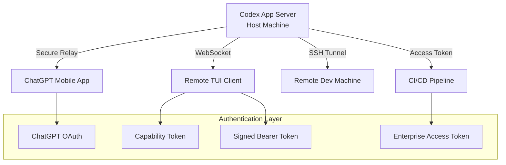
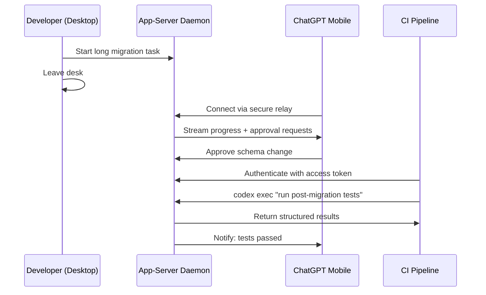

# Codex Remote Connections: Mobile Pairing, SSH Hosts, and Enterprise Access Tokens


---

Codex has quietly evolved from a single-machine terminal tool into a multi-surface development platform. The remote connections system — spanning mobile pairing, SSH host forwarding, device-to-device control, and enterprise access tokens — is the infrastructure that makes this possible. This article covers the architecture, configuration, and security model of every remote access surface, so you can run a long migration on your Mac mini, approve file writes from your phone on the train, and let your CI pipeline authenticate without a browser.

## The Remote Access Architecture

Codex remote connections operate through three distinct transport layers, each serving a different use case:



At the centre sits the **app-server daemon** — a persistent process that manages sessions, tool approvals, and project context [^1]. Every remote surface connects to this daemon through one of the transport mechanisms above.

## Mobile Pairing: Phone-to-Desktop Control

Since 14 May 2026, the ChatGPT mobile app can connect directly to a running Codex environment on your Mac [^2]. This is not a stripped-down notification feed — the mobile client loads the full live state, including active threads, pending approvals, plugin context, and project files.

### What You Can Do From Your Phone

- Monitor terminal output, code diffs, and test results in real time
- Approve or reject file writes, shell commands, and tool invocations
- Send follow-up instructions to steer active work
- Switch between multiple connected hosts
- Review screenshots from browser-based tasks [^3]

### Setup Flow

1. Update both the ChatGPT mobile app and the macOS Codex App to the latest versions
2. Open the Codex App on your Mac and navigate to **Settings > Connections**
3. Enable **"Allow other devices to connect"** (disabled by default) [^3]
4. Scan the QR code displayed on the desktop from the ChatGPT mobile app
5. Confirm the same ChatGPT account and workspace, then complete any MFA/SSO/passkey challenges

The connection uses OpenAI's **secure relay infrastructure** — a managed service that keeps your host reachable across network boundaries without exposing ports or configuring NAT traversal [^1]. Traffic flows through OpenAI's relay, encrypted end-to-end, so your host never needs a public IP.

### Current Limitations

- macOS only — Windows support is listed as "coming soon" [^3]
- Both devices must share the same ChatGPT account and workspace
- Not available in EU/UK regions at launch [^4]

## SSH Remote Projects

For developers working on remote servers, VMs, or cloud instances, Codex supports SSH-based remote project access. This connects the Codex App to a remote machine where the actual code lives.

### Configuration

Add your remote host to `~/.ssh/config`:

```ssh-config
Host dev-server
    HostName 10.0.1.42
    User deploy
    IdentityFile ~/.ssh/id_ed25519
```

Codex reads concrete host aliases from `~/.ssh/config`, resolves them with OpenSSH, and ignores pattern-only hosts [^1]. Once configured:

1. Verify SSH connectivity: `ssh dev-server echo "connected"`
2. Ensure the `codex` command is available on the remote machine's PATH
3. In the Codex App, navigate to **Settings > Connections** and add the SSH host
4. Configure the remote project folder

The Codex App then runs the remote app-server process through SSH, using the remote user's login shell [^1]. Your local Codex App becomes a thin client rendering the remote environment's full state.

### SSH Port Forwarding for Headless Authentication

On remote machines where a browser is unavailable for the standard ChatGPT OAuth login, tunnel the authentication port:

```bash
# From your local machine
ssh -L 1455:localhost:1455 dev-server

# Then on the remote machine, run the standard login
codex login
```

The browser opens locally, but the authentication token flows back to the remote machine through the tunnel [^5].

Alternatively, copy cached credentials directly:

```bash
scp ~/.codex/auth.json dev-server:~/.codex/auth.json
```

Treat `auth.json` like a private key — never commit it, never share it over insecure channels [^5].

## Device-to-Device Control

Beyond mobile, any signed-in Codex App can control another. Enable **"Control other devices"** in Settings > Connections on the host machine, and any device authenticated with the same ChatGPT account gains access [^1].

This creates a natural workflow for developers with multiple machines: start a long-running task on your desktop workstation, then pick it up on your laptop when you move to a meeting room.

## The App-Server Daemon and WebSocket Transport

Under the hood, all remote surfaces connect to the **app-server daemon**. For programmatic access or custom tooling, you can start it manually with WebSocket transport:

```bash
# Start the app-server with WebSocket listener
codex app-server --listen ws://127.0.0.1:4500
```

Connect a remote TUI client:

```bash
codex --remote ws://127.0.0.1:4500
```

### Authentication Modes for WebSocket

Two authentication mechanisms protect WebSocket connections [^6]:

**Capability token** — a shared secret verified on connection:

```bash
codex app-server --listen ws://127.0.0.1:4500 \
  --ws-auth capability-token \
  --ws-token-file /path/to/secret.txt
```

**Signed bearer token** — JWT-style authentication with issuer/audience validation:

```bash
codex app-server --listen ws://127.0.0.1:4500 \
  --ws-auth signed-bearer-token \
  --ws-shared-secret-file /path/to/shared-secret \
  --ws-issuer "my-org" \
  --ws-audience "codex-prod" \
  --ws-max-clock-skew-seconds 30
```

For the managed daemon experience, `codex remote-control` wraps this into a single command that starts the app-server with remote-control support enabled [^6]. This is the recommended entrypoint for most remote workflows, rather than manually configuring `app-server --listen`.

> **Security note:** The server accepts `ws://` listen URLs, but you should always use TLS termination or a secure proxy when clients connect over untrusted networks. Never expose raw `ws://` on a public interface [^6].

## Enterprise Access Tokens

For CI/CD pipelines and automated workflows, browser-based OAuth is impractical. Enterprise access tokens solve this by providing non-interactive authentication that inherits workspace identity and governance controls [^5][^7].

### How They Work

Access tokens are available on ChatGPT Enterprise and Business plans. Workspace admins control availability and can restrict which roles may create tokens [^7]. Once created, a token provides:

- ChatGPT workspace access (including subscription entitlements)
- Enterprise policy enforcement (managed configuration, approval requirements)
- Audit trail visibility in the workspace governance dashboard
- No browser interaction required

### CI/CD Integration

```bash
# Store the access token in your CI secrets
# Then authenticate non-interactively
printenv CODEX_ACCESS_TOKEN | codex login --with-access-token

# Run headless automation with workspace identity
codex exec "Run the test suite and fix any failures"
```

For remote app-server connections in CI:

```bash
codex --remote wss://codex-host.internal:4500 \
  --remote-auth-token-env CODEX_BEARER_TOKEN
```

The `--remote-auth-token-env` flag reads the bearer token from an environment variable and only sends it over `wss://` or localhost `ws://` connections — never over unencrypted remote WebSocket [^6].

### Token Governance

Enterprise admins should establish policies for:

- **Token rotation cadence** — treat tokens like service account credentials
- **Least-privilege scoping** — tokens inherit the creating user's workspace permissions
- **Activity monitoring** — token usage appears in workspace governance views [^7]
- **Revocation procedures** — revoke immediately when a team member departs or a pipeline is decommissioned

## The Device-Code Flow Alternative

For environments where neither browser login nor access tokens are available, Codex offers the **device-code flow** (beta) [^5]:

```bash
# Enable device auth in ChatGPT security settings first
codex login --device-auth
```

This displays a URL and one-time code. Open the URL on any browser (even on a different device), enter the code, and the CLI receives authentication. This is particularly useful for SSH sessions to machines where you cannot forward port 1455.

## Credential Storage

Control where the CLI caches authentication credentials via `cli_auth_credentials_store` in `config.toml` [^5]:

```toml
[auth]
cli_auth_credentials_store = "keyring"  # Options: "file", "keyring", "auto"
```

| Value | Behaviour |
|-------|-----------|
| `file` | Stores in `~/.codex/auth.json` — portable but less secure |
| `keyring` | Uses the OS credential store (macOS Keychain, Linux Secret Service) |
| `auto` | Prefers OS store, falls back to file |

For enterprise deployments, mandate `keyring` through managed configuration to prevent credentials from sitting in plaintext on disk.

## Putting It Together: A Multi-Surface Workflow



This is the workflow Codex remote connections enable: start work on one surface, monitor from another, approve from a third, and automate from a fourth — all backed by the same daemon, same project context, and same security model.

## Recommendations

1. **Enable remote control only when needed** — it is disabled by default for good reason
2. **Use `keyring` credential storage** on all machines to avoid plaintext `auth.json` files
3. **Prefer `codex remote-control`** over manual `app-server --listen` for managed daemon workflows
4. **Rotate enterprise access tokens** on the same cadence as service account credentials
5. **Never expose `ws://` on public interfaces** — always terminate TLS upstream or use `wss://`
6. **Enable MFA on your ChatGPT account** before using any remote access surface [^5]

## Citations

[^1]: [Remote connections – Codex | OpenAI Developers](https://developers.openai.com/codex/remote-connections)
[^2]: [Codex Now Supports Remote Access from ChatGPT Mobile, with Access Tokens for Enterprise Workspaces – Knightli](https://www.knightli.com/en/2026/05/17/codex-mobile-remote-access-enterprise-access-tokens/)
[^3]: [Work with Codex from anywhere | OpenAI](https://openai.com/index/work-with-codex-from-anywhere/)
[^4]: [OpenAI Codex Lands on ChatGPT Mobile App for iOS and Android With Remote SSH Support – Gadget Bridge](https://www.gadgetbridge.com/news/openai-codex-lands-on-chatgpt-mobile-app-for-ios-and-android-with-remote-ssh-support/)
[^5]: [Authentication – Codex | OpenAI Developers](https://developers.openai.com/codex/auth)
[^6]: [Command line options – Codex CLI | OpenAI Developers](https://developers.openai.com/codex/cli/reference)
[^7]: [Changelog – Codex | OpenAI Developers](https://developers.openai.com/codex/changelog)
