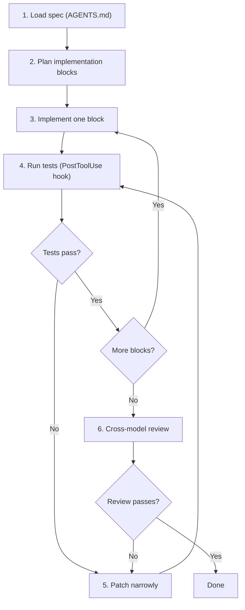

# Intelligence per Token: Why Your Local AI Needs Agentic Loops, Not Bigger Prompts — and What Codex CLI Already Solved

Manolo Remiddi's recent video, "Your Local AI is 'Stupid' Because You're Using it Like ChatGPT,"[^1] articulates a problem that Codex CLI's architecture addresses structurally. The argument is simple: smaller local models — Gemma 3 27B, Qwen 3.6 35B, running on hardware like the Nvidia DGX Spark or ASUS GX10 — produce tokens with less intelligence per token than frontier models like GPT-5.5. One-shot prompting therefore fails. The solution is not bigger hardware but better workflow: specification-first development, iterative loops, deterministic verification, and research-before-action. Every one of these patterns is already a first-class concept in Codex CLI.

## The Intelligence-per-Token Gap

Remiddi frames the core problem clearly. A 26-billion-parameter model with 3-4 billion active parameters (mixture-of-experts) generates tokens at 30-60 tokens per second on a DGX Spark's 128 GB unified memory. The speed is acceptable for interactive work. The intelligence per token is not equivalent to a frontier model with trillions of parameters. Ask GPT-5.5 to build a Tetris game in one shot, and it probably works. Ask Gemma 3 27B, and you get something close — but the sound is missing, or the restart logic fails, or the scoring breaks.

The gap is real. But it is not a hardware problem. It is a workflow problem. The same strategies that close this gap for local models also improve output quality on frontier models — they are just less obviously necessary when the model is powerful enough to mask poor prompting.

## Five Strategies That Close the Gap

Remiddi identifies five strategies. Each maps directly to a Codex CLI feature or pattern.

### 1. Specify First, Then Implement

Write the specification before writing code. Agree with the model on what the software should contain — features, constraints, expected behaviour — before any implementation begins. This is not a novel idea, but it becomes mandatory with smaller models that cannot hold the full design space in a single context window.

**Codex CLI equivalent:** The `spec.md` pattern from the AGENTS.md playbook. A well-crafted specification file, loaded as project context, constrains the model to implement what was agreed rather than improvising from a vague prompt. The instruction stack (Chapter 7 of the handbook) ensures that specifications persist across turns and survive context compaction.

```markdown
<!-- AGENTS.md -->
## Specification
Follow the specification in /design/spec.md exactly.
Do not add features not listed in the specification.
If the specification is ambiguous, stop and ask for clarification.
```

### 2. Implement in Blocks, Not All at Once

Do not ask the model to build the entire system in one pass. Divide the work into modules. Implement each module independently. This reduces the cognitive load per turn and keeps the active context within the model's effective reasoning window.

**Codex CLI equivalent:** Sub-agents and the Designer-Developer-Tester pipeline (Chapter 16 and Chapter 29). Native sub-agents parallelise independent modules. The SDK's handoff pattern gates each stage, ensuring the next module does not start until the previous one passes verification. For local models via Open Code or similar harnesses, the same principle applies: scope each prompt to one module, one file, one function.

### 3. Review Adversarially

After implementation, do not trust the model's self-assessment. Review the output as an adversary — look for what is broken, what was missed, what deviates from the specification.

**Codex CLI equivalent:** Cross-model review. Remiddi describes using GPT-5.5 to monitor Qwen 3.6's coding output — a frontier model reviewing a local model's work. In Codex CLI, this maps to the auto-review sub-agent pattern: route approval decisions through a reviewer agent using a different (potentially stronger) model. The granular approval policy system (Chapter 21) lets you configure which actions require review and which proceed automatically.

```toml
# Use a stronger model for review passes
[profiles.reviewer]
model = "gpt-5.5"
model_reasoning_effort = "high"
```

### 4. Patch Narrowly

Fix one thing at a time. Do not ask the model to address all issues in a single pass. Narrow patches are easier to verify and less likely to introduce regressions.

**Codex CLI equivalent:** The `apply_patch` mechanism and the iterative tool-use loop. Codex CLI's agent loop naturally produces narrow patches — each tool call modifies one file region. The execution policy system can enforce this by requiring approval for changes that exceed a threshold (number of files modified, lines changed). For local models, this discipline is even more important: a 26B model attempting a 15-file refactor in one pass will almost certainly introduce errors that a focused single-file patch would avoid.

### 5. Verify Deterministically

Do not accept the model's claim that the code works. Run the tests. Open the browser. Play the game. Check the output against the specification. Deterministic verification means executing the code and observing the result, not reading the code and guessing.

**Codex CLI equivalent:** PostToolUse hooks and the test-driven development workflow. A PostToolUse hook can automatically run the test suite after every code change, feeding results back to the agent. The sandbox ensures that test execution is isolated and reproducible. For visual applications, Playwright integration via MCP servers provides browser-based verification that the model cannot fake.

```python
# PostToolUse hook: run tests after every code change
import subprocess

def post_tool_use(event):
    if event.tool == "apply_patch":
        result = subprocess.run(["pytest", "--tb=short"], capture_output=True, text=True)
        if result.returncode != 0:
            return {"feedback": f"Tests failed:\n{result.stdout}"}
```

## The DGX Spark as a Codex CLI Companion

The Nvidia DGX Spark (and its ASUS GX10 variant) ships with 128 GB of unified memory, sufficient to run 26-35B parameter models at interactive speeds. Remiddi runs Gemma 3 27B (Q4 quantised, 3B active parameters via MoE) at 30-60 tokens per second on this hardware. This is fast enough for agentic use but not fast enough for the one-shot workflows that frontier models handle.

The natural architecture for a DGX Spark deployment:

| Component | Model | Hardware | Role |
|-----------|-------|----------|------|
| Implementation agent | Gemma 3 27B / Qwen 3.6 35B | DGX Spark (local) | Code generation, tool use, file manipulation |
| Review agent | GPT-5.5 | OpenAI API (cloud) | Adversarial review, specification verification |
| Orchestrator | Codex CLI | Any machine | Pipeline coordination, approval policies, sandbox enforcement |

Codex CLI's model routing capabilities (the `model` parameter in `config.toml` and per-agent configuration in the Agents SDK) make this hybrid architecture natural. The implementation agent uses the local model for high-throughput, low-cost code generation. The review agent uses the frontier model for high-intelligence, low-volume verification. The orchestrator — Codex CLI itself — coordinates the pipeline and enforces security regardless of which model generated the code.

```toml
# Hybrid local + cloud model routing
[profiles.local-dev]
model = "gemma-3-27b"  # via Ollama or LM Studio
model_reasoning_effort = "high"

[profiles.cloud-review]
model = "gpt-5.5"
model_reasoning_effort = "medium"
```

## Awareness: The Context That Closes the Final Gap

Remiddi introduces a concept he calls "awareness" — giving the model context about your specific domain, preferences, and constraints before it begins work. Without awareness, the model operates generically. With it, the output aligns with your actual needs.

In Codex CLI, awareness is structural:

- **AGENTS.md** provides project-level awareness — coding standards, architecture decisions, approved dependencies, domain-specific terminology.
- **Memories** persist context across sessions — what the model learned about your codebase in previous interactions survives context compaction and session boundaries.
- **Skills** encapsulate domain knowledge as reusable instruction sets — a skill for "how we write API endpoints in this project" carries more awareness than a generic prompt.
- **Research via MCP tools** — the model can fetch documentation, search codebases, and query knowledge bases before implementation, rather than relying on training data alone.

For local models, awareness is even more critical than for frontier models. A 26B model has less world knowledge than a trillion-parameter model. The less the model knows from training, the more it needs from context. AGENTS.md files, skill libraries, and MCP-connected knowledge bases are not luxuries for local model deployments — they are the primary mechanism for closing the intelligence gap.

## The Loop Architecture

Remiddi's central insight — that local models need loops, not bigger prompts — maps to Codex CLI's fundamental architecture. The agent loop is already iterative: propose an action, execute it, observe the result, decide the next action. Each iteration adds tokens, and each token carries the context of what came before. The intelligence-per-token gap shrinks because the loop structure converts volume into quality.



This loop is what Codex CLI does by default. The difference is that with frontier models, the loop often converges in one or two iterations. With local models, it may take five or ten. The architecture is the same; the iteration count is different. And the architecture was designed for exactly this kind of iterative refinement — not for one-shot generation.

## The Economics

Remiddi makes a pragmatic economic argument: frontier models are currently subsidised. The \$20/month subscription to GPT-5.5 delivers token volumes that cost OpenAI significantly more to serve. This subsidy will not last indefinitely. Building workflows that depend on cheap frontier tokens creates a dependency on pricing decisions you do not control.

Local models running on owned hardware have a fixed cost (the hardware) and zero marginal cost per token. A DGX Spark at approximately \$3,000 generates unlimited tokens at 30-60/second for as long as the hardware operates. For teams that need to run agents 24/7 — overnight test suites, continuous code review, background research — the economics favour local models for volume work and frontier models for high-stakes decisions.

Codex CLI's multi-provider architecture (Chapter 5) makes this hybrid model natural. The same pipeline definition works with local models via Ollama, LM Studio, or MLX, and with cloud models via the OpenAI API. Switching between them is a configuration change, not an architecture change.

## What Codex CLI Adds That Raw Local Models Lack

Running Gemma 3 27B through Ollama gives you a capable code generator. Running it through Codex CLI (or a Codex-compatible harness like Open Code) gives you:

- **Sandbox enforcement** — the local model's tool calls are confined to the workspace, regardless of what the model proposes
- **Execution policies** — dangerous commands are blocked or require approval, even when no human is watching
- **Structured context** — AGENTS.md, skills, and memories provide the awareness that smaller models need
- **Approval policies** — granular control over which actions proceed automatically and which require review
- **Observability** — OpenTelemetry traces capture every action for debugging and cost analysis
- **Pipeline integration** — the Agents SDK connects local model agents to cloud model reviewers in typed, traced pipelines

The local model provides the tokens. Codex CLI provides the guardrails, the context, and the workflow structure that makes those tokens useful.

---

## Citations

[^1]: Manolo Remiddi, "Your Local AI is 'Stupid' Because You're Using it Like ChatGPT," YouTube, May 2026. https://www.youtube.com/watch?v=NC2mE7C4s2c
