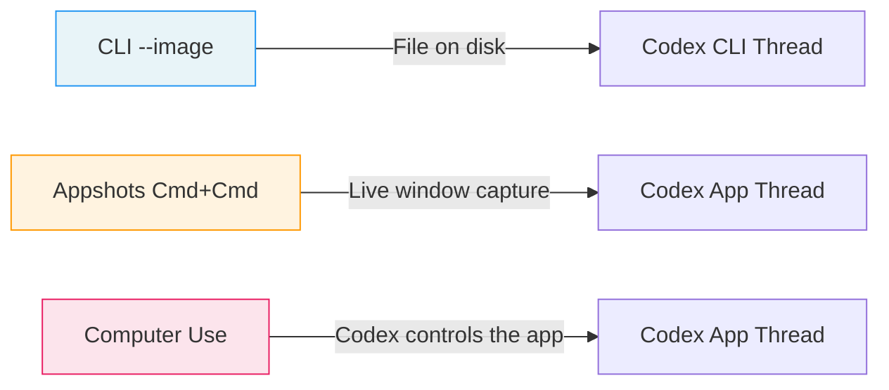
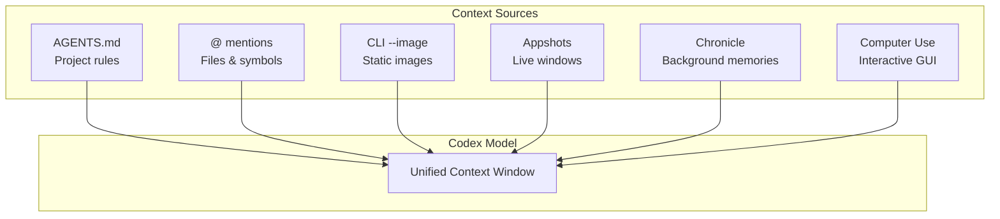

# Codex Appshots: Screenshot-Driven Context for Developer Workflows on macOS


---

Codex has always been strongest when given precise context. The `@` mention system, `AGENTS.md`, and image attachments in the CLI all serve the same purpose: reducing the gap between what the developer knows and what the model sees. Appshots, shipped on 21 May 2026 as part of the v26.519 release [^1], take that principle to its logical conclusion — press both Command keys and the frontmost macOS window lands in your Codex thread as a screenshot plus extracted text, no clipboard gymnastics required.

This article covers what Appshots capture, how they fit into a CLI-centric workflow, the security posture you should adopt, and five practical patterns that make them worth the keypress.

## What Appshots Actually Capture

An Appshot is not a raw screen grab piped into a vision model. It consists of two payloads [^2]:

1. **An image of the visible window** — the frontmost application window, cropped to its bounds.
2. **Accessible text** — text the application exposes through the macOS accessibility layer, including content beyond the visible scroll area.

This dual capture matters. A screenshot of a terminal showing a stack trace gives the model the visual layout, but the accessibility text gives it the full traceback — including the lines that scrolled off screen. For text-heavy applications like IDEs, documentation browsers, and email clients, the text payload is often more valuable than the image.

### Permissions Required

Before the first capture, macOS prompts for two system permissions [^2]:

| Permission | Purpose |
|---|---|
| **Screen & System Audio Recording** | Enables window image capture |
| **Accessibility** | Allows extraction of text from the application's accessibility tree |

Both are granted per-application in **System Settings → Privacy & Security**. If Appshots silently fail, this is the first place to check.

### Threading Behaviour

Appshots follow a simple heuristic for thread assignment [^2]:

- If you interacted with Codex within the last **60 seconds**, the Appshot attaches to the most recent thread.
- Otherwise, a **new thread** is created.

This means rapid-fire captures during an active debugging session accumulate in a single thread, building a visual timeline of your investigation.

## How Appshots Differ from CLI Image Workflows

Codex CLI has supported image input since early 2026. The `--image` flag, clipboard paste (`Cmd+V`), and drag-and-drop all let you attach visuals to a prompt [^3]:

```bash
codex --image ./specs/dashboard-mock.png "Implement this layout in React + Tailwind"
```

Appshots serve a different niche:



| Capability | CLI `--image` | Appshots | Computer Use |
|---|---|---|---|
| **Platform** | macOS, Linux, Windows | macOS only | macOS only |
| **Input source** | File path or clipboard | Live window | Codex-controlled GUI |
| **Text extraction** | None (vision only) | Accessibility layer | Vision + interaction |
| **Interaction** | Read-only | Read-only | Read-write |
| **Thread type** | CLI session | Codex App thread | Codex App thread |

The key differentiator: Appshots extract text alongside the image. When you capture an IDE window showing a type error, the model receives both the visual squiggly underline and the full diagnostic message — even if the error panel is partially scrolled.

## Security and Privacy Considerations

Appshots send window content to OpenAI's servers for processing. This places them squarely in the same trust model as any other Codex cloud thread [^4]. Three considerations deserve attention:

### What Gets Sent

Every Appshot transmits a screenshot and extracted text to OpenAI. If the frontmost window contains credentials, PII, financial data, or proprietary information, that content leaves your machine. The official documentation advises: "Avoid taking appshots of sensitive content unless the task requires that content" [^2].

### Relationship to Chronicle

Chronicle, the opt-in screen-capture memory feature released in April 2026 [^5], operates differently. Chronicle captures periodic screenshots in the background to build persistent memories stored as local markdown files. Appshots are intentional, single-shot captures triggered by a deliberate keypress. The privacy surface is narrower — you control exactly what gets captured and when — but the data still transits OpenAI's infrastructure.

### Enterprise Implications

For teams operating under data residency or compliance requirements, Appshots introduce a new exfiltration vector. A developer casually capturing an internal dashboard to ask Codex a question may inadvertently send proprietary metrics to OpenAI's servers. Consider documenting Appshot policies alongside your existing Codex usage guidelines.

## Practical Patterns

### Pattern 1: Bug Report Triage

Capture a Jira or Linear ticket showing a bug report, then ask Codex to reproduce it:

1. Open the ticket in your browser.
2. Press **Cmd+Cmd** to create an Appshot.
3. Type: *"Reproduce this bug in a failing test. The codebase is at ~/projects/api-server."*

The model receives the ticket title, description, reproduction steps, and any inline screenshots — all from a single keypress.

### Pattern 2: Design-to-Code from Figma

Capture a Figma frame showing a component design:

1. Select the frame in Figma and zoom to fit.
2. Press **Cmd+Cmd**.
3. Type: *"Implement this as a React component using our design tokens from `src/tokens.ts`. Match spacing and typography."*

Because Appshots extract accessibility text, named layers and auto-layout properties that Figma exposes through its accessibility tree become available to the model alongside the visual.

### Pattern 3: Error Diagnosis from IDE

When your IDE shows a confusing type error or linting failure:

1. Ensure the error panel is visible (but it needn't show the full trace — accessibility text captures off-screen content).
2. Press **Cmd+Cmd**.
3. Type: *"Explain this error and suggest a fix."*

### Pattern 4: Documentation Cross-Reference

When reading API documentation and wanting to integrate it into existing code:

1. Open the docs page in your browser.
2. Press **Cmd+Cmd**.
3. Type: *"Add a wrapper for this API endpoint to `src/clients/payments.ts`, following our existing client patterns."*

The text extraction captures code samples, parameter tables, and endpoint descriptions that might be partially scrolled.

### Pattern 5: CLI Bridge — Appshot to CLI Handoff

Appshots create Codex App threads, but you can bridge the context to a CLI session:

1. Capture your context with **Cmd+Cmd** in the Codex App.
2. Let the App thread generate an implementation plan or code sketch.
3. Copy the plan into a CLI prompt or save it to a file:

```bash
codex "Implement the plan in ~/notes/appshot-plan.md against this repo"
```

This pattern works because the Codex App and CLI share the same underlying model and can reference the same repository. The App handles the visual context; the CLI handles the sandboxed execution.

## Known Limitations

- **macOS only** — no Linux or Windows support at launch [^2].
- **Frontmost window only** — multi-monitor setups capture only the active window, not the focused monitor.
- **Google Workspace apps** — Docs, Gmail, Sheets, and Slides may return only the visible screenshot without full document text unless matching plugins are installed [^2].
- **No CLI-native Appshots** — the CLI cannot trigger or create Appshots; it can only access them when resuming a thread that already contains them [^2].
- **60-second thread heuristic** — if you pause too long between captures, each Appshot spawns a new thread, fragmenting your context.

## Configuration

The default hotkey (**Cmd+Cmd**) is configurable in Codex App settings [^2]. If the double-Command press conflicts with other macOS shortcuts or accessibility tools, remap it before muscle memory sets in.

For teams wanting to restrict Appshots entirely, macOS MDM profiles can revoke the Screen Recording and Accessibility permissions at the system level, preventing captures regardless of user preference.

## The Bigger Picture: Context Convergence

Appshots sit within a broader convergence of context-injection methods in the Codex ecosystem:



Each mechanism trades off convenience, privacy, and richness differently. Appshots occupy the sweet spot for developers who work across multiple applications — IDEs, browsers, design tools, ticket trackers — and want to bring that visual context into a coding thread without leaving the keyboard.

The feature is simple by design. One keypress, one window, one thread. The value compounds when you combine it with the CLI's execution capabilities and the App's review tools, treating each surface as part of a unified development workflow rather than isolated interfaces.

## Citations

[^1]: [Codex Changelog — v26.519, 21 May 2026](https://developers.openai.com/codex/changelog)
[^2]: [Appshots — Codex App Documentation](https://developers.openai.com/codex/appshots)
[^3]: [Codex CLI Features — Image Input](https://developers.openai.com/codex/cli/features)
[^4]: [Codex for Mac updated with new Appshots feature — 9to5Mac](https://9to5mac.com/2026/05/21/codex-for-mac-updated-with-new-appshots-feature-that-instantly-gives-chat-context/)
[^5]: [OpenAI Chronicle mirrors Microsoft Recall's privacy concerns — SC Media](https://www.scworld.com/brief/openais-chronicle-mirrors-microsoft-recalls-privacy-concerns)
