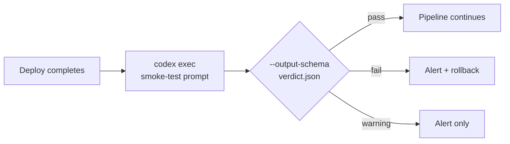

# Codex CLI Deployment Verification Patterns: exec Pipelines for Smoke Tests, API Validation, and Infrastructure Drift Detection


---

Every CI/CD pipeline worth its salt runs pre-merge checks. Far fewer pipelines verify what actually happened *after* the deployment succeeded. The container started, the health check returned 200, and the pipeline went green — but did the new pricing endpoint actually return the correct VAT calculations? Did the Terraform apply drift the security-group rules you locked down last sprint?

Codex CLI's `codex exec` command, combined with `--output-schema` for structured verdicts and `exec resume` for multi-stage verification, turns post-deployment checks into composable, agent-driven pipelines that understand context in ways a static `curl | jq` script never will[^1][^2].

This article presents four deployment verification patterns, each built on `codex exec` and ready to drop into GitHub Actions, GitLab CI, or a bare cron job.

## Why agent-driven verification?

Traditional smoke tests are brittle. A `curl -sf https://api.example.com/health` confirms reachability but tells you nothing about whether the response body matches the contract your frontend expects. Writing bespoke assertions for every endpoint is maintenance-heavy and lags behind the code it validates.

`codex exec` occupies a middle ground: you describe what "correct" looks like in natural language, attach the actual response as stdin context, and let the model judge whether the output matches intent[^1]. The `--output-schema` flag constrains the verdict to a machine-parseable JSON shape, so downstream tooling — Slack alerts, PagerDuty, Datadog events — can consume results without string parsing[^3].



## Pattern 1: API contract smoke test

The simplest pattern pipes a live API response into `codex exec` with a schema that forces a pass/fail/warning verdict.

**Schema file** (`verify-schema.json`):

```json
{
  "type": "object",
  "properties": {
    "verdict": { "type": "string", "enum": ["pass", "fail", "warning"] },
    "issues": {
      "type": "array",
      "items": {
        "type": "object",
        "properties": {
          "endpoint": { "type": "string" },
          "severity": { "type": "string", "enum": ["critical", "high", "medium", "low"] },
          "description": { "type": "string" }
        },
        "required": ["endpoint", "severity", "description"]
      }
    },
    "summary": { "type": "string" }
  },
  "required": ["verdict", "issues", "summary"],
  "additionalProperties": false
}
```

**Pipeline step:**

```bash
curl -s https://api.staging.example.com/v2/pricing \
  | codex exec \
      "Compare this API response against the OpenAPI spec at @openapi/pricing.yaml. \
       Report any missing fields, wrong types, or unexpected values. \
       Verdict is 'fail' if any critical issue exists." \
      --output-schema verify-schema.json \
      --sandbox read-only \
      --ephemeral \
      -o /tmp/verdict.json

VERDICT=$(jq -r .verdict /tmp/verdict.json)
if [ "$VERDICT" = "fail" ]; then
  echo "::error::Deployment verification failed"
  jq '.issues[] | "[\(.severity)] \(.endpoint): \(.description)"' /tmp/verdict.json
  exit 1
fi
```

The `--sandbox read-only` flag prevents the agent from modifying anything during verification, and `--ephemeral` avoids cluttering the session store with one-shot checks[^1]. The `@openapi/pricing.yaml` reference uses Codex CLI's unified mention syntax to inject the spec file as context[^4].

## Pattern 2: Multi-endpoint regression sweep

Real deployments touch dozens of endpoints. Rather than writing a prompt per endpoint, feed a manifest of URLs and expected behaviours:

```bash
cat endpoints.txt | codex exec \
  "For each URL in stdin, fetch it, check the HTTP status is 2xx, \
   verify the Content-Type header matches the expected value, \
   and confirm the response body contains the required fields. \
   Report all failures." \
  --output-schema verify-schema.json \
  --sandbox read-only \
  --ephemeral \
  -o /tmp/sweep-results.json
```

Where `endpoints.txt` contains:

```text
GET https://api.example.com/v2/users  Content-Type:application/json  required:id,email,created_at
GET https://api.example.com/v2/health Content-Type:application/json  required:status,version
POST https://api.example.com/v2/auth/token Content-Type:application/json required:access_token,expires_in
```

This pattern scales linearly — add a line to the manifest, and the agent includes it in the next sweep. No test code to maintain[^1][^5].

## Pattern 3: Infrastructure drift detection

After a Terraform or Pulumi apply, drift can creep in through manual console changes, emergency fixes, or automated processes that bypass IaC[^6]. `codex exec` can compare the planned state against live infrastructure:

```bash
terraform show -json > /tmp/tf-state.json
aws ec2 describe-security-groups --group-ids sg-0abc123 > /tmp/live-sg.json

cat /tmp/tf-state.json /tmp/live-sg.json \
  | codex exec \
      "Compare the Terraform state (first JSON document) with the live AWS \
       security group configuration (second JSON document). \
       Identify any rules present in live config but absent from Terraform state. \
       These are drift. Verdict is 'fail' if any ingress rule on port 22 or 3389 \
       exists in live but not in state." \
      --output-schema drift-schema.json \
      --sandbox read-only \
      --ephemeral \
      -o /tmp/drift-report.json
```

**Drift schema** (`drift-schema.json`):

```json
{
  "type": "object",
  "properties": {
    "verdict": { "type": "string", "enum": ["pass", "fail", "warning"] },
    "drifted_rules": {
      "type": "array",
      "items": {
        "type": "object",
        "properties": {
          "resource": { "type": "string" },
          "attribute": { "type": "string" },
          "expected": { "type": "string" },
          "actual": { "type": "string" }
        },
        "required": ["resource", "attribute", "expected", "actual"]
      }
    },
    "summary": { "type": "string" }
  },
  "required": ["verdict", "drifted_rules", "summary"],
  "additionalProperties": false
}
```

The agent understands the semantic meaning of security-group rules — an open port 22 from `0.0.0.0/0` is not just a structural diff but a security concern. Static `diff` tooling flags every change equally; the agent can triage by risk[^6][^7].

## Pattern 4: Resume-based progressive verification

For complex deployments that roll out in stages (canary → 10% → 50% → 100%), use `codex exec resume` to maintain verification context across stages[^2]:

```bash
# Stage 1: canary verification
codex exec \
  "Canary deployment of order-service v2.14.0 is live at https://canary.example.com/orders. \
   Run basic contract checks and record baseline response times." \
  --output-schema verify-schema.json \
  --sandbox read-only \
  -o /tmp/canary-verdict.json

# Stage 2: resume with 10% traffic context
codex exec resume --last \
  "Traffic is now at 10%. Check the same endpoints again. \
   Compare response times against the canary baseline. \
   Flag any latency regression above 20%." \
  --output-schema verify-schema.json \
  -o /tmp/ten-pct-verdict.json

# Stage 3: resume with full rollout
codex exec resume --last \
  "Full rollout complete. Final verification pass. \
   Confirm all previous issues are resolved and no new regressions." \
  --output-schema verify-schema.json \
  -o /tmp/final-verdict.json
```

Each `resume` call carries forward the context from previous stages, so the agent remembers the canary baseline when evaluating the full rollout — something impossible with stateless scripts[^2][^8].

## Wiring into GitHub Actions

The official `openai/codex-action@v1` GitHub Action wraps `codex exec` with authentication and sandbox setup[^9]:


```yaml
name: Post-Deploy Verification
on:
  deployment_status:
    types: [success]

jobs:
  verify:
    if: github.event.deployment_status.state == 'success'
    runs-on: ubuntu-latest
    steps:
      - uses: actions/checkout@v4
      - uses: openai/codex-action@v1
        with:
          prompt: |
            The deployment of ${{ github.event.deployment.ref }} to
            ${{ github.event.deployment.environment }} has completed.
            Fetch the health endpoint and three critical API paths.
            Verify responses match the OpenAPI spec in openapi/.
          sandbox: read-only
          output-schema: .codex/verify-schema.json
        env:
          CODEX_API_KEY: ${{ secrets.CODEX_API_KEY }}
      - name: Check verdict
        run: |
          VERDICT=$(jq -r .verdict codex-output.json)
          if [ "$VERDICT" = "fail" ]; then
            gh deployment create-status \
              --state failure \
              --description "Verification failed: $(jq -r .summary codex-output.json)"
            exit 1
          fi
```


## Cost and performance considerations

Deployment verification is inherently bounded: the prompt is short, the context is a few API responses, and the output is a constrained JSON verdict. Typical runs consume 2,000–8,000 tokens, costing fractions of a penny with GPT-5.4-mini[^10]. For verification tasks, GPT-5.4-mini (at \$0.75/M input, \$4.50/M output) offers the best cost-to-quality ratio — the task requires pattern matching and comparison rather than deep reasoning[^10].

Set `reasoning_effort = "low"` in your verification profile to reduce latency further[^11]:

```toml
[profiles.verify]
model = "gpt-5.4-mini"
reasoning_effort = "low"
approval_policy = "read-only"
```

Invoke with `codex exec --profile verify "..."` to apply these settings automatically.

## Limitations

- **Network access required:** `--sandbox read-only` still allows network reads, but `read-only` does not grant write access to the filesystem. If your verification needs to write temporary files, use `workspace-write` with a disposable workspace[^1].
- **Non-determinism:** Agent responses vary between runs. The `--output-schema` constraint ensures structural consistency, but the natural-language `summary` field will differ. Pin verdicts to the `verdict` enum, not the prose[^3].
- **Rate limits:** Running verification against dozens of endpoints in a single prompt may hit context limits on smaller models. Split into batches of 10–15 endpoints for reliable results.
- ⚠️ **Schema validation is best-effort:** While `--output-schema` constrains the model's output, edge cases may produce malformed JSON. Always validate the output with `jq` before acting on it in CI.

## Conclusion

Post-deployment verification is the gap between "the deploy succeeded" and "the deploy *worked*". Codex CLI's `exec` pipelines fill that gap with composable, agent-driven checks that understand API contracts, infrastructure semantics, and progressive rollout context — all producing structured verdicts that integrate cleanly into existing CI/CD tooling. Start with Pattern 1 against your most critical endpoint, then expand.

## Citations

[^1]: OpenAI, "Non-interactive mode — Codex," OpenAI Developers, 2026. [https://developers.openai.com/codex/noninteractive](https://developers.openai.com/codex/noninteractive)

[^2]: OpenAI, "Command line options — Codex CLI," OpenAI Developers, 2026. [https://developers.openai.com/codex/cli/reference](https://developers.openai.com/codex/cli/reference)

[^3]: Steve Kinney, "Structured CLI Output as Pipeline Glue," Self-Testing AI Agents, 2026. [https://stevekinney.com/courses/self-testing-ai-agents/structured-cli-output-as-pipeline-glue](https://stevekinney.com/courses/self-testing-ai-agents/structured-cli-output-as-pipeline-glue)

[^4]: OpenAI, "Features — Codex CLI," OpenAI Developers, 2026. [https://developers.openai.com/codex/cli/features](https://developers.openai.com/codex/cli/features)

[^5]: OpenAI, "Use Codex CLI to automatically fix CI failures," OpenAI Cookbook, 2026. [https://developers.openai.com/cookbook/examples/codex/autofix-github-actions](https://developers.openai.com/cookbook/examples/codex/autofix-github-actions)

[^6]: Brainboard, "Drift detection best practices," Brainboard Blog, 2026. [https://www.brainboard.co/blog/drift-detection-best-practices](https://www.brainboard.co/blog/drift-detection-best-practices)

[^7]: Pulumi, "Day 2 Operations: Drift Detection and Remediation," Pulumi Blog, 2026. [https://www.pulumi.com/blog/day-2-operations-drift-detection-and-remediation/](https://www.pulumi.com/blog/day-2-operations-drift-detection-and-remediation/)

[^8]: GitHub, "Add --output-schema support to codex exec resume," openai/codex Issue #14343, 2026. [https://github.com/openai/codex/issues/14343](https://github.com/openai/codex/issues/14343)

[^9]: OpenAI, "GitHub Action — Codex," OpenAI Developers, 2026. [https://developers.openai.com/codex/github-action](https://developers.openai.com/codex/github-action)

[^10]: OpenAI, "Models — Codex," OpenAI Developers, 2026. [https://developers.openai.com/codex/models](https://developers.openai.com/codex/models)

[^11]: OpenAI, "Best practices — Codex," OpenAI Developers, 2026. [https://developers.openai.com/codex/learn/best-practices](https://developers.openai.com/codex/learn/best-practices)
