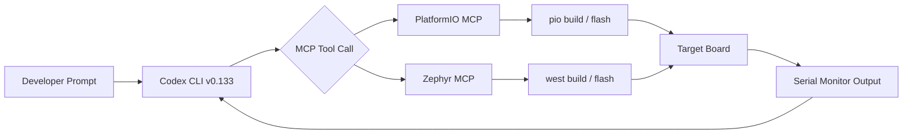
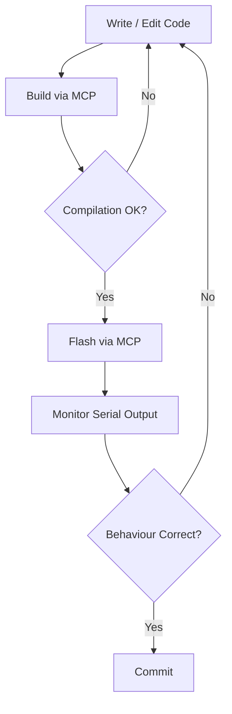

# Codex CLI for Embedded and Firmware Development: PlatformIO MCP, Zephyr Workflows, and AGENTS.md for Hardware Teams


---

Codex CLI articles cover Go, Rust, Python, Swift, Kotlin, Zig — practically every application-level language. Embedded firmware has been conspicuously absent. That gap matters because firmware teams face exactly the problems agentic coding solves well: mechanical boilerplate (register definitions, peripheral init sequences), cross-compilation targeting dozens of board variants, and build systems that punish configuration drift. This article bridges that gap with concrete patterns for using Codex CLI v0.133 [^1] with PlatformIO, Zephyr RTOS, and bare-metal C projects.

## Why Firmware Development Benefits from Agentic Coding

Embedded development is dominated by configuration management — an estimated 75% of the work involves Kconfig files, devicetree overlays, linker scripts, and build system plumbing rather than application logic [^2]. This is precisely the kind of mechanical, specification-driven work where an LLM agent excels, provided it has the right context and tooling.

The challenges are real, though:

- **Cross-compilation**: the code runs on a target board, not the development machine
- **Hardware access**: serial ports, debug probes, and JTAG adapters sit outside any sandbox
- **Memory constraints**: firmware targets may have 64 KB of RAM — the agent must respect hard limits
- **Deterministic timing**: RTOS task scheduling, interrupt latency, and DMA transfers demand precision

Codex CLI handles the first two through MCP tool servers and sandbox configuration. The second two require careful AGENTS.md instructions.

## PlatformIO MCP Server: Build, Flash, and Monitor from the Agent

The PlatformIO MCP server (v2.2.1, May 2026) [^3] exposes the full PlatformIO workflow as MCP tools that Codex can invoke directly:

| Tool | Purpose |
|------|---------|
| `list_boards` | Discover supported boards with optional filtering |
| `get_board_info` | Retrieve MCU specs, flash size, RAM, clock speed |
| `list_devices` | Detect connected hardware via USB/serial |
| `init_project` | Scaffold a new PlatformIO project for a target board |
| `build_project` | Compile firmware for the configured environment |
| `upload_firmware` | Flash compiled binary to connected device |
| `start_monitor` | Open serial monitor with configurable baud rate |
| `search_libraries` | Find PlatformIO libraries by keyword |
| `install_library` | Add a library dependency to the project |

### Installation

```bash
# Install PlatformIO Core (prerequisite)
pip install platformio

# Install MCP server for Codex CLI
npx platformio-mcp install --codex
```

This writes the MCP configuration to your Codex config. Alternatively, configure manually in `~/.codex/config.toml`:

```toml
[mcp_servers.platformio]
command = "npx"
args = ["-y", "platformio-mcp"]
```

### A Typical Firmware Session

```
> @platformio list_boards --filter esp32

> Create a new ESP32-S3 project using the Arduino framework with
  WiFi station mode, an HTTP server on port 80, and OTA update support.
  Use the esp32-s3-devkitc-1 board. After writing the code, build it
  and report any compilation errors.
```

Codex calls `init_project`, writes `src/main.cpp` and `platformio.ini`, then calls `build_project` — all within a single turn. If compilation fails, it reads the error output and self-corrects.

## Zephyr RTOS Workflows

For teams using Zephyr, MCP servers exist that wrap the `west` meta-tool [^4]:

```toml
[mcp_servers.zephyr]
command = "npx"
args = ["-y", "@hakehuang/zephyr_mcp"]
```

The Zephyr MCP server provides tools for project initialisation, `west build`, `west flash`, version detection, Kconfig verification, and build system introspection [^5]. This lets Codex navigate Zephyr's notoriously complex build system without hallucinating configuration keys.



## AGENTS.md for Firmware Projects

The AGENTS.md file is where you encode hardware constraints that the model cannot infer. A firmware AGENTS.md must be more prescriptive than a typical web project — the agent has no way to discover that your target has 256 KB of flash without being told.

### Root-Level AGENTS.md

```markdown
# AGENTS.md — Firmware Project

## Target Hardware
- MCU: STM32F411CEU6 (ARM Cortex-M4, 100 MHz)
- Flash: 512 KB
- RAM: 128 KB
- RTOS: FreeRTOS 10.6.1
- Framework: STM32 HAL

## Build System
- PlatformIO with custom board definition in `boards/`
- Build: `pio run -e production`
- Flash: `pio run -e production -t upload`
- Test: `pio test -e native` (host-based unit tests only)
- Monitor: `pio device monitor -b 115200`

## Coding Constraints
- No dynamic memory allocation after RTOS scheduler starts
- All tasks must have statically allocated stacks
- ISR functions must complete within 10 µs
- Use HAL_GPIO, HAL_UART, HAL_SPI — never access registers directly
- Prefer `configASSERT()` over silent failure
- sizeof(struct) matters — pack structs for DMA transfers
- All string literals in flash: use `const` and PROGMEM where applicable

## Conventions
- Header guards: `#ifndef PROJECT_MODULE_H`
- Function naming: `module_verb_noun()` (e.g., `sensor_read_temperature()`)
- Error returns: use `enum project_err_t`, never bare ints
- Every public function must have a Doxygen comment
```

### Subdirectory AGENTS.md for Drivers

```markdown
# AGENTS.md — drivers/

## Driver Conventions
- Each peripheral driver gets its own .c/.h pair
- Drivers must not include FreeRTOS headers — use callback registration
- All DMA buffers must be cache-aligned (32-byte boundary on Cortex-M7)
- Test drivers against the mock HAL in `test/mocks/`
```

This hierarchical loading means Codex picks up the global constraints at the repository root and the driver-specific rules when working in `drivers/` [^6].

## Sandbox and Permission Configuration

Firmware development requires capabilities that conflict with Codex's default sandbox. Flashing a board requires serial port access; monitoring requires persistent connections. Configure your permission profile accordingly:

```toml
# ~/.codex/config.toml

[sandbox]
mode = "workspace-write"
network_access = true  # needed for PlatformIO library downloads

[sandbox.workspace_write]
writable_roots = [
  ".",
  "/tmp"
]
```

For the PlatformIO MCP server to flash devices, it runs outside the sandbox as an MCP tool server — the agent calls the tool, and the tool server handles hardware access [^7]. This is the correct architecture: Codex proposes the flash command, the MCP server executes it with real device access, and the result streams back.

⚠️ **Security note**: if you grant `danger-full-access` sandbox mode to allow direct serial port access from shell commands, the agent has unrestricted filesystem and network access. Prefer the MCP-mediated approach where the tool server handles device I/O.

## Practical Patterns

### Pattern 1: Board Bring-Up Checklist

```
> I'm bringing up a new custom board based on ESP32-C3.
  The schematic shows: GPIO2=LED, GPIO4/5=I2C (BME280),
  GPIO6/7=UART1 (GPS NEO-6M), GPIO10=ADC (battery voltage divider).
  Create a PlatformIO project that initialises all peripherals,
  blinks the LED, reads the BME280, parses NMEA from the GPS,
  and logs battery voltage. Use ESP-IDF framework, not Arduino.
```

Codex generates `platformio.ini` with the `esp32-c3-devkitm-1` board and ESP-IDF framework, creates driver files for each peripheral, and a main `app_main()` that starts FreeRTOS tasks for each subsystem.

### Pattern 2: FreeRTOS Task Audit

```
> Audit all FreeRTOS tasks in this project. For each task, report:
  name, priority, stack size, stack high-water mark estimate,
  and whether it uses any blocking calls inside critical sections.
  Flag any priority inversion risks.
```

This leverages Codex's ability to trace call graphs across files — something tedious to do manually in a 50-file firmware project.

### Pattern 3: Peripheral Register Documentation

```
> Read the SPI driver in drivers/spi_flash.c and generate a markdown
  table documenting every register access: register name, address offset,
  read/write, bit fields used, and the purpose of each access.
```

### Pattern 4: Cross-Target Verification with codex exec

```bash
# Build firmware for three board variants in CI
for env in esp32_dev stm32f411 nrf52840; do
  codex exec \
    --model gpt-5.4-mini \
    --sandbox workspace-write \
    --approval-policy on-request \
    "Build the $env PlatformIO environment. If compilation fails,
     fix the errors and rebuild. Report the final binary size." \
    2>/dev/null
done
```

This uses `codex exec` in non-interactive mode [^8] to verify that firmware compiles cleanly across all target boards — a common CI requirement for multi-platform firmware projects.

## Model Selection for Firmware Work

Firmware code generation demands precision — a wrong register offset or a misaligned DMA buffer causes hard faults, not soft errors. Model selection matters more here than in web development:

| Task | Recommended Model | Reasoning Effort |
|------|-------------------|-----------------|
| Peripheral driver implementation | GPT-5.5 | High — register-level accuracy critical |
| Kconfig/devicetree changes | GPT-5.4 | Medium — structured configuration |
| Build system fixes | GPT-5.4-mini | Low — mechanical pattern matching |
| Code review and audit | GPT-5.5 | High — need to catch timing and memory bugs |
| Documentation generation | GPT-5.4-mini | Low — prose from existing code |

Switch models mid-session with `/model gpt-5.5` when transitioning from build fixes to driver implementation [^9].

## Limitations

- **Model training data**: GPT-5.5 has strong coverage of popular MCU families (ESP32, STM32, nRF52) but weaker knowledge of niche architectures (Renesas RA, Silicon Labs EFM32). Always verify generated register addresses against datasheets [^10].
- **No hardware-in-the-loop**: Codex cannot observe real-time behaviour. It can flash firmware and read serial output, but it cannot attach a debugger, set breakpoints, or read JTAG traces.
- **Timing verification**: the agent can write code with correct RTOS task priorities, but it cannot measure actual interrupt latency or verify deadline compliance.
- **Binary size awareness**: while Codex can read linker map files, it does not have a mental model of flash/RAM budgets across compilation units. Include budget thresholds in AGENTS.md.
- **Peripheral state**: the agent reasons about code, not silicon. If your SPI peripheral is in an unexpected state due to a brown-out, the agent cannot diagnose it from code alone.

## The Feedback Loop That Works

The most effective firmware workflow with Codex CLI follows a tight cycle:



Each step in this loop is mediated by MCP tools, giving Codex direct access to build output and serial logs. The agent reads compiler errors, fixes them, rebuilds — the same self-correcting loop that works for application code, now extended to cross-compiled firmware.

## Getting Started

1. Install PlatformIO Core: `pip install platformio`
2. Install the PlatformIO MCP server: `npx platformio-mcp install --codex` [^3]
3. Create your project's AGENTS.md with hardware constraints
4. Configure sandbox with `network_access = true` for library downloads
5. Start a session: `codex --model gpt-5.5 "Initialise the SPI peripheral for the onboard flash chip"`

Firmware development has been the last holdout against agentic coding tools — the hardware dependency, cross-compilation complexity, and unforgiving nature of bare-metal programming made it seem unsuitable. With MCP tool servers bridging the hardware gap and AGENTS.md encoding the constraints that datasheets define, Codex CLI is now a viable pair-programming partner for embedded teams.

## Citations

[^1]: [OpenAI Codex CLI v0.133.0 Release](https://github.com/openai/codex/releases) — GitHub, May 2026
[^2]: [Embedded Firmware Development with Claude Code — Devicetree, Kconfig, and Debugging](https://reversetobuild.com/claude-code-embedded-firmware-development/) — ReversetoBuild, 2026
[^3]: [PlatformIO MCP Server v2](https://github.com/jl-codes/platformio-mcp) — GitHub, v2.2.1, May 2026
[^4]: [Zephyr MCP Server by hakehuang](https://glama.ai/mcp/servers/@hakehuang/zephyr_mcp) — Glama MCP Directory, 2026
[^5]: [MCP Zephyr West Context Server](https://lobehub.com/mcp/leog25-zephyr-west-mcp) — LobeHub MCP, 2026
[^6]: [Custom Instructions with AGENTS.md](https://developers.openai.com/codex/guides/agents-md) — OpenAI Developers, 2026
[^7]: [Sandbox Configuration — Codex](https://developers.openai.com/codex/concepts/sandboxing) — OpenAI Developers, 2026
[^8]: [Non-interactive Mode — Codex](https://developers.openai.com/codex/noninteractive) — OpenAI Developers, 2026
[^9]: [Features — Codex CLI](https://developers.openai.com/codex/cli/features) — OpenAI Developers, 2026
[^10]: [Embedded Systems & Firmware Skill for Claude Code](https://mcpmarket.com/tools/skills/embedded-systems-engineer) — MCP Market, 2026
