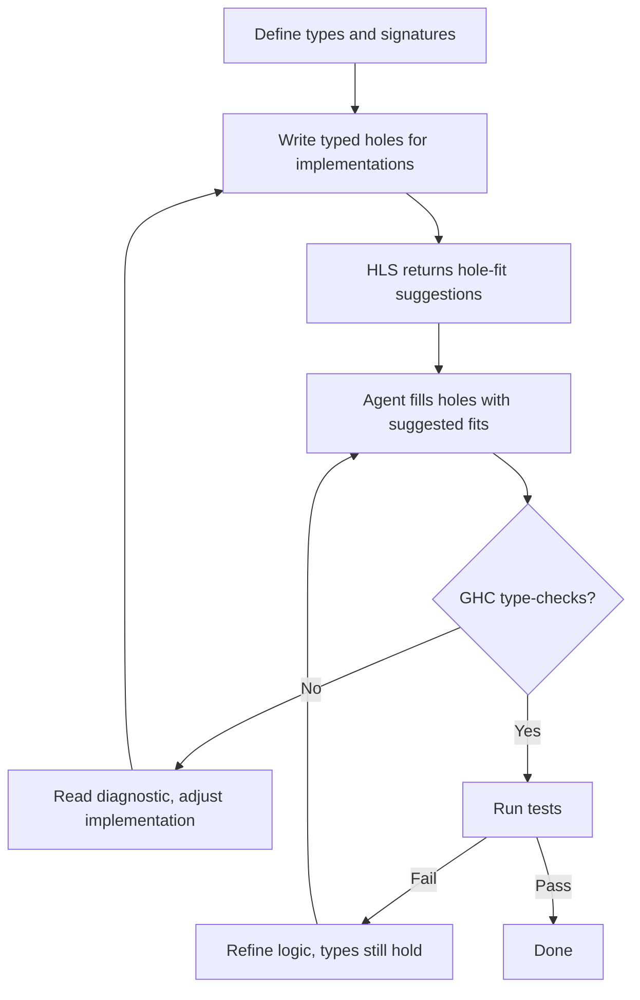

# Codex CLI for Haskell Development Teams: HLS via LSP-MCP, Type-Driven Agent Workflows, and AGENTS.md for Functional Codebases


---

Haskell's type system catches entire categories of defects at compile time, but that same rigour makes it an interesting test case for AI coding agents. A model that generates well-typed Haskell code on the first pass saves substantial iteration time; one that does not will loop against GHC errors until context is exhausted. This article covers how to wire Codex CLI into a Haskell toolchain so that the agent receives compiler diagnostics in real time, respects functional programming conventions, and leverages GHC 9.14's type system rather than fighting it.

## The Haskell MCP Landscape

Three integration points connect Codex CLI to Haskell tooling.

### LSP-MCP Bridge

The **LSP-MCP** server by Tritlo bridges any Language Server Protocol implementation to MCP [^1]. It starts an LSP client, connects to a configured language server, and exposes nine MCP tools including `get_info_on_location` (hover), `get_completions`, `get_diagnostics`, and `get_code_actions`. For Haskell, it ships with a language-specific extension that provides specialised prompts for typed-hole exploration — arguably the single most useful HLS feature for agent-driven development.

Configuration in `~/.codex/config.toml`:

```toml
[mcp_servers.haskell-lsp]
type = "stdio"
command = "npx"
args = ["tritlo/lsp-mcp", "haskell", "haskell-language-server-wrapper", "--lsp"]
```

### codex-lsp Plugin

The **codex-lsp** plugin takes a different approach: rather than exposing LSP as standalone MCP tools, it hooks into Codex's `post-tool-use` lifecycle [^2]. After every file edit, the plugin automatically validates changes against HLS and returns blocking feedback if type errors or warnings appear. This creates a tight feedback loop where the agent cannot proceed past a type error without fixing it first — exactly the discipline Haskell developers enforce on themselves.

The plugin exposes seven tools: `lsp.diagnostics`, `lsp.goto_definition`, `lsp.find_references`, `lsp.symbols`, `lsp.prepare_rename`, `lsp.rename`, and `lsp.status` [^2].

### Haskell MCP Library

For teams building custom MCP servers in Haskell itself, the **mcp** package on Hackage (v0.3.1.0, February 2026) provides a Servant-based server implementation supporting MCP protocol version 2025-06-18 [^3]. It offers HTTP transport with JWT authentication, stdio transport for subprocess integrations, and Server-Sent Events streaming. This is relevant when your Haskell project needs to expose domain-specific tools — database queries, business-rule validators, or deployment scripts — as MCP resources that Codex can call during a session.

## HLS 2.14 and GHC 9.14 Support

HLS 2.14.0.0, released 30 April 2026, supports GHC versions 9.6.7 through 9.14.1 [^4]. Key improvements relevant to agent workflows:

- **Faster startup in `multipleComponents` mode** — reduces the wait before Codex receives its first diagnostic response in large multi-package projects.
- **`ExplicitLevelImports` support** — GHC 9.14.1's new extension for separating type-level and value-level imports [^4]. The agent can use this to generate cleaner import blocks.
- **Notes hover and autocompletion** — HLS now provides hover information and completions for GHC `Note` references, helping the agent navigate compiler internals when working on GHC plugins or core libraries.

Install with GHCup:

```bash
ghcup install hls --set 2.14.0.0
```

GHC 9.14 is the first **LTS release** under GHC's new release schedule, guaranteeing a minimum of two years of bugfix support [^5]. For teams setting up Codex workflows, pinning to 9.14 LTS provides stability without sacrificing access to recent language features.

## AGENTS.md for Haskell Projects

Haskell projects benefit from unusually specific AGENTS.md instructions because the language's conventions diverge sharply from what models trained primarily on Python, TypeScript, and Go will default to. A minimal but effective configuration:

```markdown
# Build and Test

- Build: `cabal build all`
- Test: `cabal test all --test-show-details=streaming`
- Lint: `hlint src/ test/`
- Format: `fourmolu -i src/ test/`
- Type-check only: `cabal build all --ghc-options="-fno-code"`

# Coding Conventions

- Use explicit type signatures on ALL top-level bindings — never rely on inference
- Prefer `Text` over `String` for all user-facing text
- Use `newtype` wrappers for domain types rather than type aliases
- Avoid partial functions (`head`, `tail`, `!!`) — use `NonEmpty` or pattern matching
- Enable `-Wall -Werror` — treat all warnings as errors
- Use qualified imports for all non-Prelude modules
- Write Haddock comments on every exported function and data type
- Prefer `where` clauses over `let` bindings for named intermediate values
- Use typed holes (`_`) when exploring implementations — the compiler will suggest types

# Error Handling

- Use `ExceptT` or `Either` for recoverable errors, never `error` or `undefined`
- Pattern match exhaustively — enable `-Wincomplete-patterns`

# Dependencies

- Add dependencies to the `.cabal` file, never to `stack.yaml` directly
- Pin major versions with PVP bounds (e.g., `base >= 4.18 && < 4.22`)
```

The instruction to use typed holes is particularly powerful with the LSP-MCP integration. When the agent writes `_ :: SomeType`, HLS returns the expected type and valid completions via `get_info_on_location`, letting the agent fill holes iteratively rather than guessing at complex type signatures [^1].

## Type-Driven Agent Workflows

Haskell's type system enables a distinctive agent workflow pattern where types guide implementation rather than tests.



This flow works because GHC's type checker acts as a fast, deterministic oracle that the agent can query before running slower property tests or integration suites. In practice, a well-typed Haskell function that compiles often behaves correctly — the aphorism "if it compiles, it works" holds frequently enough that the type-check pass eliminates most iteration cycles.

### Practical Pattern: Algebraic Data Type Refactoring

Consider a task where the agent must add a new constructor to an algebraic data type. With `-Wincomplete-patterns` enabled, GHC will flag every pattern match that needs updating. The agent workflow becomes:

1. Add the new constructor to the data type definition.
2. Run `cabal build all --ghc-options="-fno-code"` for a fast type-check.
3. HLS diagnostics (via LSP-MCP) list every incomplete pattern match.
4. Navigate to each location and extend the pattern match.
5. Repeat until zero diagnostics remain.

This is deterministic and exhaustive — the agent cannot miss a case because the compiler enumerates every one.

## Model Selection for Haskell

Haskell is underrepresented in model training data compared to Python or JavaScript. Model selection matters more than usual:

| Task | Recommended Model | Rationale |
|------|-------------------|-----------|
| Type-driven implementation | `gpt-5.5` | Strongest at complex type reasoning [^6] |
| Refactoring, pattern match completion | `gpt-5.4` | Good balance of speed and accuracy |
| Build script generation, Cabal config | `gpt-5.4-mini` | Sufficient for declarative configuration |
| Quick interactive exploration | `gpt-5.3-codex-spark` | Fast iteration with typed holes |

Configure model routing in `~/.codex/config.toml`:

```toml
model = "gpt-5.5"

[agents]
model = "gpt-5.4-mini"
```

This routes the primary agent to GPT-5.5 for implementation work while delegating subagent tasks (documentation lookups, dependency searches) to the faster mini model [^7].

## Permission Profile for Haskell Development

Haskell builds are deterministic but can be resource-intensive. A sensible permission profile:

```toml
[permissions]
approval_policy = "unless-allow-listed"

[permissions.allow_list]
read = ["**/*.hs", "**/*.cabal", "**/cabal.project*", "**/*.yaml", "**/*.toml"]
write = ["src/**/*.hs", "test/**/*.hs", "app/**/*.hs", "*.cabal"]
commands = [
  "cabal build*",
  "cabal test*",
  "cabal run*",
  "cabal clean",
  "hlint*",
  "fourmolu*",
  "ghcup*",
]
network_access = true  # Required for Hackage dependency resolution
```

## Limitations

- **Training data lag**: Models have weaker coverage of GHC 9.14-specific extensions (`ExplicitLevelImports`, recent `SPECIALISE` improvements) and may generate code targeting older GHC versions [^6]. The AGENTS.md GHC version constraint helps but does not eliminate this.
- **Build times**: Large Haskell projects can take minutes to build. The `--ghc-options="-fno-code"` flag for type-check-only passes is essential to keep the agent's feedback loop fast.
- **Template Haskell**: TH splices execute at compile time and can perform arbitrary IO. Sandbox restrictions may conflict with TH-heavy projects. Consider `network_access = false` when the project does not require TH-driven code generation that fetches external resources.
- **No REPL integration**: Codex CLI cannot interact with GHCi directly. The LSP-MCP bridge provides evaluation-like capabilities through typed holes and hover information, but true REPL-driven exploration (`:type`, `:kind`, `:info`) is not yet available via MCP.
- **Cabal vs Stack**: The MCP tooling is agnostic to build tool choice, but AGENTS.md instructions must be specific. Teams using Stack should replace all `cabal` commands with their Stack equivalents and configure the HLS `cradle` accordingly.

## Citations

[^1]: [LSP-MCP Server - Awesome MCP Servers](https://mcpservers.org/servers/Tritlo/lsp-mcp) — LSP-MCP bridge server with nine tools and Haskell-specific typed-hole extension.
[^2]: [codex-lsp - GitHub](https://github.com/code-yeongyu/codex-lsp) — Codex plugin exposing LSP diagnostics and MCP tools with post-tool-use lifecycle hooks.
[^3]: [mcp package - Hackage](https://hackage.haskell.org/package/mcp) — Servant-based MCP server library for Haskell, v0.3.1.0, MCP protocol 2025-06-18.
[^4]: [HLS 2.14.0.0 Release - Haskell Blog](https://blog.haskell.org/hls-2-14-0-0/) — Release notes for HLS 2.14.0.0 with GHC 9.14.1 support, released 30 April 2026.
[^5]: [GHC LTS Release Schedule](https://www.haskell.org/ghc/blog/20250702-ghc-release-schedules.html) — GHC 9.14 designated as first LTS release with two-year bugfix support.
[^6]: [Codex Models - OpenAI Developers](https://developers.openai.com/codex/models) — Current model catalogue including GPT-5.5, GPT-5.4, GPT-5.4-mini, and GPT-5.3-Codex-Spark.
[^7]: [Advanced Configuration - OpenAI Developers](https://developers.openai.com/codex/config-advanced) — Subagent model routing and configuration reference.
