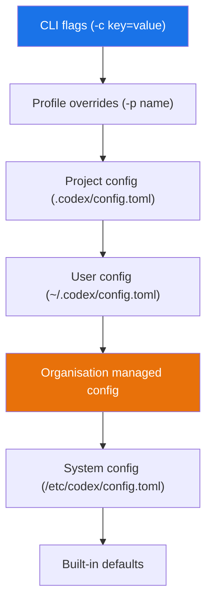

# Codex CLI Permission Profile Inheritance: Composable Security Policies and List APIs in v0.133


---

Permission profiles have been part of Codex CLI since early 2026, but they suffered from a composability problem. Every team that wanted a shared base profile with per-project overrides had to duplicate the entire profile definition, manually keep variants synchronised, and hope nobody missed a critical network rule when copying. Version 0.133.0, released on 21 May 2026, introduces three features that change the equation: **profile inheritance** through config-layer composition, **list APIs** for discovering available profiles at runtime, and **managed `requirements.toml` support** for admin-enforced policy floors[^1].

This article explains how these features work together to let engineering teams build composable, auditable security policies without restating boilerplate.

## The Problem Permission Profiles Solve

A permission profile is a named policy combining filesystem rules (what paths commands can read, write, or are denied access to) with network rules (which domains and sockets commands can reach)[^2]. Three built-in profiles ship with every installation:

| Profile | Filesystem | Network |
|---------|-----------|---------|
| `:read-only` | No modifications anywhere | Blocked |
| `:workspace` | Write within active workspace roots | Blocked |
| `:danger-full-access` | Unrestricted | Unrestricted |

Custom profiles live under `[permissions.<name>]` tables in `config.toml` and are activated with `default_permissions = "<name>"` or via the `-p` profile flag[^2].

The trouble was scaling. A platform team wanting a `base-secure` profile for the entire organisation, with individual teams adding project-specific workspace roots or domain allowlists, had to copy every filesystem and network entry into each variant. Miss one deny rule and the variant silently drops a security control.

## How Inheritance Works in v0.133

Profile inheritance in Codex CLI does not use an explicit `extends` key. Instead, it follows the same config-layer model that governs every other setting: higher-precedence layers add or replace entries under the same profile name without restating the entire profile[^2][^3].

The precedence chain runs:



### Practical Example: Layered Profile Definition

An organisation defines a `secure-base` profile at the system level:

```toml
# /etc/codex/config.toml (system layer — IT/platform team)
[permissions.secure-base.filesystem]
":minimal" = "read"
":workspace_roots"."." = "write"
":workspace_roots"."**/*.env" = "deny"
":workspace_roots".".git" = "read"

[permissions.secure-base.network]
enabled = true
mode = "limited"

[permissions.secure-base.network.domains]
"api.openai.com" = "allow"
"registry.npmjs.org" = "allow"
"*.googleapis.com" = "deny"
```

A project team extends this by adding workspace roots and an additional domain in the project-level config:

```toml
# .codex/config.toml (project layer — checked into the repo)
[permissions.secure-base.workspace_roots]
"/opt/shared-libs" = true

[permissions.secure-base.network.domains]
"api.stripe.com" = "allow"
```

When both layers are active, the resulting `secure-base` profile includes all filesystem rules from the system layer, the additional workspace root from the project layer, and the union of domain rules — without the project team needing to restate the `.env` deny or the npm registry allow[^2].

### Access Precedence Rules

Within a single profile, access levels follow strict precedence[^2]:

1. **`deny` overrides `write`**, which overrides `read`
2. More specific paths always win over broader ones
3. For network domains, deny entries override allow entries

This means a system-level `"**/*.env" = "deny"` cannot be overridden by a project-level `"**/*.env" = "write"` — the deny always wins. This is intentional: it prevents lower-trust config layers from weakening security controls established by higher-trust layers.

## List APIs: Discovering Available Profiles

Before v0.133, developers had to read config files manually to discover which profiles were available. The release introduces list APIs that surface the effective set of profiles after all config layers merge[^1].

From the TUI, the `/permissions` slash command now displays the active profile alongside all available alternatives. The `codex permissions` subcommand supports listing and inspecting profiles programmatically:

```bash
# List all available permission profiles
codex permissions list

# Show the merged definition of a specific profile
codex permissions show secure-base

# Display which config layer contributed each rule
codex permissions show secure-base --trace
```

The `--trace` flag is particularly useful for debugging inheritance: it annotates each filesystem and network entry with the config file and line number that defined it[^1].

## Managed Requirements: Admin-Enforced Policy Floors

For organisations on ChatGPT Business or Enterprise plans, `requirements.toml` provides an admin-enforced configuration layer that users cannot bypass[^4]. In v0.133, permission profiles integrate with this mechanism:

```toml
# requirements.toml (managed by IT via MDM or cloud policy)
[requirements]
default_permissions = "secure-base"
sandbox_mode_override = false

[requirements.permissions.secure-base.filesystem]
":workspace_roots"."**/*.pem" = "deny"
":workspace_roots"."**/*.key" = "deny"

[requirements.permissions.secure-base.network.domains]
"*" = "deny"
"api.openai.com" = "allow"
```

The precedence chain for requirements is: cloud-managed requirements, then MDM `requirements_toml_base64`, then system `/etc/codex/requirements.toml`[^4]. Requirements entries merge into the profile using the same additive logic, but because deny always wins and requirements sit at the highest precedence level, admin deny rules are effectively immutable.


### Runtime Refresh

A notable v0.133 improvement is runtime refresh behaviour for managed requirements[^1]. When a user signs in with ChatGPT on a Business or Enterprise plan, Codex checks for updated managed requirements and applies them without requiring a CLI restart. Previously, changes to managed policy required terminating and restarting the session.

## Platform-Specific Enforcement

Permission profiles are enforced through OS-level sandbox mechanisms, and v0.133 strengthened Windows support[^1][^5]:

| Platform | Mechanism | v0.133 Changes |
|----------|-----------|----------------|
| macOS | Seatbelt (`sandbox-exec`) profiles | Stable; unsupported policies refused rather than silently dropped |
| Linux/WSL | `bwrap` + `seccomp` with Landlock fallback | Stable; enforcement depends on kernel support |
| Windows | Restricted tokens, ACLs, firewall rules (`elevated` mode) | Stronger integration; `unelevated` fallback improved |

On all platforms, if a profile specifies a rule that the sandbox cannot enforce, Codex refuses to start rather than running unsandboxed[^5]. This fail-closed behaviour is critical for enterprise deployments where silent degradation would violate compliance requirements.

## Practical Patterns

### Pattern 1: Organisation-Wide Base with Team Overrides

Define a restrictive base profile at the system level. Each team's project config adds only the domain allowlists and workspace roots specific to their service:

```toml
# Team A: .codex/config.toml
[permissions.org-base.network.domains]
"api.stripe.com" = "allow"
"hooks.slack.com" = "allow"

[permissions.org-base.workspace_roots]
"/home/dev/services/payments" = true
```

### Pattern 2: Review Profile That Inherits Read-Only

Create a `review` profile that starts from read-only defaults but adds network access for fetching PR context:

```toml
# ~/.codex/config.toml
[permissions.review.filesystem]
":minimal" = "read"
":workspace_roots"."." = "read"

[permissions.review.network]
enabled = true
[permissions.review.network.domains]
"api.github.com" = "allow"
"api.openai.com" = "allow"
```

Activate with `codex -p review "Review the changes in this PR"`.

### Pattern 3: CI Pipeline Profile with Output Schema

For headless `codex exec` runs in CI, combine a locked-down profile with structured output:

```bash
codex exec \
  -p ci-locked \
  --output-schema schema.json \
  -o report.json \
  "Analyse this PR for security issues"
```

The `ci-locked` profile denies all network access except the OpenAI API, denies all filesystem writes except a designated output directory, and blocks access to credential files.

## Migration from Legacy Sandbox Settings

Permission profiles replace the older `sandbox_mode` and `sandbox_workspace_write` combination[^2]. The two systems do not compose — if any active config layer or CLI flag sets `sandbox_mode`, Codex falls back to the legacy behaviour entirely. Teams migrating should:

1. Audit all config layers for legacy `sandbox_mode` keys
2. Convert each to an equivalent `[permissions.<name>]` table
3. Remove all `sandbox_mode` and `sandbox_workspace_write` entries
4. Verify with `codex permissions show <name> --trace`

## Limitations and Caveats

Permission profiles govern local sandboxed command execution only[^2]. They do **not** control:

- App connector access (Slack, GitHub, etc.)
- MCP server tool execution
- Browser and computer-use surfaces
- Codex cloud task sandboxing
- Approved escalations after user confirmation

Glob patterns using unbounded `**` require setting `glob_scan_max_depth` on Linux, WSL, and Windows to enable pre-expansion before sandbox startup[^2].

⚠️ The list API subcommands (`codex permissions list`, `codex permissions show`) were introduced in v0.133.0 and may see syntax changes in subsequent releases. The permission profiles system remains in beta status[^2].

## What Comes Next

The combination of profile inheritance, list APIs, and managed requirements creates a governance stack that scales from individual developer to enterprise deployment. Platform teams can ship deny rules that project teams cannot weaken. Project teams can add domain allowlists and workspace roots without copy-pasting boilerplate. And the list APIs provide the auditability that compliance teams require.

For teams already using named profiles from the cookbook era, the migration is straightforward: factor shared rules into a system or organisation-level config, and keep only the deltas in project configs. For teams still on legacy `sandbox_mode`, the v0.133 list APIs provide the visibility needed to plan a confident migration.

## Citations

[^1]: OpenAI, "Release 0.133.0," GitHub openai/codex releases, 21 May 2026. [https://github.com/openai/codex/releases/tag/rust-v0.133.0](https://github.com/openai/codex/releases/tag/rust-v0.133.0)

[^2]: OpenAI, "Permissions – Codex," OpenAI Developers, 2026. [https://developers.openai.com/codex/permissions](https://developers.openai.com/codex/permissions)

[^3]: OpenAI, "Config basics – Codex," OpenAI Developers, 2026. [https://developers.openai.com/codex/config-basic](https://developers.openai.com/codex/config-basic)

[^4]: OpenAI, "Managed configuration – Codex," OpenAI Developers, 2026. [https://developers.openai.com/codex/enterprise/managed-configuration](https://developers.openai.com/codex/enterprise/managed-configuration)

[^5]: OpenAI, "Sandbox – Codex," OpenAI Developers, 2026. [https://developers.openai.com/codex/concepts/sandboxing](https://developers.openai.com/codex/concepts/sandboxing)
