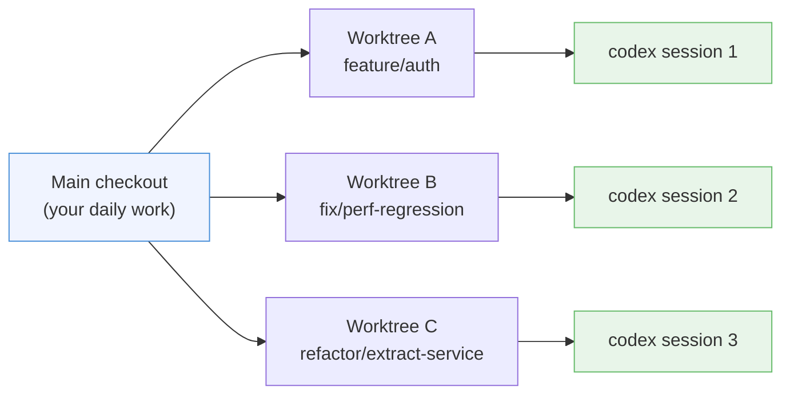
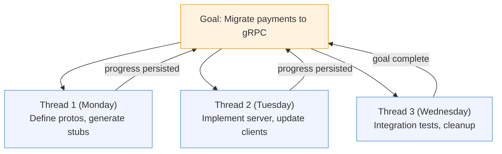
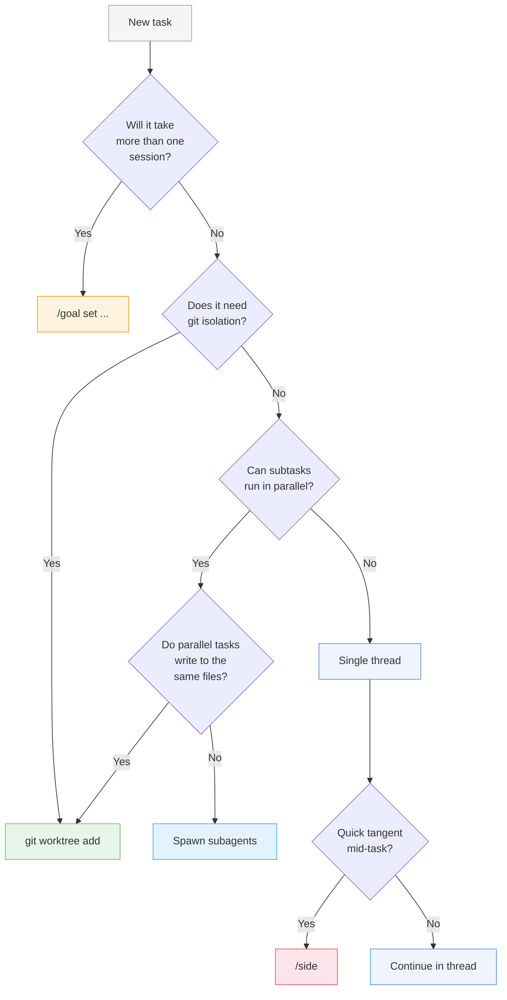

# Codex CLI Session Patterns: A Decision Framework for Threads, Worktrees, /side, Goals, and Subagents


---

Codex CLI v0.133 ships with five distinct session patterns, each designed for a different shape of work. Choosing the wrong pattern does not break anything — it wastes tokens, fragments context, or creates merge conflicts that cost more to fix than the original task. This article maps each pattern to the task shapes where it excels, provides a decision flowchart, and documents the practical trade-offs senior developers hit in production.

## The Five Session Patterns

Before the decision framework, a brief taxonomy. Every Codex CLI interaction fits one of these patterns:

| Pattern | Scope | Isolation | Lifetime | Token cost |
|---------|-------|-----------|----------|------------|
| **Single thread** | One coherent task | None (working directory) | Minutes to hours | Lowest |
| **Worktree** | Independent branch | Full git isolation | Hours to days | Low per session |
| **/side** | Quick tangent | Ephemeral fork | Seconds to minutes | Minimal |
| **Goal** | Multi-session objective | Persisted state | Hours to weeks | Budgeted |
| **Subagents** | Parallel subtasks | Per-agent sandbox | Within parent turn | Highest |

Each pattern solves a specific coordination problem. The challenge is knowing which problem you actually have.

## Pattern 1: Single Thread — The Default

A single interactive session in your working directory. You type a prompt, Codex reads files, makes changes, and you review the diff. This is where 80% of daily work should happen[^1].

**When to use it:**
- Bug fixes touching one to three files
- Small refactors with clear scope
- Code review via `/review`
- Exploratory questions about the codebase

**When to stop using it:**
- The thread has accumulated more than ~50 turns of unrelated work
- You find yourself saying "ignore everything above" — that is a signal to `/clear` or start fresh

```bash
# Start a focused session
codex --model gpt-5.4

# Mid-session: check token usage and context health
/status
```

The official best practices are explicit: "Keep one thread per coherent unit of work. Staying in the same thread for related work is often better because it preserves the reasoning trail"[^1]. Thread drift — where a bug-fix session mutates into a feature discussion — is the most common anti-pattern.

### When Context Gets Heavy

Once a thread accumulates enough context that responses slow down or become vague, you have two options:

```bash
# Option A: Compact the transcript — keeps reasoning trail, frees tokens
/compact

# Option B: Nuclear reset — when the thread is unsalvageable
/clear
```

`/compact` generates a summary of the conversation so far and replaces the raw transcript. It preserves the reasoning trail at the cost of losing verbatim detail[^2]. Use `/clear` when the thread has gone so far off course that even a summary would pollute the next task.

## Pattern 2: Worktrees — Full Git Isolation

A git worktree is a separate checkout of the same repository, sharing history but with its own working directory, branch, and `node_modules`/`.venv`/build cache[^3]. Codex sessions in different worktrees cannot conflict because they operate on physically separate file trees.

**When to use them:**
- Parallel feature work on the same repository
- Exploratory refactors you might discard
- Long-running tasks where you need your main checkout clean
- CI integration where the agent must not touch the developer's working tree

```bash
# Create a worktree for a feature
git worktree add ../myrepo-feature-auth feature/auth

# Start Codex in the worktree
codex --cd ../myrepo-feature-auth
```

**Practical considerations:**

Each worktree duplicates disk-resident state — `node_modules`, `.next`, `pytest` caches. On a typical Node.js monorepo, that is 500 MB to 2 GB per worktree[^4]. Teams running four to six parallel sessions report this as routine[^4], but disk pressure is real on smaller machines.



Worktrees provide **stronger isolation than subagents**. Subagents share the parent's sandbox and working directory; worktrees give each task its own branch, its own file state, and its own merge path. Use worktrees when you need independent `git commit` histories.

## Pattern 3: /side — Ephemeral Tangents

`/side` opens an ephemeral fork of the current conversation for a quick detour without polluting the main thread's transcript[^5]. Think of it as opening a scratch buffer in your editor.

**When to use it:**
- Quick "is this safe?" checks before a destructive operation
- Looking up an API signature while mid-implementation
- Asking for a second opinion on a design decision
- Testing a hypothesis without committing to the approach

```bash
# Mid-task: quick risk check without disrupting flow
/side Does this migration drop the index on users.email? Check the schema.

# Return to the main thread when done
```

**When NOT to use it:**
- Sustained work that produces files you want to keep — use a full thread or worktree instead
- Anything requiring more than five turns — the ephemeral nature means no persistence
- Parallel execution — `/side` is sequential; use subagents for true parallelism

The key distinction: `/side` is a **conversation-level** fork. `/fork` is a **session-level** clone that creates a new persistent thread[^5]. Use `/side` when you will return to the main thread within minutes; use `/fork` when you want a durable alternative exploration path.

## Pattern 4: Goals — Multi-Session Persistence

Goals, promoted to default-on in v0.133[^6], are persisted workflow objects that track an objective across multiple sessions. They survive session exits, machine restarts, and even CLI upgrades.

**When to use them:**
- Multi-day feature implementations
- Refactors that span dozens of files across several sessions
- Any work where you need to pause, context-switch, and return hours or days later
- Budget-sensitive work where you want Codex to track progress and avoid re-doing completed steps

```bash
# Set a goal for a multi-session task
/goal set "Migrate the payments service from REST to gRPC. Steps: 1. Define proto files. 2. Generate Go stubs. 3. Implement server. 4. Update clients. 5. Add integration tests."

# Check progress in a later session
/goal

# Resume work — Codex reads the persisted goal state
codex resume --last
```

Goals store progress in dedicated local storage and account for active work during continuation[^6]. This means Codex does not repeat completed steps when you resume — it picks up from where it left off.

**The goal vs. thread distinction:**

A thread is a conversation transcript. A goal is a **task-level intent** that can span multiple threads. You might use three separate threads (one per day) to accomplish a single goal. The goal provides continuity; the threads provide fresh context windows.



**Budget considerations:**

Goal continuations halt at usage limits and repeated blockers[^7]. If a goal gets stuck in a loop, Codex surfaces the blocker rather than burning through your quota. This is the v0.132 fix for the quota-drain problem the community reported in early May 2026[^8].

## Pattern 5: Subagents — Parallel Delegation

Subagents spawn child agents that execute in parallel within the parent's session[^9]. They share the parent's working directory and sandbox but operate on independent context windows.

**When to use them:**
- Read-heavy parallel exploration (e.g. "search the codebase for all uses of deprecated API X")
- Multi-file implementation with clear ownership boundaries (agent A handles the backend, agent B handles the frontend)
- PR review with specialised reviewers (security, correctness, documentation)

**When NOT to use them:**
- Write-heavy work on overlapping files — concurrent edits create conflicts[^9]
- Simple tasks where the overhead of spawning and consolidating outweighs the work
- Single-file changes or quick fixes

```bash
# Explicit parallel delegation
> Spawn two agents: one to add input validation to the API handlers,
  another to write unit tests for the existing handlers.

# Configuration: cap concurrency
# In config.toml:
# [agents]
# max_threads = 4
# max_depth = 1
```

**Configuration reference:**

| Key | Default | Purpose |
|-----|---------|---------|
| `agents.max_threads` | 6 | Maximum concurrent agent threads[^9] |
| `agents.max_depth` | 1 | Nesting depth (1 = children only, no grandchildren)[^9] |

The default `max_depth = 1` is deliberate. Recursive delegation — where a child agent spawns its own children — multiplies token consumption geometrically and rarely produces better results than a flat fan-out[^9].

**Custom agent roles:**

For teams with repeating patterns, define named agents in `.codex/agents/`:

```toml
# .codex/agents/reviewer.toml
name = "reviewer"
description = "Security and correctness review specialist"
developer_instructions = """
Focus on: input validation, SQL injection, auth checks,
error handling, race conditions. Flag but do not fix.
"""
sandbox_mode = "read-only"
```

These named agents appear in the `/agent` picker and can be spawned by name, giving you reproducible delegation patterns[^9].

## The Decision Flowchart

When starting a task, run through this sequence:



**The key questions in order:**

1. **Duration**: Will this span multiple sessions? If yes, set a goal first.
2. **Isolation**: Does it need its own branch and clean file state? If yes, use a worktree.
3. **Parallelism**: Can the work be split into independent subtasks? If yes, and they do not write to overlapping files, use subagents.
4. **Default**: Everything else is a single thread. Use `/side` for mid-task tangents.

## Combining Patterns

These patterns compose. A realistic multi-day feature might use all five:

1. **Goal** set on Monday: "Implement OAuth2 PKCE flow for the mobile app"
2. **Worktree** created for `feature/oauth-pkce` to isolate from main
3. **Thread 1** (Monday): Define the auth flow, create DB migrations
4. **Subagents** within Thread 1: one agent writes the token endpoint, another writes the PKCE verifier logic
5. **/side** mid-implementation: "Quick check — does our Redis version support the SET EX NX pattern?"
6. **Thread 2** (Tuesday, resumed via goal): Write integration tests, update API docs
7. **Thread 3** (Wednesday): Final review, merge preparation

The cost distribution for a pattern like this: the goal adds negligible overhead (it is metadata, not tokens). The worktree costs disk space but no extra tokens. Subagents roughly double token usage for the turns where they are active[^9]. `/side` adds a few hundred tokens per detour.

## Anti-Patterns to Avoid

**The Mega-Thread**: Running one thread for hours across unrelated tasks. Context degrades, costs rise, and model attention drifts[^1]. Start a new thread when the task changes.

**Premature Subagent Delegation**: Spawning parallel agents for a task that could be done in ten lines of a single thread. The coordination overhead (spawning, consolidating, conflict resolution) exceeds the actual work.

**Worktree Without Cleanup**: Creating worktrees for every small task and never removing them. Each one consumes disk and clutters `git worktree list`. Clean up with `git worktree remove` when the branch is merged.

**Goal Without Structure**: Setting vague goals like "improve the codebase." Goals work best when they include explicit steps so Codex can track completion[^6].

**Using /fork When You Mean /side**: `/fork` creates a persistent session clone. If you just want to ask a quick question, `/side` is cheaper and does not leave orphaned sessions in your history.

## Session Hygiene Checklist

Before starting any session:

```bash
# 1. Check if there is an active goal
/goal

# 2. Check recent sessions for resumable work
codex resume

# 3. Check worktree status
git worktree list

# 4. Set the right model for the task complexity
/model gpt-5.4        # Complex reasoning
/model gpt-5.4-mini   # Routine tasks, lower cost
```

During the session:

- Run `/status` periodically to monitor token usage
- Use `/compact` before context exceeds 60% of the window
- Prefer `/side` over tangent prompts in the main thread
- Set reasoning effort appropriately: `model_reasoning_effort = "low"` for routine work, `"high"` for architectural decisions[^10]

After the session:

- If the goal is not complete, verify progress was persisted: `/goal`
- If using worktrees, commit and push before closing
- Clean up completed worktrees: `git worktree remove ../worktree-name`

## Limitations

- **No cross-session subagents**: Subagents exist only within the parent session's lifetime. They cannot persist across sessions; use goals for that[^9].
- **/side transcripts are ephemeral**: There is no way to recover a `/side` conversation after returning to the main thread. If you need the output, copy it first.
- **Goal JSON schema is beta**: The persisted goal format may change between CLI versions. Memory summaries are versioned and rebuilt when the format is stale[^11], but goal migrations are not yet guaranteed.
- **Worktree disk pressure**: On resource-constrained machines (CI runners, Codespaces), multiple worktrees with full dependency trees can exhaust disk. Consider shallow clones or shared caches.

## Citations

[^1]: OpenAI, "Best practices – Codex," developers.openai.com/codex/learn/best-practices, accessed 22 May 2026.
[^2]: OpenAI, "Slash commands in Codex CLI," developers.openai.com/codex/cli/slash-commands, accessed 22 May 2026.
[^3]: Git Documentation, "git-worktree," git-scm.com/docs/git-worktree, accessed 22 May 2026.
[^4]: Ofox.ai, "Codex CLI Real-World Coding Workflow: The Setup Senior Devs Use in 2026," ofox.ai/blog/codex-cli-real-world-coding-workflow/, accessed 22 May 2026.
[^5]: OpenAI, "Features – Codex CLI," developers.openai.com/codex/cli/features, accessed 22 May 2026.
[^6]: OpenAI, "Codex CLI v0.133.0 release," github.com/openai/codex/releases, 21 May 2026.
[^7]: OpenAI, "Codex CLI v0.132.0 release," github.com/openai/codex/releases, 20 May 2026.
[^8]: OpenAI Developer Community, "Codex users report rapid quota drains since May 10," community.openai.com, May 2026.
[^9]: OpenAI, "Subagents – Codex," developers.openai.com/codex/subagents, accessed 22 May 2026.
[^10]: OpenAI, "Advanced Configuration – Codex," developers.openai.com/codex/config-advanced, accessed 22 May 2026.
[^11]: OpenAI, "Codex CLI v0.131.0 release," github.com/openai/codex/releases, 18 May 2026.
