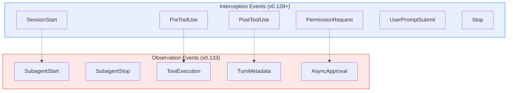
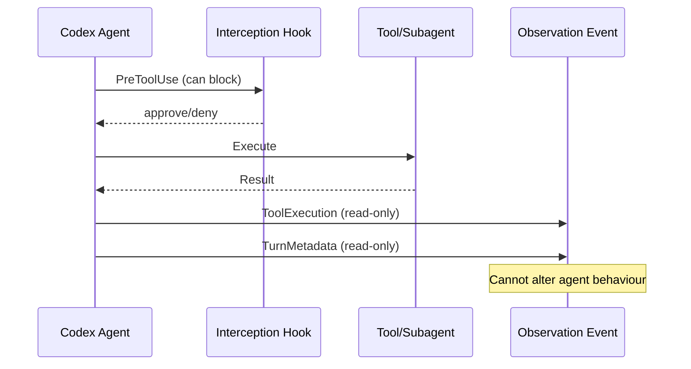

# Codex CLI v0.133 Extension Lifecycle Events: Building Observability Plugins with SubagentStart, ToolExecution, and TurnMetadata


---

Before v0.133, Codex CLI's hook system gave plugins six interception points: SessionStart, PreToolUse, PostToolUse, PermissionRequest, UserPromptSubmit, and Stop[^1]. These hooks let external scripts block commands, inject system messages, and gate permissions — but they left the inner workings of multi-agent sessions invisible. When a subagent spawned, ran three tools, and completed a turn consuming 40,000 tokens, the plugin layer had no way to observe any of it.

Version 0.133.0, released on 21 May 2026, closes this gap with five new extension lifecycle events that expose the full agent lifecycle to plugin authors[^2]. This article explains each event, shows how they differ architecturally from hooks, and walks through building an observability plugin that consumes them.

## The Eleven-Event Model

After v0.133, Codex CLI's extension surface comprises eleven distinct events spanning three categories:



The distinction matters. Interception events can **modify behaviour** — a PreToolUse hook returning exit code 2 blocks the tool call entirely[^1]. Observation events are **read-only notifications** — they inform plugins about what happened but cannot alter the outcome. This separation is deliberate: observation events fire after the action has committed, ensuring they cannot introduce latency into the agent loop or create deadlocks in multi-agent workflows.

## The Five New Events

### SubagentStart

Fires when a subagent is about to spawn. The event payload includes the proposed agent name, model, service tier, and permission profile[^3]. For plugin authors building governance gates, this is the point to log spawn decisions, enforce per-role model restrictions, or alert on unexpected agent creation.

```toml
# hooks/hooks.json embedded in plugin manifest
[[hooks.SubagentStart]]
matcher = ""
type = "command"
command = "./scripts/log-spawn.sh"
timeout = 5000
statusMessage = "Logging subagent spawn..."
```

The hook receives JSON on stdin containing the spawn configuration:

```json
{
  "hook_event_name": "SubagentStart",
  "session_id": "sess_abc123",
  "agent_name": "worker-auth-migration",
  "model": "gpt-5.5",
  "service_tier": "default",
  "permission_profile": "ci-deploy",
  "parent_agent": "default",
  "depth": 1
}
```

Unlike interception hooks, a SubagentStart observation handler returning exit code 2 does not block the spawn — it logs the denial reason but the spawn proceeds. To actually gate spawns, combine this with a PreToolUse hook matching the `spawn_agent` tool name[^1].

### SubagentStop

Fires when a subagent completes, is terminated, or times out. The payload includes the agent name, exit reason, token consumption, and wall-clock duration:

```json
{
  "hook_event_name": "SubagentStop",
  "session_id": "sess_abc123",
  "agent_name": "worker-auth-migration",
  "exit_reason": "completed",
  "input_tokens": 24500,
  "output_tokens": 8200,
  "reasoning_tokens": 3100,
  "duration_ms": 45000
}
```

This event is the foundation for cost-tracking plugins. By pairing SubagentStart and SubagentStop, a plugin can calculate per-agent cost, track spawn-to-completion latency, and detect agents that time out or are terminated prematurely.

### ToolExecution

Fires after any tool — built-in or MCP — executes within a turn. This complements PostToolUse but differs in scope: PostToolUse is an interception event that can inject system messages into the conversation, whilst ToolExecution is an observation event that reports the tool's execution metadata without the ability to alter the agent's subsequent behaviour[^2].

```json
{
  "hook_event_name": "ToolExecution",
  "session_id": "sess_abc123",
  "turn_id": "turn_42",
  "tool_name": "Bash",
  "tool_input": "pytest tests/auth/",
  "exit_code": 0,
  "duration_ms": 12300,
  "output_bytes": 4096
}
```

For audit logging, ToolExecution provides a cleaner signal than PostToolUse because it includes execution timing and output size without the overhead of the full tool response body.

### TurnMetadata

Fires when a turn completes, carrying timing and token data for the entire turn[^2]. This is the event that usage dashboards and budget-alert systems should consume:

```json
{
  "hook_event_name": "TurnMetadata",
  "session_id": "sess_abc123",
  "turn_id": "turn_42",
  "model": "gpt-5.5",
  "input_tokens": 18400,
  "cached_input_tokens": 12000,
  "output_tokens": 5200,
  "reasoning_output_tokens": 2800,
  "turn_duration_ms": 28000,
  "tools_executed": 3
}
```

The `cached_input_tokens` field is particularly useful for monitoring prompt caching efficiency. A low cache-hit ratio over successive turns may indicate that context compaction is running too aggressively or that the conversation structure is defeating the caching heuristic.

### AsyncApproval

Fires when an approval request is submitted or resolved[^2]. In multi-agent workflows, approval requests can originate from subagents and may be resolved asynchronously — a subagent requests permission, continues other work, and later receives the approval decision. The event payload tracks both sides:

```json
{
  "hook_event_name": "AsyncApproval",
  "session_id": "sess_abc123",
  "approval_id": "apr_789",
  "status": "resolved",
  "tool_name": "apply_patch",
  "decision": "approved",
  "latency_ms": 3200,
  "resolver": "auto_review"
}
```

For compliance workflows, this event closes the audit loop: every approval decision — whether made by a human, the auto-review subagent, or a policy engine — is observable and loggable.

## Observation Events vs Interception Hooks

The architectural distinction between these two categories is worth understanding before building plugins:

| Property | Interception Hooks | Observation Events |
|----------|-------------------|-------------------|
| **Can modify behaviour** | Yes — block, rewrite, inject messages | No — read-only notification |
| **Timing** | Before or around the action | After the action commits |
| **Latency impact** | Adds to agent loop latency | Runs asynchronously |
| **Exit code 2 effect** | Blocks the action | Logs only, no blocking |
| **Concurrency** | Multiple hooks run concurrently | Multiple observers run concurrently |
| **Available since** | v0.128 (GA with hooks)[^1] | v0.133[^2] |



This separation means plugins can safely consume observation events without risking the stability of the agent loop. A slow observation handler does not block the next tool call.

## Building an Observability Plugin

A minimal observability plugin that logs all five new events to a JSONL file requires three components: a plugin manifest, a hook configuration, and a handler script.

### Plugin Manifest

```json
{
  "name": "lifecycle-observer",
  "version": "1.0.0",
  "description": "Logs extension lifecycle events to JSONL for audit and dashboards",
  "author": "platform-team",
  "capabilities": ["lifecycle_events"],
  "hooks": "./hooks/hooks.json"
}
```

The `lifecycle_events` capability declaration is required — without it, Codex will not deliver the five new events to the plugin[^2][^4].

### Hook Configuration

```json
{
  "SubagentStart": [
    { "type": "command", "command": "./scripts/log-event.sh", "timeout": 3000 }
  ],
  "SubagentStop": [
    { "type": "command", "command": "./scripts/log-event.sh", "timeout": 3000 }
  ],
  "ToolExecution": [
    { "type": "command", "command": "./scripts/log-event.sh", "timeout": 3000 }
  ],
  "TurnMetadata": [
    { "type": "command", "command": "./scripts/log-event.sh", "timeout": 3000 }
  ],
  "AsyncApproval": [
    { "type": "command", "command": "./scripts/log-event.sh", "timeout": 3000 }
  ]
}
```

### Handler Script

```bash
#!/usr/bin/env bash
# scripts/log-event.sh — append event JSON to a JSONL audit log
set -euo pipefail

LOG_DIR="${PLUGIN_DATA:-$HOME/.codex/plugins/data/lifecycle-observer}"
mkdir -p "$LOG_DIR"

# Read event JSON from stdin, add timestamp, append to log
jq -c '. + {"logged_at": now | todate}' \
  >> "$LOG_DIR/lifecycle-events.jsonl"
```

The `PLUGIN_DATA` environment variable points to the plugin's writable data directory, set automatically by Codex when invoking plugin hook commands[^4].

### Installation and Activation

```bash
# Install from a local directory during development
codex plugin install ./lifecycle-observer

# Enable plugin hooks (required if not already enabled)
# In ~/.codex/config.toml:
# [features]
# plugin_hooks = true
```

Once installed, every subagent spawn, tool execution, turn completion, and approval decision across all sessions writes a structured JSON line to the audit log.

## Enterprise Patterns

### SIEM Integration

Pipe the JSONL output to a log shipper for ingestion into Splunk, Elastic, or a cloud SIEM:

```bash
# In the hook command, forward to a syslog endpoint instead of a file
jq -c '. + {"logged_at": now | todate}' | \
  logger -n siem.corp.internal -P 514 --rfc5424
```

### Cost Alerting

A TurnMetadata consumer can trigger alerts when cumulative token spend exceeds a budget threshold:

```bash
#!/usr/bin/env bash
# scripts/budget-alert.sh
EVENT=$(cat)
TOKENS=$(echo "$EVENT" | jq '.output_tokens + .reasoning_output_tokens')
BUDGET_FILE="${PLUGIN_DATA}/budget-remaining.txt"

REMAINING=$(cat "$BUDGET_FILE" 2>/dev/null || echo "100000")
NEW_REMAINING=$((REMAINING - TOKENS))
echo "$NEW_REMAINING" > "$BUDGET_FILE"

if [ "$NEW_REMAINING" -lt 0 ]; then
  echo "Budget exceeded" >&2
fi
```

### Compliance Audit Trail

Combine AsyncApproval events with the Compliance API[^5] to create a complete decision audit trail showing who or what approved every sensitive operation, with timestamps and latency measurements.

## Limitations

The five observation events are new in v0.133 and carry beta-status caveats[^2]:

- Event payloads may gain or lose fields in subsequent releases
- The `lifecycle_events` capability flag may be renamed
- Observation events do not fire for Codex cloud tasks — they apply only to local CLI and IDE extension sessions
- ToolExecution events for MCP tools may omit the full tool input if the input exceeds 64 KB
- Plugin hooks must be explicitly enabled via the `plugin_hooks` feature flag[^4]

## What This Enables

The eleven-event model transforms Codex CLI from a tool that happens to have hooks into a platform with a genuine observation API. Interception hooks govern what the agent *may* do. Observation events record what the agent *did* do. Together, they provide the dual control that enterprise security teams require: prevention and detection.

For teams already running hooks for PreToolUse governance, adding an observation plugin is additive — the two systems compose without interference. For teams building multi-agent workflows with subagent orchestration, SubagentStart and SubagentStop provide the visibility that was previously available only through log file parsing.

The practical starting point is the JSONL logger shown above. Once event data flows into a structured log, the path to dashboards, alerts, and compliance reporting is well-trodden infrastructure territory rather than novel agent-specific engineering.

## Citations

[^1]: OpenAI, "Hooks – Codex," OpenAI Developers, 2026. [https://developers.openai.com/codex/hooks](https://developers.openai.com/codex/hooks)

[^2]: OpenAI, "Changelog – Codex," OpenAI Developers, May 2026. [https://developers.openai.com/codex/changelog](https://developers.openai.com/codex/changelog)

[^3]: OpenAI, "Release 0.133.0," GitHub openai/codex releases, 21 May 2026. [https://github.com/openai/codex/releases/tag/rust-v0.133.0](https://github.com/openai/codex/releases/tag/rust-v0.133.0)

[^4]: OpenAI, "Build plugins – Codex," OpenAI Developers, 2026. [https://developers.openai.com/codex/plugins/build](https://developers.openai.com/codex/plugins/build)

[^5]: OpenAI, "Admin Setup – Codex," OpenAI Developers, May 2026. [https://developers.openai.com/codex/enterprise/admin-setup](https://developers.openai.com/codex/enterprise/admin-setup)
