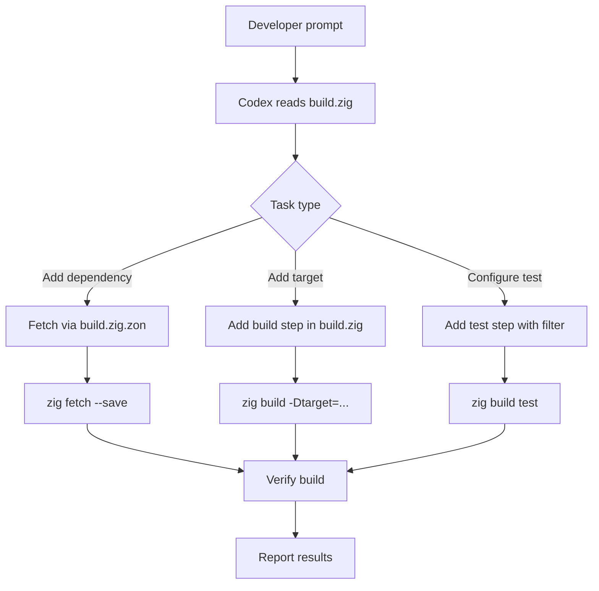

# Codex CLI for Zig Development Teams: ZLS MCP Integration, Cross-Compilation Workflows, and Build System Automation


---

The Zig ecosystem has matured considerably since the language first appeared in the TIOBE top 50 in late 2025. With Zig 0.16.0 shipping in May 2026 — introducing I/O as an Interface and 1,183 commits from 244 contributors[^1] — the language is increasingly viable for production systems work. Codex CLI, meanwhile, has grown a rich MCP tool ecosystem that makes Zig development substantially more productive. This article covers practical integration patterns for teams using Codex CLI with Zig, from MCP-backed code intelligence through to cross-compilation workflows and `build.zig` automation.

## Why Zig and Codex CLI Pair Well

Zig's design philosophy — explicit allocation, no hidden control flow, comptime metaprogramming — creates a codebase that is unusually legible to language models[^2]. The language's avoidance of operator overloading, implicit conversions, and hidden allocators means the code an LLM reads is the code that executes. This contrasts sharply with C++ or Rust, where macros and trait resolution can hide significant complexity from surface-level analysis.

Codex CLI's sandbox model also aligns well with Zig's build system. Since `zig build` is a self-contained toolchain that bundles its own C/C++ cross-compiler, libc implementations, and linker[^3], a sandboxed Codex session needs minimal filesystem allowlists — no system-wide toolchain paths, no brew-managed dependencies, no pkg-config discovery.

## MCP Server Setup: Connecting ZLS to Codex

Two community MCP servers bridge ZLS (the Zig Language Server) to MCP-compatible clients, including Codex CLI.

### Option 1: zig-mcp (16 tools)

The `nzrsky/zig-mcp` server provides the broader toolset, exposing 16 tools across code intelligence, build, and test categories[^4]. It communicates with ZLS over LSP pipes and auto-restarts the server on crashes.

```toml
# ~/.codex/config.toml
[mcp_servers.zig]
command = "npx"
args = ["-y", "@nzrsky/zig-mcp", "--workspace", "."]
```

Key tools include `hover`, `definition`, `references`, `completions`, `diagnostics`, `format`, `rename`, `code_actions`, `build`, `test`, `test_file`, `ast_check`, and `zig_version`[^4].

Requirements: Zig 0.15.2+ and ZLS on `PATH` (or specified via `--zls-path`)[^4].

### Option 2: mcp-server-zig (8 tools)

The `sadopc/mcp-server-zig` server offers a leaner set of eight tools — diagnostics, format, hover, definition, references, completions, document symbols, and build[^5]. It wraps ZLS in a Node process and connects via stdio transport.

```toml
# ~/.codex/config.toml
[mcp_servers.zig-lite]
command = "npx"
args = ["-y", "mcp-server-zig"]
```

Both servers require that your ZLS version matches your Zig version. A mismatch produces silent failures or misleading diagnostics[^5].

### Which to Choose

| Criterion | zig-mcp | mcp-server-zig |
|-----------|---------|----------------|
| Tool count | 16 | 8 |
| Test execution | Yes (`test`, `test_file`) | No |
| ZLS auto-restart | Yes | No |
| Rename / code actions | Yes | No |
| Install weight | Heavier (Zig binary required) | Lighter (Node-only wrapper) |

For teams doing active Zig development, `zig-mcp` is the better fit. For occasional Zig work within a polyglot codebase, `mcp-server-zig` keeps the MCP footprint smaller.

## AGENTS.md Configuration for Zig Projects

A well-configured `AGENTS.md` prevents common mistakes when Codex works with Zig code.

```markdown
# Project: embedded-sensor-hub

## Language and Toolchain
- Zig 0.16.0 with build.zig (not CMake, not Makefile)
- ZLS for language intelligence
- Target: ARM Cortex-M4 (thumb-freestanding-none)

## Build and Test Commands
- Build: `zig build`
- Test: `zig build test`
- Cross-compile: `zig build -Dtarget=thumb-freestanding-none`
- Format check: `zig fmt --check src/`

## Conventions
- No heap allocation in src/hal/ — use fixed buffers and comptime allocation
- All public functions must have doc comments (/// style)
- Error sets must be explicit — never use anyerror
- Use std.testing for tests, not external frameworks
- Prefer comptime validation over runtime assertions where possible

## Constraints
- Do NOT add C dependencies; use Zig's @cImport only for vendor HAL headers
- Do NOT use std.heap.page_allocator in production code
- Maximum function length: 60 lines
```

The critical entries are the build commands (Zig's build system is non-standard enough that models frequently guess wrong without explicit guidance) and the allocation constraints. Zig's explicit allocator-passing pattern is a strength, but models trained primarily on C and Rust code will occasionally introduce `std.heap.page_allocator` usage where a fixed-buffer allocator is required.

## Cross-Compilation Workflows

Zig's built-in cross-compilation is one of its strongest features — and one where Codex CLI adds genuine value. A single `zig build -Dtarget=...` flag replaces the entire cross-toolchain dance that C and C++ projects require[^3].

### Pattern: Multi-Target Build Verification

Use `codex exec` to verify that code compiles cleanly across multiple targets before pushing:

```bash
#!/bin/bash
# verify-targets.sh — run via codex exec for structured output
TARGETS=(
  "x86_64-linux-gnu"
  "aarch64-linux-gnu"
  "thumb-freestanding-none"
  "wasm32-wasi"
  "x86_64-macos"
)

for target in "${TARGETS[@]}"; do
  echo "=== Building for $target ==="
  zig build -Dtarget="$target" 2>&1
  echo "Exit code: $?"
done
```

```bash
codex exec "Run verify-targets.sh and report which targets failed, if any. \
Output a JSON summary with target, status, and first error line for each."
```

This pattern works well in CI pipelines using `openai/codex-action@v1`[^6], where structured JSON output from `--output-schema` can drive downstream decisions.

### Pattern: Platform-Specific Conditional Compilation Review

Zig uses `@import("builtin")` for target detection rather than preprocessor macros. When reviewing platform-specific code, prompt Codex with the target context:

```
Review @src/hal/uart.zig for correctness on thumb-freestanding-none.
Check that all comptime branches in the target switch cover the M4
interrupt vector layout and that volatile pointer casts are aligned.
```

The explicit nature of Zig's comptime branching means Codex can follow the control flow without the ambiguity that `#ifdef` nesting creates in C codebases.

## Build System Automation

Zig's `build.zig` is a Zig program itself — not a DSL, not YAML, not a Makefile. This is simultaneously powerful and unfamiliar to most models. Codex handles it well when given proper context.



### Adding Dependencies via build.zig.zon

Zig 0.14+ uses `build.zig.zon` for package management[^7]. Codex can handle the full workflow:

```
Add the zap HTTP server (https://github.com/zigzap/zap) as a dependency.
Update build.zig.zon with the correct hash, add the import to build.zig,
and create a minimal src/server.zig that listens on port 8080.
```

Codex will run `zig fetch --save` to resolve the package hash, modify `build.zig.zon`, wire the dependency into the build graph in `build.zig`, and generate starter code — all within the sandbox.

### Test Workflows

Zig's test runner is built into the compiler. Codex can run targeted tests via the MCP server's `test_file` tool or via direct commands:

```bash
# Run all tests
zig build test

# Run tests in a specific file
zig test src/protocol/parser.zig

# Run tests matching a name filter
zig build test -- --test-filter "parse_header"
```

A productive pattern is to ask Codex to write tests first, then implement:

```
Write tests for a Zig allocator that pools fixed-size 64-byte blocks from a
pre-allocated 4 KiB arena. Test allocation, deallocation, double-free
detection, and pool exhaustion. Place tests in src/pool_allocator.zig
using std.testing. Run them to confirm they fail, then implement the allocator.
```

## Zig-Specific Prompting Patterns

### Comptime Code Generation

Zig's comptime is powerful but unusual. When asking Codex to generate comptime code, be explicit about what should execute at compile time versus runtime:

```
Generate a comptime function that creates a lookup table mapping ASCII
characters to their hex digit values (0-15 for 0-9, a-f, A-F; 0xff for
invalid). The table should be a [256]u8 array computed entirely at comptime.
Include a runtime decode_hex function that uses the table.
```

### Error Handling Patterns

Zig's explicit error unions (`!`) and error sets are a strength that models sometimes bypass. Enforce rigour in your AGENTS.md:

```
When handling errors in this project:
- Always use named error sets, never anyerror
- Prefer errdefer for cleanup over manual error path management
- Use try for propagation; catch only when the error is genuinely handled
- Log error context with std.log before returning errors
```

### Memory Management Prompts

Zig's allocator-passing pattern is central to the language. Guide Codex explicitly:

```
Refactor the JSON parser to accept an std.mem.Allocator parameter
instead of using the global page_allocator. Ensure all allocated
memory is freed in a defer/errdefer block. The caller should be
able to pass std.testing.allocator in tests to detect leaks.
```

## Permission Profile for Zig Projects

With Codex CLI v0.133's permission profile inheritance[^8], set up a Zig-specific profile:

```toml
# .codex/config.toml
[profiles.zig-dev]
sandbox_mode = "workspace-write"
approval_policy = "on-request"
model = "gpt-5.5"
model_reasoning_effort = "high"

[profiles.zig-dev.permissions]
allow_read = ["src/", "build.zig", "build.zig.zon", "AGENTS.md"]
allow_write = ["src/", "build.zig", "build.zig.zon"]
allow_exec = ["zig", "zls"]
deny_exec = ["curl", "wget", "npm"]
```

This allows Codex to build, test, and modify Zig source files whilst preventing network access or execution of unrelated toolchains.

## Limitations and Caveats

⚠️ **Model training data lag**: Zig 0.16.0 shipped in May 2026[^1], and GPT-5.5's training cutoff may not fully cover its API changes. Use the `zig-mcp` server or `@` mention the release notes to inject current documentation.

⚠️ **Comptime debugging**: When Codex generates comptime code that produces cryptic `@compileError` messages, the error often originates in a deeply nested comptime call stack. Ask Codex to add `@compileLog` breadcrumbs rather than guessing at fixes.

⚠️ **ZLS version matching**: ZLS and Zig versions must match exactly. A Zig 0.16.0 project with ZLS built for 0.15.2 will produce incorrect diagnostics through the MCP server. Pin both versions in your project documentation.

⚠️ **Build system complexity**: `build.zig` files for larger projects can be hundreds of lines of Zig code. If the build configuration exceeds Codex's context budget, use `@build.zig` to inject it explicitly rather than relying on automatic file discovery.

## Citations

[^1]: [Zig 0.16.0 Release Notes](https://ziglang.org/download/0.16.0/release-notes.html) — Zig 0.16.0 release, May 2026, 1,183 commits from 244 contributors, introducing I/O as an Interface.
[^2]: [Zig Programming Language 2026: The Alternative to C](https://www.programming-helper.com/tech/zig-programming-language-2026) — Analysis of Zig's design philosophy and growing adoption in 2026.
[^3]: [Zig Cross-Compilation Documentation](https://ziglang.org/learn/) — Official documentation on Zig's built-in cross-compilation toolchain.
[^4]: [zig-mcp — MCP Server for Zig](https://mcpservers.org/servers/nzrsky/zig-mcp) — 16-tool MCP server connecting AI coding assistants to ZLS via LSP, with build and test execution support.
[^5]: [mcp-server-zig — Zig Language Intelligence](https://github.com/sadopc/mcp-server-zig) — 8-tool MCP server wrapping ZLS for diagnostics, formatting, hover, definition, references, completions, symbols, and build.
[^6]: [Codex GitHub Action](https://developers.openai.com/codex/github-action) — Official `openai/codex-action@v1` for CI/CD pipeline integration.
[^7]: [Zig 0.14.0 Release Notes — Package Management](https://ziglang.org/download/0.14.0/release-notes.html) — build.zig.zon package management with new hash format and metadata.
[^8]: [Codex CLI v0.133.0 Release — Permission Profile Inheritance](https://github.com/openai/codex/releases) — Permission profiles with list APIs, inheritance, and managed requirements.toml support.
