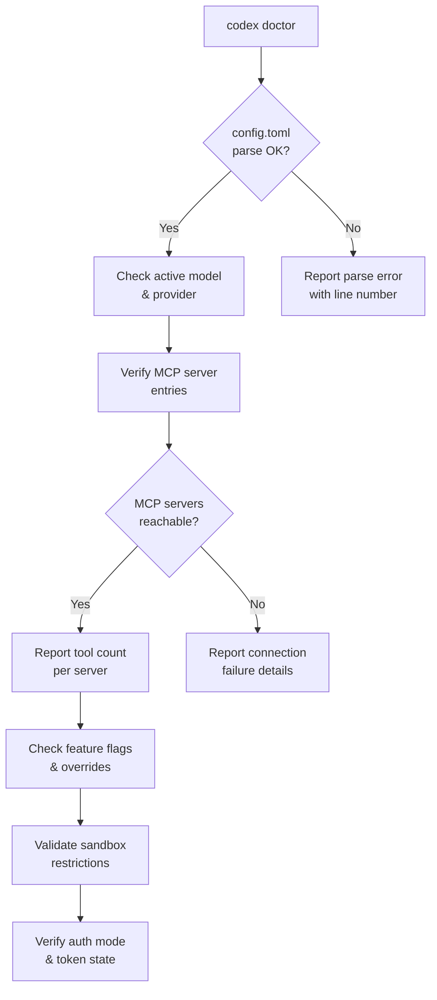

# Codex Doctor: The Diagnostic Command Every CLI User Should Know


---

When something breaks in a complex CLI tool, the first instinct is to trawl through log files, environment variables, and configuration directories. Codex CLI v0.131.0 shipped a better answer: `codex doctor` — a single command that runs a comprehensive diagnostic sweep across runtime, authentication, terminal capabilities, network connectivity, MCP server health, and local state[^1]. This article covers what it checks, how to read its output, and how to integrate it into support and CI workflows.

## Why a Dedicated Diagnostic Command?

Before `codex doctor`, troubleshooting a misbehaving Codex CLI session meant a manual checklist: verify `$OPENAI_API_KEY`, check `~/.codex/auth.json` for expired tokens, confirm network access, ensure MCP servers were reachable, and inspect `~/.codex/log/codex-tui.log` for error-level entries[^2]. Each failure mode required different tools and different knowledge.

The `codex doctor` command consolidates all of this into a single invocation. It runs every useful check by default and presents results in a grouped, colour-coded report — green ticks for passing checks, yellow warnings for non-critical anomalies, and red crosses for failures that need attention[^3].

## Running codex doctor

The basic invocation requires no arguments:

```bash
codex doctor
```

This produces detailed, human-readable output grouped by diagnostic category. Four flags modify the output:

| Flag | Purpose |
|------|---------|
| `--summary` | Compact view — section headers and status indicators only |
| `--json` | Structured, redacted JSON for programmatic consumption |
| `--all` | Expand truncated lists (e.g. full MCP tool inventories) |
| `--no-color` | Strip ANSI codes for piping to files or CI logs |

For support tickets, the recommended invocation is:

```bash
codex doctor --json > codex-doctor-report.json
```

This produces a schema-versioned JSON document where each check is keyed by a stable identifier, with a top-level `overall_status` field and per-check `details` as key/value objects[^3].

## Diagnostic Categories

The command organises its checks into five primary sections.

### Environment

Runtime provenance is the first thing verified: the installed version, the installation method (npm, Homebrew, binary), and the executable path[^3]. This catches a surprisingly common class of issues — stale binaries left behind after switching installation methods, or `$PATH` ordering that resolves to an older version.

Install consistency validation follows, checking that the package manager's view of the installation matches what is actually on disc. On Windows, this now correctly detects npm-managed installs[^1].

The environment section also verifies:

- **Search tool readiness** — ripgrep (`rg`) availability, since Codex relies on it for codebase search[^3]
- **Terminal and multiplexer metadata** — `$TERM`, tmux and Zellij session state, which affect TUI rendering
- **SQLite integrity** — the local state and log databases are checked for corruption[^3]

### Configuration



Configuration diagnostics parse `~/.codex/config.toml` and report any syntax errors with line numbers[^4]. The active model, provider, and sandbox mode are displayed alongside MCP server entries and their reachability status.

Feature flag state is summarised with the count of enabled flags and any local overrides, which is particularly useful when debugging behaviour differences between machines[^3].

### Authentication

Authentication checks are provider-aware[^3]. The diagnostic path varies depending on how you have authenticated:

- **API key** — verifies `$OPENAI_API_KEY` is set, non-empty, and free of leading/trailing whitespace (a frequent cause of 401 errors[^2])
- **ChatGPT browser auth** — checks the ChatGPT authentication path and token freshness in `~/.codex/auth.json`
- **Custom/AWS/local providers** — checks configured HTTP endpoints when available

This matters because the most common Codex CLI failure — the 401 Unauthorised error — typically comes down to an expired token, a whitespace-corrupted API key, or a `$OPENAI_BASE_URL` override pointing at the wrong endpoint[^5].

### Connectivity

Network diagnostics go beyond a simple ping. For ChatGPT-authenticated sessions, `codex doctor` performs WebSocket diagnostics, reporting the negotiated HTTP upgrade as HTTP 101 Switching Protocols and including timeout, DNS resolution, and provider context in the output[^3].

Reachability checks are provider-aware: API-key setups check the OpenAI API endpoint, ChatGPT auth checks the ChatGPT path, and custom or local providers check their configured HTTP endpoints[^3]. This helps diagnose corporate proxy issues, VPN interference, and DNS resolution failures without reaching for `curl` and `nslookup` separately.

### Background Server

The app-server daemon status is checked — whether it is running, responsive, and on the expected version. This catches issues where a stale daemon from a previous CLI version is still running after an upgrade.

## The Notes Section

Beyond the five primary sections, `codex doctor` promotes certain anomalies into a **Notes** section at the end of the report. These are non-failing observations that warrant attention:

- Available CLI updates that have not been applied
- Large rollout directories that may be consuming disc space
- MCP configuration issues that do not prevent startup but may cause unexpected behaviour
- Mixed authentication signals (e.g. both an API key and ChatGPT tokens present)[^3]

## Integration with Feedback and Support

When you run `/feedback` within a Codex session, the app-server automatically executes `codex doctor --json` and attaches the resulting `codex-doctor-report.json` to the feedback upload[^3]. Sentry tags are derived from the report — the overall status and any failing or warning check identifiers — so that the support team can triage issues before even reading the log files.

The updated TUI feedback consent dialogue explicitly mentions that the doctor report is included when logs and diagnostics are uploaded, ensuring transparency[^3].

For GitHub issue reports, the CLI bug template now requests `codex doctor --json` output, standardising the diagnostic information that accompanies bug reports[^3].

## Practical Troubleshooting Patterns

### Pattern 1: MCP Server Timeout Diagnosis

MCP server timeouts are a common frustration. A server entry in `config.toml` may be syntactically correct but fail at runtime due to a missing binary, a broken `npx` resolution, or a port conflict[^6].

```bash
codex doctor --all 2>&1 | grep -A5 "mcp"
```

The `--all` flag ensures that full tool lists are shown for each MCP server, making it clear whether the server started but failed to register tools versus failing to start entirely.

### Pattern 2: CI Pipeline Health Gate

In CI environments where Codex runs via `codex exec`, a doctor check at the start of the pipeline catches configuration drift before it manifests as cryptic failures mid-run:

```bash
#!/bin/bash
DOCTOR_STATUS=$(codex doctor --json | jq -r '.overall_status')
if [ "$DOCTOR_STATUS" != "ok" ]; then
  echo "::error::Codex doctor reports status: $DOCTOR_STATUS"
  codex doctor --summary
  exit 1
fi
```

### Pattern 3: Post-Upgrade Verification

After upgrading Codex CLI, run `codex doctor` to verify that the new version is active, the daemon has been restarted, and no configuration keys have been deprecated:

```bash
codex doctor --summary
```

The environment section will show the active version and installation method, immediately confirming whether the upgrade took effect or whether the old binary is still being resolved via `$PATH`.

### Pattern 4: Log-Level Triage

When `codex doctor` reports a failure but the cause is unclear, the next step is the log file. Error entries in `~/.codex/log/codex-tui.log` follow a severity hierarchy — ERROR, WARN, INFO, DEBUG[^2]. Extract errors with timestamps:

```bash
grep "ERROR" ~/.codex/log/codex-tui.log | tail -20
```

Cross-reference the timestamp with the doctor report to correlate the failing check with the specific error event.

## Common Failure Signatures

| Doctor Check | Typical Cause | Resolution |
|---|---|---|
| Auth token expired | ChatGPT session timed out | Run `codex login` to re-authenticate |
| API endpoint unreachable | Corporate proxy or VPN blocking | Configure `$HTTPS_PROXY` or allowlist the API domain |
| MCP server timeout | Missing binary or `npx` resolution failure | Verify the server command runs standalone |
| SQLite integrity fail | Corrupted state database | Delete `~/.codex/state.db` and restart |
| ripgrep not found | Missing dependency | Install via package manager (`brew install ripgrep`) |
| Stale daemon | Upgrade did not restart app-server | Run `codex app-server restart` or kill the process |

## Limitations

`codex doctor` is a point-in-time snapshot. It cannot detect intermittent network issues or transient authentication failures that resolve before the check runs. WebSocket diagnostics report the handshake result but do not test sustained connection stability[^3].

The `--json` output schema is versioned but currently marked as beta — the check identifiers and detail keys may change between minor releases[^1]. If you are building tooling against the JSON output, pin to the schema version and handle unknown keys gracefully.

On macOS, certain sandbox-related checks reflect the Seatbelt enforcement model, which silently ignores some `config.toml` settings (notably `network_access = true` under `sandbox_workspace_write`)[^7]. The doctor report does not currently flag this platform-specific discrepancy.

## Citations

[^1]: [Codex CLI v0.131.0 Release — Changelog](https://developers.openai.com/codex/changelog?type=codex-cli) — codex doctor feature announcement and subsequent updates
[^2]: [Codex CLI Logs: Location, Debug Flags & 401 Error Fix (2026) — SmartScope](https://smartscope.blog/en/generative-ai/chatgpt/codex-cli-diagnostic-logs-deep-dive/) — log locations, debug severity hierarchy, and 401 troubleshooting
[^3]: [feat(cli): add codex doctor diagnostics — GitHub PR #22336](https://github.com/openai/codex/pull/22336) — implementation details, check categories, JSON output format, feedback integration, and provider-aware connectivity
[^4]: [Codex CLI MCP Setup: How to Configure MCP Servers — AgentPatch](https://agentpatch.ai/blog/codex-cli-mcp-setup/) — config.toml structure and MCP server configuration
[^5]: [Codex Desktop and CLI returning 401 Unauthorized — GitHub Issue #13838](https://github.com/openai/codex/issues/13838) — common 401 causes including API key whitespace and BASE_URL misconfiguration
[^6]: [MCP servers all time out, narrowed it down to stdio bug — OpenAI Developer Community](https://community.openai.com/t/mcp-servers-all-time-out-narrowed-it-down-to-stdio-bug/1363658) — MCP server timeout diagnostics
[^7]: [Fix Codex CLI "Network Access Restricted" in 2 Commands (2026) — SmartScope](https://smartscope.blog/en/generative-ai/chatgpt/codex-network-restrictions-solution/) — macOS Seatbelt silently ignoring network_access config
