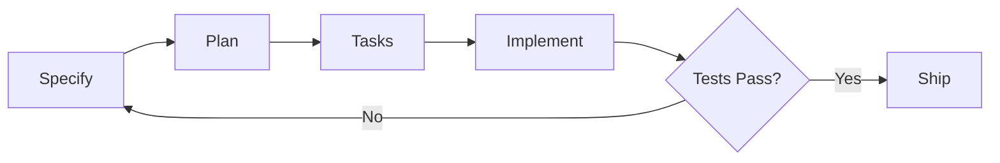

# Spec-Driven Development Frameworks for Codex CLI: Patterns, Best Practices, and the 2026 Landscape


---

Spec-driven development has become the dominant methodology for AI-assisted coding in 2026. The core insight is simple: when you give an AI coding agent a structured specification rather than an ad-hoc prompt, the output is more predictable, more testable, and more maintainable. GitHub reports teams using Spec Kit achieve "roughly an order-of-magnitude fewer 'regenerate from scratch' cycles than ad-hoc prompting" [^1]. AWS documents cases where 40-hour features shipped in under 8 hours of human time with spec-first authoring [^2].

This article maps the current landscape of spec-driven development frameworks, evaluates how each integrates with Codex CLI, and distils patterns and best practices for field engineers adopting SDD in production.

## What Is Spec-Driven Development?

Spec-driven development (SDD) is a methodology where versioned, structured specifications — not code — are the source of truth [^3]. The team (or an AI coding agent) first writes a detailed spec describing what the system should do, derives an implementation plan, breaks it into atomic tasks, and only then generates code.

The four-phase workflow:



1. **Specify** — author structured requirements with acceptance criteria, scope boundaries, and out-of-scope declarations
2. **Plan** — generate technical architecture, data models, API contracts, and framework selections
3. **Tasks** — decompose the plan into atomic, independently shippable work items
4. **Implement** — execute tasks with verification against original acceptance criteria

### SDD vs Vibe Coding vs TDD

| Dimension | Vibe Coding | TDD | SDD |
|---|---|---|---|
| Source of truth | Natural language prompt | Test suite | Structured specification |
| When code is written | Immediately | After failing test | After spec + plan + tasks |
| AI agent guidance | Ad hoc, per-prompt | Test output as feedback | Spec constrains every step |
| Regeneration rate | High (frequent "start over") | Medium | Low (~10× fewer regenerations [^1]) |
| Best for | Prototypes, throwaway code | Mature codebases | Production features with AI agents |

### EARS Notation: Making Specs Machine-Parseable

The most effective SDD frameworks use EARS (Easy Approach to Requirements Syntax) to write acceptance criteria that AI agents can unambiguously evaluate [^3]:

- **Ubiquitous:** "The system SHALL log all API requests."
- **Event-driven:** "WHEN a user submits a form, THE system SHALL validate all fields."
- **State-driven:** "WHILE the system is in maintenance mode, THE system SHALL return 503."
- **Unwanted behaviour:** "IF the payment gateway times out, THEN THE system SHALL retry twice."
- **Optional:** "WHERE two-factor authentication is enabled, THE system SHALL require a TOTP code."

## The Framework Landscape (May 2026)

### Tier 1: Production-Ready Frameworks

#### GitHub Spec Kit

| Attribute | Detail |
|---|---|
| Creator | GitHub |
| License | Open source |
| Install | `uv tool install specify-cli --from git+https://github.com/github/spec-kit.git` |
| Agents supported | 30+ (Codex CLI, Claude Code, Copilot, Gemini CLI, Cursor, Windsurf, and more) |
| Workflow | `/speckit.constitution` → `/speckit.specify` → `/speckit.plan` → `/speckit.tasks` → `/speckit.implement` |

Spec Kit is the de facto standard for SDD in 2026 [^1]. It is model-agnostic and agent-agnostic — the same specification works across Codex CLI, Claude Code, Copilot, and 27 other integrations. Each integration is a self-contained subpackage under `src/specify_cli/integrations/<key>/`.

**Codex CLI integration:**

```bash
# Initialise a Spec Kit project with Codex CLI skills
specify init my-project --integration codex --integration-options="--skills"

# The agent uses $speckit-* skill commands
$speckit-constitution    # Define project principles
$speckit-specify         # Write feature spec
$speckit-plan            # Generate technical plan
$speckit-tasks           # Break into atomic tasks
$speckit-implement       # Execute with verification
```

Spec Kit stores artefacts in a structured directory:

```
specs/
  001-auth-system/
    spec.md          # Requirements with EARS criteria
    plan.md          # Technical architecture
    tasks.md         # Atomic work items
    checklist.md     # Quality gates
```

**Why it matters for Codex CLI:** Spec Kit's AGENTS.md-first approach maps directly onto Codex's instruction hierarchy. The project constitution becomes the AGENTS.md, and specs constrain the agent's scope at every step.

#### AWS Kiro

| Attribute | Detail |
|---|---|
| Creator | Amazon Web Services |
| Type | Full IDE (fork of VS Code) |
| Pricing | Free tier available; Pro requires AWS account |
| Agents supported | Kiro Agent (built-in), Claude via Bedrock |
| Workflow | Spec → Design → Build (automated guardrails) |

Kiro is an IDE that enforces spec-driven development by default [^2]. When you describe a feature, Kiro automatically generates a requirements document, design document, and task list before writing any code. After each task, it runs automated guardrails: tests, linting, and security checks.

**Codex CLI relevance:** Kiro's workflow is not directly compatible with Codex CLI (it's a standalone IDE). However, its spec format can be adapted for Codex by exporting specs to markdown and using them as AGENTS.md context.

**Key differentiator:** Kiro's guardrails are automatic — the agent cannot skip the test phase. This is similar to Codex CLI's PostToolUse hooks but enforced at the IDE level.

#### Tessl

| Attribute | Detail |
|---|---|
| Creator | Tessl (startup) |
| Type | Framework installed as "tiles" in `.tessl/` directory |
| Pricing | Enterprise (contact for pricing) |
| Agents supported | Any MCP-compatible agent (Codex CLI, Claude Code, Cursor) |
| Workflow | Tile-based spec → plan → implement with audit trails |

Tessl targets regulated industries (fintech, healthtech) where audit trails are mandatory [^3]. It installs as "tiles" into a project's `.tessl/` directory and teaches any MCP-compatible agent to follow a spec-driven workflow regardless of stack.

**Codex CLI integration:** Because Tessl uses MCP, it works with Codex CLI's MCP tool consumption. Connect the Tessl MCP server and the agent receives structured specs, compliance checks, and audit logging automatically.

#### OpenSpec

| Attribute | Detail |
|---|---|
| Creator | Community (open source) |
| Type | Lightweight CLI |
| Agents supported | Framework-agnostic |
| Workflow | Three-phase state machine: proposal → apply → archive |

OpenSpec enforces a strict state machine — no code can be written until the spec has been proposed and approved [^4]. This is the most lightweight SDD framework, ideal for developers who want structure without committing to a full platform.

**Codex CLI integration:** OpenSpec can be invoked as a pre-execution step before `codex exec`, ensuring specs are approved before the agent writes code.

### Tier 2: Methodology Frameworks

#### BMAD-METHOD

A community methodology emphasising a "constitution" (project-level rules) and multi-agent role-play [^5]. It defines roles (architect, developer, tester) that map naturally onto Codex CLI's subagent types (default, worker, explorer).

**Codex CLI pattern:** Create separate AGENTS.md files for each BMAD role, then use subagents to implement each role:

```toml
# codex.toml — BMAD-style role agents
[agents.architect]
model = "o3"
instructions = "You are the architect. Review specs for technical feasibility."

[agents.developer]
model = "gpt-5-codex"
instructions = "You are the developer. Implement tasks from the spec."

[agents.tester]
model = "gpt-5-codex"
instructions = "You are the tester. Write and run tests against acceptance criteria."
```

#### cc-sdd (Claude Code SDD Skills)

A set of slash commands for Claude Code that implement the SDD workflow [^3]. While designed for Claude Code, the patterns transfer directly to Codex CLI:

| cc-sdd Command | Codex CLI Equivalent |
|---|---|
| `/sdd:specify` | `$speckit-specify` (via Spec Kit) or custom skill |
| `/sdd:plan` | `$speckit-plan` or manual AGENTS.md section |
| `/sdd:clarify` | Interactive prompting with `codex` TUI |
| `/sdd:implement` | `codex exec` with spec as context |

#### Codex-Spec (Community)

A Codex-native spec framework using `Backlog.md` as the specification artefact [^6]. The agent reads the backlog, picks the highest-priority item, writes a spec, implements, and marks complete. Simple but effective for solo developers.

### Tier 3: IDE-Integrated Approaches

| Tool | SDD Approach | Codex CLI Compatible? |
|---|---|---|
| **Cursor** | Plan Mode + rules files | Partial (export plans to markdown) |
| **Windsurf** | Cascade flows with spec context | Partial (via MCP) |
| **Google Antigravity** | Agent-first with spec constraints | No direct integration |
| **Copilot** | Spec Kit native integration | Yes (shared Spec Kit standard) |

## Patterns for Codex CLI Spec-Driven Development

### Pattern 1: AGENTS.md as Constitution

The simplest SDD pattern requires no external framework. Use AGENTS.md as both the project constitution and the active specification:

```markdown
# AGENTS.md

## Constitution
- Language: TypeScript 5.8 with strict mode
- Testing: Vitest with 80% coverage minimum
- Style: ESLint + Prettier with project config
- Dependencies: No new dependencies without explicit approval

## Current Spec: User Authentication
### Requirements (EARS)
- WHEN a user submits login credentials, THE system SHALL validate against the auth service within 2 seconds
- IF the auth service returns 401, THEN THE system SHALL display "Invalid credentials" and increment the failed attempt counter
- WHILE the failed attempt counter exceeds 5, THE system SHALL lock the account for 15 minutes

### Plan
1. Create `src/auth/login.ts` with credential validation
2. Create `src/auth/lockout.ts` with attempt tracking
3. Add Vitest tests for all EARS criteria

### Tasks
- [ ] Implement `login()` function with service call
- [ ] Implement `checkLockout()` with Redis TTL
- [ ] Write tests for success, failure, and lockout paths
```

Then run:

```bash
codex -a AGENTS.md "Implement the current spec. Check off tasks as you complete them."
```

### Pattern 2: Spec Kit + Goal Mode

For long-horizon features, combine Spec Kit with Codex CLI's goal mode (now enabled by default in v0.133):

```bash
# 1. Create the spec
specify init payment-gateway --integration codex --integration-options="--skills"
$speckit-specify "Build Stripe payment integration with webhooks"
$speckit-plan
$speckit-tasks

# 2. Set a goal to implement all tasks
codex /goal "Implement all tasks in specs/001-payment-gateway/tasks.md.
After each task, run the test suite. Stop when all tasks are checked off
and all tests pass. Budget: 500K tokens."
```

Goal mode will persist progress across turns, pause at budget limits, and resume where it left off.

### Pattern 3: Spec-Gated CI with codex exec

Use specs as the acceptance criteria in CI/CD pipelines:


```yaml
# .github/workflows/spec-verify.yml
name: Spec Verification
on: pull_request

jobs:
  verify-spec:
    runs-on: ubuntu-latest
    steps:
      - uses: actions/checkout@v4
      - uses: openai/codex-action@v1
        with:
          openai-api-key: ${{ secrets.OPENAI_API_KEY }}
          prompt: |
            Read the spec in specs/001-payment-gateway/spec.md.
            Read the implementation in src/payment/.
            Verify that every EARS acceptance criterion is met.
            Output a JSON report with pass/fail for each criterion.
          sandbox: read-only
          output-file: spec-report.json
```


### Pattern 4: Multi-Agent Spec Review

Use Codex subagents to review specs before implementation:

```bash
# Architect reviews the spec
codex --agent architect "Review specs/001-payment-gateway/spec.md for
technical feasibility. Flag any requirements that are ambiguous or
impossible to implement with our current stack."

# Security reviewer checks for gaps
codex --agent explorer "Review specs/001-payment-gateway/spec.md for
security implications. Are there missing EARS criteria for authentication,
authorisation, or data protection?"
```

### Pattern 5: Specification Drift Detection

Long-horizon sessions suffer from specification drift — the agent gradually deviates from the original spec [^7]. Detect this with a PostToolUse hook:

```bash
#!/bin/bash
# hooks/post-tool-use/spec-drift-check.sh
# Runs after every tool use to check alignment with spec

SPEC_FILE="specs/current/spec.md"
if [ -f "$SPEC_FILE" ]; then
  codex exec "Compare the current working directory changes against
  $SPEC_FILE. Are all changes aligned with the spec? If not, list
  the deviations." --quiet
fi
```

## Best Practices

### 1. Start with a Constitution Before Your First Spec

Every SDD project needs a constitution (or AGENTS.md) that captures durable decisions: language, framework, testing standards, dependency policies, coding conventions. Specs reference the constitution but don't repeat it.

```bash
# Spec Kit
specify init my-project --integration codex --integration-options="--skills"
$speckit-constitution "TypeScript, Vitest, PostgreSQL, no ORMs, ESLint strict"

# Or manually in AGENTS.md
echo "## Constitution\n- Language: TypeScript 5.8\n- Testing: Vitest" > AGENTS.md
```

### 2. Use EARS Notation Consistently

Every acceptance criterion should use one of the five EARS patterns. This makes criteria unambiguous for both humans and AI agents. Avoid vague criteria like "the system should be fast" — instead write "WHEN the user submits a search, THE system SHALL return results within 500ms."

### 3. Keep Individual Specs to 1-3 Pages

If a spec exceeds three pages, split it. AI agents work best with focused, bounded specifications. A large spec increases the risk of the agent losing context mid-implementation.

### 4. Review at Phase Boundaries

The most expensive mistake in SDD is implementing a flawed spec. Review at each transition:
- Spec → Plan: "Does the plan address every requirement?"
- Plan → Tasks: "Are tasks atomic and independently testable?"
- Tasks → Implementation: "Does each task have clear acceptance criteria?"

Use `/speckit.clarify` or Codex CLI's interactive mode to surface ambiguities before the agent starts coding.

### 5. Reference Specs in Commits

Link implementation back to specifications:

```
feat(auth): implement magic link login, refs specs/004-magic-link/spec.md
```

This creates a traceable chain from requirement to implementation, critical for audits and debugging.

### 6. Define Out-of-Scope with Equal Care

AI agents are prone to scope creep. Explicitly state what the spec does NOT cover:

```markdown
## Out of Scope
- Social login (OAuth) — separate spec
- Password reset flow — separate spec
- Admin user management — Phase 2
```

### 7. Treat Specs as Durable Documentation

Code generated by AI agents may be regenerated, refactored, or replaced. The specification outlives the code. Maintain specs as living documentation that evolves with the product.

### 8. Use Spec Kit for Team Projects, AGENTS.md for Solo Work

For solo developers or small projects, AGENTS.md-as-constitution is sufficient. For teams, Spec Kit provides the coordination layer: shared specs, consistent formatting, and agent-agnostic execution.

### 9. Combine SDD with Goal Mode for Long Features

v0.133's goal mode (now enabled by default) is the natural execution engine for SDD. Set a goal to "implement all tasks in the spec," and Codex will persist progress, track token spend per objective, and resume after pauses.

### 10. Vibe-Code Prototypes, Spec-Drive Production

SDD adds overhead. For throwaway prototypes and exploratory coding, ad-hoc prompting ("vibe coding") remains faster. Reserve SDD for features that will ship to production.

## Framework Comparison Matrix

| Framework | Open Source | Agent-Agnostic | Codex CLI Integration | EARS Support | Audit Trail | Pricing |
|---|---|---|---|---|---|---|
| **Spec Kit** | Yes | Yes (30+ agents) | Native (skills mode) | Yes | Git-based | Free |
| **Kiro** | No | No (Kiro agent only) | Manual export | Implicit | Built-in | Free tier / Pro |
| **Tessl** | No | Yes (MCP) | Via MCP server | Yes | Enterprise-grade | Enterprise |
| **OpenSpec** | Yes | Yes | Pre-exec gating | No | Git-based | Free |
| **BMAD** | Yes | Yes | Via AGENTS.md roles | No | Manual | Free |
| **cc-sdd** | Yes | No (Claude Code) | Pattern transfer | Yes | Git-based | Free |
| **Codex-Spec** | Yes | No (Codex only) | Native (Backlog.md) | No | Git-based | Free |

## The Emerging Standard: Spec Kit + AGENTS.md

The convergence point is clear. Spec Kit provides the specification layer, AGENTS.md provides the agent configuration layer, and goal mode provides the execution layer. Together they form a complete SDD stack for Codex CLI:

```
Spec Kit (specify → plan → tasks)
    ↓ specs/ directory
AGENTS.md (constitution + current spec context)
    ↓ agent instructions
Codex CLI (goal mode → subagents → hooks)
    ↓ implementation
Git (audit trail + spec references in commits)
```

This stack is framework-agnostic at the top (Spec Kit works with any agent), Codex-native in the middle (AGENTS.md, goal mode), and universal at the bottom (Git).

---

## References

[^1]: [GitHub Spec Kit README](https://github.com/github/spec-kit) — "roughly an order-of-magnitude fewer 'regenerate from scratch' cycles." Accessed 22 May 2026.
[^2]: [AWS Kiro documentation](https://kiro.dev) — 40-hour features in 8 hours claim. Accessed 22 May 2026.
[^3]: [BCMS: Spec-Driven Development — The Definitive 2026 Guide](https://thebcms.com/blog/spec-driven-development) — EARS notation, framework comparison. Accessed 22 May 2026.
[^4]: [OpenSpec GitHub repository](https://github.com/openspec-dev/openspec) — three-phase state machine. Accessed 22 May 2026.
[^5]: [BMAD-METHOD GitHub repository](https://github.com/bmad-method/BMAD-METHOD) — multi-agent role-play methodology. Accessed 22 May 2026.
[^6]: [Jettro Coenradie: Spec-driven development using Codex and Backlog.md](https://jettro.dev/spec-driven-development-using-codex-and-backlog-md-1de89cd229d5) — Codex-native spec approach. Accessed 22 May 2026.
[^7]: [Specification Drift and Slump article](../articles/2026-05-02-specification-drift-slump-codex-cli-faithfulness-long-horizon-sessions.md) — codex-resources. Accessed 22 May 2026.
[^8]: [Vishal Mysore: Spec-Driven Development Is Eating Software Engineering](https://medium.com/@visrow/spec-driven-development-is-eating-software-engineering-a-map-of-30-agentic-coding-frameworks-6ac0b5e2b484) — 30+ framework map. Accessed 22 May 2026.
[^9]: [MarkTechPost: 9 Best AI Tools for Spec-Driven Development in 2026](https://www.marktechpost.com/2026/05/08/9-best-ai-tools-for-spec-driven-development-in-2026-kiro-bmad-gsd-and-more-compare/) — tool comparison. Accessed 22 May 2026.
[^10]: [Microsoft for Developers: Diving Into Spec-Driven Development With GitHub Spec Kit](https://developer.microsoft.com/blog/spec-driven-development-spec-kit) — Spec Kit deep-dive. Accessed 22 May 2026.
