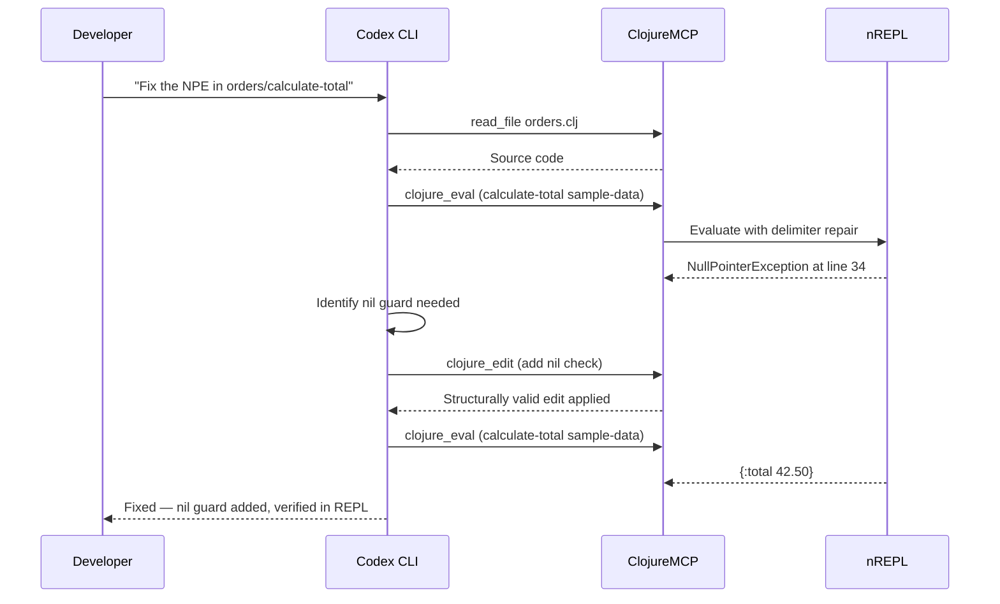

# Codex CLI for Clojure Development Teams: ClojureMCP, REPL-Driven Agent Workflows, and Structural Editing


---

Clojure's parenthesised syntax and REPL-driven development culture create a distinctive set of challenges — and opportunities — for AI coding agents. Where most language ecosystems treat the editor as the primary surface and the terminal as secondary, Clojure teams live inside a running REPL, growing systems incrementally through evaluated forms. Codex CLI can participate in this workflow directly, but only when properly equipped with Clojure-aware MCP servers, structural editing tools, and AGENTS.md conventions that encode the idioms a competent Clojurist expects.

This article covers the MCP server landscape for Clojure, AGENTS.md templates for functional codebases, practical REPL-driven agent patterns, and the pitfalls that trip up general-purpose agents in Lisp-family languages.

## The Paren Edit Death Loop

Every team that has pointed a coding agent at Clojure code encounters the same failure mode within minutes: the agent introduces a mismatched delimiter, attempts a fix, introduces another mismatch, and spirals until context is exhausted [^1]. Bruce Hauman — creator of Figwheel and one of the most prolific contributors to Clojure tooling — coined the term "Paren Edit Death Loop" and built two tools to break it [^1].

The root cause is that LLMs treat Clojure source as flat text. A missing closing parenthesis on line 47 cascades through every subsequent form, and a naive find-and-replace edit can shift delimiter boundaries in ways the model cannot predict from its diff-based output.

## MCP Server Landscape for Clojure

Three MCP-compatible tools serve Clojure development in 2026, each targeting a different point on the complexity spectrum.

### ClojureMCP (Full)

ClojureMCP [^2] is a comprehensive MCP server that connects to a running nREPL and exposes Clojure-aware tooling across four categories:

| Category | Tools | Purpose |
|---|---|---|
| Read | `LS`, `read_file`, `grep`, `glob_files` | Project introspection |
| REPL | `clojure_eval`, `list_nrepl_ports` | Live evaluation with delimiter repair |
| Edit | `clojure_edit`, `clojure_edit_replace_sexp`, `file_edit`, `file_write` | Structure-aware S-expression manipulation |
| Agent | `dispatch_agent`, `architect` | Sub-agent orchestration (requires API key) |

The editing tools use parinfer, cljfmt, and clj-rewrite internally to guarantee well-formed output [^2]. When the model's requested edit introduces a delimiter error, ClojureMCP repairs it before writing to disc — silently, without consuming additional turns.

Install via Clojure tools:

```bash
clojure -Ttools install-latest :lib io.github.bhauman/clojure-mcp :as mcp
```

For Codex CLI, configure the `:cli-assist` profile in `~/.codex/config.toml` to avoid redundant tools:

```toml
[mcp_servers.clojure-mcp]
command = "bash"
args = ["-c", "clojure -Tmcp start :config-profile :cli-assist :port 7888"]
```

The `:cli-assist` profile disables ClojureMCP's built-in file reading and shell tools — which would duplicate Codex CLI's native capabilities — and retains REPL evaluation, structural editing, and delimiter repair [^2].

### clojure-mcp-light

For teams that prefer minimal tooling, clojure-mcp-light [^1] provides three standalone CLI commands rather than a full MCP server:

- **`clj-nrepl-eval`** — nREPL evaluation with auto-discovery of ports and delimiter repair before every evaluation
- **`clj-paren-repair`** — standalone delimiter repair invocable as a shell command
- **`clj-paren-repair-claude-hook`** — a hook that intercepts Write/Edit operations and repairs delimiters before files hit disc

Install via bbin (Babashka package manager):

```bash
bbin install https://github.com/bhauman/clojure-mcp-light.git --tag v0.2.2
```

For Codex CLI, register `clj-nrepl-eval` and `clj-paren-repair` as shell tools in your AGENTS.md rather than as MCP servers. This approach preserves Codex CLI's native diff display whilst adding REPL access.

### clj-kondo MCP

The clj-kondo MCP server [^3] wraps the clj-kondo static analyser (v2026.04.15) [^4] in a single `lint_clojure` tool. It reports unused namespaces, private variable access violations, and style warnings without requiring a running REPL.

```toml
[mcp_servers.clj-kondo]
command = "npx"
args = ["-y", "clj-kondo-mcp"]
```

Compose this with ClojureMCP for a two-layer feedback loop: clj-kondo catches static issues pre-evaluation, and the REPL catches runtime errors post-evaluation.

## Bridging clojure-lsp via LSP-MCP

clojure-lsp (v2026.05.05) [^5] provides go-to-definition, find-references, rename, and the new cyclic-dependencies linter [^5]. The LSP-MCP bridge [^6] exposes these capabilities as MCP tools.

```toml
[mcp_servers.clojure-lsp]
command = "npx"
args = ["-y", "lsp-mcp", "--", "clojure-lsp"]
```

This gives Codex CLI access to project-wide refactoring operations — renaming a function across 200 namespaces, for instance — that neither ClojureMCP nor clj-kondo can perform alone.

## AGENTS.md for Clojure Projects

Clojure's conventions diverge sharply from imperative languages. An AGENTS.md that doesn't encode these conventions produces code that compiles but violates community norms. Here is a battle-tested template:

```markdown
# AGENTS.md — Clojure Project

## Build & Run
- `clojure -M:dev` to start REPL with dev profile
- `clojure -M:test` to run test suite (kaocha)
- `clojure -T:build uber` to build uberjar

## REPL-First Development
- ALWAYS evaluate code in the REPL before modifying files
- Use `clojure_eval` or `clj-nrepl-eval` — never guess at runtime behaviour
- Develop solutions incrementally: small forms first, compose later
- Use `(comment ...)` rich comment blocks for exploratory code

## Code Conventions
- Pure functions: accept arguments, return results, no side effects
- Separate pure logic from stateful operations (atoms, I/O, channels)
- Prefer `map`, `filter`, `reduce` over manual recursion
- Use destructuring instead of manual data extraction
- Namespaced keywords for domain entities (`:order/id`, `:order/total`)
- Keep data structures flat — avoid deep nesting
- Thread-last (`->>`) for collection pipelines, thread-first (`->`) for transforms

## Structural Integrity
- NEVER attempt manual delimiter repair — use `clj-paren-repair` or ClojureMCP
- Run `clj-kondo` lint after every file modification
- Zero warnings policy: all linting errors must be resolved before commit

## Testing
- Tests live in `test/` mirroring `src/` namespace structure
- Use `clojure.test` with `deftest` and `is` assertions
- Test pure functions with example-based tests
- Test stateful components with `with-redefs` or component test fixtures

## Dependencies
- deps.edn for dependency management (no Leiningen)
- Pin all dependency versions — no RELEASE or LATEST
- Document new dependencies in commit messages
```

## Practical Patterns

### Pattern 1: REPL-Driven Bug Fix

The canonical Clojure debugging workflow — reproduce in the REPL, fix, verify — maps directly onto Codex CLI's interactive mode.



The key insight is that Codex CLI never modifies the file without first verifying behaviour in the REPL. The AGENTS.md enforces this sequence.

### Pattern 2: ClojureScript Cross-Compilation with shadow-cljs

ClojureMCP's `list_nrepl_ports` tool discovers both Clojure and shadow-cljs nREPL instances [^2]. For full-stack Clojure/ClojureScript projects:

```bash
# Terminal 1: Start Clojure REPL
clojure -M:dev

# Terminal 2: Start shadow-cljs watch
npx shadow-cljs watch app
```

Both REPLs register `.nrepl-port` files. Codex CLI can then evaluate server-side code on one port and client-side ClojureScript on another by specifying the `:port` parameter in `clojure_eval`:

```
Evaluate (js/console.log "hello") on the shadow-cljs REPL at port 9000
```

This enables full-stack feature development in a single Codex CLI session — backend logic verified against the JVM REPL, frontend behaviour verified against the browser REPL.

### Pattern 3: Namespace Refactoring with clojure-lsp

Large Clojure projects accumulate namespace coupling. The new cyclic-dependencies linter in clojure-lsp v2026.05.05 [^5] flags circular `require` chains. Combined with the LSP-MCP bridge:

1. Ask Codex CLI to run the cyclic-dependencies diagnostic
2. Review the dependency graph
3. Use LSP rename and move-form refactorings to break cycles
4. Verify with `clojure_eval` that the refactored code loads cleanly

### Pattern 4: Batch Linting with codex exec

For CI pipelines, combine clj-kondo with Codex CLI's non-interactive mode to produce structured lint reports:

```bash
codex exec "Lint the entire src/ directory using clj-kondo. \
  Report every warning with file, line, and suggested fix." \
  --output-schema ./lint-schema.json \
  -o lint-report.json
```

The `--output-schema` flag [^7] constrains the output to a machine-parseable format that downstream tools can consume.

## Model Selection for Clojure

Clojure's homoiconic syntax and macro system demand strong reasoning capabilities. Model selection matters more here than in most language ecosystems.

| Task | Recommended Model | Rationale |
|---|---|---|
| Macro authoring | GPT-5.5 | Requires understanding of compile-time vs runtime evaluation [^8] |
| Pure function development | GPT-5.4-mini | Sufficient for data transformation pipelines |
| Spec/Schema validation | GPT-5.5 | Complex predicate composition benefits from deeper reasoning |
| deps.edn dependency management | GPT-5.4-mini | Declarative configuration, lower complexity |
| ClojureScript interop | GPT-5.5 | Cross-compilation and JS interop require broader context |

Switch models mid-session with `Alt+M` or the `/model` slash command [^9].

## Composing the MCP Stack

A production-ready Codex CLI configuration for Clojure combines all three servers:

```toml
# ~/.codex/config.toml

[mcp_servers.clojure-mcp]
command = "bash"
args = ["-c", "clojure -Tmcp start :config-profile :cli-assist :port 7888"]

[mcp_servers.clj-kondo]
command = "npx"
args = ["-y", "clj-kondo-mcp"]

[mcp_servers.clojure-lsp]
command = "npx"
args = ["-y", "lsp-mcp", "--", "clojure-lsp"]
```

This gives Codex CLI three complementary feedback channels: static analysis (clj-kondo), live evaluation (ClojureMCP), and project-wide navigation and refactoring (clojure-lsp).

## Sandbox Configuration

Clojure development requires network access for dependency resolution (Maven Central, Clojars) and local process communication for nREPL:

```toml
[sandbox_workspace_write]
network_access = true
```

⚠️ The `network_access = true` setting is necessary for `clojure -P` dependency downloads and nREPL socket connections, but it does reduce sandbox isolation. For tighter control, consider pre-fetching dependencies and using `network_access = false` during coding sessions.

## Limitations

- **Training data lag for recent libraries:** GPT-5.5's training data may not include libraries published after its cutoff. Clojure's smaller ecosystem means niche libraries receive less coverage than mainstream equivalents [^8].
- **Macro debugging:** Codex CLI cannot step through `macroexpand` interactively. Use `clojure_eval` with `(macroexpand-1 '(your-macro ...))` as a workaround.
- **No persistent REPL state across sessions:** Each Codex CLI session starts with a fresh nREPL connection. Long-running REPL state (loaded data, initialised components) must be recreated.
- **spec/Schema inference:** Generating comprehensive `clojure.spec` or Malli schemas from data requires extensive sampling that may exceed token budgets in a single turn.
- **ClojureMCP agent tools cost:** The `dispatch_agent` and `architect` tools in ClojureMCP make their own LLM API calls, incurring additional costs outside the Codex CLI billing surface [^2].

## Citations

[^1]: Hauman, B. (2026). *clojure-mcp-light: Simple CLI tools for LLM coding assistants working with Clojure*. GitHub. [https://github.com/bhauman/clojure-mcp-light](https://github.com/bhauman/clojure-mcp-light)

[^2]: Hauman, B. (2026). *ClojureMCP: Clojure MCP server for REPL-driven AI development*. GitHub. [https://github.com/bhauman/clojure-mcp](https://github.com/bhauman/clojure-mcp)

[^3]: Bigsy. (2026). *clj-kondo-MCP: MCP server for clj-kondo linting*. GitHub. [https://github.com/Bigsy/clj-kondo-MCP](https://github.com/Bigsy/clj-kondo-MCP)

[^4]: clj-kondo. (2026). *clj-kondo 2026.04.15*. Clojars. [https://clojars.org/clj-kondo](https://clojars.org/clj-kondo)

[^5]: clojure-lsp. (2026). *clojure-lsp v2026.05.05-12.58.26*. GitHub. [https://github.com/clojure-lsp/clojure-lsp/releases](https://github.com/clojure-lsp/clojure-lsp/releases)

[^6]: LSP-MCP. (2026). *LSP MCP bridge extension*. Open VSX. [https://open-vsx.org/extension/CJL/lsp-mcp](https://open-vsx.org/extension/CJL/lsp-mcp)

[^7]: OpenAI. (2026). *Non-interactive mode — Codex CLI*. OpenAI Developers. [https://developers.openai.com/codex/noninteractive](https://developers.openai.com/codex/noninteractive)

[^8]: OpenAI. (2026). *Models — Codex*. OpenAI Developers. [https://developers.openai.com/codex/models](https://developers.openai.com/codex/models)

[^9]: OpenAI. (2026). *Slash commands in Codex CLI*. OpenAI Developers. [https://developers.openai.com/codex/cli/slash-commands](https://developers.openai.com/codex/cli/slash-commands)
