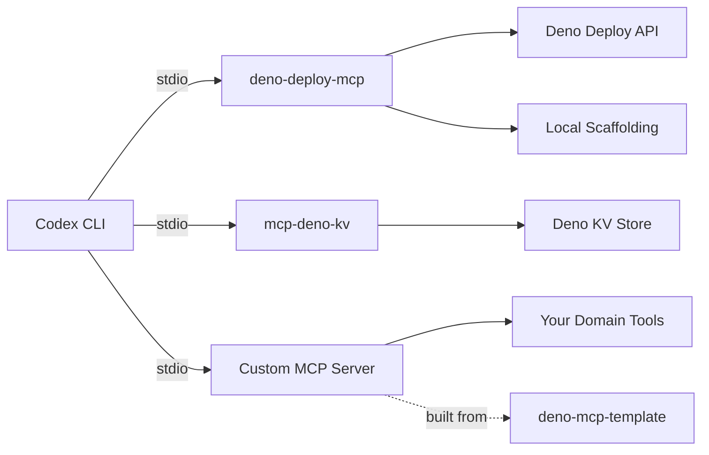
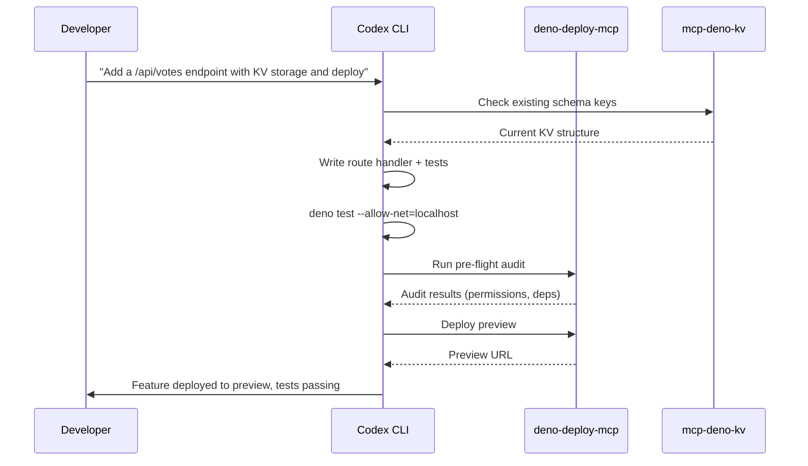

# Codex CLI for Deno Development: Deploy MCP, Deno KV, and TypeScript-First Agent Workflows


Deno 2.8.0 shipped on 22 May 2026 with `deno ci`, `deno pack`, lazy-loaded ESM modules, and TypeScript 6.0.3 support [^1]. Its security-first permissions model, native TypeScript execution, and built-in tooling (`deno fmt`, `deno lint`, `deno test`, `deno bench`) make it an unusually good fit for agent-driven development — the runtime already enforces the kind of guardrails that AGENTS.md files have to spell out manually for Node.js projects. This article covers how to wire Codex CLI into Deno workflows using three MCP servers, an AGENTS.md template tuned for Deno idioms, and practical patterns for everything from scaffolding a Fresh app to provisioning Deno Deploy infrastructure from your terminal.

## The Deno MCP Ecosystem

Three MCP servers cover the Deno development surface that matters for agent workflows:

### 1. Deno Deploy MCP Server

The `deno-deploy-mcp` server by thisisjofrank [^2] gives Codex CLI full-lifecycle control over Deno Deploy applications. It exposes tools for project scaffolding (REST APIs, static sites, WebSocket servers, cron jobs), deployment management (pre-flight checks, production and preview deploys, rollbacks), database provisioning (Deno KV and Postgres), environment variable management, and project health auditing [^2].

```toml
# ~/.codex/config.toml
[mcp_servers.deno-deploy]
command = "deno"
args = [
  "run",
  "--allow-net", "--allow-read", "--allow-write",
  "--allow-run", "--allow-env", "--allow-sys",
  "jsr:@thisisjofrank/deno-deploy-mcp"
]

[mcp_servers.deno-deploy.env]
DENO_DEPLOY_TOKEN = "${DENO_DEPLOY_TOKEN}"
```

The server requires Deno >= 2.4.2 (for the `deno deploy` subcommand) [^2] and a personal access token from the Deno Deploy dashboard for deployment and rollback operations.

### 2. Deno KV MCP Server

Divy Srivastava's `mcp-deno-kv` [^3] exposes Deno's native key-value database as MCP tools, giving agents persistent storage without any external database infrastructure. This is particularly useful for agent workflows that need to track state across sessions — storing migration checkpoints, caching analysis results, or maintaining a work log.

```toml
[mcp_servers.deno-kv]
command = "deno"
args = ["run", "--unstable-kv", "--allow-read", "--allow-write", "jsr:@divy/mcp-deno-kv"]
```

### 3. Deno MCP Template Server

The `deno-mcp-template` [^4] is a batteries-included starting point for building custom MCP servers in Deno. It ships with STDIO and Streamable HTTP transports, rate limiting, CORS, bearer auth, Deno KV-backed persistent state, sandboxed code execution, and CI/CD workflows [^4]. When your project needs a bespoke MCP server — say, for a domain-specific API or a custom build pipeline — this template gets you from zero to a publishable JSR package in minutes.



## AGENTS.md for Deno Projects

Deno's permissions model means your AGENTS.md can lean on runtime enforcement rather than relying solely on agent discipline. Here is a template tuned for Deno 2.8 projects:

```markdown
# AGENTS.md — Deno Project

## Runtime
- Target: Deno 2.8.x (TypeScript 6.0.3, V8 13.7)
- Use `deno.json` for all configuration — no tsconfig.json, no package.json
- Import from JSR (`jsr:@scope/package`) or npm (`npm:package`) — never use bare specifiers without a prefix
- Pin dependency versions in `deno.json` imports map

## Permissions
- Always run with minimal permissions: --allow-net=<hosts>, --allow-read=<paths>
- Never use --allow-all in production code
- Document required permissions in each module's JSDoc header

## Code Style
- `deno fmt` is the sole formatter — no Prettier, no editorconfig overrides
- `deno lint` with recommended rules — fix all warnings before committing
- Use Web Platform APIs (fetch, Request, Response, Streams) over Node.js polyfills
- Prefer `Deno.serve()` over `node:http` for HTTP servers
- Use `Deno.openKv()` for persistence — no SQLite/Redis unless KV is insufficient

## Testing
- All tests in `*_test.ts` files alongside source (not a separate test/ directory)
- Use `Deno.test()` with `@std/assert` — no Jest, no Vitest
- Run: `deno test --allow-net=localhost --allow-read=. --coverage`
- Coverage threshold: 80% line coverage minimum

## Dependencies
- Check JSR before npm for any new dependency
- Run `deno outdated` to verify no stale pins
- Use `deno add` to add dependencies — never hand-edit the imports map
```

## Workflow Patterns

### Pattern 1: Fresh Application Scaffolding with Deploy MCP

With the Deploy MCP server configured, Codex CLI can scaffold, develop, and deploy a Fresh application in a single conversation:

```bash
codex "Scaffold a new Fresh 2.3 application with an API route at /api/health
that returns JSON. Add a Deno KV counter that increments on each request.
Use the deno-deploy scaffolding tools to create the project structure,
then deploy a preview to Deno Deploy."
```

The agent uses the Deploy MCP's scaffolding tools to generate the project, writes the route handler using `Deno.openKv()`, runs `deno test` to verify, then triggers a preview deployment — all without leaving the terminal.

### Pattern 2: Permission Audit and Hardening

Deno's granular permissions are a natural fit for agent-driven security auditing:

```bash
codex "Audit every entry point in this Deno project. For each, list the
permissions it actually uses versus what's declared in deno.json tasks.
Tighten any over-broad permissions to the minimum required set.
Run the test suite after each change to verify nothing breaks."
```

This leverages the Deploy MCP's audit tool alongside Codex CLI's file analysis to produce a least-privilege permission manifest.

### Pattern 3: Batch Module Migration with `codex exec`

For teams migrating Node.js modules to Deno, `codex exec` [^5] processes files in parallel without an interactive session:

```bash
find src/ -name "*.ts" | xargs -P4 -I{} codex exec \
  "Convert this Node.js module to idiomatic Deno:
   - Replace require() with import
   - Replace node:path with @std/path
   - Replace node:fs with Deno.readTextFile/writeTextFile
   - Replace process.env with Deno.env.get()
   - Add explicit permission annotations in JSDoc
   - Run deno check on the result" {}
```

### Pattern 4: KV-Backed Agent Memory

The Deno KV MCP server enables a persistent memory pattern across Codex sessions:

```bash
codex "Before starting work, check Deno KV for a key 'migration/progress'
to see what modules have already been converted. After converting each
module, update the KV entry with the filename and timestamp. When all
modules are done, write a summary to 'migration/report'."
```

This is particularly valuable for long-running migration or refactoring projects where work spans multiple agent sessions.

## Model Selection for Deno Tasks

Deno's TypeScript-first nature means model selection follows a clear pattern [^6]:

| Task | Recommended Model | Rationale |
|---|---|---|
| Architecture design, Fresh island patterns | GPT-5.5 | Complex component boundaries, SSR/CSR trade-offs |
| Route handlers, middleware, KV operations | GPT-5.4-mini | Well-documented patterns, fast iteration |
| Permission auditing, security hardening | GPT-5.5 | Requires reasoning about transitive dependencies |
| Node.js to Deno migration | GPT-5.4-mini | Mechanical transformations, high throughput |
| Custom MCP server development | GPT-5.5 | Protocol understanding, transport design |

GPT-5.5 is the recommended choice for most complex Codex tasks [^6], but Deno's strong typing and comprehensive standard library mean that GPT-5.4-mini handles the majority of day-to-day implementation work effectively.

## Sandbox Configuration

Deno's built-in permissions model complements Codex CLI's sandbox. Configure your project-scoped `.codex/config.toml`:

```toml
[sandbox]
# Deno's --allow flags handle fine-grained permissions,
# so Codex sandbox can focus on filesystem boundaries
writable_paths = ["./src", "./routes", "./islands", "./static", "./deno.json"]

[model]
default = "gpt-5.4-mini"

[mcp_servers.deno-deploy]
command = "deno"
args = [
  "run",
  "--allow-net", "--allow-read", "--allow-write",
  "--allow-run", "--allow-env", "--allow-sys",
  "jsr:@thisisjofrank/deno-deploy-mcp"
]

[mcp_servers.deno-kv]
command = "deno"
args = ["run", "--unstable-kv", "--allow-read", "--allow-write", "jsr:@divy/mcp-deno-kv"]
```

## Composing MCP Servers

The three Deno MCP servers complement each other well when composed:



## Limitations and Gotchas

**Training data lag for Deno 2.8.** GPT-5.5's training data may not cover Deno 2.8's newest features (`deno ci`, `deno pack`, `deno transpile`) [^1]. Pin your target version in AGENTS.md and provide the relevant `deno --help` output as context when using bleeding-edge APIs.

**`--unstable-kv` flag.** Deno KV still requires the `--unstable-kv` flag in some contexts [^3]. The MCP server handles this automatically, but be aware when running KV code outside the MCP server.

**Deploy MCP requires local Deno.** The Deploy MCP server runs locally with filesystem and subprocess access [^2] — it cannot be used as a remote MCP server. This means Codex Cloud sessions would need Deno installed in the cloud environment.

**JSR package hallucination.** ⚠️ Models may hallucinate JSR package names that do not exist. Always verify packages with `deno add jsr:@scope/package` before committing — the command will fail if the package is not found on the registry.

**Fresh 2.x vs 1.x confusion.** ⚠️ Models trained on earlier data may generate Fresh 1.x patterns (signals, `_app.tsx` layouts) that are incompatible with Fresh 2.3's island architecture [^7]. Include the Fresh version in your AGENTS.md and prompt context.

**Permission flag verbosity.** Deno's security model means MCP server configurations require explicit permission flags, making `config.toml` entries more verbose than typical Node.js-based servers. This is a feature, not a bug — but it catches newcomers off guard.

## Conclusion

Deno's TypeScript-first runtime, built-in toolchain, and granular permissions model make it one of the most agent-friendly JavaScript runtimes available. The Deploy MCP server handles the full application lifecycle from scaffolding to production deployment, the KV MCP server provides zero-infrastructure persistence for agent state, and the MCP template makes building custom Deno-native tooling straightforward. Combined with an AGENTS.md that leverages Deno's permission enforcement, Codex CLI can operate within a Deno project with less boilerplate safety scaffolding than any comparable Node.js setup.

## Citations

[^1]: Deno 2.8.0 Release Notes, GitHub Releases, May 2026. [https://github.com/denoland/deno/releases](https://github.com/denoland/deno/releases)

[^2]: thisisjofrank/deno-deploy-mcp, GitHub Repository. [https://github.com/thisisjofrank/deno-deploy-mcp](https://github.com/thisisjofrank/deno-deploy-mcp)

[^3]: littledivy/mcp-deno-kv, GitHub Repository. [https://github.com/littledivy/mcp-deno-kv](https://github.com/littledivy/mcp-deno-kv)

[^4]: phughesmcr/deno-mcp-template, GitHub Repository and JSR Package. [https://github.com/phughesmcr/deno-mcp-template](https://github.com/phughesmcr/deno-mcp-template)

[^5]: OpenAI Codex CLI Non-interactive Mode Documentation. [https://developers.openai.com/codex/cli](https://developers.openai.com/codex/cli)

[^6]: OpenAI Models Documentation, GPT-5.5 Availability in Codex. [https://developers.openai.com/codex/changelog](https://developers.openai.com/codex/changelog)

[^7]: Fresh 2.x Web Framework, Deno. [https://fresh.deno.dev/](https://fresh.deno.dev/)
